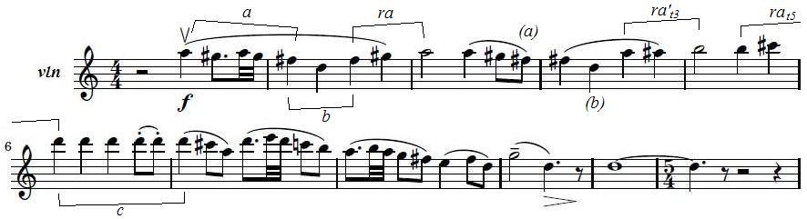
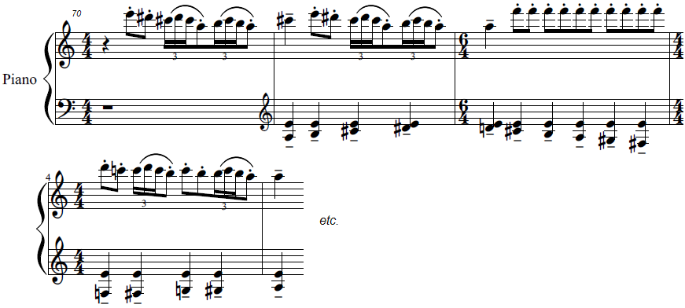

Guerra-Peixe's academic Trio

by Frederico Barros

The year was 1960 and Brazilian composer César Guerra-Peixe submitted his *Trio for violin, violoncello and piano*<1> to a contest held by the Brazilian Ministry of Education's radio station.<2> On the surface, the piece is illustrative of Guerra-Peixe's output in the period, but some of its specificities offer interesting points of discussion. From the modal techniques employed and explicit nationalism to the clear structure and tightly-knit thematic work, the *Trio* shows how Guerra-Peixe positioned himself in the debate about Brazilian music at the time. Some old-school motivic analysis may help us better understand what this means.

The opening *sonata-allegro* begins with material related to the Brazilian northeast<3> in the way the Lydian mode is employed (A1, see example 1), immediately followed by its Dorian version (A1'):

{width="5.076042213473316in" height="1.3807294400699912in"}

Example 1: GUERRA-PEIXE - Trio for violin, violoncello and piano, 1st mov., measures 1-11.

The origin of the piano part in A1 is harder to pinpoint, but that specific rhythmic structure combined with the alternation of a major second in the highest voice can be convincingly related to the "elements of the *berimbau*" that Guerra-Peixe would later affirm were present in the piece.<4>

Moving on, we get to A2, derived from the cell *c* in A1. Here, the piece also shifts from D dorian (A1') to F# minor (A2), then leading to B1, in B dorian. Finally, B2, in the key of A, has the character of a closing theme and brings back the Lydian sound of A1, to which it is also thematically related:<5> 

{width="5.895833333333333in" height="2.6527777777777777in"}

Example 2: GUERRA-PEIXE - Trio for violin, violoncello and piano, 1st mov., measures 70-74.

The exposition went from D to F#, then to B and finally to A, and from the first group to the second - the foundational polarity of sonata form - the piece descends a minor third, as if going from major to relative minor, but here making a homologous move from D Lydian to B Dorian. As we can see, despite B2 being in the dominant region, the modalism present in the *Trio* takes over the role of the tonal relations in a conventional *sonata-allegro*. This serves as an entry point into a significant aspect of the piece: Guerra-Peixe stayed rooted in principles from the Western tradition while infusing them with elements of different origins; following *sonata* procedures by the book, but employing material of recognizably Brazilian character.

Some years later, Guerra-Peixe would affirm that he wrote the *Trio* in a deliberately academic fashion, hoping it would make it fare better in the contest.<6> Furthermore, the elements indicated above are all fairly common in the Western tradition, usually being considered indicators of good compositional technique, even if somewhat dated. Nonetheless, albeit very often present, these elements tend to be considerably subtler in other works of the composer, raising the question of whether we should take all this at face value.

Born in 1914, Guerra-Peixe's formative years were marked by the rise of the first Modernist generation. It was a period of both aesthetic modernization and of coming to terms with the idea of a national art, and throughout the following two decades this two-fold task would converge. In this very same process, the first modernists would oppose those who came before with charges of Europeanism and traditionalism, but slowly sliding into being themselves the new established (in both senses) tradition. At least that's how many of their successors saw them. To add insult to injury, this took place through the participation of many of those modernists in the Getúlio Vargas dictatorial regime.<7>

To put it bluntly, younger composers such as Guerra-Peixe tended to see the nationalist modernists as uninteresting, repetitive, and in many cases as plain sellouts. During the 1940s Guerra-Peixe joined the *Música Viva* group - centered around german composer Hans-Joachim Koellreutter - and got into twelve-tone music, first radically opposing any form of nationalism and then gradually starting to experiment with combining the two trends. His stint with dodecaphony lasted until the end of that decade, when questions about how and by whom his music would be received and its social utility started bugging him. Guerra-Peixe then plunged both into the Brazilian countryside and in a creative crisis that would eventually lead him to abandon the twelve-tone technique for good in favor of a music that fed heavily from his proto-ethnomusicological researches.<8> Having joined the nationalist bandwagon now, he would criticize his new peers by turning their own principles against them, with charges of poor knowledge of the country's traditions and lack of compositional chops.

Guerra-Peixe liked to show off his knowledge of Brazilian regional cultures by ditching traditional elements of Western music in favor not only of melodic ideas and rhythms - which at that time were common currency for nationalists worldwide -, but also structures, timbres and forms he learned during the trips he took to the countryside. An eloquent example is the first movement of his *String Quartet n. 2*, from 1958: at first it may seem like an odd *sonata-allegro*, then one starts wondering if it isn't a rondo... only to finally, with some luck, find out that the composer employed the form of the *cateretê* from São Paulo. To make matters even more complicated, we are not dealing with a song form or equivalent, but with a manifestation more akin to a ritual, whose sequential development is mirrored in the piece.<9>

Thus, the meticulous melodic construction and compositional prowess shown in the *Trio* may be regarded as a deliberate act in a very specific sense. Without getting into value judgments, even if Guerra-Peixe may have misevaluated the jury (he received the second prize and the winning piece, by Marlos Nobre, cannot be said to be conservative, after all), the *Trio* reveals that Guerra-Peixe considered the jury conventional both on the aesthetic and the technical side. If in terms of nationalism he would more or less align with them - although usually in a more nuanced and complex fashion -, with regards to the technical side things tended to get fuzzier, as Guerra-Peixe would often derive procedures from folkloric forms, risking a relative alienation of an audience more attuned with the Western canon.

That's much less perceptible in the *Trio*. We won't find some alternative form here, but a proper *sonata-allegro*, and as such the thematic material is orderly presented. At the same time, rhythms from Bahia serve as accompaniment to melodic figures from Pernambuco, purposefully blurring geographic frontiers. Finally, the modal elements sound Brazilian, but below the surface they put very Western structural forces into motion. This is not to say that Guerra-Peixe would otherwise *always* avoid the so-called common practice, that is, Western concert music tradition - be it modern or classic-romantic. Timbre, harmony, developmental procedures, most aspects of the Western thought about music would be to some extent impacted by the folkloristic investigations he engaged in from the 1950s on. Threading the line that separated his aesthetic demands and the taste of an imagined jury, he ended up exposing some shortcomings of the modernist project he was himself stumbling upon but couldn't quite fathom at the time, touching on things we are still grappling with today: alternative theories of form, sound, discourse, and drama, amounting to other ways of thinking about music itself which may not even fit in these categories.

<1> The score can be accessed at https://painelsesc.sesc.com.br/partituras.nsf/viewLookupPartituras/736289B70CDBCBC5832579DC006F13D7/$FILE/trio_vl_vc_pn.pdf. The recording made in 1960 as well as the sleeve of the 1984 LP where it was released can be found in http://portais.funarte.gov.br/brasilmemoriadasartes/acervo/discos-pro-memus/guerra-peixe-e-heitor-alimonda-1984/ 
<2> *Rádio MEC*'s *II Concurso de Composição Música e Músicos do Brasil*.
<3> Showing why these materials are related to specific regions of Brazil is a complex endeavor. However, we can let the composer himself speak. In the essay *Os Cabocolinhos do Recife* (GUERRA-PEIXE, C. 2007. *Estudos de folclore e música popular urbana*. Samuel Araújo (org.). Música editada. Belo Horizonte: Editora UFMG), Guerra-Peixe presents examples very similar to both B2 and A1.

{width="5.076042213473316in" height="1.3807294400699912in"}
 
<4> Liner notes by the composer for the LP *Documentos da Música Brasileira*, v.17, LP 356-404-203, MEC/Secretaria de Cultura/Funarte. The *berimbau* is an instrument mostly associated with the *capoeira*, from Bahia. It plays two pitches - usually close to a major second in Western theory - that are subject to timbral variations through various playing techniques.
<5> FARIA, A. G. 2000. "Guerra-Peixe e a estilização do folclore." In: *Latin American Music Review*. vol. 21, no. 2.
<6> See note 4 above. 
<7> SCHWARTZMAN, S., H. M. B. BOMENY, V. M. R. COSTA. 2000. *Tempos de Capanema*. São Paulo, SP: Paz e Terra: Editora FGV; SQUEFF, E., J. M. WISNIK. 2004. *Música*. São Paulo, Brasil: Editora Brasiliense.
<8> See ARAÚJO, S. "Introduction" (GUERRA-PEIXE 2007); ARAÚJO, S. 2010. *Movimentos musicais: Guerra-Peixe para ouvir, dançar e pensar*. Revista USP, (87), 98-109. USP.
<9> FARIA, A. G. 2007. “Modalismo e Forma na obra de Guerra-Peixe” in: FARIA, A.G.; BARROS, L.O.C.; SERRÃO, R. *Guerra-Peixe: um músico brasileiro*. Rio de Janeiro: Lumiar.