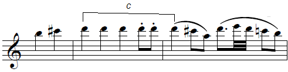
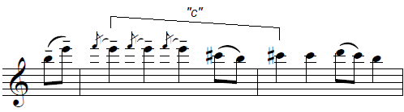
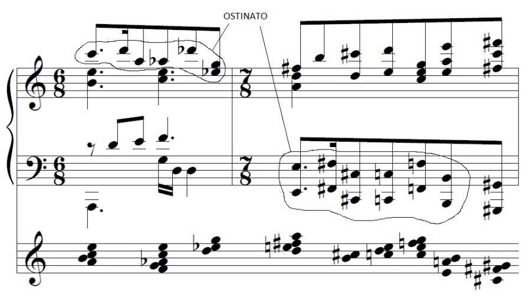

Guerra-Peixe's Trio for violin, violoncello and piano

by Frederico Barros

The year was 1960 and composer César Guerra-Peixe (1914-1993) submitted his Trio for violin, violoncello and piano to a contest held by the Brazilian Ministry of Education's radio station<1>. 

From the modal techniques employed to the explicit nationalism, its clear form and tightly-knit thematic work, the *Trio* in many ways shows how Guerra-Peixe positioned himself in the debate about Brazilian music at the time. Some old-school motivic analysis of the exposition of the first movement can help us get a clearer understanding of what this means.

The *Sonata Allegro* opens with A1, clearly related to the Brazilian northeast in the way the Lydian mode is employed, immediately followed by its Dorian version, marked by an increase in chromaticism and polyphonic activity.

{width="5.076042213473316in" height="1.3807294400699912in"}

Figura : GUERRA-PEIXE - Trio para violino, violoncelo e piano, 1º mov., compassos 1 a 11.

Then, from A1-A1', in D Lydian and D Dorian respectively, we get to A2, in F# minor, clearly derived of the cell c:

{width="3.3244794400699913in" height="0.8328127734033246in"}

{width="3.371875546806649in" height="0.9411461067366579in"}

> Figura : Relação entre a célula c (de A1) e A2: no alto, fragmento de A1 com a célula *c* em destaque; embaixo, primeiro membro de frase de A2.

Through a series of sequences and imitations the climax of the first group is reached and then leads to second group, whose B1 is the longest part of the exposition, with its seresta-like melody. Finally, B2, in the key of A and clearly functioning as a closing theme, brings back the Lydian sound of A1 - to which it shows other interesting resemblances. 

{width="5.895833333333333in" height="2.6527777777777777in"}

Figura : GUERRA-PEIXE - *Trio para violino, violoncelo e piano*, I mov., segundo tema do segundo grupo (B2)

Having finished 

Como bem observou Faria, B2 é uma derivação de A1:[^16]

{width="3.4791666666666665in" height="1.8333333333333333in"}

Figura : comparação entre B2 e A1

Desse modo, Faria argumenta que B2 teria sido escrito baseado nos cabocolinhos do Recife, mostrando como a figura de acompanhamento é uma "estilização" através de retrogradação (ver compasso 69 em diante). Além disso, não é difícil perceber a relação direta entre a ideia contrastante do período, onde o compasso muda para 6/4, e A2, que por sua vez já era uma derivação da célula *c* contida em A1, como vimos mais acima.

Como se sabe, na tradição de concerto, especialmente em seu veio alemão, a noção de que tudo derivaria de um só elemento, de uma ideia geradora, tem raízes profundas cujo ponto de referência mais forte é a obra de Bach, com toda a importância simbólica que ela assumiu.[^17] A ideia de *coerência*, particularmente importante, como veremos no capítulo seguinte, depende disso. A noção de organicidade, relacionada diretamente à de coerência, vai ser apoiada, por exemplo, em Goethe, como vemos Webern fazer, e Schönberg com frequência falou de se conceber a obra inteira de uma vez ou de como tudo derivava da *Idea* inicial, noção ambígua e difícil de traduzir.[^18]

Faria observa que, em seu trabalho de "estilização do folclore", em A1 Guerra-Peixe "emprega uma melodia que contém elementos modais do nordeste em um folguedo paulista, com esquema rítmico provavelmente de origem africana".[^19] Apesar da formulação de Faria ser acertada na medida em que leva em conta a ideia de estilização, colocando em relevo que é através deste mecanismo que Guerra-Peixe alcança juntar, no caso, São Paulo e Pernambuco, é importante ter em mente que esses *não são* nem os cabocolinhos nem o tambu. Dito assim, soa quase como uma banalidade, mas isso implica uma mudança de ênfase que me parece fundamental se este estudo pretende dizer algo sobre o mundo em que Guerra-Peixe vivia. É fácil perder de vista sua música ao afirmar que ele juntou duas manifestações populares diferentes no primeiro tema do primeiro grupo de seu *Trio* de 1960, acreditando que se explicou tudo ao mostrar de onde vêm os elementos em que ele se "inspirou". Ali não temos nem o tambu nem os cabocolinhos não só porque eles estão misturados, sobrepostos, mas porque não são mesmo nem um, nem outro, nem os dois! Guerra-Peixe junta numa mesma peça e até num mesmo trecho elementos *que ele próprio constrói*, ainda que com base em materiais de diversas origens e regiões do país, ao que parece tentando submetê-los a uma organização mais geral da peça. Sim, de certo modo, é isso que Faria chama, junto com o próprio Guerra-Peixe, de "estilizar o folclore". Mas ao focar na estilização do elemento *x* ou *y*, perdemos de vista que o principal ainda está por ser explicado, que é *como* ele faz música[^20], colocando isso em perspectiva no cenário em que ele produziu essa música. E isso significa mostrar, sim, o que ele junta, porque junta e como junta, mas também significa buscar compreender a organização geral que a tudo submete, tentar saber o que ele quer fazer com isso, que visão ou que proposta de Brasil está sendo produzida aí, porque ele dá importância à estruturação geral e que forma de estruturação geral ele tenta dar a suas peças. Significa tentar ver o que ele naturaliza, tanto deliberada quanto inadvertidamente, trazendo ou deixando entrar pela porta dos fundos elementos que constituem sua própria visão do que era e do que deveria ser uma música de concerto brasileira.

Além disso, é difícil saber, simplesmente pela análise das peças, se a convivência de elementos de origens distintas nas obras de Guerra-Peixe é parte de um "programa" ou se é uma consequência da "internalização" daquela "cultura brasileira", que ele tanto tentou capturar através de suas pesquisas e que faria com que ele simplesmente produzisse "naturalmente" obras que juntam elementos diversos de um todo que seria nossa nação brasileira.[^21] Se lembramos, no entanto, como sugere ainda Faria, a importância dos escritos de Mário de Andrade para Guerra-Peixe e observamos que, ao escrever Macunaíma, Mário era animado pela ideia de "desregionalizar" o país, de "tirar a geografia do livro", colocando lendas, expressões, animais e plantas de um canto do país no outro para tentar fazer um livro "tendenciosamente brasileiro",[^22] podemos ter aí uma chave de leitura do ponto.

However, we should not take all this for its face value 

e de fato o próprio Guerra-Peixe afirmou mais tarde que, por ter sido escrita para o referido concurso, a peça era deliberadamente acadêmica e que

> uma vez que a obra se destinava a um concurso realizado naquela época (hoje os critérios costumam ser mais abertos), \[o primeiro\] movimento está restrito formalmente ao tradicional *allegro de sonata* muito embora apareçam aqui elementos derivados do toque do berimbau, assim como da modinha e da inúbia (flautinha) dos "cabocolinhos" do Recife.[^4]

Os meios de construção e organização que encontramos neste movimento, onde se percebem facilmente os mecanismos de derivação e os esquemas de inter-relação entre os temas, que por sua vez são quase que escolarmente apresentados, não estão exatamente entre as práticas rotineiras do compositor, preocupado que estava em encontrar substitutos para a forma sonata e em ostentar as especificidades de seu nacionalismo. A partir disso, para além da caracterização que se possa fazer de Guerra-Peixe como compositor, o *Trio* em questão indiretamente também nos oferece a percepção que seu autor tinha do cenário da música de concerto brasileira: se a peça foi composta pensando num concurso, adotando uma linguagem mais "acadêmica" de modo a tentar agradar ou convencer um júri, há aí uma pressuposição por parte do compositor sobre as preferências daquele júri.

Todo esse trabalho de construção melódica a partir de pequenas células motívicas faz pensar nas ocasiões em que Guerra-Peixe foi explícito ao afirmar que, mesmo tendo abandonado o dodecafonismo, este lhe teria dado um domínio técnico que seria útil mesmo posteriormente, em sua fase nacionalista.[^6] No entanto, ironicamente, é difícil não observar que os dodecafonistas vienenses não perdiam oportunidade de afirmar que sua técnica estava ancorada na tradição da música alemã.[^7] Então o que Guerra-Peixe pode ter extraído do dodecafonismo para suas peças posteriores? É difícil saber com segurança, mas alguma prática na manipulação dos motivos certamente resultou de seus tempos de dodecafonista. Embora mesmo isso possa ter raízes mais profundas, das aulas com Newton Pádua ou de seus estudos no Conservatório Brasileiro de Música, quando se formou em Fuga e Contraponto "nos moldes do Conservatório de Paris",[^8] o dodecafonismo lhe deu uma liberdade maior no tratamento, como ele próprio veio a afirmar,[^9] especialmente no que diz respeito ao uso do cromatismo. Além disso, uma característica interessante da peça é que, por mais acadêmica que ela se pretendesse, por mais comunicabilidade que Guerra-Peixe buscasse em sua fase nacionalista, algo do chamado "princípio da variação contínua"[^10] permaneceu em sua prática musical, o que teremos a oportunidade de ver em diversas peças, mas já se pode verificar nesse primeiro movimento do *Trio*, onde praticamente não se encontra repetição literal. É evidente desde a primeira audição, no entanto, que se existe algum resquício da variação contínua schönberguiana, ele está muito diluído, a variação sendo realizada muito mais por meio de mudanças na instrumentação e na textura do que por variações rítmicas ou melódicas nos motivos, sendo ainda que as variações que ocorrem têm papel estrutural bastante restrito, servindo mais para diferenciar uma seção repetida do que para criar um desenvolvimento na forma. No entanto lá estão, por exemplo, a repetição de A1 em outro modo (compassos 13 a 25) ou toda a primeira parte da reexposição feita com uma instrumentação diferente do que havia sido feito na exposição (compasso 137 em diante).

<1> Rádio MEC's II Concurso de Composição Música e Músicos do Brasil
<2> referencia sobre procedimentos padrão de sonata