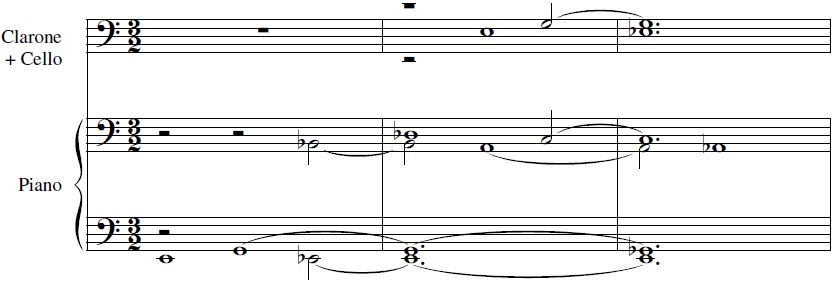
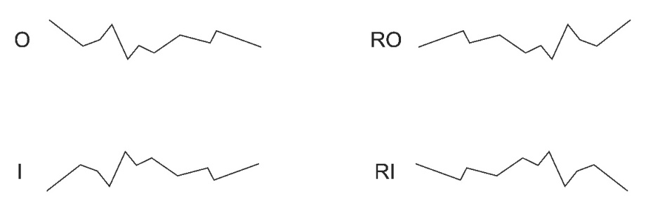
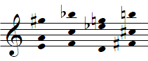
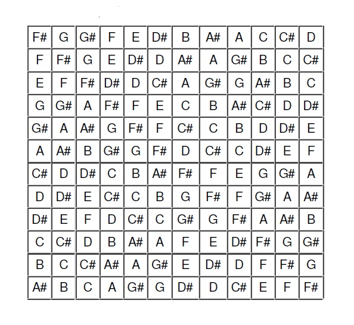
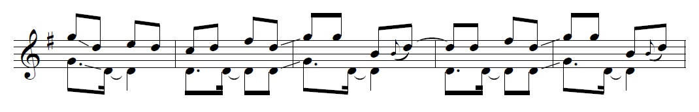
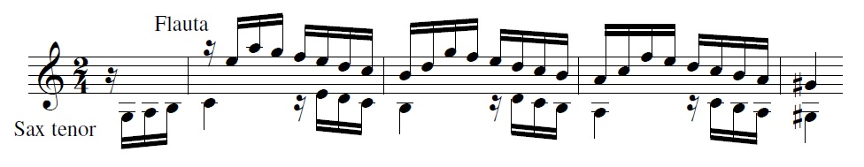

1000-1500 palavras

*CAPÍTULO 1* *- Vinte maneiras de se começar uma briga*

> *Não gostei do meu Quarteto. Perto da Sinfonia ele é uma droga. Creio estar muito carregado. Penso que perdi muito de expressão, por causa da mania de querer escrever de um modo mais fácil para o público entender. Neste sentido consegui alguma cousa, creio. Mas perdi de expressão. A parte de RITMO, que certa vez falei, foi resolvida, no quarteto, como pensei. Mas não foi difícil porque tem muitos motivos [rítmicos]{.underline} repetidos. O mais interessante é que já estão vendo "nacionalismo" em demasia na minha música. Não é nada disso. E o pior é que, justamente, o pessoal "sente" o "nacionalismo" onde não cuidei disto: nos II° e IV movimentos! O quarteto agradou (o que é muito mau sinal), assim como já me falaram de ser proposto para IMORTAL da Academia B. de Música. Veja, Dr. Lange, a que ponto chegou a minha decadência em 1.947!\... Será que me tornarei compositor "oficial"? Vejo que preciso começar de novo, e deixar de lado estas ideias de "cor" nacional, assim como a tal de simplificação. Eu certo que o melhor caminho é o da SINFONIA e o do II° DIVERTIMENTO, depois de ter perdido tempo com música\... para facilitar!\.... Qual a sua opinião a respeito?*[^1]

Em 1960, César Guerra-Peixe submetia um *Trio para violino, violoncelo e piano* a um concurso, no caso, o *II Concurso de Composição Música e Músicos do Brasil* da Rádio MEC. Era a segunda obra do compositor para esta formação e a primeira audição da mesma ocorreu ainda no ano de sua composição, ao que tudo indica no desenrolar do próprio concurso, em concerto no auditório do Ministério da Educação e Cultura, no Rio de Janeiro. Os intérpretes foram Anselmo Zlatopolski, ao violino, Iberê Gomes Grosso, ao violoncelo, e no piano estava Alceu Bocchino,[^2] que também era um dos jurados, junto com Camargo Guarnieri.[^3]

Em diversos sentidos, o *Trio* permite entender o posicionamento de Guerra-Peixe na época em relação ao debate sobre a música de concerto brasileira. Desde a organização formal até o trabalho temático, passando principalmente pelo modalismo, percebem-se no *Trio* as feições específicas que o problema de uma música nacional assumiu no caso desse compositor, especialmente naquele período de sua produção. Olhando para o primeiro movimento, notam-se, na própria estruturação do discurso, na textura predominantemente homofônica e no modalismo mais ou menos claro da obra, sugestões até mesmo de uma ligação com certo nacionalismo um tanto estereotipado, e de fato o próprio Guerra-Peixe afirmou mais tarde que, por ter sido escrita para o referido concurso, a peça era deliberadamente acadêmica e que

> uma vez que a obra se destinava a um concurso realizado naquela época (hoje os critérios costumam ser mais abertos), \[o primeiro\] movimento está restrito formalmente ao tradicional *allegro de sonata* muito embora apareçam aqui elementos derivados do toque do berimbau, assim como da modinha e da inúbia (flautinha) dos "cabocolinhos" do Recife.[^4]

Os meios de construção e organização que encontramos neste movimento, onde se percebem facilmente os mecanismos de derivação e os esquemas de inter-relação entre os temas, que por sua vez são quase que escolarmente apresentados, não estão exatamente entre as práticas rotineiras do compositor, preocupado que estava em encontrar substitutos para a forma sonata e em ostentar as especificidades de seu nacionalismo. A partir disso, para além da caracterização que se possa fazer de Guerra-Peixe como compositor, o *Trio* em questão indiretamente também nos oferece a percepção que seu autor tinha do cenário da música de concerto brasileira: se a peça foi composta pensando num concurso, adotando uma linguagem mais "acadêmica" de modo a tentar agradar ou convencer um júri, há aí uma pressuposição por parte do compositor sobre as preferências daquele júri.

O *Allegro de sonata* se inicia com o violino tocando o trecho transcrito na *Figura 1*, dobrado pelo violoncelo duas oitavas abaixo e sobre uma figura de acompanhamento bastante característica realizada pelo piano. Como se pode perceber já pelo próprio material melódico, o trecho delineia claramente o modo *lídio* em Ré, apesar do *dó natural* no último tempo do compasso 7.

{width="5.076042213473316in" height="1.3807294400699912in"}

Figura : GUERRA-PEIXE - Trio para violino, violoncelo e piano, 1º mov., compassos 1 a 11.

O período só vai repousar no *ré* do compasso 10, tendo partido do *lá* inicial e indo até o *ré* do compasso 6, que introduz uma ideia contrastante (c) em relação ao claro paralelismo que o primeiro e o segundo membros de frase guardam entre si (compassos 1 a 5). A nota mais alta do período é o *mi* da bordadura *ré-mi-ré*, no segundo tempo do compasso 7, e a nota mais grave é justamente o *ré* sobre o qual todo o trecho vai repousar no compasso 10, o que nos dá um âmbito de nona dividido simetricamente em duas quintas justas pelo *lá* inicial. Além disso, o baixo que acompanha o trecho, tocado pela mão esquerda do piano, movimenta-se por saltos de quinta durante todo o trecho citado -- que equivale à primeira exposição do tema A1 -- desenhando *ré-lá-mi-la*, *sol-ré-lá-ré* etc., o que cria exatamente a mesma relação de um âmbito total de nona dividido por quintas justas.

Um análise mais "microscópica" mostra todo um conjunto de relações que sugere também uma estruturação cuidadosa. Trata-se, porém, de um tipo de estruturação específico. Sem pretender levar longe demais a análise, percebe-se claramente que a célula *a* explora e põe em relevo justamente a nota característica do modo *lídio* (a 4ª aumentada, no caso, *sol*) e é retrogradada para levar ao *lá* do compasso 3. Ainda que a bordadura de colcheia pontuada seguida de duas fusas vá se revelar um elemento recorrente ao longo do movimento, a abstração de *a* como apenas o movimento descendente de semitom e tom, no caso *lá-sol**-fá*, retirando a bordadura, é confirmada pelo fato de que, ao repeti-la no compasso 3, o compositor trocou a bordadura *sol**-lá-sol* pela antecipação do *fá* na última colcheia do compasso. Em seguida, parece-me seguro afirmar que uma pequena célula formada pelo retrógrado de *a* (r*a*) é transposta duas vezes (r*a'~t3~* e r*a~t5~*), chegando ao *si* natural do compasso 5 e levando a harmonia por *Sol* lídio, para chegar, no compasso 6, à célula *c*, que servirá para formar o tema A2 (o segundo tema do primeiro grupo temático, que não aparece escrito no trecho acima, mas que será discutido mais adiante). A partir do compasso 7, as células *a* e *b* vão sofrendo um processo de diminuição em que são justapostas e sobrepostas, havendo aí uma rápida inclinação para o modo *lídio com o sétimo grau abaixado*[^5], indicado pelo *dó natural* do fim do compasso 7, até chegar ao *Lá* mixolídio do compasso 8, onde a harmonia desenha uma cadência plagal (bVI-i) sobre *si* menor com a melodia repousando sobre a nota *ré* (compasso 10) e, por fim, a harmonia repousa em um acorde de Ré suspenso sobre o qual voltarei no momento oportuno.

Talvez o leitor desconfie de uma descrição como esta, perguntando-se até que ponto um compositor manipulava pequenos elementos dessa maneira ou se, ao contrário, não é muito mais provável que ele simplesmente tenha criado uma melodia inteira, pronta. *Em princípio*, estamos desamparados numa situação como esta, já que não há muito que fazer a não ser buscar relações plausíveis no trecho, mas gostaria de argumentar que são justamente as referências composicionais, a técnica, a escola de composição em que Guerra-Peixe se formou que em certo sentido medeiam a relação dele próprio com suas criações e que também nos servirão de mediação para evitar olhar para tais criações diretamente. Mais que tudo isso, o fato da peça se propor acadêmica, ou seja, ser uma peça composta para um concurso onde ele sabia que ela seria *analisada* por alguns de seus pares e julgada em boa medida a partir dessa análise, pode com grande probabilidade tê-lo feito aumentar a "carga analítica" no próprio ato de composição.

Todo esse trabalho de construção melódica a partir de pequenas células motívicas faz pensar nas ocasiões em que Guerra-Peixe foi explícito ao afirmar que, mesmo tendo abandonado o dodecafonismo, este lhe teria dado um domínio técnico que seria útil mesmo posteriormente, em sua fase nacionalista.[^6] No entanto, ironicamente, é difícil não observar que os dodecafonistas vienenses não perdiam oportunidade de afirmar que sua técnica estava ancorada na tradição da música alemã.[^7] Então o que Guerra-Peixe pode ter extraído do dodecafonismo para suas peças posteriores? É difícil saber com segurança, mas alguma prática na manipulação dos motivos certamente resultou de seus tempos de dodecafonista. Embora mesmo isso possa ter raízes mais profundas, das aulas com Newton Pádua ou de seus estudos no Conservatório Brasileiro de Música, quando se formou em Fuga e Contraponto "nos moldes do Conservatório de Paris",[^8] o dodecafonismo lhe deu uma liberdade maior no tratamento, como ele próprio veio a afirmar,[^9] especialmente no que diz respeito ao uso do cromatismo. Além disso, uma característica interessante da peça é que, por mais acadêmica que ela se pretendesse, por mais comunicabilidade que Guerra-Peixe buscasse em sua fase nacionalista, algo do chamado "princípio da variação contínua"[^10] permaneceu em sua prática musical, o que teremos a oportunidade de ver em diversas peças, mas já se pode verificar nesse primeiro movimento do *Trio*, onde praticamente não se encontra repetição literal. É evidente desde a primeira audição, no entanto, que se existe algum resquício da variação contínua schönberguiana, ele está muito diluído, a variação sendo realizada muito mais por meio de mudanças na instrumentação e na textura do que por variações rítmicas ou melódicas nos motivos, sendo ainda que as variações que ocorrem têm papel estrutural bastante restrito, servindo mais para diferenciar uma seção repetida do que para criar um desenvolvimento na forma. No entanto lá estão, por exemplo, a repetição de A1 em outro modo (compassos 13 a 25) ou toda a primeira parte da reexposição feita com uma instrumentação diferente do que havia sido feito na exposição (compasso 137 em diante).

O *Trio* começa direto com a exposição do tema A1 em *Ré* lídio que vimos na figura 1. Guerra-Peixe utiliza fragmentos melódicos ligados à música do Nordeste brasileiro, talvez o mais característico sendo *lá-sol**-fá**-ré-fá*, junção das células *a* e *b*, que abre a peça e dá o forte caráter *lídio* do trecho pelo mecanismo específico de acrescentar uma quarta aumentada à tríade maior de tônica, apoiando-se sobre ela em movimento descendente por grau conjunto.[^11] O tema é reexposto (A1'), desta vez pelo piano e no modo dórico em *ré*, havendo um aumento considerável no "cromatismo" tanto na melodia como na harmonia,[^12] estendendo-se até o compasso 25. Antes, no compasso 20, a melodia é passada para o violino, havendo ainda maior intensificação da atividade polifônica, com os "contracantos" construídos a basicamente a partir da célula *a* de A1.

Vejamos ainda um pouco como se desenvolve a forma no caso desse primeiro movimento: após a exposição de A1 seguido de sua repetição variada no modo dórico (A1'), chega-se a A2, em *Fá*, de caráter ainda mais afirmativo que A1, mas que é claramente derivado da célula *c* deste, como se vê na figura 2 (ao transcrever A2 optei por incluir o impulso -- as colcheias *si-mi* -- que leva ao tema propriamente de modo a mostrar como até essa relação foi mantida):

{width="3.3244794400699913in" height="0.8328127734033246in"}

{width="3.371875546806649in" height="0.9411461067366579in"}

> Figura : Relação entre a célula c (de A1) e A2: no alto, fragmento de A1 com a célula *c* em destaque; embaixo, primeiro membro de frase de A2.

A célula *c* é desenvolvida através de sequências e a textura vai se tornando mais densa, com imitações entre o violino e o violoncelo e a subida gradual pelas diversas transposições do primeiro membro de frase até chegar ao clímax do primeiro grupo temático, em torno do compasso 35, quando há um rápido afrouxamento e uma sequência de acordes no piano prepara a entrada do primeiro tema do segundo grupo temático (B1), que dá início à segunda parte da exposição. Neste ponto a harmonia já foi do *Fá*, onde A2 claramente começou, a *Dó*, que é o centro em torno do qual a transição do piano se organiza para levar a B1, que começa em *si* dórico. É difícil acompanhar a flutuação modal, e só ao chegar ao compasso 37, onde começa a transição do piano, é que conseguimos perceber a trajetória do discurso.

Analiticamente falando, haveria muito que dizer sobre B1, a seção mais longa da exposição e que marca claramente um contraste com o primeiro grupo temático por não haver derivação explícita em relação aos elementos que a antecederam. Além disso, como tradicionalmente, escolarmente quase, acontece na forma sonata, tem-se no segundo grupo uma estrutura mais regular (sem que as estruturas do primeiro grupo temático fossem tão irregulares assim), construindo-se por um período inicial de oito compassos que é transposto e modificado de acordo com o percurso tonal que é desenhado. É assim que finalmente, ao término de B2, chega-se ao auge da tensão criada pelo desenrolar do discurso musical e alcança-se a dominante da dominante -- afinal de contas, se o *Trio* é deliberadamente acadêmico, se começamos em *Ré* e estamos no segundo grupo temático, já passa da hora de chegarmos a *Lá* maior, quando B2 será finalmente apresentado. Ao mesmo tempo em que é derivado de A1, o material a partir do qual o tema é construído e o registro agudo apontam claramente para a música dos cabocolinhos,[^13] cuja inúbia, uma espécie de flauta, alcança, segundo anotações do próprio Guerra-Peixe, uma oitava acima do flautim de orquestra[^14] e cujas figurações melódicas são muito similares ao que vemos em B2, com amplo uso de quartas aumentadas e sétimas abaixadas.[^15]

{width="5.895833333333333in" height="2.6527777777777777in"}

Figura : GUERRA-PEIXE - *Trio para violino, violoncelo e piano*, I mov., segundo tema do segundo grupo (B2)

Como bem observou Faria, B2 é uma derivação de A1:[^16]

{width="3.4791666666666665in" height="1.8333333333333333in"}

Figura : comparação entre B2 e A1

Desse modo, Faria argumenta que B2 teria sido escrito baseado nos cabocolinhos do Recife, mostrando como a figura de acompanhamento é uma "estilização" através de retrogradação (ver compasso 69 em diante). Além disso, não é difícil perceber a relação direta entre a ideia contrastante do período, onde o compasso muda para 6/4, e A2, que por sua vez já era uma derivação da célula *c* contida em A1, como vimos mais acima.

Como se sabe, na tradição de concerto, especialmente em seu veio alemão, a noção de que tudo derivaria de um só elemento, de uma ideia geradora, tem raízes profundas cujo ponto de referência mais forte é a obra de Bach, com toda a importância simbólica que ela assumiu.[^17] A ideia de *coerência*, particularmente importante, como veremos no capítulo seguinte, depende disso. A noção de organicidade, relacionada diretamente à de coerência, vai ser apoiada, por exemplo, em Goethe, como vemos Webern fazer, e Schönberg com frequência falou de se conceber a obra inteira de uma vez ou de como tudo derivava da *Idea* inicial, noção ambígua e difícil de traduzir.[^18]

Faria observa que, em seu trabalho de "estilização do folclore", em A1 Guerra-Peixe "emprega uma melodia que contém elementos modais do nordeste em um folguedo paulista, com esquema rítmico provavelmente de origem africana".[^19] Apesar da formulação de Faria ser acertada na medida em que leva em conta a ideia de estilização, colocando em relevo que é através deste mecanismo que Guerra-Peixe alcança juntar, no caso, São Paulo e Pernambuco, é importante ter em mente que esses *não são* nem os cabocolinhos nem o tambu. Dito assim, soa quase como uma banalidade, mas isso implica uma mudança de ênfase que me parece fundamental se este estudo pretende dizer algo sobre o mundo em que Guerra-Peixe vivia. É fácil perder de vista sua música ao afirmar que ele juntou duas manifestações populares diferentes no primeiro tema do primeiro grupo de seu *Trio* de 1960, acreditando que se explicou tudo ao mostrar de onde vêm os elementos em que ele se "inspirou". Ali não temos nem o tambu nem os cabocolinhos não só porque eles estão misturados, sobrepostos, mas porque não são mesmo nem um, nem outro, nem os dois! Guerra-Peixe junta numa mesma peça e até num mesmo trecho elementos *que ele próprio constrói*, ainda que com base em materiais de diversas origens e regiões do país, ao que parece tentando submetê-los a uma organização mais geral da peça. Sim, de certo modo, é isso que Faria chama, junto com o próprio Guerra-Peixe, de "estilizar o folclore". Mas ao focar na estilização do elemento *x* ou *y*, perdemos de vista que o principal ainda está por ser explicado, que é *como* ele faz música[^20], colocando isso em perspectiva no cenário em que ele produziu essa música. E isso significa mostrar, sim, o que ele junta, porque junta e como junta, mas também significa buscar compreender a organização geral que a tudo submete, tentar saber o que ele quer fazer com isso, que visão ou que proposta de Brasil está sendo produzida aí, porque ele dá importância à estruturação geral e que forma de estruturação geral ele tenta dar a suas peças. Significa tentar ver o que ele naturaliza, tanto deliberada quanto inadvertidamente, trazendo ou deixando entrar pela porta dos fundos elementos que constituem sua própria visão do que era e do que deveria ser uma música de concerto brasileira.

Além disso, é difícil saber, simplesmente pela análise das peças, se a convivência de elementos de origens distintas nas obras de Guerra-Peixe é parte de um "programa" ou se é uma consequência da "internalização" daquela "cultura brasileira", que ele tanto tentou capturar através de suas pesquisas e que faria com que ele simplesmente produzisse "naturalmente" obras que juntam elementos diversos de um todo que seria nossa nação brasileira.[^21] Se lembramos, no entanto, como sugere ainda Faria, a importância dos escritos de Mário de Andrade para Guerra-Peixe e observamos que, ao escrever Macunaíma, Mário era animado pela ideia de "desregionalizar" o país, de "tirar a geografia do livro", colocando lendas, expressões, animais e plantas de um canto do país no outro para tentar fazer um livro "tendenciosamente brasileiro",[^22] podemos ter aí uma chave de leitura do ponto.

Nos textos de Faria e de Schönberg há uma sobreposição da questão da criação de material temático próprio com o problema da organicidade da obra. Como veremos mais abaixo, ainda em seus tempos de dodecafonista, Guerra-Peixe já havia criticado os nacionalistas brasileiros afirmando que suas obras careciam de organicidade,[^23] mas não chegou a discutir a criação de temas próprios. No entanto, ao se tornar nacionalista ele passa a criar seus temas em vez de usar "temas folclóricos" em suas peças. Daí, se formos seguir a argumentação de Schönberg/Faria, nossa conclusão será que Guerra-Peixe, preocupado com a organicidade de suas obras, passa a criar seus temas de modo a poder ter material passível de ser trabalhado de acordo com suas necessidades composicionais, dando margem a desenvolvimentos como se faz na tradição de concerto. No *Trio*, como se pode ver bastante claramente no caso das relações entre os materiais obtidos de A~1~ e o que mostrei em A~2~ e B~2~, parece ter havido derivação mesmo entre os temas, seguindo a tradição europeia -- e especialmente alemã -- em um de seus pressupostos mais caros. O próprio trabalho de análise dentro da tradição é feito por meio da busca de inter-relações entre os materiais de uma dada peça, o que foi bastante criticado pela chamada "musicologia pós-moderna" devido à naturalização implícita aí de que uma boa obra precisa ser coerente, e coerente neste sentido preciso,[^24] mas a questão é que, se faz parte da tradição -- e sabemos que faz, como testemunhos de época nos mostram[^25] -- não há porque duvidar de que as coisas se passem dessa maneira para aqueles indivíduos. Compositores foram formados com base nesses princípios, e por mais que se possa argumentar que às vezes a teoria musical tenha tendência a suprir falhas do fazer musical que ela tenta explicar,[^26] pode-se supor com certa segurança que existe considerável convergência no pensamento musical de compositores e musicólogos numa dada época.

Não se trata nem de seguir acriticamente os vieses disciplinares da musicologia nem de negar teoricamente algo que a mais simples análise seria capaz de demonstrar, bancando o relativista militante ou tentando reduzir tudo à realidade última das relações de poder, merecendo então ouvir em resposta a observação de Adorno de que "a irracionalidade das obras de arte é, de um modo geral, enunciada pelas pessoas estranhas à arte de um modo muito mais altissonante do que por aqueles que se entregam à disciplina das próprias obras e entendem algo do assunto".[^27] A questão é que um estudo como este, que trata de um compositor trabalhando numa encruzilhada de tradições, beneficia-se simultaneamente da relativização da própria ideia -- pressuposta na noção de organicidade -- de que se deve atender às necessidades do material no trabalho de composição e também da observação das diferentes formas de se atender a tais necessidades. Por conseguinte, se a necessidade do material faz parte de uma das tradições a que Guerra-Peixe estava ligado, ela pode estar presente em suas criações, mas em que medida sua realização concreta segue os métodos e o senso de forma de Beethoven ou Schönberg é algo para que não há resposta definida de antemão. Se for possível oferecer aqui ao menos alguma pista em relação a isso, parte dos objetivos deste trabalho já terá sido alcançada.

Os elementos do primeiro movimento do *Trio* mostrados acima são todos bastante típicos da tradição europeia de concerto, tal como se apresentava entre o fim do século XIX e as primeiras décadas do XX, servindo muitas vezes de indicador da qualidade de uma composição, do rigor construtivo. Neste sentido, seria a princípio arriscado atribuir sua presença aqui ao academicismo deliberado que Guerra-Peixe afirmou ter guiado a composição da peça. No entanto a maneira mais sutil, menos explícita com que aparecem em outras peças do compositor -- o que teremos a oportunidade de ver ao longo deste texto -- parece-me indicar que Guerra-Peixe via os jurados do concurso em que inscreveu seu *Trio* como detentores de um gosto convencional e claramente filiado à estética nacionalista dominante na época. O que vemos a partir do *Trio* é que do ponto de vista de seu autor tratava-se de um nacionalismo específico, que dependia de critérios provindos diretamente da tradição europeia, nomeadamente, a unidade estrutural; a busca de uma lógica na organização formal;[^28] a construção com base no princípio da derivação por variação e pela abstração de caracteres mais importantes que são mantidos enquanto outros, secundários, são variados.

*1.1 - Do academicismo às disputas*

Independente do fato de que Guerra-Peixe talvez tenha errado em sua avaliação -- afinal, ele tirou o segundo lugar, enquanto o Trio de Marlos Nobre, que ficou com o primeiro prêmio, não é uma peça que chegue a chamar a atenção pelo tradicionalismo --, pode ser que sua posição naquele momento, conjugada com o que estamos vendo no *Trio*, ofereça uma perspectiva interessante sobre a música de concerto brasileira da primeira metade do século. Nascido em 1914,[^29] seus anos de formação foram justamente aqueles em que a primeira geração modernista -- a de Villa-Lobos e Mário de Andrade -- caminhou significativamente no sentido de realizar alguns dos principais ideais do movimento a que pertenciam. Assim, foi a época em que aqueles artistas tentaram -- e em boa medida conseguiram -- empreender uma renovação dos meios de expressão artística, de início a partir das pesquisas das vanguardas europeias e, em seguida, com base na incorporação de elementos vistos por eles como "nacionais". Logo, tanto no sentido da renovação dos meios de expressão como em relação a uma maior radicalização do nacionalismo que essa renovação possibilitava, o grupo que ficou conhecido como "modernista" se opunha ao que lhes parecia um "academicismo europeizado" que marcava as atividades de boa parte dos artistas brasileiros que os precederam, considerando-os "tradicionalistas".[^30]

Isso, porém, ocorreu principalmente nos anos 1920, havendo nas duas décadas seguintes um deslocamento de posições que será central para a compreensão do que está em jogo aqui. O grupo modernista, identificado com aquela renovação dos meios de expressão nas artes, assumiu por um tempo a posição de vanguarda. Em seguida, conforme entramos no período varguista, os modernistas vão se aproximando cada vez mais da problemática de uma cultura brasileira, havendo mesmo uma espécie de "virada nacionalista" no movimento que terminou por afastá-los da vanguarda artística. Embora seja uma simplificação, essa perspectiva serve aqui para esboçar esquematicamente como Guerra-Peixe via o cenário da música de concerto brasileira na época em que iniciava sua carreira.[^31] Na verdade, o maior problema de descrever o campo da música de concerto da época nesses termos é nublar seu caráter processual, visto que não só já havia um nacionalismo musical, ainda que incipiente, antes de Villa-Lobos, mas principalmente porque os alinhamentos não se deram de maneira tão simples e definitiva, como é de desconfiar, além do fato de que os modernistas foram vanguarda por um tempo. Como fator complicador, com o surgimento dos modernistas, os compositores que já estavam estabelecidos -- em sua maioria professores das principais instituições de ensino de música do país -- foram praticamente todos enquadrados sob a rubrica de "tradicionalistas", mesmo havendo aqueles que praticavam certo nacionalismo de caráter romântico. Desse ponto de vista, junto deles era alocada também a maior parte da crítica especializada, embora esta muitas vezes se colocasse em posição de antagonismo em relação ao que professores do Instituto Nacional de Música, por exemplo, defendiam[^32] ambos defendendo a tradição europeia de concerto como a "grande tradição" da qual não nos deveríamos afastar. Os espaços de que dispunham serviam então como uma espécie de tribuna a partir de onde era possível manifestar e dar força a suas concepções e visões sobre a arte e mesmo sobre a cultura e a sociedade brasileiras. Figuras como os críticos Andrade Muricy e Oscar Guanabarino ou músicos como Francisco Braga, Henrique Oswald e muitos outros representavam as preferências vistas como atrasadas contra a qual se insurgiram não só aqueles que entendemos hoje como "modernistas" num sentido mais estrito, mas já antes Alberto Nepomuceno ou Leopoldo Miguez, engajados que estavam na modernização do de instituições chave na vida musical da cidade, como o Instituto Nacional de Música.[^33] Para que se veja a dimensão que isso tinha, basta ver que em 1949 Guerra-Peixe ainda descrevia um evento ocorrido no Instituto, então Escola Nacional de Música, nos seguintes termos:

> A nossa famosa Escola Nacional de M\.... faz uma exposição de Música Erudita e Folclórica\... Tirando-se os antigos, que temos que respeitar pelo valor histórico, o resto é de doer\... Si fôssemos barbeiros ficaríamos riquíssimos de fazer a barba a tanta gente\... Qualquer rapazinho que fez um Minueto na Escola está lá representado!!!! Vila, Guarnieri, Gnattali, Santoro e eu não comparecemos com coisa nenhuma.[^34]

Além disso, havia toda uma geração de compositores um pouco mais novos que Villa-Lobos (nascido em 1887) que provavelmente não enxergavam a si próprios como figuras inevitavelmente à sombra do mais velho. Porém a História é cruel, e mais ainda o foi nossa crítica musical posterior, em geral obcecada com os problemas de uma música nacional. Assim, da maneira como foi narrado, ao longo do tempo foi-se formando uma espécie de "escola nacionalista" que, embora no que tinha de existência concreta devesse mais a Guarnieri que a qualquer outro, acabou tendo em Villa-Lobos sua grande figura e mesmo principal fonte de inspiração.[^35]

Muitos modernistas, principalmente do campo das letras, conseguiram inserção junto ao governo de Getúlio Vargas, que se iniciou em 1930 e se tornou uma ditadura a partir de 1937, com seu projeto de unidade nacional e modernização do país pela via "de cima". Esquematicamente, ter intelectuais em sua órbita ajudaria Vargas a formatar e dar respaldo a seu projeto de nação e de poder, o que acabou acontecendo numa espécie de negociação tácita que, em contrapartida, criava para esses intelectuais e artistas oportunidades de trabalho não só junto ao aparato burocrático -- o que ao menos lhes garantiria uma subsistência confortável -- como também boas possibilidades de obter visibilidade e continuarem produzindo. Desse modo, a atuação de artistas e intelectuais junto ao governo Vargas respondia em boa parte às necessidades deste em constituir a nação, ao mesmo tempo em que significava uma oportunidade de realização dos projetos de tais artistas de criação de uma arte que se propunha brasileira.[^36]

Na verdade, a importância em se criar uma arte ancorada na brasilidade tinha raízes profundas que vão bem mais longe que o projeto modernizador de Vargas. Se de início nosso Modernismo esforçava-se pela renovação dos meios de expressão por meio da busca de algo "mais fundamental" escondido dentro do indivíduo, sob as camadas de sociabilidade e civilização, aos poucos a ênfase de suas preocupações vai se deslocando para o problema da brasilidade e da existência ou criação de uma cultura que se pudesse dizer brasileira. Com a publicação em 1924 de *A Estética da Vida*, de Graça Aranha, o debate nos meios modernistas vai passando aos poucos para uma compreensão da aspiração à universalidade como necessariamente ligada ao nacional e mesmo o regional,[^37] produzindo um corte a partir da divergência quanto à maneira de se chegar até essa brasilidade. De um lado, temos uma corrente mais "doutora", para usar a expressão de Eduardo Jardim de Moraes, partindo de Sílvio Romero e Mário de Andrade e mais próxima das Ciências Sociais, pregando o estudo e o conhecimento aprofundado das diversas manifestações culturais do país através de intensa pesquisa,[^38] de outro, havia a corrente que, partindo de Graça Aranha, tomava a *intuição* como a forma privilegiada de se alcançar a nacionalidade através também do elemento "popular".

Apesar dessa divergência, a ideia de que as parcelas "rústicas" e "incultas" da população seriam como que portadoras de uma cultura brasileira mais autêntica tem uma raiz comum nas próprias noções de *expressão* e *sensibilidade*, bastante caras aos modernistas de ambos os lados. Com aquele "deslizamento" de perspectivas em nosso Modernismo a partir da publicação de *A Estética da Vida*, a renovação da expressão e a ruptura com o passado foi dando lugar à problemática da *brasilidade* como foco das preocupações modernistas: a busca por uma forma de expressão *individual* "pura" empreendida pelos artistas dos anos 1920 vai perdendo importância em detrimento da procura da expressão "pura" *de uma cultura* junto aos homens "primitivos" ou "selvagens". Se no início de nosso Modernismo a renovação dos meios de expressão era obtida por meio da busca de uma suposta expressão "espontânea" que tendia a ser identificada com uma forma de primitivismo, de retorno a algo fundamental *dentro* do homem, com o tempo esse primitivismo foi sendo deslocado para uma unidade mais geral, o "povo" ou a "nação", que passam a ser vistos até certo ponto como homólogos ao indivíduo. Foi precisamente com o estabelecimento dessa homologia entre indivíduo e nação que se saltou da reflexão sobre a criação artística individual para a consideração da "cultura popular" como uma espécie de "fonte" da nacionalidade.[^39]

Como lembra Travassos, para Mário de Andrade a poesia parnasiana teria se afastado das fontes vitais da criação e, por isso, esses "mestres do passado" deveriam ser enterrados, quando então "a arte poética conheceria um novo princípio e voltaria à sua razão de ser, àquilo que a justifica entre 'selvagens', representantes contemporâneos do homem tal como era na aurora dos tempos". Como se pode ver, trata-se exatamente da questão da arte como *expressão.* Não é possível ignorar que o tema guarda uma importante relação com um movimento mais geral nas artes do período, ligado especialmente às *vanguardas* da virada do século XIX para o XX, quando imperava uma forte sensação de que a vida na sociedade da época estava orientada talvez de maneira equivocada, possivelmente sufocando grande parte do potencial que o ser humano poderia desenvolver.[^40] Mas, além disso, com o deslocamento da problemática da expressão e da ruptura com o passado dando lugar à problemática da *brasilidade* como foco das preocupações modernistas, vão se estabelecendo formas novas de se relacionar com a tradição, ou talvez seja mais adequado dizer que foi surgindo a perspectiva de que haveriam diversos "focos" de uma tradição brasileira mais ampla com que estabelecer uma relação fertilizadora para a produção artística e, por consequência, para contribuir para a cultura brasileira.[^41]

O ponto talvez possa ser resumido por um trecho do trabalho de Travassos em que a autora trata de como a homologia entre indivíduo e nação permitiu, no pensamento marioandradeano, que se saltasse da reflexão sobre a criação artística individual para considerar a "cultura popular" como uma espécie de "fonte" da nacionalidade, da brasilidade "em estado bruto":

> Nas chamadas estéticas da juventude, o retorno às fontes vitais da criação e a recuperação da expressão espontânea eram reconhecidos como uma forma de primitivismo. \[\...\] O primitivismo investido num estrato do indivíduo psicofísico foi deslocado para o povo, estrato impreciso da sociedade. A unidade de raciocínio, neste caso, será frequentemente a nação, concebida como homóloga ao indivíduo, numa redução do coletivo ao individual ou da sociologia à psicologia.[^42]

Seria justamente a pressuposta inconsciência do "povo" que garantiria a expressão do que há de mais fundamentalmente nacional. Caberia aos artistas -- não aos artistas "populares", mas aos artistas "cultos" ou "eruditos" -- dar ao mundo aquela arte moderna e nacional por que ansiavam. Seria então justamente o fato de se originar de um suposto "fundo vital" da nação, do inconsciente do "indivíduo grande", nos termos de Travassos, que garantiria esse status de "erudita e nacional" a tal arte.

> A inconsciência do povo forneceria a expressão imediata da entidade nacional, como o sub-eu os impulsos líricos da poesia\... Assim, a fórmula "lirismo + arte = poesia" teria correspondência em outra, válida para a nação: expressão instintiva do povo + trabalho consciente dos artistas = arte moderna nacional.[^43]

Diante desta pequena digressão, o que se pode ver é que houve no período uma convergência de proposições entre aquilo que Vargas buscava realizar e os caminhos a que aspiravam nossos modernistas. Isso na verdade não tem nada de fortuito nem necessariamente aparecia como promissor no momento. Ao contrário, faz mais sentido observar como a pujança dessas ideias naquele momento -- e mesmo antes -- fez com que aqueles engajados no governo Vargas, ao pensarem o problema da unificação e da modernização do país, já o pensassem nesses termos. Eram soluções que estavam à mão, que tinham raízes mais profundas e que faziam parte da consciência daqueles atores, e é precisamente isso que se pode ler -- embora nem sempre esteja na superfície -- nas partes II e III do livro de Schwartzman, Bomeny e Costa sobre a atuação do ministro Gustavo Capanema junto a Vargas ou em muitos dos ensaios contidos no trabalho organizado por Botelho, Bastos e Villas Bôas.[^44]

Apesar das especificidades de cada caso, o exemplo de Villa-Lobos serve bem aqui. A área cultural aparecia como estratégica para Vargas na medida em que se buscava constituir a identidade da nação através justamente do conhecimento e da incorporação de elementos da cultura "popular". Neste sentido é que Villa-Lobos veio a se engajar num projeto de canto orfeônico nas escolas que visava tanto a "despertar a juventude para a música" quanto despertar nessa mesma juventude sentimentos cívicos e patrióticos. Ele então não só compôs, baseado em "temas populares brasileiros", quase todo o repertório de canto orfeônico adotado nas escolas como elaborou uma metodologia de ensino e regeu em estádios lotados enormes massas corais de crianças que cantavam hinos cívicos e exaltações a Vargas, que de início era simpatizante do fascismo, como se sabe. Por outro lado, Villa-Lobos ganhou projeção nacional sem precedentes como compositor e, quando Vargas finalmente se juntou aos aliados durante a Segunda Guerra, foi um dos grandes privilegiados com a chamada "política de boa vizinhança" dos Estados Unidos, viajando para lá diversas vezes e recebendo várias encomendas de obras.[^45]

Em grandes traços, a história se desenrolou da seguinte maneira: foi Villa-Lobos quem procurou Getúlio em busca de apoio para o projeto que já vinha colocando em prática por iniciativa própria em colégios da rede pública do Rio de Janeiro, angariando aos poucos apoio institucional cada vez maior para seu plano de "colaborar com os educadores para obter a disciplina espontânea e voluntária dos alunos, despertando, ao mesmo tempo, na mocidade um sadio interesse pelas artes em geral e pelos grandes artistas nacionais e estrangeiros".[^46] A ideia era, como um documento publicado pelo DIP foi claro em afirmar, "aproveitar o sortilégio da música como um fator de cultura e civismo e integrá-la na própria vida e na consciência nacional". Como se não bastasse, o mesmo trecho ainda fechava dizendo: "eis o milagre realizado em dez anos pelo governo do presidente Getúlio Vargas!"[^47] Por outro lado, tendo em vista o argumento resenhado acima sobre a relação entre o inconsciente da nação e a "cultura do povo", percebe-se que a tentativa de produzir a unidade nacional por meio de canções populares, apoiada em ideias sobre a educação da população, tinha alcance considerável no período, desempenhando papel particularmente importante no "instrumental de pensamento" mais geral de nossos modernistas.

Já em 1931 ocorria a primeira manifestação coral, em São Paulo, quando Villa-Lobos regeu 12.000 vozes que cantavam o hino nacional, com direito a panfletos exortativos despejados por aviões e distribuídos em escolas e até esquema especial de transportes, com desvio do tráfego etc. Os resultados daí colhidos levaram a que no ano seguinte fosse criado no Distrito Federal um curso de *Pedagogia da Música e Canto Orfeônico* em que tomaram parte nada menos que 250 figuras recrutadas entre professores da Escola Nacional de Música e "artistas de renome no cenário brasileiro", dentre os quais Roquette Pinto, seu presidente honorário. Tudo isso culminou com a criação de uma Superintendência de Educação Musical e Artística -- a famosa SEMA --, tornando o ensino de canto orfeônico obrigatório nas escolas primárias, secundárias e de ensino profissional, e, por fim, com a escolha de Villa-Lobos para secretário da recém-criada Secretaria de Educação Musical do governo Vargas.[^48]

Para que se tenha ideia melhor da dimensão que Villa-Lobos foi assumindo ao longo da história de nossa música de concerto, marcando o debate todo sobre a música produzida na primeira metade do século XX, cerca de 50 anos depois José Miguel Wisnik resumiria bem o ponto ao escrever:

> A música de Villa-Lobos busca oficiar o rito de passagem da *nação-caos* (território *potencial* da natureza bruta e do povo *inculto*, tidos como forças indômitas do "feroz instinto de uma raça em pleno desenvolvimento") à *nação-cosmos* (território *simbólico* da natureza e do povo *potenciados*).
>
> A música, que será tomada como a mediadora pedagógica dessa passagem, quando do programa do canto orfeônico, já tem a charada resolvida de antemão na obra sinfônica: dar ordem ao caos através de um movimento de espelhamento entre povo e nação, graças ao qual a sociedade surge como conflituosa (dilacerada pelos interesses conflitantes que a dividem) e harmoniosa (resgatada pelo sentimento pátrio). Da trama desse movimento de postulação da gênese da nação (fazendo-a falar através do povo e fazendo-o calar em seus "excessos") é que salta em refração acima dos conflitos a *alma brasileira*, o *Rasga o coração*, espécie de *estado* lírico e feminino, emulação utópica do Estado político masculino.[^49]

O que Wisnik está dizendo, está claro, é que desde a música dos anos 1920 ("Alma brasileira" e "Rasga o coração" são os nomes dos *Choros* números 5 e 10, respectivamente) Villa-Lobos já vinha articulando esse projeto de pacificação da nação que, no fim dos anos 1930, junto à ditadura de Getúlio Vargas, seria posto em funcionamento através das manifestações cívicas do canto orfeônico. Desse modo, "a pacificação prefigurada no *Choros* \[no. 10\] estabiliza-se na obra musical a partir da década de 30, através do neoclassicismo das *Bachianas brasileiras*, como que a augurar o desejado equilíbrio da nação 'madura', que soube disciplinar sua rica 'seiva'."[^50]

Wisnik termina por fazer uma leitura um pouco teleológica e arriscada da trajetória do autor dos *Choros*, mas o interesse aqui é muito menos criticar ou mesmo discutir com essa ou outras interpretações e mais mostrar a perenidade dessa chave de leitura. Diante de um quadro como esse, em que Villa-Lobos foi ganhando progressiva importância no cenário brasileiro, é interessante perceber que em mais de um momento vemos Guerra-Peixe manifestar opiniões que de certa forma sugerem que o compositor mais velho teria acabado por exercer uma espécie de efeito "polarizador" sobre praticamente todos os compositores brasileiros posteriores que se engajaram em alguma medida que fosse no projeto modernização de nossas artes, quase que os forçando a se posicionarem em relação a ele de uma maneira ou de outra.

Em carta a Curt Lange de 31 de dezembro de 1948, vemo-lo escrever que

> A Orquestra Sinfônica Brasileira funcionou este ano com uma verba de Cr\$3.000.000,00 (verba Federal) e outra menor (esta, Municipal). O Eleazar de Carvalho regeu uma série de concertos incluindo muitas obras brasileiras. Mas\... só de gente da panelinha do Villa.

E ainda, na mesma carta:

> Meu nome foi proposto para a Academia Brasileira de Música, e parece que serei aceito. Não gosto disso, mas preciso dar um rumo mais firme à minha vida futura. Isto, pelo menos, é uma aproximaçãozinha da panelinha dominante.[^51]

O que teve o seguinte desdobramento em carta posterior, enviada do Recife em 27 de abril de 1950:

> Este Vila, depois de ter me proposto para Membro da Academia Bras. de Música, em seção, com o apoio de todos, tem feito (presumo) tudo para que eu não entre lá. Pois, só toma parte nela os que costumam "render homenagens" ao Vila ou\... mediocridades.

No limite, era como se restasse apenas escolha entre fazer parte do "time" de Villa-Lobos -- e assim estar, de certo modo, tanto no melhor quanto no pior dos sentidos, sob sua sombra -- ou deliberadamente opor-se a ele. É verdade que no primeiro caso não se tratava propriamente de uma filiação a uma suposta "escola villalobiana", já que além do fato amplamente conhecido de que, como Stravinsky, Villa-Lobos não deixou alunos, Guerra-Peixe não parecia considerá-lo propriamente um compositor de grandes atributos técnicos para formar uma escola, como teremos a oportunidade de ver mais à frente, mas o peso de sua personalidade, sempre identificada com o nacionalismo tanto no cenário brasileiro quanto internacional, parece ter sido fundamental para alimentar essa percepção do campo da música de concerto brasileira *que se propunha moderna como* mais ou menos divido entre nacionalistas e seus opositores, os vanguardistas -- isso pelo menos até a década de 1960.

É claro que as coisas não se dão de maneira tão direta, que decisões individuais não são tomadas visando tão diretamente a fins distantes, mas, para meus propósitos aqui, essa caracterização esquemática da percepção de Guerra-Peixe sobre o cenário que tinha a sua frente serve para reforçar e matizar a percepção dominante de que o nacionalismo nas artes brasileiras do período -- especialmente a música -- era uma tendência que já estava presente e que se exacerbou, assumindo feições específicas a partir daí, o que pareceu aos olhos de muitos uma espécie de desradicalização e mesmo cooptação daqueles artistas.[^52] Como era de se esperar, mais uma vez Villa-Lobos serviu de alvo. Desta vez para aqueles que percebiam a situação como um esmorecimento do impulso artístico em detrimento de necessidades "extramusicais".[^53] Em linhas gerais, a narrativa mais comum ia no seguinte sentido: se nos anos 1920 Villa-Lobos teria chegado de Paris apresentando obras vanguardistas como os *Choros*, que do ponto de vista da linguagem composicional dialogavam com o Stravinsky da *Sagração da Primavera*, Varèse ou Florent Schmitt, nos anos 30 ele se aproximaria de Vargas, iniciaria a composição de suas neoclássicas *Bachianas Brasileiras* e, por fim, se voltaria para os Estados Unidos como um "mercado" de oportunidades.[^54]

> VILLA LOBOS: Também veio dirigir um concerto. Que obras apresentou!!! Ouviu-se \[sic\] composições que nem para o rádio eu teria coragem de assiná-las\... Foi chamado de [gênio]{.underline}, de o [maior músico das Américas]{.underline}, [maior que Stravinsky]{.underline}, [maior que Carlos Gomes]{.underline}, compositor [moderno, anti-acadêmico]{.underline}, enfim: tudo pelo avesso!!!!\....[^55]

Ao mesmo tempo, entre os anos 40 e 50 assistia-se o crescimento no Brasil de tendências à esquerda do espectro político, sendo seu principal aglutinador o PCB, fundado em 1922 e desde então vivendo numa espécie de ilegalidade intermitente, mas detendo a hegemonia entre intelectuais e artistas -- mesmo aqueles que foram absorvidos pelo regime de Vargas, criando quase que uma frente com graus variáveis de organização em torno de ideias como a transformação social pela via da nacionalidade.[^56] Além disso, ainda no campo das esquerdas, o Grupo Música Viva, de que Guerra-Peixe fazia parte, tinha ligações fortes com o movimento comunista internacional há algum tempo já, especialmente por meio da atuação de dois de seus principais integrantes, H. J. Koellreutter e Claudio Santoro.[^57]

Diante desse quadro resumido, conseguimos ter maior clareza sobre as possibilidades de inserção profissional para um artista nascido nos anos 10. De um ponto de vista mais concreto e individual, segundo relataram o próprio Guerra-Peixe e outros artistas da época, havia a percepção de que a música tal como ensinada nas instituições tradicionais era por demais voltada para o século XIX.[^58] Ao mesmo tempo, como foi dito, os modernistas pareciam praticar uma arte excessivamente ligada aos ideais do governo Vargas, o que para um artista mais jovem, de tendências vanguardistas, simpatizante do PCB[^59] e em busca de se estabelecer profissionalmente, acabava provavelmente inspirando antipatia tanto no sentido de que, por um lado, uma música como aquela remetia a um universo de ideias com o qual ele não se identificava e a um governo que não lhe oferecia grandes oportunidades -- a não ser que se colocasse sob a esfera de influência de algum dos artistas já estabelecidos -- quanto, por outro, no sentido de que talvez parecesse um certo retrocesso em termos de linguagem artística. Um trecho que deixa bastante claro esse estado de coisas pode ser encontrado na carta enviada do Recife por Guerra-Peixe ao musicólogo Mozart de Araújo, que estava no Rio de Janeiro e acompanhava o pleito do compositor por uma vaga na Academia Brasileira de Música:

> \...O negócio é como eu estou vendo há muito tempo: o que o Vila disse é o que se faz. Do jeito que ele pensar os outros pensam. Que gente sem personalidade!!! Como há de florescer a música brasileira se toda essa gente reza pelo mesmo terço, com as mesmas palavras, tal como ordena o "papa" -- que é obedecido religiosamente????[^60]

A carta foi escrita já no período em que Guerra-Peixe havia optado por abandonar o dodecafonismo e abraçar a "música brasileira", por cujo florescimento ele afirma temer no trecho acima. Entre os anos 1940 e a criação do *Trio*, em 1960, Guerra-Peixe passou por ainda por uma fase dodecafônica antinacional e em seguida tentou nacionalizar seu dodecafonismo. Todavia, apesar da aparente distância entre essas diferentes "propostas" de se fazer música, alguns argumentos e questões que o ocuparam antes de se tornar nacionalista podem nos ajudar a compreender melhor seus posicionamentos em relação à música de seus colegas no campo nacionalista no período subsequente a sua "virada estilística".

Essa visão de que Villa-Lobos era o "manda-chuva" da música no Brasil e que, mais que isso, fazia o possível para bloquear os caminhos daqueles que não gozavam de sua simpatia, perpassa a correspondência de Guerra-Peixe, onde sobram comentários como os que vimos há pouco ou apelidos irônicos do tipo de "Villa-Lobos virgulino capitão"[^61], e isso parece indicar que até certo momento Guerra-Peixe o tomou como símbolo de toda aquela realidade musical. Único compositor brasileiro a participar de fato da primeira Semana de Arte Moderna, em 1922, obtendo toda a legitimação que seu período em Paris lhe proporcionou[^62] e, além disso, com o desaparecimento prematuro de Glauco Velásquez e Luciano Gallet, a posição de Villa-Lobos como pioneiro de nosso Modernismo acabou por se sedimentar. Unindo-se a isso o bom posicionamento obtido por ele junto ao Estado Novo, sua enorme produtividade e, evidentemente, o interesse de sua obra num contexto de busca de uma arte elaborada a partir de fontes nacionais,[^63] na visão de Guerra-Peixe não restava senão a escolha entre fazer parte da "panelinha" ou se opor abertamente a Villa-Lobos, caso em que haveria um preço a pagar, como veremos.

***1.2 - Engajamentos: Guerra-Peixe e o Música Viva***

Penso que Guerra-Peixe e alguns de seus colegas de geração tinham uma percepção da situação similar à que esbocei acima e, se estou certo, isso pode ter sido fundamental para a maneira como eles tentaram sua inserção profissional e artística. Tendo em vista a oposição entre o grupo dos modernistas/nacionalistas, que se consolidava junto ao aparelho estatal, e os professores, regentes e críticos tradicionais, que defendiam a tradição europeia e ocupavam a maior parte dos lugares em instituições de ensino e na imprensa, criava-se uma espécie de barreira para a ascensão de compositores mais jovens, principalmente para aqueles que não se alinhassem em suas fileiras, visto que tanto os modernistas quanto os tradicionalistas disputavam as já exíguas posições no cenário da música de concerto brasileira da época.[^64] Para um compositor que iniciava sua carreira, uma boa alternativa seria então a abertura de novos espaços, algo difícil de se fazer sozinho, logicamente. Foi exatamente esta a importância do grupo *Música Viva* naquele momento, no qual Guerra-Peixe se engajou ao ir tomar aulas de composição com o alemão Hans-Joachim Koellreutter.[^65]

O *Música Viva* foi um grupo fundado por Koellreutter em 1938 com base em sua experiência vivida ainda na Europa, quando foi aluno de Hermann Scherchen. Este último foi um dos mais importantes regentes empenhados na causa da "música nova" durante a primeira metade do século XX e exerceu profunda influência sobre Koellreutter, tendo sido responsável pela primeira audição de várias obras fundamentais da música do século XX.[^66] Scherchen havia ainda fundado um movimento e um periódico que foi editado em Bruxelas de 1933 a 1936 com o nome *Musica Viva*. Assim, o movimento europeu organizado em torno de Scherchen foi a inspiração de boa parte do que Koellreutter realizou no Brasil[^67], que acabou por se tornar o principal foco de irradiação de propostas modernizadoras em nossa música de concerto na década de 1940. Para se ter ideia da importância do movimento brasileiro, fizeram parte dele ou ao menos foram alunos de Koellreutter, dentre outros, Cláudio Santoro, Eunice Katunda, Luiz Heitor Corrêa de Azevedo, Edino Krieger, Roberto Schnorrenberg, Guerra-Peixe e mesmo Camargo Guarnieri, que publicaria depois, em 1950, a famosa *Carta Aberta aos Músicos e Críticos do Brasil*.

O *Música Viva* brasileiro (dessa vez escrito em português, com acento) foi fundado por Koellreutter a partir do contato, principalmente por intermédio de Luiz Heitor Corrêa de Azevedo, com músicos e intelectuais cariocas da época, dentre os quais estavam Brasílio Itiberê (compositor e professor do Conservatório Brasileiro), Andrade Muricy (que era crítico musical do Jornal do Commercio), o pianista Egydio de Castro e Silva, entre outros. Foram estes os que deram início ao grupo que, organizado em torno do alemão, tinha por objetivo declarado "dinamizar e renovar" o ambiente musical brasileiro da época em três frentes de ação: formação, criação e divulgação.

Como se vê, essa fase inicial do *Música Viva* foi muito mais integradora, ainda mais que muitos dos que o formaram e tomaram parte nesse primeiro momento já eram pessoas formadas e estabelecidas profissionalmente no campo da música. Começando de fato suas atividades mais significativas em 1939, nessa primeira fase o grupo guardava fortes ligações com o nacionalismo que dominava a música de concerto do país na época, como se pode ver pelos integrantes mencionados há pouco, e percebe-se a intenção mais conciliadora em relação a tendências estéticas e ideológicas bastante discrepantes: é sintomático que Villa-Lobos tenha sido escolhido presidente honorário da seção brasileira da Sociedade Internacional de Música Contemporânea, criada no seio do *Música Viva* ainda em 1939, ou que as obras escolhidas para integrar os programas de concertos promovidos pelo grupo no período[^68] incluíssem tanto peças do próprio Villa-Lobos ou de Guarnieri -- os principais compositores do lado do nacionalismo/modernismo -- quanto de Santoro e Koellreutter, que já vinham começando a trabalhar a partir da polêmica técnica dodecafônica.

Aos poucos, porém, o grupo foi abrindo mais espaço para a chamada "música nova", promovendo concertos e estimulando debates em torno de temas correlatos, o que só tomou impulso de fato a partir do momento em que Koellreutter se viu com um grupo mais forte e coeso em termos de ideais, principalmente com a entrada de alguns novos alunos -- Cláudio Santoro, Eunice Catunda e César Guerra-Peixe --, interessados que estavam em aprender as técnicas que os compositores europeus de vanguarda vinham utilizando em suas obras.

Assim, em 1944, após ter se formado no Conservatório Brasileiro de Música, Guerra-Peixe foi buscar nas aulas de Koellreutter conhecimentos "mais atualizados", mais próximos do que vinham fazendo os compositores europeus da época. É importante lembrar que tais conhecimentos não eram ensinados no conservatório, onde os professores eram justamente aqueles músicos tradicionalistas já mencionados, muito ligados à estética romântica do século XIX. Logo, o contato com Koellreutter era visto como uma oportunidade -- talvez a única no Brasil da época -- de aproximar-se do que se fazia de mais avançado na música de concerto de então.[^69] Foi nesse momento que se deu a virada definitiva na orientação do *Música Viva*, com a saída dos membros mais alinhados com o nacionalismo/modernismo e a consolidação de um perfil mais vanguardista para o grupo, preocupado com a defesa do que chamavam de música moderna e agora em franca oposição à estética nacionalista dominante na época

*1.3 - Dodecafonismo*

Quais eram, então, as técnicas que Guerra-Peixe e os demais colegas desejavam aprender de Koellreutter? O Música Viva entrou para a história como o foco de surgimento do dodecafonismo no Brasil, mas nos cursos do alemão havia ainda outras "disciplinas", como estética, análise, uma forma especial de harmonia chamada "harmonia acústica" ou técnicas de microfonação. Isso será discutido no momento oportuno, mas por ora, tendo em vista sua importância no debate da época, é importante concentrar a atenção no dodecafonismo, cujo significado preciso para os alunos de Koellreutter não é fácil de mapear.

A chamada *Segunda Escola de Viena*, formada por Arnold Schönberg e seus dois alunos mais famosos, Alban Berg e Anton Webern, embora tivesse algum impacto na Europa, permanecia em geral restrita ainda aos meios musicais onde se buscava "música nova" e aparentemente não teve grande força na França de início, o que explica em boa parte que não tenha tido também no Brasil. Apesar da importância que tiveram para os caminhos que a música de concerto tomou no século XX, sendo frequentemente vistos como estando entre os principais artífices da ruptura com a tradição realizada na época, Schönberg e seus alunos faziam questão de afirmar a continuidade direta entre suas obras e aquela mesma tradição. Após um período em geral chamado de "atonal" ou "atonal livre", associado ao *Expressionismo* e tendo lugar aproximadamente entre 1908 e 1923,[^70] aqueles compositores começaram a trabalhar a partir de um método de composição que recebeu o nome de dodecafonismo. Na verdade, Schönberg acreditava tê-lo *descoberto* e tentava demonstrar seu vínculo com a tradição alemã afirmando que ele não passava de um resultado da exploração consistente de alguns procedimentos já presentes na prática dos compositores que o antecederam. Além disso, segundo Schönberg, a nova técnica de composição seria uma forma necessária de sistematizar o atonalismo de modo a lhe dar consistência e coerência. Mas a questão é que, sem uma discussão mais detalhada do tema, é difícil saber exatamente a que estas duas palavras, "consistência" e "coerência", se referem. Longe de ser um artifício retórico para abordar o assunto aqui, a forma específica de coerência que Schönberg tinha em mente é fundamental para que entendamos o desenvolvimento de sua música.

Da maneira como Schönberg o compreendia, o dodecafonismo, ou "*método de composição com doze sons relacionados somente entre si*", como ele preferia chamá-lo, baseava-se no seguinte: desde a segunda metade do século XIX, Wagner, Brahms, Mahler e outros compositores da tradição austro-alemã vinham expandindo o universo das relações tonais, que, como se sabe, serviam em grande parte para estruturar o discurso. Na virada do século XIX para o XX essas explorações das possibilidades da tonalidade, indo a regiões cada vez mais distantes em espaços de tempo progressivamente mais curtos e, conjuntamente, certa sensação de esgotamento das possibilidades combinatórias do tonalismo -- o que Charles Rosen propõe compreender como uma espécie de "intolerância" ao uso de material visto como convencional[^71] --, levaram a um progressivo enfraquecimento da sensação de tonalidade em detrimento de fenômenos de menor alcance. Para garantir então alguma coerência ao discurso, a solução adotada naquela tradição tendeu a ser o encadeamento dos diferentes fenômenos com base em suas características "locais". Neste sentido, deu-se particular importância ao elemento melódico, mas para que isso fosse eficaz era necessário que esses elementos melódicos possuíssem algum caráter distintivo, o que evidentemente se coadunava bem com a preocupação em evitar a convencionalidade do material usado na composição. Assim, o *motivo*, ou seja, uma célula melódica que serve como material básico do processo composicional, foi erigido em peça fundamental na organização do discurso, sendo em boa medida o que possibilitava o trânsito pelas diversas tonalidades mantendo a coerência do discurso. Foi justamente a isso que Schönberg se ateve ao romper com a tonalidade e, mais ainda, ao desenvolver o dodecafonismo.

Joseph N. Straus, tratando de como os compositores do início do século XX "releram" a tradição, mostra como o caráter motívico era importante para a música daqueles vienenses:

> In the "free atonal" music written by Schoenberg, Webern, and Berg during the second decade of the century, the last vestiges of tonal harmony fall away, leaving the structure resting entirely on a foundation of contextually established motivic associations. Schoenberg disliked the designation "atonal" for the music of this period and preferred to think of it as "working with tones of the motif".[^72]

Ou então, para tomarmos o ponto de vista "nativo", um trecho bastante eloquente nesse sentido se encontra no livro de contraponto de Ernst Krenek:

> When key consciousness vanished completely and music became "atonal", technical unity could no longer emerge from a solid harmonic groundwork. Quite logically, the attention was focused on the motif-relationships. Whereas they had formerly been a superstructure erected above the harmonic groundwork, they now became responsible for the consistency of the whole edifice... Thus the primary function of the series is that of a sort of "store of motifs" out of which all the individual elements of the composition are to be developed.[^73]

Krenek já está falando aqui no dodecafonismo, pois comenta sobre o sentido da *série*, mas temos exemplos da importância do motivo enquanto pilar de sustentação da estrutura musical em peças anteriores daqueles compositores. Um caso extremo disso, dentre muitos existentes, pode ser visto na introdução de *Nacht*, uma das peças que compõem o *Pierrot Lunaire* de Schönberg (ver figura 5, abaixo). O motivo principal da peça, *mi-sol-mi*, é usado para criar um efeito de saturação extrema na textura, bastando observar as relações entre as linhas: no piano temos o próprio motivo, mas a segunda nota do motivo, *sol*, serve de ponto de partida para outra apresentação do mesmo (completado na mão direita do piano), desta vez transposto uma terça menor acima (*sol-si**-sol*). E aqui também a segunda nota do motivo, no caso *si*, se torna a primeira nota de mais uma apresentação transposta do mesmo motivo, desta vez *si**-ré**-lá*, e assim por diante.[^74]

{width="4.859166666666667in" height="1.645in"}

Figura : Saturação motívica em SCHÖNBERG, *Nacht*, compassos 1 a 3.

Schönberg escreveu em 1941 que lhes era difícil compor formas longas ou de organização complicada sem recorrer às funções estruturantes da tonalidade e, diante dessa situação, textos foram frequentemente usados como base: as diferenças e a forma das partes e as mudanças no caráter ou no clima eram refletidas na forma e no tamanho da composição, em suas dinâmicas e tempo, figuração e acentuação, instrumentação e orquestração, explicou ele. Desse modo, afirmava, obtinha-se uma diferenciação tão clara quanto a que as funções estruturais e tonais da harmonia haviam antes garantido.[^75] Isso, porém, parecia não ser suficiente, pois para Schönberg as possibilidades de criar grandes formas que fossem musicalmente autônomas continuava vedada devido à própria natureza dos materiais sobre os quais estava trabalhando.[^76] Assim, certo de que as "novas sonoridades" que vinha explorando obedeciam a leis naturais e convicto de que ordem, lógica, compreensibilidade e forma não são possíveis sem a obediência àquelas leis, Schönberg lançou-se à busca do que chamou de "um controle consciente dos novos meios e formas".[^77]

Ainda que o dodecafonismo seja de fato o desenvolvimento de tendências já "inscritas no material", qualquer sistema musical é evidentemente resultado de uma seleção por vezes mais, por vezes menos consciente de alguns dentre os diversos elementos que compõem a realidade diante da qual se está trabalhando. Assim, a ideia de emancipação da dissonância; uma espécie de necessidade sentida de sempre completar o total cromático para obter "equilíbrio" harmônico e, por conseguinte, a sensação de que, uma vez apresentado o total cromático, a peça estaria concluída;[^78] e, por fim, uma exacerbação do tematismo a ponto de se chegar a derivar todos os elementos da composição de uma única ideia musical[^79] foram talvez os principais pontos de apoio e tendências que se conjugaram no método dodecafônico.[^80]

Concretamente, este consistia no estabelecimento de uma *série* -- uma ordem mesmo -- para as doze notas de que dispõe o sistema temperado ocidental, e na extração de todos os materiais da peça dessa mesma *série.*[^81] O uso de todas as doze notas se justificaria pela necessidade de evitar qualquer forma de polarização, de destaque de uma delas sobre as outras, mas, como Krenek já adiantou acima, a série como princípio construtivo funcionava principalmente uma forma de restringir complexidade ao permanecer atado a um material básico único enquanto, ao menos teoricamente, garantia-se uma coerência profunda à obra, uma vez que tudo era derivado dela. Havia, portanto, uma espécie de "ultra tematização" na qual esse motivo ou tema que é a própria série está por toda parte, o que tem seu ancoramento, segundo afirmavam os atonalistas vienenses, na já mencionada proliferação do trabalho motívico realizada desde antes do período atonal, mas que atingiu novos patamares ali, quando começaram a trabalhar seus motivos tanto vertical quanto horizontalmente.[^82]

Evidentemente, a série de cada obra é escolhida com base em suas propriedades, e para obter variedade a partir deste material limitado toda uma gama de técnicas de construção e procedimentos de transformação pode ser empregada, sendo de especial importância os mecanismos de manipulação praticados pelos polifonistas do século XVII, os "mestres neerlandeses" por quem Webern manifesta tanta admiração em suas palestras sobre a "Música Nova".[^83] Pode-se tomar uma série e utilizá-la em sua ordem direta, chamada *original* ("O"); em seu *retrógrado* ("R"), que seria a série de trás para frente; seu *inverso* ("I"), que significa uma espécie de espelhamento vertical onde cada distância percorrida numa direção na forma *original* é percorrida na direção contrária; e, por fim, o *retrógrado do inverso* ("RI"), que consiste na conjugação de ambos os procedimentos:

{width="3.8464566929133857in" height="1.2401574803149606in"}

Figura : Representação gráfica das quatro formas seriais básicas[^84]

Como se pode ver, a série é tratada quase como um objeto,[^85] e por isso pode ser colocada em "posições" diferentes. Se mudar o objeto de lugar não muda o próprio objeto, além dessas quatro formas básicas há ainda a possibilidade de transpor cada uma delas para qualquer uma das alturas da escala cromática, o que nos dá um total de 48 formas da mesma série[^86] que podem ser empregadas conforme as necessidades do compositor: em contraponto, em forma de "acordes", combinando melodia e acompanhamento dentro da mesma série ou juntando mais de uma, interpolando-as etc.[^87]

Embora tenhamos visto que para esses compositores o dodecafonismo podia ser considerado uma decorrência "natural" -- e mesmo necessária -- da tradição, o método acabou entrando para a história como a mais radical das inovações da linguagem musical até então, isso em boa parte devido à sensação de distância que as obras dodecafônicas causavam em relação à música tonal, mas também porque o princípio da série, ao se generalizar e autonomizar como meio construtivo, parecia a muitos uma forma absolutamente estranha e por vezes arbitrária de se fazer música.[^88] E foi justamente este um dos principais argumentos mobilizado pelos nacionalistas brasileiros -- do que a famosa *Carta Aberta* de Guarnieri não é muito mais que apenas um exemplo que se celebrizou -- no debate contra o dodecafonismo.[^89] Assim, além da posterior acusação jdanovista de música burguesa-decadente, a principal crítica que o dodecafonismo recebeu de seus detratores no Brasil foi a de ser uma música cerebral, "antinatural" e inconciliável com o "caráter" de nossa cultura.[^90]

*1.4 - Expressionismo*

É importante perceber, no entanto, que determinados princípios de ordem estética originados no Expressionismo alemão, ou seja, o contexto em que Schönberg, Berg e Webern começaram a produzir suas obras atonais, terminaram por ser inevitavelmente vinculados ao dodecafonismo. Os próprios vienenses produziam outras texturas que não as ambientações tensas a que suas obras ficaram associadas, por vezes evocando estados de espírito bastante variados em sua música,[^91] e, como era de se esperar, outros compositores que trabalharam com o dodecafonismo também realizaram experiências nesse sentido. Assim, também dentre os dodecafonistas brasileiros, cuja ortodoxia é por vezes questionada, diversos meios foram tentados para fugir daquela atmosfera vinda do expressionismo associada naquele contexto a pessimismo, desespero etc.[^92] Temos disso um exemplo interessante nos comentários que Guerra-Peixe faz a respeito da edição de seu primeiro quarteto de cordas. É verdade que aqui se trata de uma autocrítica, onde ele julga ter exagerado, mas ainda assim o trecho é válido como demonstração de que ele próprio nutria preocupações desse tipo e, mais ainda, que tinha consciência e conhecia recursos para evitar aquela "atmosfera" expressionista:

> A impressão está muito clara e bonita. Até parece que a música é melhor!\... Pena é que acho que a composição é pouco expressiva, comparando-a com outros troços meus. A harmonia tornou-se muito "doce", devido à preocupação de fugir ao TRÍTONO e, também, de organizar acordes mais "aceitáveis" por parte do público.[^93]

O ponto é que, segundo Schönberg, era preciso evitar quaisquer reminiscências da harmonia tonal anterior, pois a seu ver elas criariam falsas expectativas de consequências e continuações que perturbariam o desenrolar do discurso musical.[^94] Para que compreendamos melhor o que estava em jogo, é preciso ter em mente o fato de que isso era visto como uma decorrência direta da própria necessidade de coerência postulada na tradição, pois pelo menos desde Bach -- onde o contraponto se baseia num tematismo que, embora tonal, podia ser aproximado da obra dos vienenses do século XX[^95] --, a lógica motívica pelo menos dividia os deveres organizacionais do discurso com a dimensão harmônica. Assim, com o aumento de sua importância, a necessidade de ser coerente e desenvolver aquilo que o motivo tinha a oferecer[^96] passou a potencialmente levar a música a desenvolvimentos por vezes insuspeitos, progressivamente afastados da experiência musical pregressa conforme se trabalhava com motivos mais dissonantes ou "exóticos". Além disso, procedendo deste modo seria possível explorar mais completamente as possibilidades abertas pela nova técnica. Talvez valha a pena trazer mais uma vez as palavras do próprio Schönberg:

> Na composição dodecafônica as consonâncias (tríades maiores e menores) e também as dissonâncias mais simples (tríades diminutas e acordes de sétima) -- de fato quase tudo o que costumava constituir o fluxo e o refluxo da harmonia -- são evitadas o quanto possível. *Mas isso não se deve a nenhuma lei natural da nova arte. Isso é presumivelmente apenas uma manifestação de uma reação, algo que não tem suas próprias causas mas é derivado de outra manifestação -- a qual ela tenta contradizer e cujas leis são portanto basicamente as mesmas que as suas próprias.* Na raiz de tudo isso está o impulso inconsciente de tentar os novos recursos independentemente, de arrancar delas possibilidades de construir formas, de produzir apenas com elas todos os efeitos de um estilo claro, de uma apresentação compacta, lúcida e exaustiva da ideia musical. Usar aqui os antigos recursos no antigo sentido evita problemas -- o problema de cultivar o novo -- mas significa também perder a chance de experienciar o que quer que só possa ser alcançado através dos novos recursos quando os antigos são excluídos![^97]

O trecho abre um artigo de 1923 chamado *Twelve-Tone Composition* e expõe com bastante clareza o argumento. Diante da afirmação de que se deveriam evitar elementos de feições tonais de modo a possibilitar a exploração das possibilidades do novo método, e partindo da percepção de que qualquer reminiscência do sistema tonal poderia criar falsas expectativas de se estar novamente sob suas "leis", pode-se concluir com alguma segurança que, ao menos como formulado pelo criador do dodecafonismo, está-se discutindo aqui muito mais questões *estéticas* do que *técnicas*.[^98]

Não que minha intenção seja estabelecer uma separação radical -- e ademais artificial -- entre técnica e estética, mas o ponto é de interesse, uma vez que Guerra-Peixe, após tentar em algumas peças uma conciliação entre dodecafonismo e nacionalismo, abandonou o primeiro afirmando a impossibilidade de tal empreitada. Ao que parece, em geral aqueles que se debruçaram sobre esse momento da produção do compositor fluminense têm tomado a conclusão como óbvia.[^99] Entretanto, como algumas obras de Alban Berg demonstram -- para ficar num exemplo que se pode dizer "canônico" --, é perfeitamente possível incorporar material musical de outras origens a uma estrutura dodecafônica, chegando mesmo a "simular" uma ambientação tonal, se for o caso.

Evidentemente, é bastante diferente compor música dodecafônica que, conforme a necessidade, soe até como música tonal do século XVIII quando se está em Viena no início do século XX, um dos centros da tradição, e compor música dodecafônica de cores brasileiras no Rio de Janeiro ou no Recife dos anos 1950. Havia todo um peso (tanto no sentido de um lastro, que dá força e significado, quanto no sentido de um fardo mesmo) da "grande tradição" de concerto sobre Alban Berg que lhe garantia não só um "idioma" comum com o qual romper ou ao qual fazer referência, mas também havia um público com intimidade suficiente com aquela tradição à qual ele fazia referência ao citar um coral de Bach em seu *Concerto para Violino* ou a abertura de *Tristão Isolda* no final da *Suíte Lírica*.[^100]

Há que se reconhecer que, como observou George Perle, "evidently Berg did not share, and perhaps was not aware of, his teacher's view that \[e\]ven a slight reminiscence of the former tonal harmony would be disturbing, because it would create false expectations of consequences and continuations."[^101] Mas ao mesmo tempo negar o *status* de Berg como um dos principais dodecafonistas seria absurdo, tanto que Guerra-Peixe e Edino Krieger -- que era seu colega de Música Viva -- usaram justamente sua música para justificar a variedade que se poderia produzir dentro deste método de composição:

> Com respeito aos [copistas]{.underline} de Schoenberg\... isso é um grave erro de todos os que não conhecem mais de perto o atonalismo!!! A linguagem é riquíssima, a técnica oferece recursos esplêndidos, o estilo poderá ser encontrado de mil maneiras. Só se limita a [copiar]{.underline} Schoenberg quem não tem o talento de Alban Berg -- cujo CONCERTO para violino faz abrandar os nervos dos que se assustam com o dodecafonismo. Como todo mundo não pode ser genial, o que se vê é muita mistificação e muita droga em prejuízo das boas obras dodecafônicas (do bom nome da dodecafonia, digo). Não existem milhares de compositores sem talento imitando Stravinsky, Prokofieff e Hindemith, ou mesmo Ravel? O mesmo se dá com Schoenberg.[^102]

***1.5 - A situação do compositor brasileiro para além do dodecafonismo***

Interessantemente, foi em decorrência do período em que o Música Viva assumiu uma posição mais aguerrida e mesmo intransigente em relação à importância de se fazer uma música de vanguarda que Santoro, Guerra-Peixe e Katunda começaram sua busca por formas de compor uma música de características nacionais sem abrir mão do dodecafonismo.[^103] Porém, como aconteceu com diversos outros artistas e intelectuais da época envolvidos em alguma medida com o PCB, as diretrizes do realismo socialista e a crescente polarização político-ideológica que marcou a segunda metade do século XX foram dando uma definição mais específica para o nacionalismo que o tornava progressivamente difícil de conciliar com as demandas associadas ao dodecafonismo, dentre as quais estavam a ideia de música "pura", ou seja, completamente autônoma; o cromatismo exacerbado e a "emancipação" da dissonância; a "diluição" do elemento rítmico; o princípio da variação contínua; além de uma noção de progresso mais "universalista", relacionada ao desenvolvimento intelectual e à emancipação da humanidade por meio de uma arte tecnicamente "avançada" e temas correlatos. Tudo isso foi criando um "desconforto" crescente quanto à adoção dos ideais identificados com as tendências europeias de vanguarda, que passaram a ser consideradas sinônimo de um afastamento cada vez maior do solo nacional em termos artísticos.

Paralelamente a isso, a atuação de Guerra-Peixe no rádio mostra bem a relação que vai se estabelecendo, tanto do lado do Música Viva como do lado do progressismo identificado com Praga, entre os compositores e as ideias sobre o papel de sua arte. Como se sabe, praticamente todos os compositores daquele período tiveram dificuldades para viver dos rendimentos gerados por sua atividade composicional, sendo forçados a atuar como instrumentistas em bailes, cinemas, cafés, restaurantes e casas de partituras, como copistas, arranjadores, compondo trilhas e canções "comerciais" (ou "ligeiras"), dando aulas de instrumento ou, na melhor das hipóteses, aulas de composição.[^104] Neste sentido, excetuando-se a criação de trilhas para cinema, a posição de arranjador talvez fosse das que menos distância guardava em relação ao *métier* do compositor e, quando o músico era bem sucedido neste papel, poderia gerar dividendos bastante satisfatórios.[^105] Isso no entanto parecia ainda desviá-los excessivamente de suas ambições de compositores, como narrou Carlota Santoro, então esposa do compositor, a Nadia Boulanger: "Santoro travaille beaucoup, il fait des programmes pour la Radio, ceci pour gagner sa vie. Mais il travaille bien dans la composition aussi et fait la direction d\'orchestre".[^106] O próprio Santoro, escrevendo em 1952 a sua célebre ex-professora, dizia que estava se esforçando muito para voltar à Europa pois "não aguent\[ava\] mais esta vida de produção de porcarias para a Radio".[^107]

Já Guerra-Peixe tinha um ponto de vista mais matizado. Se no período mais "ortodoxo" de Música Viva ele manifestava explicitamente seu descontentamento como compositor que era forçado a se dispersar de seu trabalho com vistas a ganhar a vida, aos poucos foi mudando de posição. Em carta enviada do Recife a Mozart de Araújo, ele escrevia:

> na Rádio nada tenho feito de interessante. É o mesmo sistema do Rio, o adotado. Infelizmente, a força aniquiladora das energias do compositor brasileiro no rádio é um problema que me parece insolúvel sem a completa oficialização e direção do mesmo. Tenho, porém, procurado criar uma atmosfera nacionalizadora no que faço -- e isso tem sido percebido por alguns. Enquanto trabalho desse jeito, como posso, vou criando, também, a mentalidade nacional, da qual eu tinha me afastado desde 1944.
>
> Ainda não comecei a produzir, no Recife. Estou observando, conversando, lendo e deixando me influenciar naturalmente, ao invés de cavar música brasileira, como é de hábito\...[^108]

Há muito que se comentar do trecho acima. Em primeiro lugar, vemos bem a convergência entre a concepção de arte de vanguarda encampada tanto pelo Música Viva quanto pelo Congresso de Praga e esse discurso sobre a "força aniquiladora das energias do compositor". Talvez ele estivesse apenas se referindo ao excesso de trabalho, que o obrigaria a permanecer tempo demais voltado para a música sem que no entanto lhe sobrasse tempo para realizar sua "obra", mas a julgar pelas maneiras de ver a arte em jogo, há que se desconfiar de certa visão elitista segundo a qual no rádio o compositor faria um trabalho menor, lidando com músicas sem valor, como vimos explicitamente na carta de Santoro a Nadia Boulanger acima e como veremos também logo abaixo numa carta de Guerra-Peixe a Mozart Araújo. Além disso, ainda em relação à primeira frase da citação, surpreendemos Guerra-Peixe emitindo uma opinião se não de traços dirigistas ao menos um tanto estatizante. Na verdade, não é de estranhar que alguém naquele momento, diante do clima político mais geral da época, manifestasse esse tipo de posicionamento, mas em se tratando de um compositor antipático a Vargas, é no mínimo arriscado desejar "a completa oficialização e direção" do rádio como forma de solucionar esse tipo de problema\...[^109]

Mais tarde, porém, Guerra-Peixe passaria a uma verdadeira louvação do Rádio, reconhecendo na função de "maestro", ou seja, arranjador, a oportunidade de ganhar um verdadeiro *métier* como instrumentador e uma intimidade profunda com o material popular. É o que se vê em duas cartas enviadas do Recife a Mozart de Araújo. Na primeira delas, Guerra-Peixe afirma, ao comentar um concurso para o qual mandou uma obra: "o assunto é imprestável para musicar. Eu me defendi com a minha prática do rádio". Depois, na outra carta, ele escreveria:

> Li PEDRO E O LOBO, de Prokofieff. Não é grande música, mas se justifica, em parte, devido a quem se destina. Porém, a parte descritiva, entremeada de fala do locutor, é droga, e da grossa. A música, por vezes, parece nada ter com a narração. Qualquer música cinematográfica americana está mais adequada com o assunto que descreve. Francamente, eu a comporia bem melhor. Não há nada como a escola da vida, onde a gente tem que fazer, com os elementos de uma arte viva, por inferior que seja, toda a \[sic\] espécie de treino preliminar a uma obra mais profunda. Salve o rádio!!!![^110]

Aqui parece haver uma mudança na maneira de Guerra-Peixe encarar o material popular que vai além de sua perspectiva em relação ao trabalho no rádio e talvez indique uma nova valoração tanto para aquilo que ele entendia como "música popular urbana" quanto o que ele chamava de "folclore". Nessa mudança de posição está pressuposta uma avaliação do popular em que este é encarado numa posição menos inferiorizada, mais horizontal, em relação à música de concerto. É verdade que Guerra-Peixe é explícito em afirmar que a atividade no rádio seria uma atividade menor, mas veremos depois que essa aproximação traz em germe uma valorização sem precedentes do "popular" em geral e do "folclore" em especial, ao ponto de Guerra-Peixe chegar a dizer em entrevista que seu "guia mais seguro nos últimos tempos" vinha sendo o folclore, "especialmente o de fonte ibero-africana". E continua:

> \[Neste folclore\] observo um mundo inédito de experiências e adoto as que suponho me servirem melhor na qualidade de compositor. Aliás, vale acrescentar que, a meu ver, aprendi tanto com os tamborileiros dos cultos africanos do Recife, quanto nos conservatórios e nos livros de musicologia.[^111]

Mas esse completo reposicionamento levou um tempo; antes disso, foi preciso labutar em cima da ideia de um dodecafonismo nacionalista e por fim abandoná-lo, para que esse processo de aproximação com o folclore ganhasse os contornos que acabou tomando no seu caso. É preciso investigar então como se delineou essa trajetória, olhando para dimensões tão diversas do fato como a relação de Guerra-Peixe com seus pares ou algumas questões técnicas em torno da dodecafonia.

*1.6 -* *Engajamento dodecafonista*

A partir do momento em que o dodecafonismo se torna um aglomerado de diretrizes composicionais que vão bem além de uma dentre muitas formas possíveis de se organizar as alturas numa composição, ele vai logicamente se tornando cada vez mais exclusivista, mais "intransigente" em relação ao que se pode fazer com ele, num processo análogo à trajetória do nacionalismo do período, porém vindo pela direção contrária.[^112] Evidentemente, colocando a questão por esse ângulo estou invertendo a ordem histórica das coisas, já que muitas daquelas "diretrizes" composicionais o precederam -- o que, como vimos há pouco, permitiu até mesmo que Schönberg e seus discípulos o explicassem como resultado e desenvolvimento de certas práticas anteriores --, porém, ao mesmo tempo, a própria ideia de *conciliação* entre dodecafonismo e nacionalismo (e o termo usado por Guerra-Peixe naquele contexto era realmente conciliação) sugere já essa tentativa de flexibilização, a busca por uma forma de *transigir* com o método schönberguiano. É o que vemos em diversos momentos de sua correspondência do período, em especial as cartas enviadas para Curt Lange, quando ele manifesta suas dúvidas quanto ao que poderia ou não fazer no tratamento de suas séries e até que ponto poderia ir nesse sentido sem abandonar o método schönberguiano. Acredito que um único exemplo baste. Na carta de 10/02/1948, ele escrevia:

> Dr. Lange., ultimamente venho criando séries de doze sons desta forma, observando muito o complexo harmônico:
>
> {width="1.4286461067366578in" height="0.5958333333333333in"}
>
> Os sons são empregados indiferentemente, iniciando por qualquer um deles e seguindo por qualquer outro do mesmo grupo de sons. Não sei se este processo já foi empregado, mas creio que vale alguma coisa -- pois deu-me excelente resultado nas Músicas n.1 e n.2 para violino, Provérbios n.2 e Trio de sopros. Penso continuar porque a melodia se torna mais maleável e bastante variável. Pode-se chamar isso de TÉCNICA DOS DOZE SONS?[^113]

A resposta de Lange não poderia ser mais "ortodoxa":

> Acho que você sempre está dentro da técnica dos doze sons. É só uma derivação no processo da aplicação estrita da série, por ordem consecutiva, que, aliás, não foi empregado sempre pelo Schoenberg. Se você estuda o trabalho do \[George\] Perle no Volume V, traduzido por mim, vai ver certos aspectos interessantes e coincidentes. O próprio Cláudio \[Santoro\] já procurou também evasões parecidas.[^114]

Embora o fato em si seja irônico, não há nenhuma intenção irônica aqui ao dizer que a resposta de Lange foi ortodoxa. O artigo de George Perle a que ele se refere sugere, de fato, uma forma de expansão do método dodecafônico, mas, segundo o próprio autor, esta seria uma forma de emprego da série em completo acordo com o desenvolvimento da técnica dos doze sons.[^115] Perle começa lembrando que haveria duas razões de fundo para a existência da série: uma delas seria a importância que o material motívico ganhou na música da tradição que originou o dodecafonismo -- e neste sentido a série é usada como uma espécie de fonte de motivo(s) a ser(em) empregado(s) na composição --, e a outra estaria ligada à questão da atonalidade, ou seja, da evitação da sensação de proeminência de uma nota sobre as outras -- o que poderia ser obtido através do controle de sua repetição, uma nota só retornando após todas as outras notas do total cromático terem sido apresentadas. O que Perle propõe, então, é um desenvolvimento da ideia, já presente desde os primórdios da prática dodecafônica em obras de Schönberg, de que se poderia voltar na série ao som anterior e daí seguir novamente. Por exemplo, ao utilizar-se uma série que começasse com *si-dó-ré-fá* etc., seria possível fazer soarem os sons nessa ordem, retornar do *fá* para o *ré*, por exemplo, e depois seguir com a série pelo *fá* em diante até o fim. Perle conclui daí que o que se está fazendo é recorrer ao retrógrado da série para depois voltar a sua ordem original, e daí levanta a ideia de que então não há motivo para que não se recorra também ao inverso e ao retrógrado do inverso. Isso nos daria então um complexo em que cada uma das notas da série funcionaria como um "eixo", possuindo quatro notas adjacentes que poderiam ser utilizadas em conjunto com ela.

Daí, Perle tira uma série de conclusões interessantes sobre possibilidades de transposição dos motivos da série que se aproximariam de uma espécie de raciocínio que ele chama de "modal", no sentido de que se conseguiria uma transposição não "literal" dos motivos, ou seja, uma transposição que não seria "redundante" (é este o termo que Perle utiliza).[^116] Entretanto, não sendo este um trabalho sobre a fase dodecafônica de Guerra-Peixe, importa menos aqui resenhar e discutir formas específicas de se desenvolver o dodecafonismo e mais comprovar que a existência de diferentes maneiras de "expandi-lo", mostrando que elas estavam à disposição do compositor fluminense naquele momento.[^117]

Diante disso, as próprias dúvidas que Guerra-Peixe manifestava em relação à aplicação do método dodecafônico podem sugerir um conhecimento um tanto incipiente de procedimentos mais ou menos básicos entre os compositores vienenses. Entretanto, se, como afirma Lange, Santoro já vinha praticando manipulações seriais similares àquelas e não parecia estar em crise com isso -- sendo que é de se supor que, dada a coesão de posições do grupo até certo momento, a formação no Música Viva deveria ser mais ou menos homogênea --, começamos a desconfiar que, ao menos em parte, os problemas de Guerra-Peixe com o método schönberguiano passassem por outras dimensões que vão além de questões que se poderia entender como puramente "técnicas".

Neste mesmo momento, Eunice Katunda escrevia que:

> Não se permitem, na série, simetrias que criem motivos temáticos, pois o tema, a repetição, que o ouvido mais facilmente identifica, vai contra o princípio de variação contínua que rege a música dodecafônica. Esse princípio de variação contínua é o que mais torna inacessível ao povo, ao comum dos mortais, a problemática música dodecafônica, de vez que assim se elimina toda possibilidade de memorização, de identificação, que é o que nos leva à compreensão do sentido humano do discurso musical.[^118]

A chamada "variação contínua" tem relação direta com uma estética específica, ligada à música produzida por Schönberg e seus alunos, e não propriamente com o método de composição com doze sons relacionados somente entre si. Da mesma forma que acontecia com aqueles elementos de sua linguagem musical discutidos mais acima, a ideia de que a repetição literal consistia em primarismo era derivada de uma visão em certa medida pessoal de Schönberg sobre o desenvolvimento da tradição musical alemã, da qual um traço importante seria o princípio da "variação em desenvolvimento" (*entwickelnde Variation*, em inglês, *developing variation*), já adotado por Schönberg em obras antes mesmo da fase atonal livre, mas tendo ficado como inerente à "linguagem dodecafônica", para muitos.

> Homophonic music can be called the style of "developing variation". This means that in the succession of motive-forms produced through variation of the basic motive, there is something which can be compared to development, to growth. But changes of subordinate meaning, which have no special consequences, have only the local effect of embellishment. Such changes are better termed *variants*.[^119]

A questão, evidentemente, é quais são as variações que possuem "consequências especiais". Schönberg diz no parágrafo imediatamente anterior que "determining which features are more important depends on the compositional objective", mas isso continua nos deixando desamparados, já que continua dependendo necessariamente de um julgamento do compositor/analista que está sujeito a contingências espaço-temporais/contextuais diversas. Tudo depende do senso de forma de cada compositor, e isso por sua vez é formado em um "contexto" mais amplo.

Nesse sentido, até mesmo as dúvidas de Guerra-Peixe quanto a estar ou não "dentro da técnica" já revelam como os limites do dodecafonismo -- e por consequência a ligação com a tradição austro-alemã -- não estavam tão claros para os compositores do Música Viva, pois é como não ter um domínio claro sobre o que é essencial e o que é acessório naquela forma de fazer música. Extrapolando ainda mais, observando essas indagações chegamos mesmo a ficar em dúvida quanto ao nível de profundidade com que Koellreutter ensinou o dodecafonismo a seus alunos do Música Viva, visto que eles pareciam não ter consciência de diversas possibilidades do tratamento serial que vinham sendo praticadas na Europa e nos Estados Unidos, e podemos até nos perguntar se realmente entendiam o método tal como Krenek o descreve naquela citação apresentada há pouco. O que surpreende um pouco mais, no entanto, é constatar a existência de documentos onde Eunice Katunda, contemporânea de Guerra-Peixe no Música Viva, cita precisamente o livro de contraponto de Krenek, afirmando ser este "um dos v*ade-mecum* dos dodecafonistas"[^120], para demonstrar certas características do método schönberguiano e em seguida criticá-lo. Ora, se ela conhecia o livro de Krenek, era bastante provável que seus colegas de Música Viva também o conhecessem.

Uma resposta possível é que Katunda, tendo passado um período na Europa com Hermann Scherchen em 1948 e sendo capaz de ler em outras línguas -- o que Guerra-Peixe não fazia --, tenha tido acesso ao livro nessas circunstâncias, já que, até onde foi possível averiguar, o livro de Krenek jamais foi traduzido para o português. Mas é difícil acreditar que não houvesse troca de informações desse nível entre eles. De qualquer modo, no que diz respeito ao ensino do dodecafonismo por Koellreutter, ao que parece, teria sido Santoro quem lhe pediu para aprender o método, não sendo este parte do instrumental técnico que Koellreutter praticava em princípio. De acordo com o que informa Carlos Kater em seu livro sobre o movimento Música Viva,[^121] Koellreutter teria sido iniciado no assunto por Scherchen, ainda na Europa, tendo analisado com ele algumas obras de Schönberg, mas ainda assim nunca havia composto nenhuma peça dodecafônica até chegar ao Rio de Janeiro. Ainda segundo Kater, as peças de Koellreutter, até por volta de 1940 (ele chega ao Rio em 38) não se aproximavam em nada dessa "tendência", remetendo mais a Hindemith do que a Schönberg. Somente quando Santoro, que foi um de seus primeiros alunos de composição no Brasil, organizou serialmente algumas passagens de uma peça é que Koellreutter, diante do total desconhecimento de seu aluno sobre o método, decidiu inserir o tema em suas aulas, encontrando também estímulo para compor sua primeira peça dodecafônica, a *Invenção* para oboé, clarineta e fagote, que mesmo assim não é, sempre segundo Kater, uma peça completamente ortodoxa.[^122]

Disso tudo, fica muito forte a sensação de que num dado momento Guerra-Peixe teria simplesmente chegado à conclusão de que não fazia sentido insistir no dodecafonismo, encerrando a questão com o ponto final da *inconciliabilidade*. Afirmando primeiro que as escolas nacionais são o que garantiria o caráter da música de determinado lugar, oferecendo uma espécie de "lastro" para a música dos compositores nelas educados, Guerra-Peixe tece uma série de argumentos que vão culminar no seguinte parágrafo:

> Objetar-se-á que um austríaco, um alemão, um francês, um italiano (evite-se o russo a propósito, dados os fatores especiais deste país) conservarão as suas respectivas personalidades compondo música dodecafônica. Não há que negar. Pois, dá-se que nestas nacionalidades os compositores encontram uma enorme herança social e uma segura tradição erudita garantindo-lhes a possibilidade de produzirem obras dodecafônicas sem que percam o fio da continuidade cultural. Porém, sem rejeitar as experiências contemporâneas, inclusive a dodecafônica, é incompreensível compositores de países sem tradição erudita, os do continente americano, se dedicarem a um empenho que nada tem a ver com os problemas das músicas de suas nações. No Brasil, especialmente, onde o riquíssimo populário oferece matéria vasta, o emprego do atonalismo se torna simplesmente pedante e burlesco.[^123]

Após reconhecer que cada escola nacional poderia produzir desenvolvimentos específicos que, apesar do fio que os ligaria a sua própria tradição, podem parecer absolutamente estranhos a outras tradições, em dada altura Guerra-Peixe acaba por afirmar o "descolamento" do dodecafonismo em relação à própria tradição austro-germânica por ser fruto de requintes e especulações de uns poucos artistas decadentes -- o argumento da cultura decadente era muito forte e se fazia presente em todas as discussões da época. Além disso, nacionalismo e dodecafonismo seriam inconciliáveis porque a ausência de repetição e de tonalidade seriam estranhas à "música nacional".[^124] Mas, se estou certo em minha argumentação, apenas a ausência de tonalidade -- e nem ela em termos absolutos, já que o próprio Guerra-Peixe fala em ter produzido fenômenos similares a centros e a funções em algumas de suas peças dodecafônicas[^125] -- seria intrínseca ao método schönberguiano. O que resta, parece, é a "vontade" de deixar aquilo para trás. Por fim, em mais de um momento, Guerra-Peixe fala que haveria uma espécie de "virada dos tempos", que produziria a passagem de uma música mais especulativa, talvez, mais voltada para problemas internos, para uma música mais socialmente orientada. Isso porém precisa esperar mais um pouco para ser discutido.

*1.7 - O **Música Viva racha***

Como se pode ver, o problema que era então resumido na chave da inconciliabilidade/incomensurabilidade entre nacionalismo e dodecafonismo era constituído de um emaranhado de forças de natureza diversa que, em conjunto com os ideais vanguardistas e de função social do compositor e de sua música herdados do Música Viva, terminaram por lhes dar outra direção. A questão da "função social da música" era reforçada por toda a conjuntura política da época e, de maneira simples, pode-se dizer que é como se houvesse diferentes encaminhamentos possíveis para alguns dos ideais já presentes nas propostas do Música Viva, principalmente porque se estava num momento em que a relevância, a utilidade social do compositor, era como que "disputada", cabendo a cada um escolher que rota seguir para chegar a ela: uma música identificada com a vanguarda nos termos que tradicionalmente a entendemos ou a "vanguarda" no sentido jdanovista. Apenas no nome os pontos de chegada coincidiam.

No Música Viva, o problema da arte para uma nova sociedade era colocado em termos bastante claros, permitindo ver bem a forma de "relevância social" abraçada:

> O *Grupo Música Viva* surge como uma porta que se abre à produção musical contemporânea, participando ativamente da evolução do espírito.
>
> \[\...\]
>
> *Música Viva*, divulgando, por meio de concertos, irradiações, conferências e edições a criação musical hodierna de todas as tendências, em especial do continente americano, pretende mostrar que em nossa época também existe música como expressão do tempo, de um novo estado de inteligência.
>
> A revolução espiritual, que o mundo atualmente atravessa, não deixará de influenciar a produção contemporânea. Essa transformação radical que se faz notar também nos meios sonoros, é a causa da incompreensão momentânea frente à música nova.
>
> Ideias, porém, são mais fortes do que preconceitos!
>
> Assim o *Grupo Música Viva* lutará pelas ideias de um mundo novo, crendo na força criadora do espírito humano e na arte do futuro.[^126]

Como parte de sua atuação em prol dessas ideias "progressistas", o movimento se propunha desde o início "dinamizar o ambiente musical". Assim, buscavam privilegiar a "música nova" de todos os períodos, ou seja, toda música que eles considerassem que tivesse sido importante em sua própria época para o avanço da linguagem musical -- logicamente de acordo com o conceito de Koellreutter e seus alunos do que seria esse avanço --, mas privilegiava principalmente a "música nova" contemporânea, dando especial importância à produção brasileira mais recente. Desse modo, como era de se esperar, os compositores brasileiros que ganhavam mais destaque nas atividades do grupo eram justamente os próprios integrantes do *Música Viva*.[^127] E quais seriam essas atividades do grupo? O trabalho de Kater, ao tratar das "atividades *Música Viva*", dá uma dimensão disso,[^128] mas já no primeiro boletim do grupo, publicado em Maio de 1940, o texto "O nosso programa" apontava a direção. Após fazer a apologia da música nova de todos os tempos, da música contemporânea e em especial da "jovem música brasileira", o texto seguia afirmando:

> "Música Viva" realizará concertos e audições com programas especiais e de acordo com as finalidades do grupo.
>
> "Música Viva" realizará conferências e discussões sobre temais atuais.
>
> "Música Viva" publicará obras contemporâneas e composições inéditas da literatura clássica.
>
> "Música Viva" encarregar-se-á da divulgação e da execução das obras que publicar, no Brasil e no estrangeiro.
>
> "Música Viva" realizará um intercâmbio de composições contemporâneas entre o Brasil e outros países.
>
> "Música Viva" publicará mensalmente uma folha musical para servir as \[sic\] finalidades do grupo e apoiar todo o movimento \[sic\] tendente a desenvolver a cultura musical. Ela quer informar, animar, ajudar, defender e criticar, numa base positivo \[sic\] e objetiva.[^129]

Em que pesem as dificuldades que se poderia esperar para se manter no Brasil da época uma agenda como esta, o grupo realizou praticamente tudo que foi adiantado em seu programa e ainda "irradiações radiofônicas" semanais pela Rádio Ministério da Educação - PRA 2 a partir de 1944, bem como outros programas elaborados individualmente por Koellreutter sobre a música de diversas épocas.[^130] Do que *não* foi realizado, mas que foi idealizado em algum momento, mais significativos foram a elaboração de uma "biblioteca de músicas modernas" e os *Festivais Música Viva*, que de certo modo acabaram se concretizando na década de 50, em Teresópolis/RJ, sob o nome de *Cursos Internacionais de Férias Pró-Arte* e tendo somente Koellreutter à frente.[^131]

De fato, as apresentações musicais e as conferências funcionavam como o suporte básico de formação e divulgação do trabalho do *Música Viva*, buscando "recriar o circuito compositor-obra-intérprete-público", que segundo o diagnóstico dos integrantes do grupo encontrava-se na época desarticulado e desatualizado. De nosso ponto de vista, precisamente este tipo de atividade possibilitaria que o poder canalizador do grupo agisse sobre as criações individuais, principalmente através da simples oportunidade de cada compositor ver suas obras interpretadas e ainda por cima interpretadas por músicos minimamente familiarizados com o repertório moderno/contemporâneo -- certamente não um dos menores problemas do ambiente musical brasileiro da época e ainda dos dias atuais.[^132] Além disso, vale reforçar que pertencer a um grupo que comungava em boa medida dos mesmos ideais estéticos incentivava o desenvolvimento de obras na direção específica para onde apontavam aqueles ideais, isso não só pela aceitação mas também por possíveis relações de competição entre pares, algo de que o próprio Guerra-Peixe mais tarde deixaria claro ter consciência quando, após criticar uma peça de um ex-colega do grupo, diz a Curt Lange: "Peço-lhe não tomar as minhas palavras como as de um concorrente de Santoro. Tenho sempre receio de abordar este assunto, que pode dar interpretações variadas\..."[^133]

Por outro lado, a partir do fim da década de 1940, os músicos ligados, ainda que apenas por simpatia, aos Partidos Comunistas passaram a ter uma linha definida, seguindo os ditames do *2º Congresso de Compositores e Críticos Musicais*, realizado em Praga em 1948, que foi algo próximo a uma ratificação das diretrizes jdanovistas na área da música.[^134] Santoro compareceu ao Congresso como delegado e propôs que o Música Viva se tornasse a seção brasileira da *Federação Internacional de Compositores e Musicólogos Progressistas*,[^135] decorrendo daí todo um *imbróglio* no que diz respeito à relação entre o Música Viva e a Federação, com uma espécie de disputa velada pela liderança do grupo entre Santoro e Koellreutter, que havia permanecido no Brasil.[^136]

As diretrizes de Praga, enfáticas em condenar as tendências vanguardistas como representantes de uma suposta cultura burguesa decadente, não eram menos claras em seu posicionamento, estimulando os compositores "progressistas" a se aproximarem da "música e das aspirações do 'povo'", que eram colocadas em oposição à vanguarda propriamente dita, o que ajudou a dar forma definitiva ao debate do lado do comunismo no período. Em resumo, o que o Congresso apontava era que a composição musical de então passava por uma crise cujo principal motivo era a oposição entre música popular e música erudita. A primeira estaria caminhando para a banalização, a estagnação e a padronização, enquanto a segunda estaria se tornando progressivamente mais individualista e subjetiva no conteúdo e complexa e artificial na forma. Da maneira como era vista a situação, a causa disso era o abandono dos "traços específicos da vida musical das nações", sendo ambas as tendências decorrência de um suposto "estado social defeituoso" marcado pelo cosmopolitismo. Diante disso, o Congresso propunha: (1) que os compositores buscassem evitar o subjetivismo, criando música que exprimisse "sentimentos e ideias progressistas das massas populares"; (2) que se prendessem mais estreitamente à cultura nacional, defendendo-a de "falsas tendências cosmopolitas"; (3) que praticassem formas musicais que favorecessem a consecução de tais objetivos, com especial destaque para a música vocal; (4) que trabalhassem, junto de críticos e musicólogos, por uma melhor educação musical "para as massas".[^137]

Diante das resoluções do Congresso, o primeiro a se reorientar esteticamente foi Santoro, no que foi seguido por Eunice Katunda e Guerra-Peixe. Com base nos diagnósticos de Praga sobre a música contemporânea de então,[^138] Santoro passou a afirmar que os artistas deveriam participar das lutas do "povo" para que pudessem refletir em suas obras os conteúdos democráticos e progressistas delas e que -- o que era ainda mais importante para a linguagem musical -- não se deveria temer dar o "passo atrás",[^139] importando apenas a realidade do "povo" e o novo caminho a construir.[^140]

*1.8 - Progressismo e vanguardismo*

Pode-se dizer que, em linhas gerais, a diferença entre o vanguardismo "tradicional" e o progressismo de Praga, jdanovista, estava em que, diante do diagnóstico comum de algo como um "mundo doente", do ponto de vista da vanguarda o povo é que precisaria vir até ela, e o próprio fato de que isso não acontecia era sintoma desse estado doentio de coisas -- o que ela poderia contribuir para sanar, mas que no limite deveria ser resolvido em outras dimensões da realidade. Enquanto isso não acontecesse, a música de vanguarda, com sua força "alienante", estaria aí para ninguém se esquecesse da "condição contemporânea". Já para os progressistas (orientados segundo as diretrizes de Praga) a cura estaria nos músicos irem ao "povo", aproximando-se dele em termos musicais, como foi dito. Colocando desse modo a diferença entre essas duas maneiras de pensar a música, compreende-se melhor a importância da música vocal para os progressistas: esta seria uma forma privilegiada porque permitiria "alcançar o povo" mais prontamente, as letras desempenhando uma espécie de mediação entre a música e a suposta mentalidade musical menos desenvolvida daquele "povo". Como se pode ver, a ideia de uma educação musical para as massas matiza um pouco o esquema, pois significa um movimento ativo por parte daqueles que produzem música para que as "massas" se aproximem da produção musical da época, uma espécie de reconhecimento da dificuldade que mesmo uma música supostamente mais simples ou "objetiva" apresentaria para um grupo que não tivesse por hábito nem mesmo frequentar salas de concerto, muito menos para ouvir o repertório contemporâneo. Aqui, sim, percebem-se bem os limites desse pensamento e o que ele guarda de fundamentalmente comum com a vanguarda: seu vínculo forte com a tradição de concerto ocidental, cuja forma de pensar a música não é colocada em questão, visto que se continuaria a compor as mesmas formas musicas para os mesmos agrupamentos instrumentais do núcleo de uma tradição que muitas vezes não tinha qualquer relação significativa com as tradições locais.

Em *Avantgarde und Volkstümlichkeit*,[^141] Carl Dahlhaus invocava uma afirmação de Schönberg segundo a qual o caminho do meio em que a vanguarda e a popularidade buscam uma "trégua vazia" seria o único "que não leva a Roma", comentando que tal observação não havia perdido nada de sua pertinência.[^142] Com este argumento, Dahlhaus até certo ponto defendia a vanguarda dos ataques que buscavam relativizá-la ao afirmarem a dificuldade de se apontar quem pertence a ela, sendo bem direto neste sentido ao argumentar que, ainda que por vezes seja de fato difícil saber em cada momento histórico quem estaria na dianteira -- principalmente porque isso é algo que só a História pode dizer --, em geral existiriam poucas dúvidas sobre quem *não* estaria.[^143]

Sua preocupação principal, entretanto, é bem menos com critérios para se definir quem foi ou não vanguarda em determinado contexto do que com a própria validade da categoria como base para uma compreensão apropriada do desenvolvimento histórico-musical. Ele então procede a uma historicização do termo, lembrando sua origem militar e o início de seu emprego para referir-se à arte no século XVIII, momento a partir do qual passou a estar sempre ligado às noções de originalidade e da autonomia da arte. Nesse ponto, Dahlhaus associa a persistência e a longevidade tanto da categoria quanto da vanguarda enquanto realidade histórica a sua importância como forma -- talvez a única forma, ele parece sugerir -- de escapar à alienação nas sociedades burguesas.[^144]

Dahlhaus define então a conhecida perspectiva adorniana a respeito do progresso musical a partir da ideia de que um compositor que permanecesse em sua obra aquém do nível em que as "descobertas e invenções" musicais estivessem em sua própria época estaria condenado à irrelevância. Diante disso, é interessante notar que, ao abandonar o dodecafonismo -- o que desse ponto de vista resenhado por Dahlhaus significaria a princípio abandonar o tal nível mais avançado da linguagem musical em sua época --, Guerra-Peixe falava também em irrelevância, mas justamente para argumentar na direção oposta. Advogando a criação de uma música nacional a partir das propostas de Mário de Andrade,[^145] o compositor argumentava que, no estágio em que se encontrava a cultura brasileira, qualquer músico que não se ocupasse das questões nacionais era desnecessário, inútil à coletividade.[^146] Isso mostra bem como o nacionalismo de Guerra-Peixe (e de Mário de Andrade) estava associado a uma percepção de que o Brasil ocupava uma posição periférica e que precisamente isso colocava exigências específicas para os compositores, sendo de maneira nenhuma a menor delas aquela segundo a qual o compositor deveria sacrificar sua individualidade em prol da criação de uma música nacional, se fosse o caso.[^147]

Na verdade, o argumento de Adorno é mais complexo, pois ele em mais de um momento afirma que muitas vezes compositores oriundos de países periféricos à "grande tradição europeia" como Bartók e Janáček poderiam, através dos elementos nacionais, compor uma música que manifestasse distanciamento e diferença em relação a essa tradição e, por isso, acabasse se aproximando da vanguarda, e não da reação.[^148] Nessa linha, Dahlhaus afirma que, "de acordo com Adorno, não se pode falar em progresso e regressão com respeito a qualidades de obras individuais escritas em épocas diferentes\... Progresso não significa nada além de a cada momento compreender (e se apropriar) do material no estágio mais avançado de sua dialética histórica".[^149] O assunto em pauta aqui não é a reflexão de adorniana sobre música progressista, mas o trecho serve para caracterizar o que estava em jogo naquele momento da história da música de concerto brasileira: em boa medida, na argumentação dos defensores brasileiros do dodecafonismo o abandono deste era tratado como a perda do passo da História ou, em termos adornianos, uma forma de capitulação diante do estágio em que se encontrava o material: era como um recuo deliberado a estágios anteriores do desenvolvimento da linguagem composicional; ponto de vista compartilhado, aliás, tanto por Santoro como por Guerra-Peixe, que no entanto afirmavam ser exatamente isso o que era necessário fazer, como veremos em breve.[^150]

Mas voltando a Dahlhaus, ao historicizar as categorias de vanguarda e progresso, ele observa também a própria historicidade do termo "popularidade" (*Volkstümlichkeit*), que remete diretamente ao século XVIII, quando guardava uma espécie de *complementaridade* em relação a "vanguarda". A partir daí, introduz o principal problema com que teriam de se bater os partidários desta:

> Qualquer um que argumente contra a vanguarda -- e não simplesmente lance injúrias contra ela -- sempre baseia seu argumento, tácita ou explicitamente, numa ideia de popularidade que ainda não se materializou. É uma ideia que ele precisa definir mais precisamente se não quiser que o discurso se torne vago e retórico; e se ele deseja que tal discurso seja mais bem entendido, ele deve indicar com que meios -- educacionais, revolucionários ou autoritários -- ele poderia ser colocado em prática.[^151]

Um dos exemplos oferecidos por Dahlhaus é Hans Eisler, que em 1935 comentava que o "estilo moderno", ou seja, a música nova, era uma música que interessava apenas a um pequeno círculo de especialistas e intelectuais -- perspectiva partilhada por Guerra-Peixe, recém convertido ao nacionalismo, nos anos 1950.[^152] "De um ponto de vista revolucionário", escreveu Dahlhaus, "esse estilo moderno pode ser descrito como algo progressivo dentro do capitalismo", uma vez que ele não estimularia conexões inexistentes entre as pessoas na sociedade capitalista, não alimentaria sentimentos de união e fraternidade e, talvez mais importante de tudo em sua crítica, uma música como aquela demandaria do ouvinte um nível progressivamente mais alto de educação para poder compreendê-la, o que significava que seus ouvintes precisariam estar apoiados em condições materiais progressivamente melhores para terem disponibilidade e capacidade para fruir de uma tal arte.[^153]

Desnecessário dizer que a tese adorniana do progresso da arte -- a tese de que a arte moderna, ao se retrair em relação ao mundo tal como este se encontrava, confinando-se na abstração, estava na verdade criticando esse mundo ao recusá-lo -- é o próprio contraponto[^154] das ideias de Eisler. Para Adorno, a nova música seria humana precisamente porque fala de inumanidade e resiste a essa inumanidade. Sua função crítica seria desempenhada quando esta música, em vez de transfigurar ou obscurecer o que existe, "chama-o pelo nome".

Dahlhaus observa que a dimensão política dessa divergência entre as perspectivas de Eisler e Adorno quanto ao esoterismo da música moderna se torna ainda mais visível ao percebermos que, tendo em vista o ceticismo deste na possibilidade de mitigação da alienação nos estados socialistas, a crítica interna surgia como a forma principal de resistência ao presente estado de coisas. Para Eisler, entretanto, que se enxergava na trilha para o socialismo, toda música que se propusesse ser "crítica" deveria servir como instrumento para denunciar ativamente a alienação, e não permanecer como algo meramente contemplativo.[^155] A partir dessa caracterização, pode-se perceber melhor o efeito das diretrizes mobilizadas pelo Congresso de Praga, que deram nova força ao nacionalismo e ajudaram a ligá-lo à estética neoclássica que vinha ganhando força na Europa desde o entre Guerras. No fundo, as duas perspectivas -- o vanguardismo do Música Viva e o progressismo de Praga -- são manifestações concretas dessa divergência de perspectiva, e o que houve, mais que tudo, parece ter sido realmente uma "virada dos tempos" -- peço ao leitor que retenha a expressão ainda mais um pouco --, a vanguarda brasileira perdendo naquele momento a briga histórica pela precedência interpretativa do mundo.

Era o compromisso de substituir "a estética do 'novo' pela do 'povo'", na formulação feliz de Carlos Kater,[^156] e, diante disso, vemos mais um nó no emaranhado que ligava progressismo, nacionalismo, comunismo, modernismo e vanguardismo naquele contexto. Com o clima de polarização política do pós-Segunda Guerra,[^157] o que se podia observar entre os artistas *identificados com a esquerda* da época era uma reorientação que passava menos pela questão do comunismo propriamente dito do que pelo nacionalismo: para muitos daqueles artistas, esse nacionalismo artístico, agora plenamente associado ao "progressismo" segundo as diretrizes realistas-socialistas e oposto ao "universalismo desenraizado" burguês-decadente, era já uma forma de atuação política.[^158]

A dimensão mais geral dessa história é relativamente bem conhecida, com direito a cartas abertas, alinhamentos e realinhamentos políticos, acareações, insurreições diversas e trocas de insultos, mas é interessante observar que aquele mesmo processo que chamou atenção para os jovens alunos de Koellreutter, com a abertura de espaços, o distanciamento da música praticada por seus pares alinhados com o modernismo nacionalista e, principalmente, o estabelecimento de uma justificação política e social para sua música, terminou depois de um tempo por precipitar a ruptura destes com o mestre, abandonando então o dodecafonismo e passando à composição de uma música de concerto com base em elementos nacionais.

Isso pode ser sentido de fundo no longo processo de ruptura de Guerra-Peixe com o dodecafonismo. Narrando a Curt Lange algumas de suas vitórias como compositor, como a execução de sua *Sinfonia* pela BBC, a encomenda de outras obras etc., o compositor comentava, de início um pouco enigmaticamente, que vinha pensando em mudar de orientação:

> Entre parênteses, disse \[o Eurico Nogueira França\] que ia, daqui para adiante, dedicar um pouco da sua atenção para mim\... Creio ser esta atitude o resultado dos comentários do Sr. Renato Almeida, que parece estar simpatizando-se muito com as minhas diretrizes estéticas. (Mas, o diabo é que estou com vontade tomar uma outra direção. É caso para pensar, ainda.)[^159]

As diretrizes estéticas de Guerra-Peixe naquele momento eram justamente as da *1ª Sinfonia*, quando ele experimentava a incorporação de elementos "populares" a seu dodecafonismo, mas depois, o caso vai sendo deflagrado mais completamente, Guerra-Peixe assumindo sua vontade de tentar um nacionalismo "do Guarnieri para cima" -- o que é muito importante:

> Devo ser franco dizendo que nada tenho feito, pois a nossa rápida conversa veio de encontro ao que eu já vinha pensando, trazendo, em consequência, uma certa vontade de experimentar o nacionalismo franco, do Guarnieri para cima (se eu o puder topar, é claro), pois mesmo no Rio encontrarei muito mais apoio de certos elementos\... das esferas oficiais!!! Estou num momento de indecisão, sinto-o.[^160]

Apesar de desavenças e prevenções, Guerra-Peixe tinha Guarnieri em alta conta, como se poder ver. Este assunto, porém, voltará à baila somente no terceiro capítulo, quando for discutida a relação de Guerra-Peixe com o folclore. Importa mais aqui é observar sua consciência de que essa tentativa nacionalista poderia lhe garantir mais oportunidades, que aparecem aqui formuladas em termos de "apoio de certos elementos das esferas oficiais". De qualquer forma, nas cartas a Mozart de Araújo, com quem a conversa era mais aberta, mais horizontal, chama atenção a presença de comentários em que Guerra-Peixe chama o amigo de "anti-dodecafônico por preconceito nacionalista" e de "catequizador musical", despedindo-se com a frase, muito citada na bibliografia sobre o compositor: "aceite o abraço apertado \[\...\] que envia o dodecafonista dos doze sons eternamente teimoso (até que surja o babaca que me faça mudar de rumo)".[^161]

É preciso resistir à tentação de fazer psicologia aqui, mas é difícil ignorar que comentários como esses podem revelar que Guerra-Peixe já vinha "amolecendo" em suas convicções. Afinal, não só sabemos o fim da história como, por fim, ele admitiria novamente estar buscando mais aceitação para sua música, pois não via como sua obra teria relevância -- e representatividade, logicamente -- sem ser ouvida por ninguém:

> Técnica do 12: penso abandoná-la para escrever mais compreensivelmente para a maioria, já que não querem executar nossas músicas assim. Se nada conseguir depois, tratarei de abandonar tudo e cuidarei de ganhar dinheiro.
>
> Basta de esperar pelas raras execuções para animar. Pois, desse jeito nossas obras não poderão ter realmente função social, porque vivem somente na gaveta e nas conversas. Não sei se estou pensando certo. Mas, se o público não recebe uma obra, ela não existe. Tentarei uma vez mais, para uma nova experiência\... e chega.[^162]

Admitindo-se que a perspectiva vencedora naquele momento foi a do progressismo de Praga, surge então o problema de saber o que significava concretamente a categoria "povo". Independente da necessidade de caracterização de que forma de encarar o "popular" está em jogo na atuação de cada artista, o que interessa mais aqui é que a própria indefinição do que seria esse popular na cabeça de cada ator, ou seja, o espaço de movimentação deixado pelo discurso, possibilitou que mesmo depois de convertido ao nacionalismo, Guerra-Peixe conseguisse ainda tentar marcar diferença em relação a seus pares.

Ainda que se possa querer ver certa dose de oportunismo -- ou pelo menos de certa "volubilidade" -- nessa ruptura justo naquele momento, um olhar mais detido revela que, no caso dos egressos do *Música Viva* ou ao menos no caso de Guerra-Peixe, a adoção de uma linguagem composicional baseada em elementos nacionais não significou necessariamente um alinhamento puro e simples com a estética nacionalista dominante -- muito embora aquela mudança de orientação tenha sido saudada como tal por integrantes do grupo nacionalista.[^163] É perceptível na virada estilística de Guerra-Peixe alguma continuidade em relação à postura assumida anteriormente em relação aos nacionalistas.

Em primeiro lugar, o nacionalismo não chegava a ser peremptoriamente rejeitado pelo Música Viva. É o que se encontra nos elogios de Koellreutter a peças em que Guerra-Peixe tentava a já famosa conciliação com o dodecafonismo:

> O que ressalta nas DEZ BAGATELAS é o estilo novo, realmente novo, realizado pela primeira vez na SINFONIA para pequena orquestra sinfônica. Estilo fortemente pessoal apesar da contribuição que a música popular deu à sua formação.[^164]

Isso a julgar pelas informações mais detalhadas que Guerra-Peixe deu a Curt Lange sobre a ocasião:

> A "Sinfonia" aí está. Espero de sua competência e cultura uma opinião sincera e rigorosa -- sem "rodeios" e sem a preocupação de que eu não saiba interpretar as suas abalizadas palavras. Sob o ponto de vista "nacional" é que mais desejo de sua impressão, -- pois estou compondo dessa maneira, atualmente -- mas não quero me apegar a um pensamento limitado e fazê-lo rotina. Posso estar errado, atualmente, procurando fundir "nacionalismo" com atonalismo (quantos "ismos"!\...) Mas qualquer argumento que me convença é o suficiente para fazer-me abandonar uma ideia. Aguardarei a sua valiosa opinião, sobre esta obra.[^165]

Cruzando essas informações que o compositor dá sobre a sinfonia com o que ele narra sobre o dia em que a obra foi tocada pela BBC de Londres, podemos concluir que parecia haver da parte de Koellreutter ao menos algum espaço para o nacionalismo dentro de uma estética de vanguarda:

> O Koellreutter ficou (disse ele) emocionado. Disse que perdeu o controle da percepção das cousas, dizendo palavras desmedidas, quando terminou a execução do "abacaxi". Naturalmente é porque se trata de eu ter sido sua "descoberta" musical. O Koellreutter considerou a Sinfonia na mais alta categoria, citando obras de envergadura. Julgo exagerada, a sua crítica. É muita vantagem, para mim. Pois, nós brasileiros somos, ainda, "crianças de peito", não cabendo as comparações que ele ousou fazer. Penso que quando ele "voltar a si" irá julgar melhor. Pois, se eu fosse a metade do que ele passou a me considerar\... eu não ficaria aqui nestas selvas.[^166]

Além disso, como venho argumentando, a forma que esse nacionalismo assumiu apresenta continuidades importantes com a experiência e a formação adquiridas nos tempos de Música Viva, o que estava ligado à posição que Guerra-Peixe ocupava no cenário da música de concerto da época -- e isso incluía tanto a maneira de pensar a função social do artista quanto a postura vanguardista ou a maneira de pensar técnica, rigor e coerência na fatura das obras: um compositor mais jovem que os principais nomes do grupo nacionalista, que ele via como gozando de uma posição de estabelecidos por terem aceitado pagar o preço de permanecer "na órbita" de Villa-Lobos, algo que Guerra-Peixe se recusava a fazer.

*1.9 - Além do Música Viva*

Fazendo referência a um dos trechos mais citados de Mário de Andrade, Guerra-Peixe explicaria anos mais tarde sua mudança de posição do dodecafonismo para o nacionalismo nos seguintes termos: "ater-se à tese do nacional nesta época de equívocos é uma humildade que requer uma coragem talvez inglória. É como criar uma criança na esperança -- e somente isso -- de ser útil à coletividade".[^167] Para além do curioso tom altruísta, importa observar que, como se sabe, Mário afirmou em seu *Ensaio* que a música brasileira deveria passar por três fases -- (1) a "tese nacional", (2) o "sentimento nacional" e (3) a "inconsciência nacional" -- para que pudesse se realizar plenamente. Segundo escreveu, "só nesta última a Arte culta e o indivíduo culto sentem a sinceridade do hábito e a sinceridade da convicção coincidirem".[^168] Quando o compositor finalmente conseguisse compor sem sequer se dar conta da presença das "constâncias" da música do "povo", nesse momento "os dois inconscientes, o do indivíduo e o da nação, coincidiriam".[^169] O compositor deveria, portanto, "internalizar" o processo criativo popular para poder *criar* uma arte que estivesse ligada à nacionalidade sem ser necessário citar temas populares. Neste sentido, Guerra-Peixe escreveu que, para começar a compor música brasileira foi preciso "fazer uma sistematização de elementos populares, quer dizer fazer o treinamento, 'fazer a munheca', fazer um artesanato nacional",[^170] O que fica claro também numa carta enviada do Recife a Mozart de Araújo em 06/02/1950:

> Produção -- Neca, neca e neca. Nada tenho feito. Comecei com um Trio de Cordas mas não vou prosseguir neste trabalho. Está muito característico. Sinto que durante algum tempo eu preciso compor Suítes que é para explorar todos estes ritmos que conhecemos. Começarei, depois de empregar muitos ritmos na sua forma mais elementar, a diluir todo esse material.[^171]

O que é interessante, no entanto, é que Guerra-Peixe não só aderia às teses de Mario de Andrade -- um dos autores "canônicos" de nosso modernismo --, mas usava essas mesmas teses contra os próprios nacionalistas, afirmando a necessidade de se "fotografar artisticamente o folclore", no sentido de que "a fonte do material sonoro (isto é, aquilo que é focalizado) seja em termos de arte suficientemente reconhecível ou pressentido pelo ouvinte leigo", o que seria, segundo ele, "diferente do 'copiar o folclore'".[^172]

Na verdade, a situação é bastante complexa, porém gostaria de argumentar que talvez a maneira como a virada estilística de Guerra-Peixe se deu decorra *em parte* da própria posição que Guerra-Peixe ocupava no cenário da época. Como argumentou Pierre Bourdieu ao discutir relações de concorrência entre costureiros na França, as características distintivas dos diferentes concorrentes na disputa e as estratégias que estes utilizam na luta que os opõe dependem da posição que eles ocupam na estrutura do próprio campo em que estão em confronto.[^173] Assim, "o jogo dos recém-chegados consiste, quase sempre, em romper com certas convenções em vigor (\...), mas dentro dos limites da conveniência e sem colocar em questão a regra do jogo e o próprio jogo".[^174]

Tratar a situação nestes termos é possível, embora tenha o inconveniente de pressupor, em primeiro lugar, uma regra mais ampla ou mesmo prévia que guiaria até certo ponto o comportamento dos atores e, em segundo lugar, enxerga as relações sociais como um jogo, acabando por sugerir que as pessoas estão o tempo todo engajadas em competições. Mas, se tratado metaforicamente, o *insight* de que os atores se mantêm dentro do "jogo", evitando levar seus questionamentos até o ponto em que as "regras" que tornam esse jogo possível seriam rompidas, é bastante interessante para o problema que quero discutir aqui. Uma forma melhor entender essa dinâmica seria em termos de *participação com diferenciação*, mas sigamos por ora o argumento de Bourdieu.

Embora haja diferenças importantes por tratar de um campo de produção de bens culturais em que os atores se colocam abertamente em concorrência, o estudo de Bourdieu mostra características significativas da dinâmica de competição entre aqueles produtores que servem para iluminar o que está em questão aqui. Segundo ele, os "pretendentes"

> podem acumular capital de autoridade específico ao levarem a sério os valores e as virtudes exaltados pela representação oficial da atividade legítima e ao oporem a fé intransigente do convertido ao fervor de instituição característico dos guardiães da ortodoxia. Às concessões dos dominantes, que pactuam com sua época e negociam o capital simbólico que acumularam em ganhos temporais, econômicos e políticos (condecorações, academias, etc.), os pretendentes opõem o sacrifício absoluto à arte e às audácias desinteressadas da afetação, granjeando assim, pouco a pouco, os serviços de uma parte do aparelho de celebração.[^175]

Pela maneira como descrevi o quadro até aqui, não é difícil perceber que a dinâmica de relações entre os jovens compositores do *Música Viva* e aqueles já estabelecidos na época se desenrolou de maneira bastante similar à descrição que temos acima. Neste sentido, a afirmação de que Guerra-Peixe se tornou um compositor nacionalista sem que isso implicasse uma adesão ao nacionalismo dominante se baseia na maneira como ele recorreu ao *Ensaio sobre a Música Brasileira*, usando o livro de Mário de Andrade para afirmar e dar respaldo à ideia de que um nacionalismo que cumprisse sua missão de "social" deveria partir de um conhecimento profundo e um rigor sem precedentes no trabalho sobre material "popular". Guerra-Peixe agia então como os recém-chegados de Bourdieu, que ao levarem a sério as regras do jogo acumulam "capital de autoridade específico", opondo uma "fé intransigente" naqueles valores à prática mais "solta" dos já estabelecidos.

Talvez valha detalhar um pouco o argumento antes de prosseguir. Mesmo afirmando que a perspectiva aqui proposta serve apenas pra iluminar parte do problema, pode ser interessante descrever, ainda que brevemente, como tais posições e estratégias são muito mais complexas do que podem parecer à primeira vista. Se por um lado nem sempre se age deliberada e friamente, somente por interesse, por outro lado vai contra toda evidência considerar que seja verdade o inverso completo disso, ou seja, que o compositor age somente de acordo com suas inclinações pessoais e artísticas próprias e plenamente sedimentadas, pois estaríamos partindo implicitamente da ideia de que o compositor já estaria "feito", "pronto", desde o início, que já teria suas ideias e sua "estética pessoal" definidas e formadas de antemão. Daí a importância do ambiente de troca e estímulo intelectual e musical construído em torno de Koellreutter e dos colegas do *Música Viva*: a participação no grupo certamente ajudou a formar e canalizar as energias artísticas de cada um de seus membros em direções que estavam em consonância com a orientação geral do grupo, que vinha sendo construída e definida através de sua própria atuação, que por sua vez dava concretude e especificidade a princípios filosóficos sobre a arte, o artista e o mundo moderno, a práticas herdadas da formação de Koellreutter na Europa e a slogans políticos e artísticos em voga entre as esquerdas da época. Expor a situação desta maneira não é reduzir Guerra-Peixe ou qualquer outro daqueles músicos a um mero interesseiro e oportunista, é reconhecer que as influências mútuas são parte da própria dinâmica das relações sociais; que relações de competição entre pares estimulam realizações maiores e até mais audaciosas do que se estaria disposto ou inclinado a realizar em princípio; e que a própria oportunidade de ver suas obras executadas e o estímulo desses mesmos pares, a recepção e a compreensão de obras consideradas difíceis, tudo isso favorece "espontaneamente" não só a coesão do grupo, mas também tem em geral um efeito significativo sobre a produção individual de cada artista envolvido.[^176]

Pode ser tentador submeter à sob a lógica única das melhores oportunidades de celebrização todas as decisões, hesitações e idas e vindas de Guerra-Peixe entre dodecafonismo, dodecafonismo nacionalista, nacionalismo, comunicabilidade etc. No entanto, como será desenvolvido ao longo deste trabalho, estamos diante de um caso -- e este é apenas um entre todos os casos do mundo -- em que vemos claramente como são complexas as tomadas de posição não só devido às decisões e hesitações vividas seja no calor da hora ou depois de muita reflexão, mas também porque há um acúmulo de motivações, que ganham e perdem importância ao longo do tempo, que se sobrepõem ou se compensam, que apontam em uma direção para em seguida, interagindo com um novo problema ou novos questionamentos, sugerirem outra rota, às vezes um pouco mais curta, outras vezes um pouco mais sinuosa. O mais interessante disso tudo é observar que nossas "variáveis" vão desde um problema supostamente de ordem puramente musical -- como a maneira de harmonizar uma melodia -- até, no outro extremo, a necessidade de um emprego ou o ressentimento diante da glória de um compositor mais velho.

*1.10 - Mais realistas que o rei*

No caso da "virada estilística" de Guerra-Peixe, segundo ele próprio afirmou,[^177] a amizade com Mozart de Araújo e a leitura de Mário de Andrade foram determinantes. Mas mesmo antes da ruptura com Koellreutter, Guerra-Peixe e Santoro já teorizavam em termos muito próximos do que formaria o arsenal explicativo de sua própria forma de nacionalismo, escrevendo artigos para o Boletim Música Viva em que afirmavam a importância do desenvolvimento de uma escola de composição brasileira. Santoro, por exemplo, argumentava que nossos compositores nacionalistas não faziam pesquisa consistente do folclore e que não tinham um *métier* plenamente desenvolvido em compasso com o que se fazia de mais avançado na música de concerto do resto do mundo. De maneira muito similar ao que Guerra-Peixe argumentava, Santoro fazia a defesa de um suposto "verdadeiro desenvolvimento do folclore" que não deveria ser feito espontaneamente, pela intuição,[^178] ou apenas aproveitando temas musicais, "mas pelo estudo de suas características técnicas: 'pontos culminantes, cadências naturais, resoluções, modulações, intervalos que produzem suas características individuais, escalas, modos pelos quais a melodia é guiada'." Seria o conhecimento destas características técnicas do folclore que, em conjunto com o conhecimento da música contemporânea, "possibilitaria o surgimento de um sistema de composição legitimamente brasileiro."[^179]

Assim, quando Santoro, ainda dodecafonista mas dizendo não ser contra o nacionalismo musical, define o que se havia feito até então em termos de música nacional como a audição de um tema ou dois já muito explorados "no meio, em geral, de uma balbúrdia de sons, *sem uma determinada lógica para cuja finalidade devíamos senti-la*", dando com isto o suposto "paladar nacional",[^180] ele simplificava e reduzia a prática daqueles a quem se opunha -- os nacionalistas --, ao mesmo tempo em que afirmava a importância da coerência, do desenvolvimento a partir de elementos contidos no material e do uso consistente do elemento folclórico. Como vimos, esses são precisamente aqueles critérios e argumentos que norteavam a tradição de concerto alemã,[^181] e eram usados aqui não como algo excludente em relação a uma música que se propusesse nacional, mas como algo que funcionaria em conjunto com ela, que a tornaria real.

Da mesma maneira, Guerra-Peixe afirmou após sua virada estilística ser necessário "fazer uma sistematização de elementos populares, (\...) fazer um artesanato" para poder criar uma música que não repetisse a "música do povo", mas sim que surgisse dela. Já Villa-Lobos, por sua vez, embora muito próximo do que se fazia na Europa em termos de técnica composicional -- tanto em seu período vanguardista quanto em seu período neoclássico --, no que diz respeito ao folclore talvez não possa ser considerado propriamente um "pesquisador", já que usufruía à vontade do que chamava de "folclore" e mesmo da "música popular urbana" quando foi o caso.[^182] Uma rápida comparação com o húngaro Béla Bartók[^183] (1881-1945) -- talvez o protótipo do "compositor-pesquisador folclorista" --, deixa bastante claras as diferenças de abordagem. A confiar nos estudos musicológicos que possuímos sobre sua música, Bartók desenvolveu um sistema coerente de composição que incorporava os modos musicais, ritmos e métricas da música que pesquisava em suas viagens "etnomusicológicas" pelo interior da Hungria e da Romênia, organizando esses elementos com base em proporções numéricas que perpassavam todas as dimensões do material musical.[^184] Assim, Bartók atingiu um grau extremo de organização do material sonoro com base no "folclore" de seu país, o que lhe possibilitou o desenvolvimento de um sistema próprio à margem da tradição de concerto europeia do ponto de vista técnico-composicional, mas que fazia sentido se colocado ao lado da música atonal da tradição alemã da época -- à qual a música de seu país estava ligada pelos laços do Império Austro-Húngaro.

Villa-Lobos, por sua vez, colocou-se justamente dentro da tradição de concerto europeia utilizando as técnicas que vinham sendo desenvolvidas em seu seio -- tanto no contexto vanguardista de ruptura nos anos 20 quanto no contexto neoclássico de "retorno à ordem" a partir dos anos 30 -- e dando a elas um caráter "nacional" através de citações e do recurso a alguns (poucos) procedimentos que se poderia dizer colhidos do "folclore". É verdade que havia alguma convergência possível entre os procedimentos vanguardistas em voga principalmente nos anos 1910 e 1920 na Europa e muito do que se poderia desenvolver a partir de elementos oriundos de tradições estranhas à tradição de concerto europeia, mas Villa-Lobos, ao que parece -- e sua reorientação neoclássica nos anos 30 de certo modo comprova isso --, fez muito mais o caminho inverso de Bartók, partindo antes dos procedimentos da vanguarda europeia do que do folclore para fazer música "moderna".[^185]

Embora se trate de uma simplificação para fins argumentativos, isso serve para ressaltar que, na linha do que vem sendo discutido neste trabalho, Guerra-Peixe enquanto compositor está mais para Bartók que para Villa-Lobos[^186] se for feita uma comparação entre a atitude rigorosa, coerente ao ponto de ser sufocante e de certo modo etnográfica do húngaro *versus* uma forma mais "eclética", aberta, "antropofágica" do brasileiro. Assim, quando Guerra-Peixe dizia que era preciso fazer uma sistematização dos elementos que vinha absorvendo do folclore, talvez não se referisse a um sistema fechado e organizado em todas as vicissitudes como o que Bartók desenvolveu, mas certamente referia-se ao fato de que "fotografar artisticamente o folclore" era bastante diferente de harmonizar "canções populares" recolhidas por etnógrafos ou citá-las em composições de qualquer estilo como marca de identidade nacionalista. Assim, embora essa seja uma redução do que faziam os outros nacionalistas, foi justamente isso que serviu de principal arma após a virada estilística contra os antigos nacionalistas. Continuando a sustentar os argumentos a respeito da criação de uma escola nacional de composição que já vinham servindo de base para as críticas aos nacionalistas-modernistas desde o período dodecafônico, Guerra-Peixe passa a afirmar que se lançava à criação de uma música que, embora de caráter nacional, claramente baseada em material "popular", não deveria se confundir com a música criada pelos nacionalistas contra os quais se opunha.[^187] Para sustentar isso, ele passa a ostentar suas pesquisas em áreas até então inexploradas pelos compositores de concerto, como a cidade do Recife e o interior do estado de São Paulo, engajando-se no Movimento Folclórico que começa a ganhar força no país a partir dos anos 1940,[^188] publicando monografias e artigos sobre temas relacionados aos interesses do movimento[^189] e afirmando que isso teria servido de ponto de partida para o desenvolvimento de sua linguagem composicional.

Desse modo, vale reiterar, em sua relação com os compositores nacionalistas-modernistas, Guerra-Peixe permaneceu agindo em boa medida de acordo com a descrição que Bourdieu nos dá: adotando e em seguida radicalizando a proposta daqueles a quem se opunha ao ponto da mesma proposta servir para desqualificar o trabalho de seus opositores. A questão é: no que esse rigor etnográfico garantiria uma especificidade a sua música? Na impossibilidade de responder analiticamente à pergunta -- o que demandaria um estudo comparativo que depende de um estudo prévio como este --, podemos olhar para as circunstâncias que cercam essa postura e tudo o que veio junto dela da parte do próprio Guerra-Peixe. Em primeiro lugar, chama atenção a necessidade de afirmar sua especificidade, seu conhecimento do folclore, que permanece ao longo de toda sua vida, como se não fosse possível a seus ouvintes e pares reconhecer o "lastro" de brasilidade que seus estudos de folclore davam a suas peças; em segundo lugar, a "carga folclorística" em suas obras parece não ter sido suficiente, sendo-lhe necessário, como forma de tentar obter notoriedade, afirmar constantemente seus atributos técnicos como compositor:

> Compositor brasileiro vai a Praga, Nova York, Londres, Roma, e não vai a Cascadura.[^190]
>
> Acho que nenhum compositor brasileiro tem tanta técnica quanto eu.[^191]
>
> O Guarnieri inventou um folclore só dele. É um negócio que se assemelha a algo de nordestino, e, de fato, às vezes se parece bem. Mas não sai daquilo. É a mesma coisa toda a vida.[^192]
>
> O Guarnieri, que é paulista, nasceu lá, foi criado lá, morou lá toda a vida, vai fazer Nordeste? Eu posso me dar a esse luxo, porque conheço a música, mas ele não conhecia nada.[^193]
>
> Uma vez, falando com o Guarnieri, ele disse que é criador, e não é obrigado a conhecer folclore.[^194]

A partir dessa caracterização de seus novos pares, percebe-se bem como a perspectiva de se tornar nacionalista veio junto de uma preocupação em marcar claramente a diferença. Em momentos de crise, Guerra-Peixe chegou a perguntar explicitamente se era excluído por escrever música contemporânea,[^195] o que só comprova como a pesquisa intensiva no folclore atua junto dessa proposta de fugir da repetição e da academização que de que Guerra-Peixe acusava os outros nacionalistas. Guerra-Peixe constrói para si uma *persona* que teria aprendido sua técnica com Newton Pádua e pela observação do folclore, mas no entanto a proposta de soar moderno estava lá, presente em sua música. Isso é a modernidade em busca de uma tradição, de um lastro mais profundo que dê peso e caráter a sua música. Há, portanto, uma relação complexa entre participação e diferenciação que pode ser notada aí. O ponto tem implicações sociológicas de alcance considerável, e por ora pode ser somente delineado para que, mais tarde, de posse de mais algumas informações, seja possível argumentar menos precariamente sobre ele.

O que vemos Guerra-Peixe fazer com as diretrizes de Praga, mesmo que só no plano das ideias, é dar-lhes realidade. Como sabemos já pela história dos expurgos na própria União Soviética,[^196] praticamente cada compositor que aderiu àquelas diretrizes produziu obras que dão testemunho de uma interpretação ligeiramente diferente delas, como revela o contraste com Santoro -- que Guerra-Peixe dizia não ter nada de brasileiro, apesar das intenções. O que veremos adiante neste trabalho são os elementos onde Guerra-Peixe "apoia" sua obra, de modo a dar sustentação à posição específica que construiu para si ao se tornar nacionalista. Independente de concordarmos ou não com seus argumentos, vemos aí parte do que dá sentido a sua realização musical e aprendemos um pouco mais sobre a lógica dos engajamentos: há muito mais do que a simples adesão às diretrizes jdanovistas, que só se tornam "reais" -- ao menos no caso em tela -- quando são combinadas a diversos outros elementos específicos da trajetória de Guerra-Peixe e que ele soube usar a seu favor, como a radicalização da proposta nacionalista, que foi então voltada contra os outros nacionalistas; a possibilidade concreta de fazer pesquisa de folclore em Recife e posteriormente em São Paulo; a trajetória de orquestrador de rádio; as ideias sobre o que é representar uma nação em termos musicais, onde entram todas as preocupações de Guerra-Peixe com o "caráter" dos elementos, com a "psicologia" da cultura da região onde teriam sido colhidos certos materiais etc.

Nem um nacionalista como os outros, nem um compositor alheio ao nacionalismo, Guerra-Peixe parece ter entrado no grupo dos nacionalistas só até o ponto em que participava de suas preocupações com a cultura brasileira, com a criação de uma música baseada nesta cultura, partilhando com eles características suficientes para que sua música fosse identificada como integrando uma comunidade maior, porém marcando dentro dessa comunidade diferenças específicas e, mais importante que isso, tentando dar discursivamente todo um peso a essas diferenças, de modo que elas aparecessem como traços fundamentais que não só o distinguiriam dos outros, mas que o colocariam em vantagem em relação a eles. Mais do que a simples diferenciação buscada a qualquer preço, vemos que se tratava da participação em algo; em seguida, uma vez parte daquele algo maior, a busca pela diferenciação em relação aos pares. Muitos dos problemas enfrentados por Guerra-Peixe parecem ter decorrido da dificuldade em acertar a medida de cada um desses componentes.

[^1]: GUERRA-PEIXE, C. *Carta Curt Lange*. Rio de Janeiro: 12/12/1947. Acervo Curt Lange, UFMG.

[^2]: NOBRE, M. Entrevista. In: www.soarmec.com.br/marlosnobre.htm, \[2005\], entrevista concedida a Adriana Ribeiro (último acesso em 01/12/2012).

[^3]: GUERRA -PEIXE, C. "Principais Traços Evolutivos da Produção Musical". In: www.guerrapeixe.com/

    texto01.html, 1971 (último acesso em 21/01/2013).

[^4]: Texto do próprio compositor para a contracapa do LP *Documentos da Música Brasileira*, v.12, LP 356-404-203, MEC/Secretaria de Cultura/Funarte.

[^5]: É questionável a importância de se falar nesse "cromatismo" como uma inclinação para outro modo, já que, como se verificará ao longo da obra, "cromatizações" deste tipo são recorrentes e mesmo parte importante da construção e do desenvolvimento da forma. No entanto, vale a menção aqui, pois a famosa "escala da série harmônica", como alguns o chamam, é parte importante de uma série de caracterizações, digamos, idiomáticas da música do Nordeste brasileiro entre nossos compositores nacionalistas. Visto pela teoria jazzística como o quarto modo da escala menor melódica e chamado de "*lídio dominante*" por ter o quarto grau aumentado, típico do lídio, e o sétimo grau abaixado, típico do mixolídio, principalmente a partir dos anos 1970, esse modo passou a ser um dos preferidos de músicos brasileiros que buscavam praticar uma espécie de "jazz brasileiro" (embora muitos reneguem esse rótulo), servindo para dar um "sabor nordestino" aos temas e terminando por virar um clichê também nesse campo.

[^6]: Entre outros, ver entrevista de GUERRA-PEIXE, C. "Entrevista a Claudio Tavares". In: Suplemento do *Diário de Notícias*. Salvador: 07/05/1951. Ver também GUERRA-PEIXE, C. "O Dodecafonismo no Brasil I". In: *O Jornal*. Rio de Janeiro: 02/09/1951:

    > Há entre nós, iniciado em minhas obras dodecafônicas, o esforço de pouco resultado no sentido de nacionalizar a linguagem dodecafônica. Entretanto, isto é quase que somente percebido pelos que leem as partituras. Não basta haver pequeníssimos sinais de uma pseudo-nacionalização, porque o problema da música brasileira é bem mais complicado. Todavia, como fonte de sugestões, para extrair dele soluções contemporâneas, eu acho o Dodecafonismo uma linguagem riquíssima. Abundantemente farta, para falar propositadamente com certa redundância! Seria mesmo aconselhável que cada compositor brasileiro deixasse de lado os seus prejudiciais preconceitos estéticos e se dedicasse a compor uma ou outra obra, pelo menos dodecafonizada.

[^7]: Veremos isso com mais detalhe no próximo capítulo.

[^8]: FARIA, A. G.; BARROS, L. O. C.; SERRÃO, R. *Guerra-Peixe: um músico brasileiro.* Rio de Janeiro: Lumiar, 2007, p. 132.

[^9]: cf. GUERRA-PEIXE, C. Depoimento. \[1992\] Acervo MIS-SP. Entrevistadores não identificados.

[^10]: Ver abaixo.

[^11]: Ver, por exemplo, GUERRA-PEIXE, C. *Estudos de Folclore e Música Popular Urbana.* Belo Horizonte: Editora UFMG, 2007, especialmente os três artigos para a *Revista Brasileira de Folclore*. O assunto será tratado com mais vagar no próximo capítulo, quando veremos a significação vertical de estruturas com segundas acrescentadas como esta.

[^12]: Ver Capítulo 2.

[^13]: FARIA, A. G. "Guerra-Peixe e a estilização do folclore." In: *Latin American Music Review*. vol. 21, no. 2, 2000.

[^14]: GUERRA-PEIXE, C. *Op. Cit.* pp. 35ss.

[^15]: Para uma discussão mais detalhada do ponto, cf. FARIA, A. G. *Op. Cit*. A questão da derivação dos cabocolinhos será discutida no capítulo 3.

[^16]: *Idem.*

[^17]: FAUQUET, J-M. ; HENNION, A. *La grandeur de Bach*. Paris: Fayard, 2000.

[^18]: A noção era muito disseminada no debate alemão da época, e para ficar só na teoria musical, podemos ver em Schenker, por exemplo, noções que partilham do mesmo universo semântico. Ver RIGAUDIÈRE, M. *La Théorie musicale germanique du XIXe siècle et l\'idée de cohérence*. Paris: Société Française de Musicologie, 2009 e BENT, I.; W. DRABKIN. *Analysis*. New York: W.W. Norton & Co, 1987.

[^19]: FARIA, A. G. *Op. Cit.* p. 179.

[^20]: Para ser justo, Faria realizou outros trabalhos onde seu ponto principal não é a estilização propriamente. Cf. FARIA, A. G.; BARROS, L. O. C.; SERRÃO, R. *Op. Cit.* e FARIA Jr., A. E. G. *Guerra-Peixe: sua evolução estilística à luz das teses andradeanas*. Dissertação (Mestrado). Rio de Janeiro: Instituto Villa-Lobos, UNIRIO, 1997.

[^21]: A referência aqui, como não poderia deixar de ser, é o *Ensaio sobre a Música Brasileira* e as famosas três fases da criação de uma música brasileira: *Tese, Sentimento e Inconsciência Nacionais*. ANDRADE, M. *Ensaio sobre a Música Brasileira.* Belo Horizonte: Editora Itatiaia, 2006, p. 34.

[^22]: ANDRADE apud FARIA, A. G. *Guerra-Peixe e a Estilização*, p. 181.

[^23]: EGG, A. A. *O debate no campo do nacionalismo musical no Brasil dos anos 1940 e 1950: o compositor Guerra-Peixe*. Dissertação (Mestrado). Departamento de História - UFPR, 200444ss

[^24]: Cf. MONELLE, R. *The Sense of Music*. New Jersey: Princeton, 2000, capítulo 1.

[^25]: Ver, entre muitos exemplos possíveis, o artigo *Brahms the Progressive* em SCHOENBERG, A. *Style and Idea*. Berkeley: University of California Press, 1984.

[^26]: Cf. MONELLE, R. *Op. Cit.*

[^27]: ADORNO, T. W. "Teses sobre Sociologia da Arte". In: Cohn, G. (org.) *Theodor W. Adorno*. São Paulo: Ática, 1986, p. 111

[^28]: Veremos isso no próximo capítulo, ao discutir o plano tonal da obra.

[^29]: Só para se ter uma referência, Guarnieri é de 1907, Mignone e Lorenzo Fernandes de 1897, Marlos Nobre de 1939, Santoro de 1919 e Villa-Lobos de 1887.

[^30]: Ver, entre outros, TRAVASSOS, E. *Os Mandarins Milagrosos.* Rio de Janeiro: Funarte, 1997 e WISNIK, J. M. "Getúlio da Paixão Cearense" in: *Música -- o nacional e o popular na cultura brasileira*. São Paulo: Brasiliense, 2004. Voltarei ao tema com mais vagar no capítulo 2, ao tratar da maneira como se estabeleceu a relação com o folclore.

[^31]: Veremos isso em maior detalhe abaixo, na discussão referente ao Música Viva.

[^32]: Ver a polêmica entre Oscar Guanabarino e Alberto Nepomuceno em Pereira, A. R. *Música, Sociedade e Política -- Alberto Nepomuceno e a República Musical*. Rio de Janeiro: Editora UFRJ, 2007. 111ss.

[^33]: Ver *Idem*, 111ss, FARIA, A. M. *Koellreutter e a Crítica de Andrade Muricy (1939-1951)*. Dissertação (Mestrado). Programa de Pós-Graduação em Música Brasileira do Centro de Letras e Artes -- UNI-RIO, 2004.

[^34]: GUERRA-PEIXE, C. *Carta a Curt Lange*, Rio de Janeiro: 28/4/1949. Acervo Curt Lange, UFMG.

[^35]: Sobre todo o trecho, ver KATER, C. *Música Viva e H. J. Koellreutter: movimentos em direção à modernidade*. São Paulo: Musa Editora, 2001 e EGG, A. A. *Op. Cit.*, cap. 1.

[^36]: WISNIK, *Op. Cit.*

[^37]: Ver MORAES, E. J. *A Brasilidade Modernista*. Rio de Janeiro: Graal, 1978.

[^38]: *Idem.* p. 124.

[^39]: TRAVASSOS, *Op. Cit.* p. 157.

[^40]: Para uma discussão mais aprofundada do tema, ver Travassos, capítulo 1, mas há um pequeno trecho pode mostrar com considerável clareza do que se trata aqui - Travassos, 1997, p.157-8. Segundo a autora, os artistas modernistas

    > buscaram as fontes da criação artística ora nas profundezas da mente ou nas regiões da subjetividade associadas às emoções, ora nas expressões de indivíduos postos à margem da sociedade, supostamente livres das convenções sociais, ora entre crianças, provisoriamente livres das convenções. Tendia-se a identificar norma social e norma acadêmica, de sorte que libertar-se de uma era libertar-se da outra. Os modos de vida boêmios constituíram, para alguns artistas, experiência necessária à conquista da autenticidade na expressão. Não surpreende que as expedições de coleta de música em áreas rurais tenham sido consideradas um sintoma da aversão de alguns artistas à vida "normal".

[^41]: Ver MORAES, E. J. *Op. Cit*.

[^42]: TRAVASSOS, E. *Op. Cit.* p. 157

[^43]: TRAVASSOS, E. *Op. Cit.* p. 158.

[^44]: SCHWARTZMAN, S.; BOMENY, H. M. B.; COSTA, V. M. R. *Tempos de Capanema*. São Paulo: Paz e Terra, 2000; BOTELHO, A.; BASTOS, E. R.; VILLAS BÔAS, G. *O Moderno em Questão: a década de 1950 no Brasil*. Rio de Janeiro: Topbooks, 2008.

[^45]: Para uma boa ideia do ponto, ver GUÉRIOS, P. R. *Heitor Villa-Lobos: o caminho sinuoso da predestinação*. Curitiba: Parabolé, 2009, principalmente o capítulo 5, e WISNIK, *Op. Cit.*, mas tem-se também uma excelente noção de como as coisas se davam na época lendo o capítulo 4 de EGG, A. A. *Fazer-se Compositor: Camargo Guarnieri 1923-1945*. Tese (Doutorado). Departamento de História -- USP, 2010, onde o autor aborda a trajetória de Guarnieri durante o período. O interesse de consultar esse trabalho está em que Guarnieri não conseguiu uma posição tão boa junto ao governo Vargas, em parte porque, sendo paulista, tinha boa parte de seus "contatos" ligados à Revolução Constitucionalista. Ainda assim, Guarnieri teve importantes oportunidades nos EUA, chegando a publicar diversas de suas obras junto a editoras norte-americanas, realizando concertos naquele país etc.

[^46]: As palavras citadas são do próprio compositor em relatório sobre o programa de implantação nacional do ensino de canto orfeônico nas escolas, ver WISNIK, *Op. Cit.* p. 179.

[^47]: Apud *Idem*.

[^48]: Para todo o trecho acima, ver WISNIK, *Op. Cit.* pp. 175-183.

[^49]: WISNIK, *Op. Cit.* p. 173.

[^50]: WISNIK, *Op. Cit.* p. 174

[^51]: GUERRA-PEIXE, C. *Carta a Curt Lange.* Rio de Janeiro: 31/12/1948. Acervo Curt Lange -- UFMG.

[^52]: Ver EGG, *O Debate*, 152ss, KATER, C. *Eunice Katunda: musicista brasileira*. São Paulo: Annablume, 2001 e SILVA, F. (org.) *Camargo Guarnieri -- o Tempo e a Música*. Rio de Janeiro: Funarte, 2001, especialmente a seção denominada "Abrindo uma Carta Aberta".

[^53]: O exemplo mais direto disso é o de Willy Correa de Oliveira, que publicou em 2007 um ensaio em que revisita sua relação com o "Mestre". Ver OLIVEIRA, W. C. "Com Villa-Lobos" in: *Estadao.com.br.* 2007 http://www.estadao.com.br/especiais/reencontro-com-villa-lobos,14614.htm (último acesso em 21/01/2012).

[^54]: Para uma visão mais matizada dessa trajetória, ver GUÉRIOS, *Op. Cit.* e para uma revisão da produção de Villa-Lobos, colocando em relevo a continuidade de determinados procedimentos composicionais ao longo de sua trajetória, ver SALLES, P. T. *Villa-Lobos: Processos Composicionais.* Campinas: Editora da Unicamp, 2009.

[^55]: GUERRA-PEIXE, C. Carta a Curt Lange. Recife: 06/07/1950. Acervo Curt Lange, UFMG -- sublinhados do autor.

[^56]: Ver RIDENTI, M. *Brasilidade Revolucionária*. São Paulo: Unesp, 2010.

[^57]: Cf. KATER, *Eunice*, caps. 2 e 3, SCHWARTZMAN et al., *Op. Cit.* pp. 155ss, RIDENTI, *Op. Cit*, pp. 57ss e "Brasilidade vermelha: artistas e intelectuais comunistas nos anos 1950", artigo de RIDENTI em BOTELHO et al. *Op. Cit.*

[^58]: Ver ASSIS, A. C. *Os Doze Sons e a Cor Nacional: Conciliações estéticas e culturais na produção musical de César Guerra-Peixe (1944 - 1954)*. Tese (Doutorado) Belo Horizonte: Faculdade de Filosofia e Ciências Humanas da UFMG, 2006, cap. 2 e EGG, *O Debate*, cap. 1.

[^59]: Há considerável divergência na bibliografia sobre a relação de Guerra-Peixe com o PCB, mas em geral tende-se a considerar que havia uma simpatia sem engajamento em questões propriamente políticas (ver ARAÚJO, S. "Introdução". In: Guerra-Peixe, C. *Estudos de Folclore e Música Popular Urbana*. Belo Horizonte: Editora UFMG, 2007, p. 20). Sabe-se no entanto que Santoro foi de fato membro do Partido, sendo inclusive impedido de receber uma bolsa da Fundação Guggenheim para estudar nos Estados Unidos devido a suas "atividades subversivas" (MARIZ, V. *Claudio Santoro*. Rio de Janeiro: Civilização Brasileira, 1994. p. 25).

[^60]: GUERRA-PEIXE, C. *Carta a Mozart de Araújo*. Recife: 06/02/1950. Acervo Sala Mozart de Araújo, CCBB-Rio de Janeiro.

[^61]: GUERRA-PEIXE, C. *Carta a Curt Lange*. Rio de Janeiro: 25/05/1947. Acervo Curt Lange, UFMG.

[^62]: Não é nenhuma novidade assinalar a importância que o sucesso na capital francesa tinha naquela época para que um artista fosse reconhecido no Brasil.

[^63]: Para uma apreciação mais completa da trajetória de Villa-Lobos, ver GUÉRIOS, *Op. Cit.* Sobre o projeto getulista de "modernização" e "civilização" do país e o papel de Villa-Lobos nele, ver WISNIK, *Op. Cit.*, especialmente a partir da p. 174.

[^64]: Para se ter uma ideia disso, ver PEREIRA, *Op. Cit.* e WISNIK, J. M. *O Coro dos Contrários: a música em torno da semana de 22*. São Paulo: Duas Cidades, 1977.

[^65]: KATER, *Música Viva*, pp. 16-18. Para o que segue, a referência é o capítulo 2 da mesma obra.

[^66]: Ver KATER, *Música Viva*, cap. 2.

[^67]: Um detalhe interessante é que Scherchen foi quem apresentou o jovem Adorno a Alban Berg em Frankfurt em 1924. ADORNO, T. *Berg: o mestre da transição mínima*. São Paulo: Unesp, 2010, p. 55.

[^68]: Sobre os compositores apresentados, ver o anexo 13 em KATER, *Música Viva*, onde há detalhes sobre os programas de rádio realizados pelo grupo.

[^69]: Na verdade, não se pode dizer que naquela época o dodecafonismo fosse o que se fazia de mais avançado na Europa, mas provavelmente assim parecia para aqueles que olhavam daqui.

[^70]: ROSEN, C. *Arnold Schoenberg.* Chicago: Chicago University Press, 1996.

[^71]: *Idem.*

[^72]: STRAUS, J. N. *Remaking the Past: musical modernism and the influence of the tonal tradition*. Cambridge: Harvard University Press, 1990, p. 23.

[^73]: Krenek apud STRAUS, *Op. Cit.* p. 26. É importante observar que Krenek não foi aluno de Schönberg, embora participasse do mesmo contexto na época. Tendo começado seus estudos em Berlim, ficou lotado em Viena durante a Primeira Guerra, dando continuidade a seus estudos musicais lá. Foi o primeiro compositor que não foi diretamente aluno de Schönberg a adotar o método dodecafônico (para mais informações, ver ANTOKOLETZ, E. *Twentieth-Century Music*. New Jersey: Prentice Hall, 1992, cap. 14).

[^74]: STRAUS, *Op. Cit.* p. 29.

[^75]: SCHOENBERG, *Op. Cit.* pp. 217-218.

[^76]: Este não é o lugar para discutir em detalhes como se chegou a este estado de coisas. Remeto então o leitor ao texto de Schönberg, *Composition with Twelve Tones* (SCHOENBERG, *Op. Cit.* pp. 214-245), bem como aos demais textos da relativos ao tema contidos na coletânea. Além deste, os trabalhos de Dahlhaus, *Tonality: structure or process?* (DAHLHAUS, C. *Schoenberg and the New Music*. Cambridge; New York: Cambridge University Press, 1997, pp. 62-72), e de Rosen (*Op. Cit.*, especialmente o primeiro e o segundo capítulos) são bastante esclarecedores, principalmente no sentido de historicizar tais percepções, mostrando como alguns dos envolvidos viam sua situação como resultado de uma necessidade histórica que talvez não fosse tão "necessária" assim.

[^77]: SCHOENBERG, *Op. Cit.* p. 218.

[^78]: Ver DAHLHAUS, *Op. Cit.* pp. 69-70. Como o próprio Webern narrou (WEBERN, A. *O Caminho para a Música Nova*. São Paulo: Novas Metas, 1984, pp. 133-134), durante aquele período em que se buscava máxima expressividade conjugada com a máxima brevidade e concisão das peças, ele se viu escrevendo o total cromático numa folha de papel e riscando nota por nota conforme elas apareciam na peça, até que, ao usar todas as notas, percebeu que a obra estava concluída.

[^79]: Na verdade, isso tem uma implicação mais profunda cuja importância para o desenvolvimento do estilo em pauta é difícil de superestimar, uma vez que leva até o ponto em que a apresentação de uma ideia pode se dar tanto de maneira totalmente vertical, ou seja, como um aglomerado sonoro, quanto linearmente. Sobre isso, ver SCHOENBERG, *Op. Cit.* pp. 209-210 e 214-245, DAHLHAUS, C. *Between Romanticism and Modernism.* Berkeley: California University Press, 1989, p. 40ss, e o capítulo relativo a dodecafonismo em STRAUS, J. N. *Introduction to Post-Tonal Theory*, New Jersey: Prentice Hall, 2000.

[^80]: Para uma discussão mais detalhada, ver ROSEN, *Op. Cit.*, capítulo 4, BENT & DRABKIN, *Op. Cit.* e STRAUS, *Introduction.*

[^81]: Eis porque o método por vezes também é chamado de serialismo, embora o termo seja usado preferivelmente para designar o serialismo posterior, ainda que decorrente do dodecafonismo.

[^82]: Cf. WEBERN, *Op. Cit.*

[^83]: Aliás, é digno de nota que, apesar do esforço discursivo empreendido por eles para ligar sua música à tradição, o termo adotado pelos próprios vienenses para designar seu trabalho seja *Neue Musik*, o que evidentemente põe ênfase na dimensão de apartamento em relação ao que os antecedeu.

[^84]: Partindo da associação que a teoria musical ocidental faz entre "agudo" e uma posição mais alta e entre "grave" e uma posição mais abaixo, representa-se o trajeto de uma nota mais grave para uma nota mais aguda como uma linha ascendente, e vice-versa. Eis um exemplo musical concreto, caso o leitor tenha a curiosidade de ver como isso acontece em "notas musicais":

    {width="5.905555555555556in" height="1.382638888888889in"}

    (No exemplo, o perfil "visual" da série não se mantém exatamente igual devido às transposições de oitava para facilitar a leitura, mas observando as relações intervalares pode-se notar que o procedimento inversional -- o retrógrado nada mais é que um espelhamento a partir do eixo vertical -- foi consistentemente mantido.)

[^85]: É bom frisar que minha intenção aqui *não* é associar a série à noção de objeto sonoro.

[^86]: O que gera uma matriz serial que é em geral usada como material pré-composicional e serve de apoio ao colocar à disposição do compositor (e do analista) todas as formas da série. A matriz da série apresentada na nota 89 (tirada de uma obra de Anton Webern) seria a seguinte:

    {width="2.783464566929134in" height="2.559055118110236in"}

    Lendo a matriz da esquerda pra direita, temos as diversas transposições da forma original da série, enquanto lendo na direção contrária encontramos as transposições do retrógrado. Do mesmo modo, lendo de cima para baixo, temos as transposições da forma inversa, enquanto de baixo para cima temos as formas retrógradas do inverso.

[^87]: O que já adiantei ao falar do uso do motivo verticalmente, horizontalmente etc. Como se pode concluir, a regra tantas vezes propalada de que uma nota não pode ser repetida antes que todas as outras o sejam vale apenas -- e mesmo assim até certo ponto -- dentro da exposição de cada forma da série; ao apresentar duas formas diferentes simultaneamente, inevitavelmente algumas notas serão repetidas antes que todas as outras apareçam. Isso teoricamente não criaria qualquer problema, uma vez que a lógica serial estaria sendo respeitada. Como consequência dessa noção de uma lógica serial, é possível também ir até determinado ponto da série e repeti-la do início antes de prosseguir até o fim (de certa forma, isso não é muito diferente da apresentação simultânea daquele trecho da série, como se fosse um acorde). Além disso, em seções de desenvolvimento principalmente, o uso de apenas trechos da série que vão se sucedendo e se justapondo com considerável rapidez não é um fenômeno de todo incomum. Para mais detalhes sobre a composição dodecafônica, ver STRAUS, *Introduction.*

[^88]: STRAUS, *Remaking*, faz uma interessante discussão sobre como os compositores europeus da primeira metade do século XX, em especial Schönberg, releram, tanto analiticamente como em suas próprias obras, a tradição de concerto europeia segundo suas práticas e preocupações composicionais.

[^89]: Cf. SILVA, *Op. Cit.* "Abrindo uma Carta Aberta".

[^90]: Para uma explicação não excessivamente técnica e que ainda conta com o ponto positivo de ter sido dada por alguém que viveu todo esse processo muito intensamente, pode-se consultar as palestras que Anton Webern deu em 1932 e 33 em Viena e que foram publicadas sob o nome de *O Caminho para a Música Nova* (WEBERN, *Op. Cit.*). Outro texto a que este meu resumo deve muito é ROSEN, *Op. Cit.*

[^91]: Talvez os exemplos mais notórios sejam o *Pierrot Lunaire* e a *Serenata Op. 24*, ambos de Schönberg.

[^92]: É o que vemos nas críticas vindas de Praga. Além disso, o próprio Schönberg viria a admitir que era compreensível as pessoas quisessem fugir daquele "pesadelo", colocando-se ainda contra a realização de um concerto com obras suas na Espanha, onde ele estava vivendo, afirmando que havia feito amigos lá e não queria de certo modo abalar suas relações com aquelas pessoas. ROSEN, *Op. Cit.*, 36ss.

[^93]: GUERRA-PEIXE, C. *Carta a Curt Lange*. Rio de Janeiro: 20/02/1948. Acervo Curt Lange, UFMG.

[^94]: SCHOENBERG, *Op. Cit.* p. 219.

[^95]: Isso dependendo do olhar daquele que observa o fenômeno, evidentemente. Basta lembrar que Webern enxergou no *Ricercare* da *Arte da Fuga* elementos suficientes para fazer uma orquestração da peça baseada na lógica motívica que regia suas próprias obras, compostas cerca de 120 anos depois da morte de Bach.

[^96]: Acredito que não seja necessário frisar que quando escrevo algo como "aquilo que o motivo tinha a oferecer" estou me referindo *sempre* às características que um ator pertencente àquele universo via no motivo ou no que quer que seja. Sendo mais explícito: se não aceitamos que os atores historicamente situados têm percepções sobre as coisas que os cercam e reagem a elas segundo essas percepções, e não concordamos que levar isso em conta no trabalho sociológico não significa naturalizar, mas, muito pelo contrário, historicizar, não há como seguir argumentando e não há, no limite, possibilidade de uma sociologia da cultura que vá além das diversas formas de reducionismo sociológico que conhecemos.

[^97]: SCHOENBERG, *Op. Cit.* p. 207, grifo meu. "In twelve-tone composition consonances (major and minor triads) and also the simpler dissonances (diminished triads and seventh chords) -- in fact almost everything that used to make up the ebb and flow of harmony -- are, as far as possible, avoided. But this is not because of any natural law of the new art. It is, presumably, just one manifestation of a reaction, one that does not have its own special causes but derives from another manifestation -- which it tries to contradict, and whose laws are therefore the same, basically, as its own. At the root of all this is the unconscious urge to try out the new resources independently, to wrest from them possibilities of constructing forms, to produce with them alone all the effects of a clear style, of a compact, lucid and comprehensive presentation of the musical idea. To use here the old resources in the old sense saves trouble -- the trouble of cultivating the new -- but also means passing up the chance of enjoying whatever can only be attained by the new resources when the old ones are excluded!"

[^98]: Neste sentido, uma carta do Santoro já convertido ao progressismo de Praga enviada do Rio de Janeiro em 01/12/49 ao compositor francês, comunista também, Louis Sagueur, mostra bem esta mesma perspectiva:

    > Estamos de pleno acordo quanto aos nossos pontos de vistas estéticos, é claro que nosso problema atual é de conteúdo novo e não um problema técnico. Claro que com novo conteúdo o artista poderá se servir dos meios técnicos que achar melhor para se expressar inclusive a tecnica dos 12 sons como faz o Nigg. Mas, para mim esta tecnica em si não serve para expressar o conteudo novo, numa linguagem simples, accessivel, e que tenha uma relacao com a linguagem musical que se expressa o meu povo. Naturalmente que acidentalmente poderei usar alguns dos seus "processos", mas nunca a "maneira". O fato é que em geral todos que teem empregado esta tecnica teem se servido também da "maneira" da linguagem e até do "não conteúdo"ou conteudo falso e decadente dos mestres desta escola\.... Em geral caem num abstracionismo (como eu mesmo cai) que nos leva sempre a pensar naquela celebra frase de Lefebvre sobre o abstracionismo "que é como se fosse uma lampada a gaz que se consome por se proprio"\... Ora o que querermos é justamente o contra\'rio uma arte que não se consuma por si próprio\... Queremos uma arte em que nossa mensagem seja entendida e sentida pela grandes massas que a inspiraram." (SANTORO, C. *Carta a Louis Sagueur*. Rio de Janeiro: 01/12/1949. Biblioteca Nacional Francesa -- Divisão de Música, Paris, França)

[^99]: Cf. ASSIS, *Op. Cit.*, EGG, *Op. Cit.* e LIMA, C. N. *A fase dodecafônica de Guerra-Peixe: à luz das impressões do compositor*. Dissertação (Mestrado), Campinas: Instituto de Artes - Unicamp, 2002.

[^100]: ROSEN, *Op. Cit.* e PERLE, G. *Serial Composition and Atonality: An Introduction to the Music of Schoenberg, Berg, and Webern.* Berkeley: University of California Press, 1991.

[^101]: PERLE, G. *Style and Idea in The Lyric Suite of Alban Berg*. New York: Pendragon Press, 2001, p. 60.

[^102]: GUERRA-PEIXE, C. *Carta a Mozart de Araújo*. Recife: 06/02/1950. Acervo Sala Mozart de Araújo, CCBB-Rio de Janeiro. O artigo em que Krieger comenta a obra de Berg será trazido mais adiante, quando poderemos inferir implicações mais amplas do que ele afirmava.

[^103]: O trabalho de Assis (*Op. Cit.*) trata especificamente dessa fase da produção de Guerra-Peixe.

[^104]: Egg (EGG, *Fazer-se compositor*) discute em considerável detalhe essa situação no caso de Guarnieri, e a situação de Villa-Lobos é mostrada por Guérios (*Op. Cit.*). Mesmo Villa-Lobos, cuja estadia em Paris com financiamento de Carlos Guinle e envolvimento com o Estado Novo são conhecidos, atuou também por certo período como violoncelista em cinemas e cafés. Um exemplo que temos também está nas cartas de Santoro a sua ex-professora, Nadia Boulanger, onde ele narra que, de volta ao Brasil, estava sem trabalho e foi residir na fazenda de seu sogro, no interior de São Paulo: os trabalhos de regente em uma orquestra (que ele não especifica) e o trabalho de professor no "Conservatório de Villa-Lobos" (também não especificado) a que ele aspirava lhe haviam sido negados. Depois conta que havia sido demitido da rádio, "vous pouvez bien vous imaginer pour quelle raison". Diz que estava preocupado porque não conseguia trabalho em nenhuma rádio pelos mesmos motivos, mas que, felizmente, em São Paulo a indústria cinematográfica prosperava, e ele acabou sendo contratado para escrever música de filmes, vivendo disso na época. SANTORO, C. *Carta a Nadia Boulanger*. São Paulo: 18/08/53. Biblioteca Nacional Francesa -- Divisão de Música, Paris, França.

[^105]: Ao ir para Recife e depois para São Paulo, Guerra-Peixe narra quanto ganhava e quanto passou a ganhar, havendo relatos de ser ele o músico mais bem pago do país na época. Voltarei a isso no momento oportuno.

[^106]: SANTORO, Carlota. *Carta a Nadia Boulanger*. Rio de Janeiro, 22/03/52. Biblioteca Nacional Francesa -- Divisão de Música, Paris, França.

[^107]: SANTORO, C. *Carta a Nadia Boulanger*. Rio de Janeiro, 22/03/52. Biblioteca Nacional Francesa -- Divisão de Música, Paris, França.

[^108]: GUERRA-PEIXE, C. *Carta a Mozart de Araújo*. Recife: 31/01/1950. Acervo Sala Mozart de Araújo, CCBB-Rio de Janeiro.

[^109]: Evidentemente, o dirigismo cultural não era prerrogativa de regimes como o de Vargas, como mostra RIDENTI, *Op. Cit.* a respeito do PCB.

[^110]: GUERRA-PEIXE, C. *Carta a Mozart de Araújo*. Recife: 26/06/1950. Acervo Sala Mozart de Araújo, CCBB-Rio de Janeiro.

[^111]: GUERRA-PEIXE, C. Entrevista. Lisboa: *Gazeta de Todas as Artes*, Dezembro de 1958, Ano IX, 2ª série, no. 93.

[^112]: Digo vindo da direção contrária pois cada um parece vir de um extremo da oposição -- que parecia fazer muito sentido na época -- entre arte pura e política/sociedade: o nacionalismo vem do campo das ideias, das questões políticas e sociais e vai ganhando maior definição enquanto proposta estética, enquanto o dodecafonismo teria vindo do puramente musical, do "técnico", para se tornar um conjunto de princípios estéticos.

[^113]: GUERRA-PEIXE, C. *Carta a Curt Lange*. Rio de Janeiro: 12/02/1948. Acervo Curt Lange, UFMG.

[^114]: CURT LANGE, F. *Carta a Guerra-Peixe*. Mendoza: 21/02/1948. Acervo Curt Lange, UFMG.

[^115]: PERLE, G. "El Sistema Modal de los Doce Tonos" in: *Boletim Latino Americano de Música*. V/5 10/1941, pág. 422.

[^116]: *Idem*, p. 426.

[^117]: Ainda assim, não se pode deixar de observar que qualquer estudante de análise nos dias de hoje conhece o procedimento adotado por Schönberg em seu Op. 33a, por exemplo, quando organizou a série em tetracordes e a tratou de maneira bastante similar à que Guerra-Peixe relata

[^118]: Katunda, apud KATER, *Música Viva*, p. 66.

[^119]: SCHOENBERG, A. *Fundamentals of Musical Composition*. London: Faber and Faber, 1970, p. 8.

[^120]: Katunda, apud KATER, *Eunice Katunda...* p. 70.

[^121]: KATER, *Música Viva.*

[^122]: KATER, *Música Viva*, pp. 105-107.

[^123]: GUERRA-PEIXE, C. "O Dodecafonismo no Brasil I". In: *O Jornal.* Rio de Janeiro: 02/09/1951.

[^124]: *Idem*. Ver também Katunda, apud KATER, *Eunice Katunda...* p. 69. Béla Bartók fala o mesmo em relação à tonalidade, como veremos no próximo capítulo.

[^125]: GUERRA-PEIXE, C. "Uma parte dos meus conceitos estéticos, em 24 de março de 1947" in: *Carta a Curt Lange*. Rio de Janeiro: 24/03/1947. Acervo Curt Lange, UFMG.

[^126]: *Manifesto* de 01/05/1944 apud KATER, *Música Viva*, p. 54.

[^127]: Para mais detalhes sobre isso, ver mais uma vez KATER, *Música Viva*, pp. 144-150 e anexos de número 5, trazendo os índices dos boletins *Música Viva*, e 13, onde figuram as obras dos compositores interpretados nos programas radiofônicos realizados pelo grupo.

[^128]: KATER, *Música Viva*, cap. 5.

[^129]: Citado em KATER, *Música Viva*, pp. 140-141.

[^130]: KATER, *Música Viva*, p. 152.

[^131]: *Idem*, pp. 141 e 164.

[^132]: EGG, *Fazer-se compositor*, p. 84ss.

[^133]: GUERRA-PEIXE, C. *Carta a Curt Lange*. Recife: 22/05/1950. Acervo Curt Lange, UFMG.

[^134]: Sobre o jdanovismo em sentido mais geral, ver ARBEX, L. B. M. *Intelectualidade brasileira em tempos de Guerra Fria : agenda cultural, revistas e engajamento comunista*. Dissertação (Mestrado) São Paulo: Departamento de História, USP, 2012.

[^135]: KATER, *Música Viva*, p. 89.

[^136]: O episódio é narrado com considerável detalhe em KATER, *Música Viva.*

[^137]: Para todo o parágrafo, ver KATER, *Música Viva*, pp. 84-88, 95ss e 132.

[^138]: Vale lembrar: estéticas de vanguarda como manifestação da cultura burguesa decadente; desligamento da realidade social; importância do artista estar na linha do progresso, ou seja, ao lado do "povo", considerado "a classe revolucionária"; um conceito de beleza mais próximo do útil e do compreensível para a maioria; e a necessidade de manifestar-se um conteúdo positivo nas obras (o que se opunha à "morbidez" do atonalismo). Ver NEVES, J. M. *Música Contemporânea Brasileira*. São Paulo: Ricordi, 1981, p. 120 e KATER, *Música Viva*, pp. 125-132.

[^139]: Ao que Koellreutter se opôs claramente em um artigo, escrevendo que "o problema social da música pode e deve ser resolvido sem o 'passo atrás'. E já avançamos muito nesse caminho. Estou convencido que os talentos e os 'gênios' encontrarão a solução pela clarificação do material novo --- criado pela última fase da música burguesa --- pelo 'descongestionamento' de processos e por uma organização formal mais simples e mais inteligível. \[\...\] Quanto, em nosso próprio grupo, já trabalhamos nesse sentido!" Citado em KATER, *Música Viva*, p. 91.

[^140]: KATER, *Música Viva*, p. 99 e NEVES, *Op. Cit.* p. 120.

[^141]: No caso, o termo *Volsktümlichkeit*, que de fato pode ser traduzido por "popularidade" ou "caráter popular", significa apenas algo relativo ao povo, não trazendo simultaneamente a outra acepção que a palavra possui em português de algo que é conhecido, famoso, de grande penetração.

[^142]: DAHLHAUS, *Schoenberg*, p. 24.

[^143]: *Id. Ibid.*

[^144]: *Id. Ibid.*

[^145]: Cf. ANDRADE, *Op. Cit.* pp. 16-17.

[^146]: Ver, por exemplo, GUERRA-PEIXE, C*. Carta a Curt Lange*. Recife: 09/06/1949. Acervo Francesco Curt Lange, UFMG e GUERRA-PEIXE, C*. Carta a Curt Lange*. Recife: 30/08/1948. Acervo Francesco Curt Lange, UFMG.

[^147]: Em artigos como *Música e Dodecafonismo* e *O Dodecafonismo no Brasil I e II*, Guerra-Peixe fala da condição do Brasil, que não possui "escola" formada e, por isso, seria suscetível à influência de culturas dominantes. GUERRA-PEIXE, C. "O Dodecafonismo no Brasil I". In: *O Jornal.* Rio de Janeiro: 02/09/1951,

    GUERRA-PEIXE, C. "O Dodecafonismo no Brasil II". In: *O Jornal.* Rio de Janeiro: 09/09/1951 e GUERRA-PEIXE, C. "Música e Dodecafonismo". In: *Fundamentos.* Ano V, no. 29, Agosto de 1952. Ver também TRAVASSOS, *Op. Cit*. p. 162ss.

[^148]: Ver, entre outros, ADORNO, *Philosophy of New Music*. Minneapolis: University of Minnesota Press, 2006, p. 30.

[^149]: DAHLHAUS, *Schoenberg* p. 21. "According to Adorno, one cannot speak of progress and regression with respect to the qualities of individual works written at different times\... Progress means nothing other than now and then to grasp the material at the most advanced stage of its historical dialectic."

[^150]: "Nada de novo no front atonal. Somente tenho a impressão que a coisa não vai bem assim como tem ido. Retroceder é errado, mas, então qual será a direção???" (GUERRA-PEIXE, C. *Carta a Curt Lange*. Rio de Janeiro: 12/05/1949. Acervo Curt Lange, UFMG).

[^151]: DAHLHAUS, *Schoenberg*, p. 25. "Anyone who argues against the avant garde -- and not merely inveighs against it -- always bases his argument, tacitly or explicitly, on an idea of popularity which has not as yet materialised. It is an idea that he must define more precisely if the discourse is not to become vague and rhetorical; and if he wishes it to be better understood, he must indicate with what means -- educational, revolutionary or authoritarian -- it could be put into practice."

[^152]: Ver GUERRA-PEIXE, *Música e Dodecafonismo* No artigo, Guerra-Peixe afirmava, num tom entre o ressentimento e a implicância, que "o dodecafonismo se ajusta a essa gracinha de minoria existencialista, que tem por fundamental prazer o sentir-se isolada do mundo, divertindo com os seus exóticos e irresponsáveis requintes intelectuais."

[^153]: Ver DAHLHAUS, *Schoenberg* p. 28

[^154]: Observemos que a palavra contraponto aqui diz mais do que pode parecer em princípio: no contraponto as diversas vozes simultâneas têm algo em comum, têm alguma afinidade fundamental, como é fácil perceber também entre Eisler e Adorno\...

[^155]: DAHLHAUS, *Schoenberg* p. 28. The difference between Eisler\'s and Adorno\'s interpretations of esotericism can be decoded politically. It means that for Adorno, who did not believe in a mitigation of alienation in socialist states, in other words, in their basic socialism, resistance against the existing state of affairs came together in the form of internal criticism, which found a refuge in art. Eisler, however, saw himself on the right path to socialism, to an active criticism of alienation. Therefore he only allowed music which formed a tool of active and not merely of contemplative, criticism, to pass as "critical music".

[^156]: KATER, *Música Viva* p. 100.

[^157]: Não custa lembrar que havia no Brasil da época tanto tendências nacionalistas de esquerda quanto de direita, mas que, apesar das proximidades no discurso, cada uma delas entendia "utilizar a arte do povo" de uma maneira própria. Ver ARBEX, *Op. Cit.* e KATER, *Música Viva* cap. 3.

[^158]: Cf. KATER, *Música Viva* p. 114 e NEVES, *Op. Cit.* p. 117-120.

[^159]: GUERRA-PEIXE, C. *Carta a Curt Lange*. Rio de Janeiro: 25/05/1947. Acervo Curt Lange, UFMG.

[^160]: GUERRA-PEIXE, C. *Carta a Curt Lange*. Rio de Janeiro: 28/04/1949. Acervo Curt Lange, UFMG.

[^161]: Todos os três trechos podem ser encontrados na carta enviada do Recife a Mozart de Araújo, cuja data não foi possível descobrir, mas que seguramente é do início da estadia do compositor na capital pernambucana, ou seja, em torno de julho de 1949, pois ele inicia a carta dizendo coisas como "esta Recife é UMA CIDADE FORMIDANDA!!!!!! Nunca eu tinha imaginado um lugar tão gostoso!!!" etc.

[^162]: GUERRA-PEIXE, C. *Carta a Curt Lange*. Rio de Janeiro: 30/08/1948. Acervo Curt Lange, UFMG.

[^163]: GUERRA-PEIXE, C*. Carta a Curt Lange*. Recife: 25/01/1952. Acervo Francesco Curt Lange, UFMG.

[^164]: Koellreutter apud KATER, *Música Viva*, p. 113.

[^165]: GUERRA-PEIXE, C. *Carta a Curt Lange*. Rio de Janeiro: 02/09/1946. Acervo Curt Lange, UFMG.

[^166]: GUERRA-PEIXE, C. *Carta a Curt Lange*. Rio de Janeiro: 26/04/1947. Acervo Curt Lange, UFMG.

[^167]: GUERRA-PEIXE, *Uma parte.*

[^168]: ANDRADE, *Op. Cit.* p. 43.

[^169]: TRAVASSOS, *Op. Cit.* p. 163.

[^170]: Citado em FARIA et al, *Op. Cit.* p. 44.

[^171]: GUERRA-PEIXE, C. Carta a Mozart de Araújo. Recife: 06/02/1950. Acervo Sala Mozart de Araújo, CCBB-Rio de Janeiro.

[^172]: GUERRA-PEIXE, *Uma parte.*

[^173]: BOURDIEU, P. "O costureiro e sua grife" in: *A Produção da Crença*. Porto Alegre: Zouk, 2006, p. 115.

[^174]: *Id. Ibid.*

[^175]: *Idem*, pp. 124-125.

[^176]: Evidentemente (e de certo modo ironicamente, já que estamos falando aqui em adesões), isso mostra também o limite de minha própria adesão à proposta de Bourdieu, visto que indiretamente a noção de *habitus*, base de seu projeto sociológico, vai sendo esfacelada para que se possa dar conta das escolhas feitas pelos "agentes" individuais nas situações específicas vividas por eles. Um pesquisador mais "fiel" poderia argumentar -- com certa razão -- que o *habitus* não é necessariamente algo tão restritivo ou "engessado" e que ele não define posturas ou tendências específicas ao ponto de criar problemas para a compreensão de mudanças de posição de acordo com, por exemplo, a avaliação de melhores oportunidades; muito pelo contrário até, como qualquer leitor de Bourdieu sabe. Mas o problema é que, uma vez que se coloca o *habitus* em marcha, é difícil escapar à percepção das escolhas feitas pelos "agentes" diante de situações específicas segundo a(s) lógica(s) ditada(s) por aquele *habitus* que se "atribuiu" analiticamente ao "agente" em questão.

[^177]: ARAÚJO, *Introdução*, p. 20, nota 12.

[^178]: Como veremos mais abaixo e no capítulo 2, o tema da intuição tinha alcance considerável no debate da época, e talvez não tenha vindo à baila fortuitamente. Entretanto, ironicamente, a música nacionalista escrita posteriormente por Santoro parece guardar uma relação consideravelmente mais intuitiva que a de Guerra-Peixe ou mesmo a de Guarnieri, o que terei a oportunidade de discutir no terceiro capítulo deste trabalho.

[^179]: EGG, *O Debate*, p. 44.

[^180]: *Id. Ibid.* grifo meu.

[^181]: Sobre o tema, ver o capítulo seguinte, mas também ALMEIDA, J. *Crítica Dialética em Theodor Adorno.* Cotia: Ateliê Editorial, 2007, cap. 4.

[^182]: Ver GUERIOS, *Op. Cit.* cap. 3.

[^183]: A comparação com Bartók, embora não tome aqui o mesmo caminho que toma lá, foi sugerida pela leitura do trabalho de Gil Jardim, ao qual este parágrafo e o seguinte devem consideravelmente (JARDIM, G. *O estilo antropofágico de Heitor Villa-Lobos*. São Paulo: Philarmonia Brasileira, 2005, pp. 37-38). O trabalho de Travassos (*Op. Cit.*) é bastante interessante na comparação do viés etnográfico em Bartók e Mário de Andrade.

[^184]: Cf. LENDVAI, E. *Béla Bartók: An analysis of his music.* Nova York: Kahn & Averill, 1991 e ANTOKOLETZ, E. *The Music of Béla Bartók.* Berkeley: University of California Press, 1989.

[^185]: Não quero dizer aqui que Bartók tenha derivado sua música unicamente do folclore, como se ela fosse o resultado puro do desenvolvimento da cultura nativa do leste europeu -- explicação, aliás, que estava presente muito mais da narrativa que Villa-Lobos construiu para si próprio em relação à cultura brasileira. É claro que Bartók foi formado no Conservatório e conhecia muito bem a tradição alemã a que sua música estava ligada, mas segundo a bibliografia sobre sua música, ele conseguiu amparar seus procedimentos composicionais também em suas pesquisas de campo.

[^186]: Rodrigo Cicchelli Velloso, ex-aluno de Guerra-Peixe, relatou-me que mais de uma vez seu antigo professor referiu-se a Bartók para dar exemplos de organização composicional de material folclórico.

[^187]: Guerra-Peixe escreve a Curt Lange no momento da virada para o nacionalismo:

    > No meio, entretanto, me parece haver uma neblina\... Talvez causada pelo artigo que escrevi sobre Koellreutter, que é seu amigo particular. Contudo, apesar dessa situação, devo acrescentar que a minha atitude não mudou até agora. Pelo contrário, continuo cada vez mais consciente da posição que tomei. E se deve esclarecer: não houve nisso nenhuma influência dos inimigos de Koellreutter, como Guarnieri e outros -- pois estes também não são meus amigos. Não tenho e não tive nenhum contato com esta gente -- o que, aliás, não lamento. Estou em atividade na composição e continuo firme nos meus propósitos -- fazer música baseada nas fontes populares (não quer dizer, isto, que vou me utilizar de temas folclóricos ou de imitar o folclore). Sinto ter que voltar ao assunto do artigo que lhe enviei, sobre Koellreutter, pois suponho que aqui é que está o seu silêncio escondido. (GUERRA-PEIXE, C. *Carta a Curt Lange*. São Paulo: 11/08/1954. Acervo Francesco Curt Lange, UFMG.)

[^188]: VILHENA, L. R. *Projeto e Missão: o movimento folclórico brasileiro*. Rio de Janeiro: Funarte/Fundação Getúlio Vargas, 1997.

[^189]: Ver ARAÚJO, *Op. Cit*. O rigor etnográfico adotado por Guerra-Peixe em suas pesquisas fez com que ele fosse inclusive reivindicado pela etnomusicologia brasileira como um de seus pioneiros. Voltarei a isso no momento oportuno.

[^190]: FARIA et al. *Op. Cit.* p. 178.

[^191]: GUERRA-PEIXE, C. *Entrevista a Ronaldo Miranda e Tião Vianna*, 1993, transcrição cedida por Flavio Silva.

[^192]: FARIA et al. *Op. Cit.* pp. 234-235.

[^193]: GUERRA-PEIXE, C. *Entrevista a Ronaldo Miranda e Tião Vianna*.

[^194]: GUERRA-PEIXE, C. *Entrevista para a Funarte*. 26/06/1984, transcrição cedida por Flavio Silva.

[^195]: Em longa carta enviada do Recife a Mozart de Araújo em 1950, Guerra-Peixe despeja toda sua frustração e ressentimento por julgar-se ignorado, e em dado momento ele pergunta, mostrando muito da ambivalência com que via a si próprio: "Por que essa gente me trata desse jeito? Porque trabalho em rádio, com músicas populares, desprezadas destes \[sic\] idiotas? Porque componho dentro de um espírito contemporâneo? Porque não grito? Não faço propaganda de mim? Não sou puxa-saco?" Voltarei a isso no terceiro capítulo. GUERRA-PEIXE, C. Carta a Mozart de Araújo. Recife: 26/05/1950. Acervo Sala Mozart de Araújo, CCBB-Rio de Janeiro.

[^196]: Cf. BUENO, M. A. S. *Círculos de Influência: as gerações pós-Shostakovitch*. São Paulo: Algol, 2010.

*CAPÍTULO 2 - Princípios gerais, fenômenos particulares*

> *Je puis affirmer qu\'il n\'est pas de manifestation de la pensée musicale contemporaine, aussi libre qu\'elle soit, qui ne se rattache à une tradition solide dont elle est la conséquence, et qui n\'ouvre pour l\'avenir une voie logique. Toute oeuvre n\'est qu\'un chaînon d\'une chaine, et les apports nouveaux de la pensée ou de la technique ne font que se surajouter à tout un passé, à toute une culture musicale sans laquelle toute invention ne sera pas viable.*[^1]

Uma vez que Guerra-Peixe decidiu abandonar o dodecafonismo, surgiu daí um desafio: o de compor uma música que não soasse como uma "capitulação" em comparação a sua própria música anterior à virada estilística. Como vimos no capítulo 1, a crise composicional que antecedeu a decisão parece ter sido de uma profundidade considerável e talvez seja interessante agora olhar com mais vagar o rumo que Guerra-Peixe foi dando a sua música a partir daí.

*2.1 - As bifurcações da tradição*

Se a dodecafonia foi uma solução específica para a estruturação das alturas numa tradição musical que caminhou no sentido de explorar suas próprias possibilidades, tirando delas consequências às vezes extremas, talvez houvesse outras soluções possíveis. Olhando a tão discutida "dissolução" do sistema tonal a partir do que narraram seus artífices da tradição austro-alemã, percebe-se que ao longo do século XIX a teoria musical europeia foi sendo erigida junto da própria tradição que ela buscava entender e explicar. Em boa medida, o procedimento dos teóricos daquele século consistiu na extração de princípios a partir da observação das práticas dos compositores do século precedente, muitas vezes dando longo alcance a fenômenos anteriormente presentes apenas localmente,[^2] mas a questão é que nas simples generalizações analíticas desses teóricos há inevitavelmente muito de "interação produtiva" com o material analisado. Ideias -- e não só elas, é claro, mas aqui elas servem de metonímia para algo mais amplo e difícil de definir -- que circulavam na época participavam no "enquadramento" das obras do passado, dando-lhes realidade histórica ao elaborar sua teoria e percebê-las como parte de uma tradição que estava sendo construída ali. Trocando em miúdos, a tradição da "música de concerto europeia" surge com sua teoria musical; ambas são coproduzidas principalmente durante o século XIX, e por isso guardam com ele uma intimidade profunda. Por exemplo, a maneira -- em boa medida dominante até hoje -- de entender a *forma sonata* como relação entre grupos temáticos, pensando-a por conseguinte como ternária em vez de binária, é um fenômeno daquele século, e ligada a ela está toda a importância que o material temático foi ganhando durante o oitocentos.

Como se sabe, os teóricos do século XVIII encaravam a *forma sonata* muito mais como relação entre regiões tonais que entre grupos temáticos, estes figurando como a base da construção musical oitocentista.[^3] Basta ver o comentário com que Carl Dahlhaus abre seu ensaio *Issues in Composition*:

> Richard Strauss once observed that the melodic ideas which provide the substance of a composition seldom consist of more than two to four bars; the remainder is elaboration, working-out, compositional technique. \[...\] Certainly the limited dimensions of the kind of thematic inspiration to which Strauss referred are characteristic not so much of all musical creativity at all times as of composition in the latter part of the nineteenth century. It is no exaggeration to say that the difficulties faced by composers after Beethoven were due in no small part to the brevity of their musical ideas \[\...\] something that could be expressed as the contradiction between the brevity of the musical ideas and the monumentality of the formal designs.[^4]

A importância que a dita "ideia musical" assumiu ao longo do século XIX, em especial na música austro-alemã, está ligada à própria direção que a *prática comum* tomou ali no que diz respeito ao tonalismo, com o gradual aumento da importância das relações harmônicas de terça (as *mediantes*) e a ambiguidade tonal daí decorrente, assim como a progressiva exploração de encadeamentos por notas comuns com mínimo movimento entre as vozes (ver abaixo), levando a que se dependesse cada vez mais do *motivo*[^5] como elemento estruturante e garantia de unidade formal.

Acompanhando ainda um pouco mais o argumento de Dahlhaus, vemos que uma das principais razões pelas quais os compositores da época foram assumindo esse pendor pela concisão da "ideia musical", com a consequente necessidade de se distinguir a ideia inicial de sua elaboração, está ligada à força que a ideia de *originalidade* ganhou a partir de fins do século XVIII, tornando-se uma espécie de "doutrina estética inquestionável".[^6] Dahlhaus desenvolve o ponto com base no exemplo do pensamento musical do século XIX, que tendia a ver a ideia inicial do primeiro movimento da *Quinta Sinfonia* de Beethoven como formada por dois compassos que eram então repetidos em sequência nos dois compassos seguintes, enxergando já aí uma elaboração da ideia. Dahlhaus por sua vez conclui que, enquanto compositor do século XVIII, Beethoven tenderia muito mais a pensar aquele trecho como uma ideia de quatro compassos, o que ele conclui observando a semelhança estrutural entre o primeiro e o segundo temas e argumentando que a distância de terça menor descendente percorrida em cada membro de frase do primeiro (*sol - mi* e *fá - ré*) se torna no segundo uma quinta descendente que também é repetida (*si- mi* → *fá - si*), e que portanto o movimento sequencial faria parte já da ideia temática e não de sua elaboração.[^7] Isso, para Dahlhaus, seria revelador do quanto, ao verem uma parte do tema como uma ideia musical autossuficiente, os compositores oitocentistas estavam vendo sua própria prática em Beethoven.

De certo modo podemos, por nossa vez, ver aí também uma diferença de compreensão da música do período clássico entre os teóricos do século XIX e do XX, mas não precisamos tomar partido para acompanhar o argumento. Seja como for, se essa breve digressão serviu, por um lado, como base para a historicização do surgimento da tradição de concerto europeia no século XIX, ela nos deu também subsídios para desenrolar um fio importante do novelo que chega até nossa discussão sobre Guerra-Peixe: na teoria do século XIX, alguns dos mais importantes princípios observados na música do passado a serem generalizados foram justamente a noção de condução de vozes e o trabalho motívico, além das ideias mais gerais e interligadas de *proporção, organização* e *equilíbrio*, que penso poderem ser sintetizadas para meus fins nesta última. Isso ainda será melhor discutido, mas importa mais que tudo aqui ter em mente que, nesse procedimento de estabelecer princípios a partir da observação da prática dos compositores do passado e em seguida generalizar, chegou-se em fins do século XIX a algo que pode ser encarado como um "esgarçamento" daquelas práticas, produzindo uma música que foi ouvida por alguns como uma desfiguração de tudo que formava aquela tradição, enquanto para outros ela nada mais era que a continuação dessa mesma tradição.

No Brasil, basta ver, por exemplo, a retórica inflamada de Camargo Guarnieri em sua "Carta aberta aos músicos e críticos do Brasil", onde ele diagnosticava que "o dodecafonismo é assim, de um ponto de vista mais geral, produto de culturas superadas, que se decompõem de maneira inevitável; é um artificialismo cerebralista, antinacional, antipopular, levado ao extremo; é química, é arquitetura, é matemática na música -- é tudo o que quiserem -- mas não é música!"[^8] ou a observação de Rosen de que os críticos de Schönberg o teriam acusado de violar as leis naturais da música, de substituir um sistema já existente e formado em conformidade com as leis da física por algo puramente artificial.[^9] Caso interessante são os artigos de Guerra-Peixe "O Dodecafonismo no Brasil" I e II de Guerra-Peixe, publicados em *O Jornal* em 02 e 09 de setembro de 1951, em que o autor fazia afirmações do tipo de "como tem sucedido a várias épocas na história da música, o dodecafonismo -- que representa uma das fases do post-romantismo \[sic\] decadente -- é fruto da especulação estética e do refinamento técnico de compositores centro-europeus e vai de encontro \[sic\] à satisfação de super-requintados gozos mentais da burguesia do Velho Mundo".[^10] Aqui, apesar da intenção ser criticar o sistema dodecafônico, ele não só afirma que aquilo era fruto de uma cultura que tinha seu lugar na Europa central, como chega a comentar mais adiante que o caráter nacional em escolas mais sólidas seria perfeitamente mantido mesmo em se fazendo música dodecafônica -- o que possivelmente pressupunha a noção de que o sistema era congruente com as tradições nacionais no mínimo no sentido de não poder anulá-las.

Por fim, no campo da defesa declarada, não há manifesto mais eloquente que as célebres palestras de Anton Webern publicadas sob o nome de *O Caminho para a Música Nova*, onde o autor elabora da maneira mais completa todo o conhecido discurso sobre a "música de doze sons" ser uma decorrência "natural" -- nos sentidos literal e figurado do termo -- do que vinha sendo feito antes.[^11]

*2.2 - Três princípios para definir a tradição ocidental de concerto*

O ponto é bastante conhecido e bem documentado, mas a questão é que a perspectiva de que as práticas composicionais desenvolvidas após a ruptura da tonalidade seriam uma consequência do que vinha sendo feito antes, ou seja, a visão da *continuidade*, acabou por prevalecer ao longo do século XX, especialmente a partir de sua segunda metade,[^12] dificultando que se veja agora, em retrospecto, que, na eleição de alguns princípios como mais fundamentais à tradição, outros foram relegados a segundo plano. No entanto, para além da visão historicamente vencedora de que tudo poderia ser compreendido a partir de uma bifurcação entre neoclassicismo e dodecafonismo,[^13] até meados do século XX algumas alternativas ainda "concorriam" pelo direito de dar continuidade legítima à tradição. Como foi dito há pouco, se o dodecafonismo não era mais que uma das possíveis continuações da tradição, deveriam haver outras.

Embora este não seja um trabalho sobre o desenvolvimento do tonalismo (e nem do atonalismo), alguma coisa precisará ser dita neste sentido para que possamos entrar na discussão que nos importa mais firmemente alicerçados em bases históricas. Sendo assim, já tendo comentado, ainda que por alto, a importância do material temático na composição musical do século XIX, sigamos pelo princípio de que as vozes deveriam ser conduzidas sempre pelo caminho mais curto na realização harmônica, princípio este que vigora pelo menos desde o século XVI na tradição de concerto europeia. Não é difícil encontrar uma explicação sobre isso em qualquer manual de harmonia, mas por uma questão de completude segue uma breve demonstração do que se entende naquela tradição por condução de vozes:

Como foi dito, o princípio da condução de vozes pressupunha que cada voz,[^14] quando se movesse, buscasse fazê-lo pelo caminho mais curto, isto é, indo para a nota mais próxima possível. Trabalhando dentro do sistema temperado, podemos partir de *dó*, por exemplo, e ir para seus vizinhos mais diretos, os chamados "graus conjuntos" superiores e inferiores (*ré*, *si*, *ré* e *si*), ou *saltar* para outros sons. Na figura 1 cada voz é separada da outra pela direção das hastes, havendo em cada pentagrama duas vozes, a mais grave com as hastes para baixo e a mais aguda com as hastes para cima. Como se pode ver pelas linhas que ligam as notas, o caminho que ambas as vozes do pentagrama superior fazem é sempre por grau conjunto ou permanecendo estacionárias. Nas vozes do pentagrama inferior já vemos alguns saltos, isto é, deslocamentos que vão além dos graus conjuntos, e há alguns procedimentos que visam a regular tais movimentações.

A ideia de condução de vozes, tal como foi desenvolvida na tradição europeia de concerto, pressupõe que se tentaria manter a individualidade de cada linha, o que teria relação com a origem polifônica atribuída ao pensamento harmônico ocidental. Logo, a princípio essa individualidade de cada voz tende a ser equacionada com a noção de *independência* entre as vozes -- o que não é tão simples assim na prática, havendo muitos trechos em que fica claro o quanto essa independência é relativa, mesmo quando todas as prescrições do referido princípio são guardadas. De qualquer forma, de acordo com a direção do movimento das vozes, determinados intervalos entre elas são preferíveis para tentar garantir sua independência: quando são formados intervalos cujo grau de consonância é maior -- principalmente oitavas e quintas -- evita-se o movimento *direto* (quando duas vozes se movem na mesma direção), dando-se preferência aos movimentos contrário e oblíquo (respectivamente quando duas vozes se movem em direção contrária ou uma delas permanece estacionária enquanto a outra se move). Já para os demais intervalos a direção do movimento é relativamente livre, visto que seu grau menor de consonância não tenderia tanto a causar no ouvido a sensação de que elas se fundem em uma só ao se moverem na mesma direção. Além disso, ainda com relação à independência, paralelamente à questão da direção do movimento evitar-se-ia também *cruzar* as vozes, ou seja, que uma voz cujo registro é mais baixo atinja uma nota mais alta que aquela que está sendo entoada pela voz contígua acima dela e vice-versa, visto que isso tenderia a confundir o ouvido em relação a qual seria a linha própria a cada voz.

Por fim, segundo a narrativa tradicional, tudo isso teria origem não só na polifonia mas na escrita polifônica para a voz humana, ou seja, para cantores. Por isso seria importante seguir certos princípios para garantir uma maior facilidade de movimentação e de afinação. Desse modo, haveria que se cuidar de evitar ou ao menos usar com parcimônia saltos considerados difíceis de cantar -- como sétimas, nonas, intervalos aumentados etc. --, evitando também a chamada "falsa relação", que é o uso contíguo no tempo de sons enarmônicos.

É interessante perceber que ao mesmo tempo em que tudo isso foi sendo catalogado e estruturado num conjunto de procedimentos mais ou menos coerente e exaustivo (principalmente pela teoria musical do século XIX), foi-se construindo a percepção de que tais práticas poderiam ser expandidas, flexibilizadas e contrariadas de acordo com a *necessidade* do compositor em uma situação musical específica. Em geral, apesar do uso que críticos e acadêmicos em diversos momentos fizeram de tais regras, voltando-as contra obras e compositores que lhes desagradassem, sempre se soube que mesmo no chamado período *Clássico* tratava-se menos de regras a serem estritamente seguidas que de uma série de princípios visando à "boa" realização sonora, o que estaria diretamente ligado a padrões estéticos de alcance mais amplo. Um dos princípios mais gerais que serviria de base para isso seria o de *equilíbrio*, que perpassa diversas dimensões do fazer musical nessa tradição mas que pode ser percebido já na ideia de que, principalmente no contraponto, seria desejável compensar saltos maiores com um movimento por grau conjunto na direção contrária. Este é apenas um exemplo e há aí, evidentemente, também questões de entoação. Mas a explicação de alguns teóricos não raro recorre a argumentos como a necessidade de se preencher o espaço sonoro atravessado pelo salto -- uma sensação de acúmulo de energia produzido pelo salto que precisaria ser "amortecida" pelo movimento contrário em grau conjunto -- ou mesmo a compensação de uma tensão criada pelo salto com um relaxamento subsequente -- o que valeria para a voz humana ou para uma trompa, por exemplo, mas talvez não para um violino ou um piano --, todos esses argumentos se apoiando em noções que ficam na fronteira entre o que em geral se considera como "físico" ou "fisiológico" e o que se entende por "estético".[^15] Um exemplo particularmente ilustrativo disso, que bastaria como mote para todo um estudo, pode ser encontrado em Hindemith:

> The step from a higher tone to a lower is always felt as a relaxation of tension. This motion is undoubtedly the most natural one in music, since the production of a higher one requires, at least in all instruments in which mechanism does not play a large part, greater energy than that of a lower one, and accordingly a step downwards gives the impression of diminished resistance, of an approach to rest and to the end. The singer, whose instrument is more sensitive than any other to the differences in tension between tones of different pitch, feels this most clearly. But even keyboard instruments, which on account of their mechanism should give the listener the impression that it makes no difference whether one moves up or down, or over how great a distance, do not entirely conceal the feeling of a lessened resistance in a downward movement. What other explanation is there for the fact that the very common downward interval of a fifth from the dominant to the tonic, which occurs in the bass in the commonest of all cadences, is felt, irrespective of instrumental questions, as a fall, and even explicitly as a final fall?[^16]

Vê-se por trás de todas essas relações de compensação, assim como na exigência de evitar que todas as vozes do conjunto se movam simultaneamente na mesma direção, por exemplo, que o princípio de equilíbrio norteia e mesmo delimita a prática musical da tradição europeia de concerto.

Evidentemente, o que se considera equilíbrio já é parte da própria tradição, mas como não estamos estudando aqui o tonalismo, sendo esta apenas uma discussão preliminar necessária para abordar a dimensão técnica do fazer musical de Guerra-Peixe após o abandono do dodecafonismo, é preciso renunciar a investigar a formação e as características de algo como um "senso de equilíbrio" que seria estruturante na tradição europeia de concerto. O que importa reter aqui é que, dentro dessa tradição, esse princípio da condução de vozes foi ganhando mais definição em termos de seu funcionamento, ao mesmo tempo em que eram exploradas algumas de suas possibilidades, num movimento paralelo e de influência recíproca com uma espécie de busca constante por encadeamentos e caminhos harmônicos alternativos àquilo que se escutava como "convencional" em cada época, o que era diretamente associado naquele contexto à noção de expressividade.[^17] Esquematicamente, pode-se dizer que foi da interação principalmente desses três elementos -- a "adequada" condução das vozes, a busca por maior variedade de encadeamentos e a ideia de expressividade -- que se caminhou de uma prática de estruturação do jogo simultâneo de vozes com base simplesmente em determinadas consonâncias para o que chamamos hoje em dia de sistema tonal propriamente dito[^18] --, com o surgimento da noção de acorde entre os séculos XVII e XVIII e, a seguir, das teorias das funções harmônicas -- e posteriormente para a exploração das chamadas "harmonias de mediante" em detrimento da movimentação pelo ciclo de quintas, tradicionalmente vista como mais "forte" (as mediantes são em geral consideradas um passo importante em direção à atonalidade, por explorar a indefinição e a ambiguidade harmônica em vez da direcionalidade mais definida do movimento de fundamentais por quintas). Charles Rosen resumiu em um parágrafo a visão predominante na musicologia do século XX sobre o tema, deixando ver, ainda que um tanto telegraficamente, as principais razões que amparam tal percepção da trajetória da música não só europeia, mas em muitos casos ocidental como um todo:

> The relation of tonic to dominant is the foundation of Western triadic tonality. The attempt of the early nineteenth century to substitute third or mediant relationships for the classical dominant amounted to a frontal attack on the principles of tonality, and it eventually contributed to the ruin of triadic tonality. *This ruin was accomplished from within the system, however, as mediant relationships were essential to tonality as conceived in the eighteenth century*.[^19]

É como se Rosen dissesse que o sistema tonal ruiu sob o peso de suas próprias contradições\... e o interessante disso é ver mais uma vez que se tal processo ocorreu com base em elementos que já estavam presentes dentro do "sistema", fica obscurecido nesta narrativa que no momento em que se diz isso outras características da própria *prática comum* são relegadas a segundo plano, tratadas como elementos cujo peso relativo não seria suficiente para definir o tonalismo. Para dar apenas um exemplo, o próprio Arnold Schönberg, considerado ponta de lança da empreitada atonal, escreve logo no início de seu manual de composição que, ao construir uma frase, "almost any simple harmonic progression can be used, but for opening phrases I and V are especially useful, *since they express the key most clearly*".[^20] É verdade que pelo menos desde o classicismo vienense se exploram ambiguidades harmônicas do material, principalmente em seções de desenvolvimento, com vistas a impulsionar o discurso musical, porém o que se vai ver em obras já de fins do século XIX é esse tipo de indefinição, anteriormente deixado para situações e usos específicos, tornar-se parte fundamental da própria ideia musical. Exemplo extremo disso é *Am Scheideweg*, das *Drei Satiren* *Op. 28* de Schönberg, onde não só a letra pergunta "tonal ou atonal?", aludindo ironicamente aos contemporâneos do autor, que a seu ver pararam no meio da encruzilhada entre tonalismo e atonalismo, mas o tema do cânone começa com uma tríade de *Dó maior* -- que ali figura como uma espécie de símbolo da tonalidade -- para logo em seguida se mostrar claramente atonal.[^21]

Quanto às chamadas "harmonias de mediante", estas figuram como um dos principais temas da musicologia que se ocupa do século XIX -- praticamente unânime em afirmar que este tipo de realização harmônica é bastante difícil de enquadrar em uma ideia ou princípio geral -- e são em geral encaradas como um desenvolvimento a partir da própria condução de vozes articulada com a "mistura" entre os modos maior e menor facilitada por esse movimento em terças.[^22] Pode-se mostrar alguns procedimentos comuns que explicam porque se considerou, dentro da tradição, que a música produzida a partir desses procedimentos foi perdendo a sensação clara de tonalidade, ou seja, a sensação de que haveria um polo de atração em relação ao qual os demais sons estariam relacionados.

A relação da harmonia por mediantes com o princípio da condução de vozes pode ser melhor compreendida observando-se o seguinte exemplo tomado emprestado (e adaptado) de Bailey:[^23]

A partir do movimento de uma única voz por grau conjunto, caminha-se para outro acorde, abrindo a possibilidade de se chegar à região da dominante por mediantes -- de *F\#* para *A*, como mostra a figura, e em seguida, pelo mesmo princípio, de *A* para *C\#*, apenas descendo o *lá* para *sol* -- ou mesmo que se criem ciclos de terças em que estruturas como as tétrades diminutas e tríades aumentadas ganham projeção de longo alcance.[^24] Segundo a narrativa mais generalizada sobre a música do século XIX, ao se dar equivalência estrutural similar à do V7-I a outras resoluções possíveis do acorde de dominante, que passa a se tornar quase que apenas uma extensão linear da tônica ou mesmo um substituto dela no momento de expressar um centro tonal, um novo sistema de polaridades baseadas no intervalo de terça foi aos poucos assumindo proeminência sobre a tradicional polaridade de dominante-tônica.[^25] Assim, as polarizações continuaram a fazer parte do sistema, embora se tenha ampliado o número de opções igualmente válidas, o que naturalmente levou a um enfraquecimento da polaridade principal de que dispunham anteriormente os compositores da tradição.

> \...depois já de um quarto de século, maior e menor não existem mais, e somente poucas pessoas sabem disso. Era tão excitante voar em direção às mais longínquas regiões tonais, para depois retornar ao ninho aconchegante da tonalidade original! E, de repente, não se voltou mais -- esses acordes astutos tornaram-se tão equívocos! Era muito agradável tudo isso, mas finalmente não se considerou imprescindível retornar à tônica. \[...\] Para resumir, eu diria: da mesma maneira que os modos eclesiásticos desapareceram e deram lugar aos modos maior e menor, esses dois por sua vez também desapareceram e deram lugar a uma escala única: a gama cromática. A relação com a tônica -- a tonalidade -- foi perdida.[^26]

Webern vai um pouco rápido demais neste trecho, mas a citação tem a virtude de mostrar muito claramente a história do ponto de vista de seu autor, o que nos interessa aqui na medida em que foi essa a visão que dominou -- e talvez ainda domine em certa medida -- a História da música de concerto europeia. O fato é que, como se sabe, Webern era aluno de Schönberg e, junto deste e de Alban Berg, formava a "trindade" da Segunda Escola de Viena, ponto de partida da importância que o atonalismo e o dodecafonismo assumiriam dentro da tradição de concerto ocidental, especialmente em seu "veio" austro-germânico -- tradição de que Koellreutter era, no Brasil, um representante privilegiado, vale lembrar. Em dado momento havia alternativas possíveis dentro dessa própria tradição, e a escolha de Guerra-Peixe, ao abandonar o dodecafonismo, pode ser entendida não simplesmente como uma ruptura com sua antiga escola de composição, mas como uma tomada de posição em relação a isso, ainda que provavelmente não tivesse para ele o alcance que estou dando ao fato agora, mais de sessenta anos depois do ocorrido.

Como vimos no primeiro capítulo, ao explicar o desenvolvimento do atonalismo, Schönberg e seus discípulos buscaram enfatizar a continuidade entre a música que faziam e a tradição musical europeia, afirmando que sua música nada mais seria que o resultado da aplicação e o desenvolvimento de consequências lógicas tiradas da prática comum daquela tradição. A questão é que, como já foi sugerido, para seguir princípios já contidos na música do passado e ainda assim produzir algo que guarde diferenças estilísticas e estéticas com este mesmo passado, é-se forçado a selecionar quais princípios serão seguidos, deixando outros de lado, por considerá-los de menor importância, desinteressantes para os objetivos que se tem em mente, ou ainda encará-los como resquícios de outra época, à qual não interessa mais estar ligado. Não quero sugerir que isso tenha sido feito conscientemente; só chamo atenção para o fato de que simplesmente não há como a música de Schönberg estar rigorosamente baseada nos mesmos princípios que a de Beethoven e ainda assim as duas soarem tão distantes esteticamente, mesmo que se perceba nelas certo "ar de família". Pois então, dentre o que foi mantido, ainda que transformado, três princípios estão sendo destacados aqui por sua importância para nossa discussão: o tratamento temático, o princípio de condução de vozes, e a noção de equilíbrio -- a ser discutida agora para fechar o ponto.

A noção de equilíbrio é tão disseminada e tomada como auto-evidente na literatura musicológica quanto é vaga, e justamente por isso é até difícil selecionar trechos dessa literatura em que ela apareça claramente enunciada. Pode-se começar lembrando que pelo menos até a época que nos ocupa a *composição* musical, para merecer este nome, pressupunha que os materiais fossem trabalhados tendo em vista um todo integrador onde tudo faria sentido,[^27] o que só veio começar a ser mais sistematicamente questionado a partir da segunda metade do século XX. Portanto pela negação talvez fique mais fácil notar a presença subentendida deste pressuposto estético: quando se detecta desequilíbrio em uma determinada obra, é-se forçado a justificá-lo para torná-lo aceitável. Vejamos a título de exemplo um trecho em que Charles Rosen discute as mudanças de modo em Chopin:

> This accounts in part for the complete success of Chopin\'s large forms in spite of his defiance of the main Classical methods of structure. He had found a way of contrasting not tonalities but modes, and he did this by extending the way major and minor modes were conceived far beyond the more limited uses made before him. Fundamentally, he turned the mediant shifts into changes of mode instead of changes of key. That gave him the possibility of sustaining interest over a large structure without the clear-cut oppositions and tensions of Classical modulation, and he could postpone the true increase of tension until the last part of the work with dramatic effect. \[...\] Chopin has been criticized for his disregard of Classical proportions and structures, and it was paradoxically this disregard which accounts for his greatest triumphs.[^28]

Ou então Schönberg falando do "conceito de forma", como pressuposto para discutir a composição musical:

> Used in the aesthetic sense, form means that a piece is *organized*; i.e. that it consists of elements functioning like those of a living *organism*.
>
> Without organization music would be an amorphous mass, as unintelligible as an essay without punctuation, or as disconnected as a conversation which leaps purposelessly from on subject to another.
>
> The chief requirements for the creation of a comprehensible form are *logic* and *coherence*. The presentation, development and interconnexion of ideas must be based on relationship. Ideas must be differentiated according to their importance and function.[^29]

O leitor pode objetar que a generalidade que estou tentando dar à noção de equilíbrio só se sustenta em vista de um pequeno salto lógico dado mais acima, jogando com a indefinição do conceito para sobrepô-lo às noções de "proporção" e "organização". É verdade que, do ponto de vista da definição rigorosa de tais palavras, sua relação pode não parecer tão estreita quanto estou sugerindo, mas quando se observam os *usos* que se tem feito delas nota-se como a organização de uma obra é pensada em geral a partir da perspectiva do controle de suas proporções -- onde é preciso haver razões para que se fuja de algum esquema de simetria, por exemplo --, pelas relações entre parte e todo e pela distribuição destas partes de modo a subsistirem em um todo perceptível como tal.[^30] Uma breve história sobre Schönberg e seus alunos ilustra bem o ponto. Ao que parece, a idéia de que a música não deveria enfeitar, mas sim ser verdadeira era um tema recorrente nas aulas de Schönberg, que teria tido uma boa ocasião de provar seu ponto de vista quando um aluno lhe apresentou uma canção que havia composto e da qual gostava especialmente por achá-la difícil. Lendo a peça, Schönberg teria perguntado ao aluno se seu "achado inicial" já trazia claramente em si toda aquela complexidade no acompanhamento, e começou a apontar trechos na peça onde o aluno lhe parecia ter adicionado posteriormente elementos para torná-la mais elaborada do que a idéia inicial demandava, "como se colam fachadas na parede dos edifícios". E então deu sua lição nas seguintes palavras, segundo relatou o aluno:

> Veja, disse ele, acompanhe a canção harmonicamente. Ela parecerá primitiva, mas será mais autêntica que a sua. Porque o que temos aqui é um enfeite. Aqui estão invenções a três vozes, enfeitadas com uma linha melódica. *A música, porém, não deve enfeitar, e sim ser verdadeira.* \[\...\] Nada deve se apresentar a você como difícil. O que o senhor compõe deve ser tão óbvio para o senhor quanto suas mãos e luvas. Até que isso aconteça, não se deve nem mesmo colocar a idéia no papel.[^31]

A questão é que, principalmente no século XX, raramente se recorreu a noções ingênuas ou simplórias de equilíbrio e simetria, frequentemente havendo compensações entre diferentes parâmetros musicais que concorrem para que, por exemplo, uma segunda seção mais curta que a primeira se equilibre com ela na base de uma distensão melódica e harmônica mais pronunciada ou pela inversão de algum princípio que guiou a construção da forma musical até então. É o que vemos na análise que Ernö Lendvai[^32] apresenta da fuga que abre a *Música para Cordas, Percussão e Celesta*, de Béla Bartók. Explicando a relação que a série de Fibonacci guarda com as proporções estabelecidas com base na razão áurea, Lendvai apresenta o seguinte esquema da peça de Bartók:

E segue desdobrando a explanação de seu achado analítico para mostrar que cada evento na exposição da fuga, isto é, o trecho que vai até o fortíssimo do compasso 55, pode ser entendido com base na série de Fibonacci. Em seguida Lendvai introduz a ideia de seção áurea negativa para explicar o fato de que, após a seção central, o tema da fuga é apresentado invertido, a peça aos poucos descendo até terminar em pianíssimo, o que acontece num espaço de tempo menor, como se pode ver pelo gráfico.

Independente das críticas de que as análises de Lendvai são passíveis,[^33] o fato da teoria dessa tradição, sua musicologia no caso, aceitar a própria ideia de uma música estruturada segundo relações tão rigorosas já mostra a importância de critérios construtivos com base em relações de proporção no pensamento musical ocidental.[^34] Nas próprias cartas de Guerra-Peixe encontramos exemplos desse equilíbrio num sentido amplo, o compositor manifestando sua preocupação com a presença de elementos individuais em vista de um todo coerente. Comentando o segundo movimento de sua primeira *Sonata para piano*, ele escreveu que em determinado trecho "o ritmo da mão esquerda é autêntico xangô. Não o aproveitei mais porque antes não o tinha empregado. Assim, esse é o lugar onde não se tornou muito importante\... a ponto de surgir sem razão".[^35] Também em um artigo de 1954, *Variações sobre o maxixe*, ele discutia a forma tradicional de acompanhamento feita através das baixarias do violão, e concluía dizendo: "Em franca decadência, vem sendo substituída pelas vulgares sequências harmônico-impressionistas do *jazz* comercial, *num critério alarmantemente desconectado do caráter melódico daquelas poucas músicas* que ainda poderiam ser agradáveis."[^36] Assim, se *equilíbrio* pode ser entendido num sentido amplo, relacionado à ideia de organização e mesmo dando maior precisão e alcance ao significado desta última, gostaria de dar um último passo e fazer a transição para a discussão sobre as obras de Guerra-Peixe.

Apesar das afinidades que guardava com o pensamento musical schönberguiano, em pelo menos outro ponto além do uso de material "folclórico" na composição[^37] Bartók se afastava do vienense: o problema da centricidade na música.[^38] Em suas próprias palavras,

> Our peasant music, naturally, is invariably tonal, if not always in the sense that the inflexible major and minor system is tonal. (An "atonal" folk-music, in my opinion, is unthinkable.) Since we depend upon a tonal basis of this kind in our creative work, it is quite self-evident that our works are quite pronouncedly tonal in type. I must admit, however, that there was a time when I thought I was approaching a species of twelve-tone music. Yet even in works of that period the absolute tonal foundation is unmistakable.[^39]

A observação sobre um tonalismo que não seja necessariamente baseado nos modos maior e menor do sistema tonal ocidental -- é fundamental para que se compreenda boa parte da música de concerto do século passado. De fato, da metade do século XIX até a época que nos ocupa, diversas formas de raciocínio até certo ponto tonal foram aplicadas a outras estruturas que não os modos maior e menor do período da prática comum,[^40] com resultados que vão do exotismo ou a evocação do passado, como se pode encontrar em alguns trechos de Berlioz ou Gounod,[^41] até usos mais sistemáticos ou generalizados, como vemos em trechos de Debussy, Guerra-Peixe, Ginastera, Bartók, Villa-Lobos, a fase russa de Stravinsky, entre muitos outros.[^42] De um ponto de vista conceitual, talvez fosse melhor falar em "centricidade",[^43] categoria mais neutra que nos desembaraça de possíveis confusões decorrentes do outro termo, que acaba por remeter ao tonalismo tradicional. Independentemente da questão terminológica, é bom lembrar também que falar em outras formas de tonalidade ou centricidade não necessariamente implica alguma forma de modalismo, como mostram os trabalhos de teóricos como George Perle sobre a Segunda Escola de Viena, por exemplo.[^44]

Mas, afinal, no que diz respeito à discussão em tela, o que significam os termos tonalismo, centricidade e modalismo? O chamado *período da prática comum*, mais que um período na verdade pode ser entendido como uma espécie de "contexto" temporal e geográfico cujo epicentro estava na Europa Central dos séculos XVIII e XIX, quando compositores, intérpretes e ouvintes compreendiam, produziam e praticavam música segundo uma série de práticas consideravelmente homogêneas. Dentre essas práticas estavam as noções já discutidas de condução de vozes e equilíbrio -- o trabalho motívico foi algo mais específico, surgido tal como nos importa aqui no século XIX --, além da ideia de acorde e o recurso aos modos maior e menor como materiais básicos para a construção da música, que tiveram papel fundamental e nos interessam particularmente neste momento. Como disse mais acima, da maneira como foi entendida por sua própria teoria, a música europeia de concerto teria se originado na música polifônica dos séculos XV e XVI, quando aos poucos foi surgindo a noção de acorde a partir da observação das relações entre as diversas vozes simultâneas num conjunto.

Como se pode ver na figura, admitindo-se a equivalência de oitava, todos os sons simultâneos podem ser reduzidos a um empilhamento de terças, exceto pela quinta aberta *fá-dó* da primeira simultaneidade, que ainda assim é um intervalo formado através do empilhamento de duas terças, sendo a nota do meio, no caso *lá*, omitida. O desenvolvimento histórico da noção de acorde foi consideravelmente mais longo, mas para nossos fins basta observar que aos poucos se foi produzindo uma percepção de que estruturas como *lá-dó-fá* e *dó-fá-lá*, (na verdade, qualquer permutação entre essas três notas que não tenha o *fá* como nota mais grave), seriam na verdade uma variação de *fá-lá-dó*. Simplificando, isso significa que a ordem mais "direta", mais reduzida em termos de empilhamento de terças, era considerada o *estado fundamental* do acorde, que gozaria portanto de precedência entre todas elas e seria a forma a partir da qual as propriedades de cada aglomerado seriam avaliadas.

Esses acordes, no entanto, não eram formados aleatoriamente, mas vinham de uma *coleção* de notas que serviria como material básico também para a criação das melodias e demais elementos de altura definida numa dada peça. Na música anterior à prática comum, como o exemplo de Palestrina, dispunha-se de diversos *modos*, que são como permutações específicas, com características próprias, da forma abstrata mais geral a que chamamos *coleção diatônica*, enquanto na prática comum inicia-se a vigência dos modos chamados de *maior* e *menor*, que teoricamente seriam nada mais que dois dos muitos modos de que a música anterior dispunha e que teriam aos poucos condensado em si as características dos demais até a completa extinção destes.

Essa é a explicação clássica de Schönberg para dar sustentação a sua teoria do desenvolvimento da atonalidade, uma vez que seu argumento era o de que a prática musical ocidental teria caminhado em direção à progressiva conquista de todo o domínio sonoro. Essa ideia se baseia na série harmônica para atribuir certas características fundacionais à coleção diatônica, cujas sete notas seriam originadas de relações acústicas mais básicas, as cinco notas que completam o total cromático não passando de harmônicos mais distantes que cedo ou tarde também seriam incorporados com "direitos iguais" à prática musical. Quando chegássemos a isso, os dois modos diatônicos seriam, também eles, substituídos pela escala cromática.[^45]

Acontece que na mesma época em que os vienenses cediam às forças históricas que sentiam atuar sobre sua música, outros compositores reagiam a isso de modo próprio e, dentre outros caminhos, procuravam novas possibilidades nos antigos modos. Por um lado, os modos ofereciam uma sonoridade que era identificada como arcaica, remetendo à música da Renascença e mesmo medieval; por outro, vários desses modos eram encontrados na música de outros grupos que não partilhavam da prática comum centro-europeia, e por isso começaram a despertar cada vez mais interesse em tempos de folclorismo e nacionalismo musical. De uma maneira ou de outra, os modos significavam um afastamento da prática comum, sendo que em muitos casos procedimentos específicos da prática comum tonal conviviam numa mesma peça com procedimentos tipicamente modais, como veremos inclusive no caso de Guerra-Peixe.

Ainda assim -- ou talvez por isso mesmo -- o tratamento dado a esses modos tinha pontos fundamentais em comum com o raciocínio que guiava a estruturação harmônica tonal. O principal deles era a própria noção que está sendo tratada aqui por *centricidade* e que pressupõe que haja uma nota que serve de referência hierárquica a maior parte do tempo numa peça, como uma espécie de polo em torno do qual as outras notas gravitariam. Os mecanismos para conseguir essa polarização são vários e, na prática comum, incluem o tratamento cuidadoso das notas que não pertencem à coleção que se está empregando e das demais dissonâncias e o estabelecimento de *funções* para os acordes, sendo esses dois os principais procedimentos a serem adaptados a determinadas práticas modais.[^46] Na música do século XX, porém, além dessas, outras formas de criar centros vão sendo desenvolvidas, dentre as quais a simples repetição da nota em torno da qual se está querendo polarizar ou mesmo sua polarização por ausência.[^47]

*2.3 - O problema da coerência*

Como vimos no primeiro capítulo, no Brasil dos anos 1940 e 50, a ideia de uma música de concerto "avançada" ou "progressista" só escapava da associação direta com uma linguagem harmônica que tivesse incorporado o total cromático ao seu vocabulário -- e dele fizesse uso **ostensivo** -- se o compositor estivesse ligado aos círculos comunistas, onde o realismo socialista propunha outra ideia de progressismo artístico ancorada na realização de uma música "para as massas", positiva e portadora de valores associados à sociedade que estaria por vir. Visto que a música de concerto de tradição europeia é marcada por um forte *bias* em relação à harmonia,[^48] tendo sido este o principal foco de experimentações nessa tradição pelo menos até o primeiro quarto do século passado, a tendência era que a audição e a classificação de determinada obra fosse consideravelmente influenciada por características ligadas a essa dimensão do fazer musical. E não foi diferente quando da polêmica em torno de dodecafonismo, atonalismo e vanguarda nos anos 1940 no Brasil, como vimos, quando muita confusão foi feita em torno dos termos do debate e sua identificação numa dimensão que se poderia dizer mais estritamente musical.

Num quadro como aquele, para quem se colocasse numa perspectiva mais distante do realismo socialista ou raciocinasse de um ponto de vista puramente técnico, abandonar o atonalismo poderia significar uma espécie de capitulação, ainda mais que, apesar da vitória localizada do nacionalismo no debate brasileiro daquela década e da seguinte, o dodecafonismo dominou o pensamento musical da época, tendo como resultado uma percepção relativamente duradoura e generalizada de que o caminho único do progresso musical era o serialismo e suas derivações.[^49] Diante disso é que se pode entender um pouco melhor a sensação de "beco sem saída" por parte de Guerra-Peixe naquele momento.[^50] A questão não é redutível nem à dimensão sociológica, nem à musicológica, visto que não há como saber onde enquadrá-la (e na verdade não vejo porque fazê-lo): ao compor música dodecafônica, o compositor se ligava a toda uma percepção mais ampla do dodecafonismo em sua época, da qual ele também partilhava. Isso significa que, do ponto de vista do próprio compositor, a maneira como soa sua música, aquilo a que ela remete, em que sua construção é baseada, pode ser determinante na maneira como ele enxerga e constrói a si mesmo como "indivíduo" -- o que não é nada surpreendente na medida em que o *métier*, a profissão, a arte produzida por um indivíduo frequentemente são dimensões fundamentais na maneira como ele se entende e se coloca no mundo. Esta é a razão porque, ao abandonar o dodecafonismo, surgia imediatamente para Guerra-Peixe o problema de como sua música soaria: se ele tinha uma preocupação clara em "não ser atraído para a órbita de Villa-Lobos" ao se tornar nacionalista, e ao mesmo tempo a "ambientação" harmônica de uma peça tinha um peso considerável na maneira como essa peça seria compreendida e enquadrada, era preciso encontrar uma forma de trabalhar o material folclórico que permitisse uma fatura musical afinada com os referenciais da música de concerto do século XX também no plano harmônico. O problema se torna ainda mais agudo se lembramos que, numa tradição como a de concerto europeia -- e Guerra-Peixe sem dúvida pensava sua música dentro dessa tradição --, a noção ampla de *equilíbrio* que discuti acima tende a direcionar a percepção do compositor e parte considerável de suas energias para problemas relacionados à coerência, à lógica e à inter-relação entre os materiais empregados. Logo, sendo algo originado em outra tradição, o elemento folclórico tenderia a ser sentido como "funcionando", ao menos em certa medida, em outras bases, via de regra essa diferença sendo decodificada na chave de uma discrepância de complexidade entre o "tratamento" e o "material folclórico". Tudo isso tendia a criar, dependendo do grau de adesão do compositor a referenciais estéticos mais gerais da tradição ocidental de concerto, quase que uma espécie de "trabalho extra" na composição para fazer os *elementos* díspares se encontrarem.

Usar o termo "elemento" aqui significa menos falar em fatores hierarquicamente similares numa obra -- como temas diferentes a serem comparados entre si -- e muito mais em fatores presentes em níveis diferentes da fatura composicional. É aí que se percebe com mais clareza os problemas de uma composição que se encontra numa encruzilhada de tradições, fazendo aflorar algumas das naturalizações mais profundas de Guerra-Peixe em relação ao trabalho composicional. Como veremos mais adiante, ele chegou a declarar em carta que achava a "transposição dos elementos populares para a música erudita" um problema "maior que o dodecafônico",[^51] tecendo comentários como aqueles em que afirmava ter que diluir todo o material excessivamente característico que lhe vinha à mente.

> Sinto que durante algum tempo eu preciso compor Suítes que é para explorar todos esses ritmos que conhecemos. Começarei, depois de empregar muitos ritmos na sua forma mais elementar, a diluir todo esse material.
>
> Agora é-me inteiramente impossível fazer qualquer coisa como sonata por causa da abundância do material que surge sem que eu queira. Ficarei nas pequenas peças, suítes de dança e suítes descritivas.[^52]

Aqui fica bastante claro: a suíte é justamente uma forma em que os movimentos normalmente se sucedem segundo o caráter e o andamento de cada peça, uma em relação à outra. Dentro dessa organização geral, cada movimento é construído através da estilização mais ou menos convencional de alguma *dança,* que em um dado momento da história teria feito parte das "culturas populares" que integram ou integraram a tradição europeia de concerto, o que revelaria a proximidade da forma suíte com essas culturas. O próprio tom de Guerra-Peixe revela sutilmente que ele olhava a produção de suítes como uma atividade um pouco menor no campo da composição, e em seguida vemos em que medida a forma sonata -- talvez a forma máxima da música de concerto ocidental, vista "de dentro" como aquela onde têm lugar todas as exigências que caracterizam essa tradição[^53] -- era tida por ele como um problema maior a ser resolvido em se tratando da produção de música de concerto com base em material folclórico. Com a enxurrada descontrolada de material que ele afirmava lhe vir à cabeça naquele momento, não seria possível tentar uma forma como aquela, onde era preciso trabalhar com economia de meios, derivações, desenvolvimentos lógicos etc. Era preciso assimilar e sedimentar tudo primeiro. Confirma-o aquilo que Guerra-Peixe diria em 1956 sobre o ano e meio em que praticamente não compôs, no início daquela década: "não compus muito, mas não tenho pressa, pois é necessário deixar amadurecer bem tudo isso que assisti em Pernambuco e em São Paulo. Mas agora já estou em forma, parece."[^54]

Ao que parece, há aí muito mais a dificuldade de integrar em um todo coerente materiais que eram sentidos como díspares do que um problema com o material folclórico propriamente. Trata-se, caso se queira usar o termo, de um problema de "tradução",[^55] e isso talvez ajude a entender porque Guerra-Peixe viria a preferir a composição de temas próprios baseados em características do folclore do que o aproveitamento de materiais em estado bruto colhidos em pesquisa. Se estou certo em minha leitura, gostaria de sugerir que a dificuldade de Guerra-Peixe estava em partir de materiais que, originados em outra tradição, não necessariamente serviriam às exigências de seu "senso de forma" para produzir peças cujas características incluiriam, por exemplo: serem escritas para instrumentos próprios da tradição de concerto; organizadas segundo critérios hierárquicos entre seções, com ponto culminante no início do terceiro terço da peça e temas relacionados por variação e desenvolvimento lógico; macro e microforma organicamente relacionadas; entre outras características da música de concerto de sua época. O argumento é conhecido e foi celebrizado num artigo escrito por Schönberg em 1947 chamado *Folkloristic Symphonies*,[^56] mas isso não necessariamente significa encampar o argumento do vienense. O ponto é que este parece ser o pano de fundo do pensamento do próprio Guerra-Peixe em relação a isso, o que já deve ter ficado claro pelas acusações de falta de coerência, lógica e necessidade no desenvolvimento das obras dos outros nacionalistas que vimos no primeiro capítulo. Ademais, uma prova de que este tipo de dificuldade com o material "folclórico" era real para ele pode ser encontrada em seu comentário ao texto de um colega folclorista que tentava impor a transcrição de melodia com acompanhamento como condição de validade para o estudo folclórico da música. Segundo Guerra-Peixe, muitas vezes não havia sequer acompanhamento harmônico em que se basear:

> \...restaria indagar como proceder o pesquisador, no caso de uma música como a dos violeiros, que quando canta não toca, e quando toca não canta; ou Reza-de-Defunto, aboio, pregão etc., que não têm acompanhamento. Pergunta-se ainda: para completar um trabalho que fosse composto de "melodia e acompanhamento", que melodia seria acrescentada à música apenas percussiva, de momentos passados em xangôs recifenses e candomblés baianos, ou absolutamente percussiva, como a dos caiapós paulistas e mineiros?[^57]

À primeira vista o trecho pode parecer contradizer o que foi dito acima sobre o problema não ser com o material folclórico em si, mas sim uma dificuldade no momento de transpô-lo, já que Guerra-Peixe fala justamente dos problemas que decorrem das "ausências" de certas músicas -- segundo o caso, ausência de melodia, de acompanhamento etc. Em primeiro lugar, ali ele se refere à pesquisa folclórica, e não à composição musical, logo outras preocupações o animam. Em segundo lugar, não é de "deficiências" na fonte entendida em seus próprios termos que ele fala, mas de características que só aparecem como problemas a partir do momento que se as encara com as lentes de outros referenciais, no caso aqueles que dizem que toda música deveria ter melodia, harmonia e ritmo -- não fosse assim ele não perguntaria, um pouco sarcasticamente, sobre que melodia se poderia acrescentar à música que é apenas percussiva. Por fim, somente no momento da "transposição" é que o problema emerge, pois aí sim é necessário preencher as "lacunas" surgidas do desencontro entre as duas tradições, cada uma carregada de suas próprias características. Fosse o caminho inverso, o problema provavelmente também apareceria, basta ter olhos para ver:

> Quando o pesquisador se aproximava da sede do conjunto de Vicente Zabumbeiro, em Caruaru, foi recebido ao som do "Hino Nacional Brasileiro", perfeitamente identificado quanto à melodia mas no toque do baião. O mesmo ocorreu em Pesqueira, quando visitou uma Zabumba o maestro Clóvis Pereira, do Recife. Uma delícia!\...[^58]

Aqui o caráter rítmico próprio à música da Zabumba é "suprido" pelos intérpretes diante de sua falta no "tema original". Da mesma forma, porém na direção inversa, acontece no trecho abaixo, onde vemos Guerra-Peixe falar das soluções que encontrava no momento de transpor para suas composições materiais folclóricos que não possuíam todas as dimensões constituintes de uma obra de concerto tal como ele a pensava, ou seja, tal como a tradição havia consagrado:

> As melodias de xangô ouvidas por mim não tinham acompanhamento harmônico. Então, que fazer numa sonata para piano? Aproveitei as notas da escala da melodia (mais ou menos gregoriana) que, enfim, parece fugir ao emprego da harmonia comum de música brasileira, segundo o uso dos mais destacados compositores.[^59]

Como se conclui a partir do trecho acima, Guerra-Peixe podia por vezes utilizar materiais colhidos em pesquisa ou muito similares e derivar daí elementos para as demais dimensões da peça. O segundo movimento da Sonata a que ele se refere, por exemplo, é todo construído sobre um ostinato que sofre diversas transposições ao longo da peça, mantendo seu contorno constante, embora na seção central os intervalos sofram variações em seu âmbito. Em praticamente todos os compassos da obra se percebe a presença do ostinato, que soa junto de basicamente mais dois elementos melódicos numa textura polifônica que vai sendo encorpada com o desenrolar da peça por meio do acréscimo de vozes paralelas a cada uma das vozes, numa técnica muito empregada por Guerra-Peixe e que está presente não só na música orquestral da tradição de concerto (que discutirei mais abaixo ao falar de Darius Milhaud), evidentemente, mas também nos *soli* e na escrita "em bloco" dos arranjos de música popular de sua época.[^60] É difícil saber com segurança o que Guerra-Peixe usou dos xangôs recifenses na peça,[^61] mas pode-se investigar como procedeu em relação ao modalismo e à harmonia:

{width="4.070866141732283in" height="2.322834645669291in"}

> Figura 5: Guerra-Peixe: exemplos de acordes no segundo movimento, Larghetto, da Sonata para piano no. 1 (as ligaduras de expressão foram suprimidas).

O trecho acima mostra os compassos 28 e 29 da peça, já na seção central, onde há uma espécie de desenvolvimento, e é o momento em que a peça se aproxima do clímax, a harmonia se tornando mais densa para em seguida começar a decrescer e por fim chegar à reexposição. Como se pode ver, não se trata de uma textura especialmente densa em termos absolutos, e Guerra-Peixe buscou predominantemente estruturas consonantes -- a maioria derivada da tríade -- às quais é acrescentada uma segunda para dar cor e densidade, como observou Faria,[^62] uma técnica amplamente disseminada na música do século XX.[^63] A peça começa com a forma inicial do ostinato cromático assinalada no exemplo, à qual é sobreposta primeiro uma figura de três semitons descendentes si-lá-lá e em seguida uma frase no modo frígio em si, que muito provavelmente é a melodia "mais ou menos gregoriana" a que Guerra-Peixe se referia na carta a Mozart de Araújo citada há pouco. Este último elemento vai sendo desenvolvido, porém sempre se mantendo rigorosamente dentro do modo frígio, até que todos os eventos da peça são transpostos de si para fá. Até aqui a peça caminhou por um crescendo dinâmico de piano a forte e por uma melodia ascendente, além do adensamento decorrente da entrada sucessiva das vozes. Após a transposição, Guerra-Peixe continua o crescendo por meio de outros recursos, que incluem a adição de notas à harmonia. Primeiramente, vemos o dobramento em oitava do ostinato e de partes da melodia, à qual são também acrescentadas por vezes quartas ou quintas, formando estruturas em que é acrescentado um desses intervalos logo abaixo da nota principal, que é então dobrada (ver os dois últimos aglomerados tocados pela mão direita na figura 5), algo muito comum na música de Guerra-Peixe e de diversos compositores do século XX, especialmente na escrita pianística e que visa mais a "timbre" do que harmonia propriamente.

Desde a primeira seção da peça, quando o centro é *si*, a harmonia é resultado do movimento de cada voz por grau conjunto ou segundo células próprias de sua construção motívica inicial, o que gera uma textura bastante cromática, com predomínio das estruturas já mostradas na figura 5, mas difícil de ser compreendida como o "aproveitamento das notas da escala da melodia" a que Guerra-Peixe se referia.[^64] Essa forma de movimentação, em que os acordes resultam de uma lógica puramente horizontal, remete diretamente à harmonia cromática do romantismo e, no século XX, torna-se o princípio gerador de boa parte do pensamento harmônico dentro da tradição. A partir principalmente da harmonia wagneriana, o princípio *diatônico* de condução das vozes passa para uma condução predominantemente por semitons; assim, a não ser pelos momentos de estabilidade harmônica -- que num ambiente tonal em geral ocorrem em pontos de articulação estrutural --, a lógica linear foi tomando cada vez mais precedência sobre a lógica harmônica.[^65] Não somente Schönberg é explícito em afirmar que o caminho da música de sua época é o de um retorno à polifonia[^66], como, por exemplo, a lógica harmônica em Shostakovich tem sido tradicionalmente entendida nessas bases,[^67] e mesmo a música de Guarnieri é frequentemente lembrada e elogiada pelo contraponto.

*2.4 - "Constâncias da música brasileira"*

Mario de Andrade foi explícito ao afirmar, no *Ensaio sobre a música brasileira*, que "os processos de harmonização sempre ultrapassam as nacionalidades" e que, ainda que haja uma possível "ambiência harmônica" decorrente do emprego de modos e escalas característicos, "a música artística não pode se restringir aos processos harmônicos populares, pobres por demais". Por isso, segundo ele, tudo acabaria coincidindo "fatalmente com a harmonia europeia", ou então deveríamos criar um novo sistema de harmonizar que terminaria por ser falso ou individualista, mas não nacional.[^68] É difícil saber até que ponto Guerra-Peixe compartilhou desse tipo de questionamento, mas para além do eurocentrismo pressuposto na declaração de Mario, o que se sabe é que Guerra-Peixe via, mesmo num contexto tonal, diferenças entre a harmonia encontrada na música que pesquisava e a tradição europeia, e a importância disso para ele parecia ir além de um simples sabor característico. Comentando, em 1949, a recém-composta *Suíte para quarteto ou orquestra de cordas*, ele escreveria:

> Compus no Recife, experimentando as danças nacionais. Não é composição dodecafônica, pelo contrário empreguei certas constâncias da harmonia popular brasileira. Eis os movimentos:
>
> MARACATU - PREGÃO - MORENA NISÁ - FRÊVO.
>
> Esta obra foi executada na rádio e tenho os discos. Agrada muito, como primeira composição nacionalizante\...[^69]

Não se tratava simplesmente de deixar de ser atonal, do contrário ele não falaria em "empregar constâncias da harmonia popular brasileira", contentando-se em dizer que voltou para o tonalismo. Não é fácil saber o que seriam estas "constâncias da harmonia popular brasileira" na obra, visto que Guerra-Peixe parece também não se contentar com o simples emprego da harmonia encontrada diretamente nas fontes populares que ele mal começava a conhecer. Já em seus compassos iniciais a peça parece se ligar a referenciais harmônicos um tanto distantes do que se poderia esperar de uma harmonia que se diz característica de "nossa" música popular:

{width="5.905555555555556in" height="1.207638888888889in"}

*Figura* *6*: GUERRA-PEIXE: excerto do *Maracatu* da *Suíte para Quarteto ou Orquestra de Cordas* (redução minha - algumas indicações foram suprimidas)

Ao conhecer a obra, uma indagação que quase inevitavelmente surge é: qual "popular brasileiro" Guerra-Peixe tinha em mente durante a composição? Como se pode ver na figura, há elementos que talvez se tenha dificuldade em associar diretamente à música que na época se chamaria de "folclórica", como a polimodalidade que atravessa todo o trecho. Neste sentido, um efeito curioso que Guerra-Peixe cria é o movimento de terças paralelas no ostinato na região grave, que, mais tímbrico que propriamente harmônico, segue indiferente à lógica diatônica do modo e toca um *sol* na voz mais grave que é harmonizado com *si* pelas violas para, na colcheia seguinte, entoar *si*(terceiro compasso na figura), o mesmo acontecendo em relação aos pares de colcheias *mi/sol*-*sol**/si* e *fá**/lá*-*lá**/dó*. Outro efeito interessante, este mais claramente policêntrico, é o que Guerra-Peixe cria com a melodia tocada em semi-imitação pelos violinos. Ali, apesar de não haverem propriamente "conflitos" de harmonização ou modo entre o ostinato grave e as vozes superiores, a melodia dos primeiros violinos parece sugerir *Si* como centro, e não o *Mi* da harmonia. Isso fica particularmente claro logo no início, quando é feito o glissando *lá*-*si*, que soa como um movimento cadencial de subtônica para tônica, desenhando uma resolução em *Si* *mixolídio* que evoca uma sonoridade nordestina até um pouco estereotipada. Ainda assim, o *mi* mais grave tocado pelos segundos violinos, formando uma quinta aberta, tenderia a colocar o centro novamente em *Mi*, o que acaba sendo compensado pelo fato de que neste momento a harmonia vai para *Sol* antes de retornar ao *Mi* em torno do qual o trecho se polariza, mantendo ainda, portanto, alguma ambiguidade.

Por fim, como se pode ver no primeiro compasso mostrado na figura, que faz a transição entre os seis compassos de introdução onde se firma o ostinato e a primeira frase, há um movimento cadencial que dá a cor modal da peça, sugerindo claramente uma sonoridade lídia devido ao acorde maior sobre o II grau da escala. Há também, no entanto, um movimento cromático descendente, com a bemolização do segundo grau, criando um acorde bII, num movimento das fundamentais que faz *mi-fá**-fá**-mi*. O interessante é que, em vez de sugerir uma sonoridade frígia e continuar na ambientação modal, esse acorde parece apontar para outras direções. Se na tradição de concerto uma estrutura baseada na tríade maior sobre bII tende a ser vista como um acorde de 6^a^ aumentada, a própria maneira como ele foi grafado por Guerra-Peixe faz pensar ou numa progressão puramente cromática em movimento paralelo descendente ou mesmo no acorde chamado na teoria de música popular de *dominante substituto*, o subV:

Se a origem do subV remonta ao acorde de 6^a^ aumentada da tradição de concerto, que no entanto possui suas especificidades resolutivas,[^70] a teoria musical formulada a partir da tradição do *jazz* norte-americano oferece para ele a explicação de que, por possuírem o mesmo trítono (que seria o intervalo definidor do acorde de dominante), os acordes de 7^a^ da dominante sobre o segundo grau abaixado e sobre o quinto grau seriam intercambiáveis, sendo que o subV ainda teria a vantagem suplementar da condução na voz do baixo ser mais melódica ao atingir a tônica por movimento de semitom descendente. Evidentemente, tanto a lógica de funcionamento quanto o próprio som de um acorde de 6^a^ aumentada eram moeda corrente para qualquer compositor treinado, como Guerra-Peixe, na tradição de concerto ocidental, mas por outro lado, pela própria natureza de seu trabalho como arranjador de rádio, sua intimidade com os procedimentos harmônicos do jazz era também bastante grande, sendo que ele chegou a manifestar em carta a Curt Lange seu interesse pela orquestra de Stan Kenton tida na tradição do *jazz* como das mais importantes em termos de inovações.[^71]

Mas voltando ao Maracatu, o trecho em questão parece guardar ambiguidades interessantes (refiro-me ao primeiro compasso na figura 6 acima, o compasso 7 na partitura da obra). Por um lado, o *Fá* no último tempo do compasso remete ao subV e efeitos relacionados: em primeiro lugar, pelo tratamento que recebe ali, onde é empregado o estado fundamental, realizando justamente o movimento cromático descendente no baixo, e pela condução de vozes em geral, privilegiando o movimento paralelo. Além disso, sabendo da proposta de Guerra-Peixe de tomar elementos da harmonia "popular", pode ser que estivessem incluídos aí procedimentos de harmonização da chamada "música popular urbana", que no caso da música brasileira partilhava na época uma série de procedimentos com o *jazz.*[^72] Afinal, é preciso lembrar que, na maioria das peças do recém-encerrado período de conciliação entre dodecafonismo e nacionalismo,[^73] Guerra-Peixe trabalhava com o que tinha à mão, que eram justamente a música popular urbana e materiais relacionados.[^74] Apesar da insistência de Mozart de Araújo para que ele se embrenhasse em pesquisas "de campo" no Recife, naquele momento -- estamos em 1949 -- Guerra-Peixe ainda não estava tão inserido na lógica das pesquisas de folclore, e o fato é que, como vimos na carta citada há pouco, ele não especifica exatamente que "popular" tinha em mente ao "empregar certas constâncias da harmonia popular brasileira".

Se apesar disso tudo somos levados a duvidar da proposta de compreensão desse acorde como um subV nesse contexto devido a (1) a ambientação modal claramente referenciada na música do Nordeste brasileiro,[^75] (2) os nomes de manifestações musicais recifenses dados aos movimentos da *Suíte* e (3) o próprio fato de sabermos que na época Guerra-Peixe vivia no Recife e já havia começado -- embora ainda incipientemente, reforço -- suas pesquisas, a própria sonoridade de cadência lídia do encadeamento de um acorde maior sobre o II grau seguido da tônica é contrariada ou ao menos enfraquecida pela presença da dominante (seja ela substituta ou a principal) em seguida, que faz com que o acorde maior sobre *Fá* (aqui o II grau) funcione também como dominante da dominante (ou subV do subV). Ainda assim, nem um nem outro possuem 7^a^, não formando trítono com a terça e enfraquecendo seu caráter de subV. Por fim, além disso tudo, pode-se lembrar que *Sem Lei Nem Rei*, peça composta por Capiba no âmbito do Movimento Armorial -- que era um movimento talvez mais "radical" que Guerra-Peixe em relação à "pureza" brasileira dos elementos empregados -- explora acordes na mesma região tonal no fim da seção central (em torno do compasso 112 da versão para orquestra). Na verdade, não é necessário decidir por um ou por outro, quando muito provavelmente era algo secundário ou quando muito uma "convergência" de possibilidades. Vale mais observar justamente o acúmulo de referências e sonoridades originadas em tradições diferentes concentrado em uma só peça. É exatamente porque esse universo heterogêneo de referências convivia no compositor que determinados trechos aparecem tão carregados de traços estilísticos diferentes, o que interessa observar como se origina e é abordado nas obras ao longo do tempo.

*2.5 - Harmonia e modos*

O ponto é que, ao trabalhar com materiais provenientes de diferentes tradições, Guerra-Peixe foi se apoiar em princípios harmônicos mais "gerais" para organizar sua música; princípios que supostamente seriam capazes de abarcar e ao mesmo tempo permitir a manifestação de diferenciações e especificidades presentes nos elementos que eram postos em contato em sua nova música. Uma das características fundamentais desse conjunto de princípios é que, ao menos teoricamente, eles permitiriam a criação de centros, de polos de atração como a tônica na música tonal, mesmo quando se construíssem linhas melódicas tão tortuosas ou aglomerados sonoros tão complexos quanto aqueles praticados pelos atonalistas. Assim, Guerra-Peixe teria uma forma de manter a centricidade que enxergava na música que encontrava em suas pesquisas, porém sem prender-se completamente ao tonalismo ou à simples aplicação de sua lógica a outros modos.

> Atonal quer dizer sem tom. O tom implica um condicionamento a um polo tonal; as coisas giram em torno desse polo. Há um polo como ponto de referência, na música folclórica nordestina, como tem na carioca, que é diferente. Mas no atonalismo não tem esse polo. Sem tom é sem polo, e sem outras relações, embora se possa criar, formalmente, outras relações, mas aí não há nenhum compromisso com nada.[^76]

Tornava-se então possível juntar elementos da música "folclórica" com procedimentos da música de concerto do século XX, produzindo uma estruturação lógica da dimensão harmônica da peça, o que era importante para um compositor cuja obra aspirava a fazer parte da tradição ocidental de concerto. No *Pedinte*, terceiro movimento da *Suíte n^o^ 2 -- Nordestina* para piano, de 1954, vemos mais uma vez sobreposições de modos diferentes:

Nos dois primeiros compassos mostrados na figura, a mão esquerda toca um ostinato em *Sol* mixolídio, organizado primeiro pela sobreposição de quintas (*sol-ré-lá*) e depois subindo por graus conjuntos mas contendo um *si* cuja importância parece mais timbrística do que harmônica, a sétima "seca" produzida junto com o *lá* fazendo uma espécie de pontuação até um pouco percussiva. Sobre esse *Sol* mixolídio, o motivo principal da peça faz o movimento descendente *ré-dó**-si-lá-sol*, cujo *dó* sugere o modo lídio em *Sol*. É interessante observar a exploração das características dos modos: Guerra-Peixe escolhe o som típico do lídio na música nordestina brasileira[^77] ao colocar na síncope a quarta aumentada, dando-lhe proeminência métrica; ao mesmo tempo, o ostinato ascendente na mão esquerda coloca o *fá* em destaque ao atingi-lo por movimento ascendente, repetindo também um uso bastante comum do mixolídio.[^78] Isso por si só teria como resultado o modo lídio com 7^a^ abaixada, não fosse o fato de que o *fá* aparece na mão esquerda e que o motivo lídio descendente da mão direita é harmonizado em tríades paralelas que sugerem outras coleções diatônicas -- primeiro o lídio em *Ré*, que possui *fá*, e em seguida o mesmo modo em *Dó* --, resultando da interação vertical entre mão direita e esquerda as já comentadas tríades, às quais é adicionado um som a uma segunda de distância de qualquer de seus componentes.

Todos esses recursos parecem servir para "nublar" -- ou "diluir", para usar o termo empregado por Guerra-Peixe -- o excessivamente característico do modo, ao que se soma ainda o procedimento que consiste em transpor diretamente, de maneira abrupta até, o material apresentado. É o que se pode ver no terceiro compasso mostrado na figura acima (quinto compasso na partitura da peça), quando há a transposição literal de tudo o que foi apresentado para *Fá*, um tom abaixo do original. Em seguida Guerra-Peixe transpõe para *Mi*, agora já com alguma variação, o motivo sendo apresentado em *Ré* dórico, aumentando a tensão do trecho devido à maior "discrepância" harmônica entre o ostinato e o tema. Assim, a música vai escurecendo, de *Sol* a *Mi* passando por *Fá*, para depois passar por mais uma transposição, esta em *Mi*, que inicia um crescendo harmônico que leva de volta a *Sol*, onde é introduzido um segundo tema -- claramente derivado das colcheias repetidas do primeiro motivo -- que serve de base para a curta seção central, onde o crescendo continua até o clímax da peça, quando então a tensão diminui progressivamente -- sendo digno de nota como Guerra-Peixe reexpõe a primeira seção da peça com a tensão harmônica desta vez em decrescendo.

A sobreposição de modos e tonalidades diferentes, muito presente especialmente nas obras de Guerra-Peixe desse período, é um dos meios pelos quais ele criava os *crescendi* e *decrescendi* harmônicos cuja importância estrutural em diversas de suas peças será discutida em momento oportuno. Além disso, o recurso à politonalidade e à polimodalidade parecia ser uma forma de produzir uma textura cromática usando material folclórico, que tenderia a ser diatônico. Assim Guerra-Peixe não descaracterizaria o material, mas conseguiria também uma complexidade maior, o que aparecia como um traço importante em obras da tradição de concerto. Basta ver que a "simples" harmonização de temas populares tendia a ser encarada pelos compositores nacionalistas da época como um trabalho menor,[^79] uma vez que estaria de certo modo "aquém" de pelo menos dois traços fundamentais do que era visto como o *métier* do compositor na tradição de concerto da época: criação ou ao menos elaboração dos elementos básicos de uma obra e construção de estruturas de longo alcance -- o que não necessariamente significa que uma peça deveria ser longa, mas que haveria uma relação entre micro e macroforma ao menos no sentido de se trabalhar com elementos que permitam uma forma de maior alcance.

Neste sentido, o termo "constância" usado por Guerra-Peixe naquela citação de 1949 sugere uma forma de se referir a elementos inspirados no material popular, como que pequenos clichês, mas que não necessariamente seriam citações literais -- de fato, muitas vezes é até difícil estabelecer uma separação clara entre esse tipo de elemento e a citação literal --, e sua presença neste debate pode ser rastreada até os folcloristas dos anos 1930,[^80] aparecendo também no *Ensaio sobre a música brasileira*, onde Mario empregava a expressão de maneira muito similar à de Guerra-Peixe:

> Além disso, existem as peculiaridades, as constâncias melódicas nacional que o artista pode empregar a todo momento pra nacionalizar a invenção. \[...\] Afirmar que empregamos a síncopa ou a sétima abaixada é uma puerilidade. O compositor deve conhecer quais são as nossas tendências e constâncias melódicas. Aliás, a sétima abaixada é uma tendência brasileira de que carece matutar mais sobre a extensão. Isso nos leva pro hipofrígio e as consequências harmônicas derivadas alargam um bocado a obsessão do tonal moderno.[^81]

Se em relação a uma possível realização harmônica brasileira as opiniões de Guerra-Peixe e Mario de Andrade talvez não convergissem tanto, a proximidade era maior no que diz respeito ao problema de se avaliar as características melódicas de uma dada tradição musical pela presença de intervalos melódicos específicos. O fato é curioso, uma vez que os dois fatos estão até certo ponto ligados: se entendemos modo não simplesmente como uma estrutura escalar, mas como pressupondo também alguns desenhos melódicos, especialmente nas cadências, a presença de certos intervalos tenderia a implicar modos específicos e, por consequência, campos harmônicos e estruturas acordais correspondentes, o que poderia levar à percepção de "constâncias" não só na melodia como também na harmonia. Em cartas consecutivas da correspondência do compositor com Curt Lange, encontramos:

> \[Guerra-Peixe\]
>
> Agora uma pergunta: O que importa saber quantas vezes determinada música folclórica tem os intervalos de segunda, de terça, de quarta, etc.??? Qual a finalidade disso??? Na música de todo o mundo não predominam os intervalos mais próximos??? A não ser que me engane, eu não tenho visto vantagem nessa questão de encontrar tantas vezes, mais tantas, menos tantas os intervalos tais. Tenho feito confrontos com músicos de vários povos. Porém, um certo intervalo (o de terça, por exemplo) parece existir abundantemente na música centro-européia. Logo, a questão é do [caráter]{.underline} do intervalo, e não do intervalo em si, não acha??? E qual o modo de verificar o [caráter]{.underline} dos intervalos, ou da melodia?????[^82]
>
> \[Lange\]
>
> Você deveria consultar todos os cancioneiros antigos de Portugal, pois se existem no Norte \[do Brasil\] tais poesias, estas só poderiam ter chegado de Portugal, onde a Espanha, Portugal e a influência da Provence foi em certos momentos uma só coisa, flutuante, mas existente. \[\...\] Não me chamaria tanto atenção a existência das poesias, e sim, dos modos, porque a gente de cor tem a tendência de transformarem o material melódico de acôrdo \[sic\] com o seu background modal africano. Não haverá coincidência modal africana e européia?[^83]
>
> \[Guerra-Peixe\]
>
> *Não uso a palavra [modo]{.underline} empregando o primitivo sentido, o sentido de constâncias melódicas (ao [modo de Frígia]{.underline}, ao [modo de Lídia]{.underline}). Porque, realmente, [tudo aqui se modificou]{.underline}. Faço esse esclarecimento para dizer, depois, que apenas se conservou entre nós o [sabor arcaico das monodias]{.underline}. Mas estas monodias nossas já são outra coisa, e difere daquilo que se conhece na Europa* (pelo menos foi o que pude concluir, ao examinar diversos volumes). Embora eu não concorde com a apresentação de esquemas escalares para explicar melodias populares, fato é que somente isso nos resta. Por outro lado, preciso destacar o que é [monodia]{.underline} do que é [melodia]{.underline}, esta já com caráter tonal clássico. Vai ver que no livro a coisa está mais explicada. Concluo, todavia, apresentando escalas\...[^84]

O assunto é complexo e além disso a formulação de Guerra-Peixe não é muito precisa aqui. Por um lado, ele diz que não usa "a palavra modo empregando o primitivo sentido, o sentido de constâncias melódicas", fazendo parecer que um modo seria para ele apenas uma estrutura escalar, mas em seguida diz que as monodias que encontrou em suas pesquisas "já são outra coisa", o que sugere que na verdade o que haveria é incompatibilidade entre as características que certas estruturas escalares assumem na música europeia e na música que ele encontrou em campo. Assim, o problema seriam os nomes dos modos, e não a ideia de modo como "constância melódica". Guerra-Peixe teria então na verdade simplesmente usado os nomes da tradição europeia -- frígio, lídio, dórico etc. -- por uma questão de imediatez na compreensão, já que o nome "mixolídio", por exemplo, sugeriria para qualquer leitor minimamente versado no assunto uma estrutura similar ao modo maior, porém com o sétimo grau abaixado, ficando por ser explicado o *caráter*[^85] diferente que essa estrutura assume em cada tradição. Essa segunda possibilidade parece fazer mais sentido e é corroborada inclusive pelo comentário de Lange sobre coincidência modal africana e europeia, e se estou certo nessa percepção, embora não se distancie das questões levantadas por Mario, Guerra-Peixe neste ponto parece dar melhor encaminhamento ao problema, apontando justamente a afinidade entre as ideias de "constâncias melódicas" e "constâncias harmônicas". Reforça ainda essa leitura o comentário que o vimos fazer a respeito de sua primeira sonata para piano, onde ao empregar material melódico que na fonte popular não possuía acompanhamento, ele recorreu às notas do modo para harmonizá-la.

Deriva daí, porém, uma questão que é interessante ao menos levantar: pode parecer óbvio que Guerra-Peixe olharia para esse universo de problemas a partir da perspectiva do modalismo, mas isso só é óbvio por já o pensarmos como parte da tradição de concerto. Em vez de partir disso como um pressuposto, gostaria de sugerir que o próprio raciocínio modal é uma marca de filiação a essa tradição e sua teoria. Basta ver a diferença entre o tratamento dos modos enquanto "entidades" em certa medida abstratas, transponíveis para outras alturas, e o raciocínio dos *Tons* que os "piferos" empregam nos Zabumbas descritos por Guerra-Peixe em *Zabumba, orquestra nordestina*.[^86] De acordo com o compositor/pesquisador,

> Uma nomenclatura própria qualifica as escalas não só pelo âmbito dos sons como pela sua estrutura. Deste modo, a palavra *tom* tem estes dois sentidos. Interessa ressaltar que o diapasão universal não é aqui levado em conta, uma vez que a altura escalar depende necessariamente das dimensões do instrumento. \[...\] Todos os *tons*, ou melhor, escalas, partem \[do sol grave lido nos documentos\], abolido o sentido de tônica ou nota principal.[^87]

Assim, é de se imaginar que os "nativos" com quem Guerra-Peixe iria obter material dificilmente utilizariam a categoria *modo* tal como ela aparece na tradição ocidental de concerto,[^88] onde o termo tende a ser encarado na chave das características melódicas e serve de categoria para explicar sua música. Muito menos se tem notícia nos escritos do próprio Guerra-Peixe ou do que foi possível averiguar de suas leituras de que tais "nativos" teriam uma teoria sobre o fato. Se há então bons motivos para considerar que Guerra-Peixe pensava em termos de modos,[^89] e levando em conta que um estudo sobre a música de um compositor cuja obra tem um forte componente de busca de referenciais em outras tradições não tem como (ou não deveria) saber previamente o que vem de onde em sua música, pode-se tentar uma interpretação um pouco mais ampla da questão do modalismo no caso em pauta: não se trata de negar que o pesquisador Guerra-Peixe pensasse em modos enquanto coleções de alturas com um centro definido ao analisar determinada manifestação folclórica, mas ele não necessariamente precisaria olhar para a música folclórica e *retirar* dali um raciocínio modal. O compositor poderia partir, como ele parece ter feito em alguns momentos, da presença e principalmente do que ele chama de *caráter* de determinados intervalos, sem enquadrá-los em modos, ou então olhar para aquelas estruturas simplesmente do ponto de vista da inclinação a outras regiões ou mesmo como cromatismo, submetendo tudo aquilo ao sistema tonal\... As possibilidades são muitas.

Sem renunciar a "cromatizações", "flutuações"[^90] e recursos similares, Guerra-Peixe parecia estar buscando a sonoridade que percebia como característica de cada modo nas diversas manifestações folclóricas que pesquisou, o que significava muitas vezes deixar de lado os modos que se encontram na música europeia, mesmo nos casos em que as estruturas escalares coincidissem. Assim, quando insere cromatizações nos modos ou muda de centro, Guerra-Peixe parece tentar manter a sonoridade característica do modo *no plano melódico*, o que é interessante diante do fato de que, como venho argumentando, o acompanhamento muitas vezes tem por objetivo "nublar" o som "puro" do modo, no que parece uma busca por produzir complexidade e ambiguidade. Demonstram-no os exemplos já citados da *Sonata n^o^ 1*, para piano, da *Suíte para Quarteto ou Orquestra de Cordas*, da *Suíte n^o^ 2 -- Nordestina* etc., e é o que veremos mais abaixo no *Trio para violino, violoncelo e piano*, de 1960, quando o estilo do compositor já apresentava mudanças perceptíveis.

Se por um lado o afastamento de uma sonoridade mais próxima do veio principal da tradição de concerto não causa surpresa em um compositor brasileiro preocupado com a criação de uma música que pudesse ser identificada com sua nacionalidade, essa preocupação em complexificar o material colhido no folclore no momento de "transpô-lo" para a realidade da música de concerto -- bem como os mecanismos encontrados por Guerra-Peixe para fazê-lo -- merecem alguma atenção. Apesar do discurso de que o que importava era a música brasileira, que ser moderno nos moldes que o dodecafonismo oferecia não tinha importância,[^91] essa alegada ligação mais forte com a música brasileira que com uma ideia de música moderna parecia ter seus limites. Ao que tudo indica, embora a preocupação em estar na linha de frente da arte de sua época, manifestada veementemente nos tempos de Musica Viva, tenha de fato ficado em segundo plano, a música para sala de concertos de Guerra-Peixe parece nunca ter se afastado completamente de referenciais dessa tradição que lhe eram contemporâneos. Isso pode ser comprovado, por exemplo, quando vemos Bartók apontar no *Pribaoutki* de Stravinsky procedimentos muito similares aos que discuti mais acima a respeito da relação entre melodias de inspiração folclórica com perfil mais diatônico participando em texturas de caráter fortemente "cromático" em obras de Guerra-Peixe:

> The vocal part consists of motives which ... throughout are imitations of Russian folk music motives. The characteristic brevity of these motives, all of them taken into consideration separately, is absolutely tonal, a circumstance that makes possible a kind of instrumental accompaniment composed of a sequence of underlying, more or less atonal tone-patches very characteristic of the temper of the motives.[^92]

Ir para o Recife e para o interior de São Paulo fazer pesquisa folclórica não significou portanto trocar completamente a música de concerto de sua época por uma suposta "música brasileira" ainda por ser criada "a partir do chão";[^93] ao contrário, havia uma preocupação em ligar sua música à contemporaneidade pela via da tradição de concerto ocidental. Afinal de contas, era para a sala de concertos que ele continuava direcionando a maior parte de seus esforços artísticos -- o que também não precisa ser tomado como evidente. Interessa ver, portanto, que muitos dos mecanismos a que Guerra-Peixe recorreu foram oferecidos pela própria tradição de concerto em seu veio "moderno". Se nesse movimento de permanecer ligado à tradição de concerto há um componente "existencial", no sentido de se permanecer ligado e afeito àquilo para que se foi formado, para que se direcionou a própria trajetória -- o que talvez até pudesse ser relacionado à ideia de *habitus*, diriam alguns --, certamente subjaz aí também, junto e por causa disso, uma boa dose de auto-afirmação diante dos pares -- procurando mostrar que possuía técnica e recursos para a criação de uma tal música: moderna, brasileira e bem acabada. Nada disso porém basta para compreender concretamente sua arte; não por esta ser inefável, mas sim pela razão bastante concreta de que muitas seriam as possibilidades de responder em termos musicais a tais desafios. Há que se considerar, portanto, que polimodalismo e politonalismo talvez tivessem maior alcance na maneira de pensar a música na época, pois tendiam a ser vistos como especialmente adequados ao diatonismo implícito no modalismo, este por sua vez um elemento importante na definição identitária de nossa sempre nascente música de concerto, como sabemos.

*2.6 - Politonalismo e atonalismo*

No início dos anos 1920, teve lugar na imprensa parisiense um acirrado debate a respeito da relação entre a moderna música francesa e aquela que vinha sendo produzida no mundo germânico, chegando a trazer à baila argumentos relacionando a origem racial de certos compositores e as características de sua música. Observando a atuação das diversas partes engajadas na discussão, vemos que, em meio a uma confusão generalizada entre atonalismo e politonalismo, houve tanto críticas quanto elogios a Wagner e o wagnerismo na França -- por "livrarem" o país de uma suposta influência musical ítalo-judaica -- e teve-se ocasião de investir contra a execução de obras musicais de origem alemã na França,[^94] tudo culminando na tentativa de afirmação de uma música que retornasse ao que era visto como mais fundamentalmente característico da cultura francesa:

> Les caractéristiques de la musique française doivent se chercher dans une certaine clarté, une sobriété, une aisance, une mesure dans le romantisme et un souci des proportions, du dessin et de la construction d\'une oeuvre, dans un désir de s\'exprimer avec netteté, simplicité et concision.[^95]

Foi nesta direção que caminhou a música do *groupe des Six*, que representava na época a jovem vanguarda da música francesa.[^96] Ainda em termos musicais, essa perspectiva ganhou corpo na oposição que Darius Milhaud[^97] traçou entre diatonismo e cromatismo: "Le diatonisme et le chromatisme sont les deux pôles de l\'expression musicale. On pourrait dire que les Latins sont diatoniques et les Teutons chromatiques".[^98]

Evidentemente, não se trata aqui nem de longe de se apoiar no argumento de que um compositor brasileiro, por ser latino -- independente do que isso signifique em cada caso -- deveria compor música de perfil mais diatônico, mas se desci a esses detalhes é porque é importante ao menos ter em mente algumas das razões de Milhaud para enfrentar o debate nestes termos naquele contexto de pós-Primeira Guerra. Escrito um ano antes, *Polytonalité et Atonalité* foi o artigo em que Milhaud estabeleceu uma distinção fundamental entre as duas "tendências da música contemporânea" que serviam de mote para seu texto: segundo afirmava, existiriam entre a politonalidade e a atonalidade as mesmas diferenças que entre o diatonismo e o cromatismo, sendo que aquelas, para Milhaud, "bem longe de destruírem os princípios fundamentais da música, como muitas vezes se tem erroneamente imaginado, apenas continuam e levam ao extremo ideias levantadas por esses princípios à medida que através da história os músicos os utilizaram e enriqueceram".[^99]

A parte inicial do artigo de Milhaud é dedicada a tentar provar o vínculo de continuidade da politonalidade com a tradição de concerto por meio do diatonismo, vendo indícios dela na prática de compositores anteriores, principalmente quando o movimento melódico das vozes gera simultaneidades que Milhaud julgava difíceis de explicar pela teoria tonal -- e que portanto seriam melhor compreendidas como resultantes de algo como uma tendência à autonomia em cada voz. Este seria, segundo Milhaud, o germe da politonalidade, e ele em seguida dedica-se a mostrá-la na obra de seus contemporâneos, referenciando os exemplos a alguns quadros sistemáticos onde ele apresenta diversas possibilidades de sobreposições que são sistematicamente permutadas em termos de inversões e disposições.

Milhaud apresenta algumas das técnicas que a politonalidade engendra, entre elas o que ele chama de "contraponto de acordes" -- algo similar ao procedimento assinalado mais acima em algumas obras de Guerra-Peixe, quando o referenciei à música da tradição de concerto e à escrita em bloco da música popular urbana e do *jazz.*[^100] A diferença fundamental é que aqui não se trata de quaisquer acordes que se movem "em bloco", mas de acordes pertencentes a tonalidades diferentes, como vimos no exemplo do *Pedinte* da *Suíte n^o^ 2* (figura 8 acima). Outra técnica apresentada é a "politonalidade contrapontística", onde "no lugar de superpor acordes ou encadeamentos de acordes, temos como elemento melodias escritas em diversos tons que se superpõem por um jogo de contraponto".[^101]

Todas essas técnicas poderiam levar, no limite, a um resultado atonal, mas após uma breve discussão sobre a escala de tons inteiros -- que segundo o autor escaparia tanto à politonalidade quanto à atonalidade por não conter quinta justa (condição para o acorde perfeito que serviria de base à tonalidade) e nem possibilitar o cromatismo --, Milhaud julga importante apresentar sua explicação sobre o surgimento da atonalidade propriamente dita. Como já foi dito, segundo ele, se a música politonal é de origem essencialmente diatônica -- como o são as melodias e harmonias das quais é composta --, a atonal é cromática, baseada que é no acorde de sétima da dominante. Isso significa, para Milhaud, que cada acorde seria potencialmente a dominante de um outro, num movimento constante entre tonalidades. Assim, uma linha melódica construída sobre as doze notas da escala cromática poderia até mesmo conter elementos de politonalidade, mas esta seria menos uma superposição de tons diferentes que guardam as qualidades essenciais de cada um deles e mais "o resultado de um movimento contrapontístico trazendo uma superposição de notas estranhas ao acorde de sétima por terças superpostas".

Por fim, Milhaud afirma:

> Nous avons vu que, d\'origine absolument opposée, \[a politonalidade e a atonalidade\] se rejoignent dans certains cas (harmonies atonales résultant de contrepoints polytonaux, mélodies atonales reposant sur un tissu harmonique composé d\'éléments diatoniques).
>
> Ce qui déterminera le caractère polytonal ou atonal d\'une oeuvre, ce sera bien moins le procédé d\'écriture que la mélodie essentielle qui en sera la source, et qui vient du "coeur" seul du musicien. C\'est cette nécessité absolue, organique, de la mélodie initiale qui empêchera ces procédés de se figer em un système autrement mort-né.[^102]

Após estas palavras, Milhaud termina o artigo deixando em aberto os caminhos que cada músico pode seguir segundo "sua sensibilidade, sua imaginação e sua fantasia" -- a atonalidade ou a politonalidade sendo apenas um campo mais vasto de recursos --, mas as palavras acima são bastante veementes na ligação direta entre as características do material, o "coração" do compositor e a escolha entre a politonalidade ou a atonalidade. Desnecessário apontar que, mais uma vez, encontramos aqui o princípio de *equilíbrio* manifestado na ideia de uma coerência entre material e meios de escrita, mas para além disso vemos colocada uma forma possível de se encarar o recurso à politonalidade e à polimodalidade nas obras de Guerra-Peixe do início dos anos 1950.

*2.7 - Diferentes formas de sobreposição*

Como pudemos ver nos exemplos de peças de Guerra-Peixe trazidos acima, a melodia tocada pelos violinos no *Maracatu* da *Suíte para Quarteto ou Orquestra de Cordas* é quase que um caso isolado em que ele trabalha com a sobreposição de uma melodia em *Si* mixolídio e um acompanhamento em uma espécie de *Mi* lídio com sétima abaixada, mantendo-os como dois planos separados através de cadências típicas de cada modo que inclusive ocorrem defasadas metricamente (ver figura 6 acima). Nos outros casos que pude analisar, quando surgem estruturas identificáveis como uma sobreposição de modos, centros ou ambas as coisas, o objetivo parece ser sobretudo a criação de complexidade e ambiguidade, da qual tivemos exemplo claro no *Larghetto* da *Sonata para Piano*. Além disso, como vimos, Milhaud falava que o politonalismo poderia ser mais harmônico ou mais contrapontístico. Portanto, embora talvez não fosse exatamente isso que o compositor francês tinha em mente, pode-se tomar esses termos para, deslocando-os um pouco, traçar uma diferenciação entre dois tipos de politonalismo: um que visa à criação de planos simultâneos, cada um deles em uma tonalidade diferente -- correspondendo ao *politonalismo contrapontístico* de Milhaud --, e outro cuja intenção é empilhar acordes ou escalas para gerar estruturas harmonicamente mais complexas -- que corresponderia de certo modo ao *politonalismo harmônico*:

Como vemos nas figuras acima, o primeiro seria aquele que produziria o "efeito" politonal propriamente dito, enquanto o segundo geraria texturas que podem ser entendidas como cromáticas no sentido de frequentemente verem transcorrer todas ou quase todas as notas do sistema temperado em curtos espaços de tempo, mas sem derivar do cromatismo[^103] enquanto prática harmônica, tal como resenhado por Milhaud. Ao contrário, tais simultaneidades seriam geradas justamente pela *sobreposição* de estruturas mais limitadas que o total cromático, e não pelo *trânsito* por essas estruturas através dos recursos do cromatismo. De certo modo, este segundo tipo de politonalismo seria uma forma de se obter "cores" que não se encontram nos modos diatônicos "puros", tendo como consequência um grau mais elevado de dissonância.[^104]

Estas duas formas funcionam mais ou menos como tipos ideais, sendo evidentemente raros os casos como os exemplos de Milhaud e Stravinsky mostrados acima, em que as encontramos quase que em estado puro. Sua utilidade consiste em oferecer balizas para pensar a prática composicional na tradição de concerto ocidental do século XX face a trechos de obras em que se pode identificar, devido à manutenção de sua identidade, a convivência de estruturas delimitadas que em geral ou já são previamente encontradas na tradição -- como as diferentes rotações da coleção diatônica, escalas pentatônicas, tríades, acordes de nona etc. --, ou são criadas a partir de raciocínios já presentes na prática comum dessa tradição -- como escalas sintéticas e estruturas simétricas formadas por ciclos de intervalos, por exemplo. Essa diferenciação é útil para compreender melhor o que Guerra-Peixe vinha fazendo com o material folclórico, assim como permite perceber algumas especificidades de sua técnica harmônica. Voltarei a isso.

Ainda no que diz respeito a tipificações, não tenho sido muito cuidadoso na diferenciação entre polimodalismo e politonalismo, frequentemente deixando que o primeiro ficasse subentendido no segundo, por acreditar que esta tipificação rende menos no que concerne às preocupações deste trabalho. De um ponto de vista estrito, *polimodalismo* seria o termo mais adequado para designar momentos em que modos diferentes, porém com o mesmo centro, são sobrepostos, como numa estrutura em que tivéssemos uma melodia em *sol* frígio sobre um ostinato em *Sol* lídio. *Politonalismo*, por sua vez, seria o termo para designar trechos em que há centros diferentes, mas um só modo, de preferência um dos modos do tonalismo, como num dueto em que um instrumento toca em *Lá* maior e outro em *Ré* maior. Por fim, teríamos *politonalismo e polimodalismo* quando encontrássemos, por exemplo, uma voz apresentando material em *si* menor e outra em *lá* dórico, ou *Fá* frígio e *Mi* lídio etc.[^105] Musicalmente, porém, essas três formas tendem a ser empregadas um tanto indistintamente, passando de uma à outra e incluindo ainda outras formações e estruturas. Por conseguinte, não há grande utilidade em observar com rigor o emprego dos termos segundo cada caso. De qualquer forma, "politonalismo" tende a ser usado nos momentos em que discuto o fenômeno em termos mais amplos, encompassando as outras possibilidades, sendo que por vezes "polimodalismo" pode ser preferível, caso seja útil especificar.

Como pudemos observar no *Larghetto* da *Sonata para Piano* ou nos exemplos da *Suíte n^o^ 2*, as texturas cromáticas geradas a partir da politonalidade harmônica serviam para complexificar e nublar o característico dos materiais de origem folclórica empregados, dando-lhes uma ambientação mais próxima da sonoridade da música de concerto contemporânea de Guerra-Peixe. Por outro lado, as cromatizações "intra-modos" realizadas por ele -- a chamada "flutuação modal" -- aparecem menos como forma de escapar ao característico e mais como expedientes para o desenvolvimento temático e também, em boa medida, complexificação. Apesar do que possa parecer num primeiro momento, não há propriamente contradição aí: a flutuação modal visa a uma complexificação do material melódico mantendo as características definidoras de cada modo, condição para a presença e o reconhecimento do elemento folclórico -- do contrário, Guerra-Peixe não estaria preocupado com o "caráter dos intervalos", como o vimos escrever a Curt Lange. Desse modo, a flutuação propriamente dita tende a ficar restrita ao plano em que o modo está sendo apresentado, ou seja, tende a aparecer num sentido mais horizontal -- na linha melódica onde determinado modo aparece, por exemplo. Trata-se de um elemento importante da técnica modal de Guerra-Peixe; não por acaso, é mais frequente em obras de maior duração como sonatas ou peças de câmara, cuja ligação forte com a tradição de concerto estabelece a necessidade de sustentar um discurso de longo alcance com uma certa "economia de meios". Assim, partindo daquela oposição entre diatonismo e cromatismo discutida há pouco, vemos que Guerra-Peixe talvez tenha encontrado em suas pesquisas meios de produzir um modalismo que não precisava ser diatônico para evitar perder suas características; um modalismo que se pode dizer cromático, que mantém a sonoridade típica do modo que se está empregando por meio de figurações características, ao mesmo tempo em que insere cromatizações e inclinações para outros modos:

> Determinadas melodias fluem nos *tons* sem quaisquer sons estranhos a eles; outras, admitem -- fixos ou à guisa de variação -- sons que não estão restritos à constituição dos *tons*, tudo, porém, sem destruir a estrutura escalar que permanece absolutamente reconhecível.[^106]

É o que podemos ver num exemplo encontrado por Faria entre as anotações do compositor:[^107]

Como sugere Faria, esse tipo de cromatização melódica encontrada no que Guerra-Peixe chamava de folclore talvez lhe tenha servido de base para experimentações no sentido da flutuação modal. É o que podemos encontrar, por exemplo, na exposição do primeiro movimento da *Sonata para Violino e Piano n^o^ 1*, onde quase ouvimos uma sucessão de modos diferentes, tão característico é o desenho melódico posto em marcha:

Guerra-Peixe trabalha neste trecho com um arpejo de sétima ascendente seguido por uma descida que mescla graus conjuntos e um salto de terça. Como se vê, ele realiza uma transposição da figura em que ela sofre adaptações; porém essas alterações seriam desprovidas de interesse para o que estamos tratando aqui não fosse pelo fato de que elas não se realizam segundo uma lógica diatônica, mas sim por meio de transposições e inclinações modais. Na figura, é quase como se fossem sugeridos modos diferentes de um compasso para outro, como vemos na alteração de *fá* para *fá* entre o primeiro e o segundo compasso da figura, ou de *sol* para *sol*, em seguida.

Frequentemente, uma pergunta que paira quando se discute politonalidade e técnicas relacionadas é o que regula esses procedimentos. Haveria critérios ou mesmo técnicas que pudessem guiar o compositor na combinação de estruturas diferentes, dando-lhe ao menos indicações do caminho para atingir seus fins composicionais? Nos casos em que se trabalhasse predominantemente com o politonalismo harmônico, haveria alguma forma de controlar os aglomerados sonoros produzidos? Se vimos que Guerra-Peixe também reconhecia centricidade na música folclórica, como ele poderia garantir essa centricidade nas estruturas complexas com que vinha trabalhando em sua música? Era preciso encontrar uma forma de regular o cromatismo, ser modal, cromático e cêntrico ao mesmo tempo\... mas como fazê-lo consistentemente?

Como vimos, Bartók tinha seus mecanismos, mas no caso de Guerra-Peixe não foi possível encontrar nem em seus escritos nem nas cartas referências significativas ao problema específico do trabalho harmônico e modal. Só podemos imaginar que esse tipo de questionamento teria entrado em jogo naquele período de gestação da nova fase composicional, a chamada "crise de orientação", do fim dos anos 1940 até mais ou menos a metade da década seguinte. Diante disso, fazia sentido que ele fosse buscar em sua bagagem técnica e teórica instrumentos para lidar com os desafios composicionais colocados por suas novas exigências estéticas.

*2.8 - Harmonia Acústica*

> Algo que entrou em toda bibliografia sobre mim e não está correto: dizem que fui aluno de Hindemith! Eu assisti um curso de extensão que Hindemith deu sobre a nova teoria; mas eu era um dos muitos que fez isto! \[...\] Quem me levou à música nova foi o maestro Hermann Scherchen -- fez análises e me levou à música moderna. E a discussão sobre o dodecafonismo era corrente em todos os lugares.[^108]

Pelo que se pode averiguar, na época em que Guerra-Peixe era aluno de Koellreutter um dos temas que constavam das aulas se chamava *Harmonia Acústica*, expressão que não diz muita coisa para a maioria dos músicos de hoje. Ao que consta, teria sido Koellreutter quem deu esse nome à teoria, o que explica em parte o pequeno alcance da designação, mas penso que nosso relativo desconhecimento a respeito do assunto se deva também, em alguma medida, ao próprio desenrolar da História da música de concerto ocidental.

> Hindemith descobriu, isto é, explicou o que já existia e estabeleceu uma tabela que o Koellreutter andou ensinando. Harmonia é a combinação de dois ou mais sons, pela relação dos intervalos. Há intervalos consonantes, outros meio termo, outros mais ainda, depois, uma dissonância mais suave, outra mais agressiva. São gradações do dinamismo harmônico. Koellreutter chamava isso de harmonia acústica, e eu achei um bom nome. Mas ninguém desenvolveu isso; inclusive há um americano que usa isso, dá exemplos, mas não dá o ensino da coisa. Então, eu criei uma didática que funciona, mesmo.[^109]

Guerra-Peixe publicou nos anos 1980 uma pequena apostila didática chamada *Melos e Harmonia Acústica* e que traz o subtítulo "Princípios de Composição Musical". A apostila é muito posterior ao período que estou enfocando aqui, mas serve ao menos de confirmação e mesmo de explicitação dos termos em que -- acredito -- ele já pensava antes, visto que teria travado contato com tais técnicas quando era aluno de Koellreutter, ainda nos anos 1940.

Uma olhada no conteúdo do trabalho revela que, após exercícios iniciais de construção melódica -- que estão agrupados dentro de uma primeira parte denominada "Melos" --, chegamos a uma parte da apostila onde começa a ser discutida a estruturação de pequenas peças a duas vozes, finalmente chegando, em seguida, à parte denominada "Harmonia Acústica". Além disso, já no prefácio (denominado *Prelúdio*) Guerra-Peixe inicia dizendo que "foi o professor H. J. Koellreutter quem trouxe para o Brasil o estudo da Melodia e daquilo que ele denominava 'Harmonia Acústica', ambos os estudos com apoio nas obras de ensino de Paul Hindemith e outros".[^110]

De fato, na parte da apostila relativa à Harmonia Acústica encontram-se princípios praticamente idênticos aos que Hindemith descreve em seu *Unterweisung im Tonsatz*, publicado pela primeira vez em 1937 e traduzido para o inglês como *The Craft of Musical Composition*.[^111] Especialmente no que tange à "tensão proporcional dos intervalos", onde se discute o "emprego racionalizado das consonâncias e dissonâncias"[^112] e se estabelece uma forma de organizar os aglomerados sonoros a partir da noção de intervalo, os conceitos parecem claramente originados na teoria do compositor alemão.

Basicamente trata-se de um sistema de tonalidade expandida que permite classificar virtualmente qualquer aglomerado sonoro e, a partir dessa classificação, integrá-lo a um discurso musical estruturalmente organizado. De fato, tais ideias parecem ter tido alguma circulação na época, embora não tão sistematizadas como vemos nos trabalhos de Hindemith e Guerra-Peixe. Em *Twentieth-Century Harmony*, por exemplo, livro de Vincent Persichetti publicado em 1961 e que foi provavelmente a primeira obra a tentar uma síntese sobre a "prática harmônica"[^113] dos compositores da tradição de concerto da primeira metade daquele século, encontram-se descrições muito similares às que são oferecidas pelos dois compositores em seus trabalhos, inclusive trazendo discussões sobre o grau de dissonância dos intervalos e o controle da tensão proporcional dos aglomerados como parte da prática harmônica,[^114] porém sem o ponto principal da teoria de Hindemith/Guerra-Peixe, que era a possibilidade de estabelecer a fundamental de qualquer aglomerado sonoro, e também sem qualquer teorização sobre o aspecto melódico. O próprio problema da "flutuação harmônica" -- a observação do grau de tensão proporcional entre as simultaneidades de um trecho -- parecia presente na época, como vemos em Persichetti e como atesta Allen Forte em seu artigo sobre Hindemith,[^115] mas, salvo engano, foi Hindemith quem criou uma teoria para o controle e a organização consciente do discurso, considerando-o também como recurso e preocupação estética.

Da maneira como Guerra-Peixe propõe, o sistema se organiza a partir de uma "série" -- sem nenhuma relação com a série dos serialistas, como se verá em seguida -- em que os intervalos são classificados de acordo com seu grau de tensão, indo do menos tenso ao mais tenso na seguinte ordem:

Como se vê, as noções de dissonância e consonância são na prática substituídas por um *contínuo* crescente de tensão, apesar Guerra-Peixe recorrer simultaneamente aos termos "consonância perfeita" e "imperfeita", "dissonância branda" e "aguda" e intervalos "vagos". Até aí nada de muito novo, mas além disso o autor propõe que entre os intervalos presentes numa dada simultaneidade o menos tenso seria mais "forte", e por isso predominaria sobre os outros, o que por consequência permitiria encontrar a fundamental de virtualmente qualquer aglomerado de notas -- à exceção de certas estruturas simétricas, que não teriam fundamental. No caso, partindo do princípio de equivalência de oitava -- amplamente disseminado na música de concerto ocidental e assumindo consequências extremas na música do século XX[^116] --, e tratando tal intervalo como o uníssono, vamos em grau crescente de tensão da quinta justa até o trítono, que por sua vez é definido por Guerra-Peixe como um "intervalo vago", não possuindo fundamental. De resto, vemos também a fundamental de cada um desses intervalos (a figura usa sempre o *dó* como fundamental), sendo que entre sétimas menores e maiores não seria possível estabelecer qual a mais tensa, nem entre segundas menores e maiores.[^117] Logicamente, como já foi mencionado, segundo a teoria não seria possível encontrar a fundamental de estruturas simétricas, uma vez que a presença de apenas um intervalo na estrutura não permite estabelecer a predominância de uma altura sobre as outras, o que vai ao encontro do pensamento tonal, que durante o século XIX veio explorando esse tipo de estrutura como forma de alcançar regiões tonais mais distantes a partir da reinterpretação enarmônica de acordes diminutos ou aumentados.[^118] Além disso, há uma convergência considerável entre a teoria tonal clássica e a harmonia acústica, a maioria dos acordes tonais sendo entendida da mesma maneira no novo sistema,[^119] o que reforça a leitura da proposta de Guerra-Peixe/Hindemith como uma espécie de teoria para uma tonalidade expandida, mas que Guerra-Peixe diria em entrevista posterior não se tratar nem de tonal, nem atonal e nem modal:

> É a harmonia independente de ser tonal, atonal, modal; vale pelo intervalo. É um negócio matemático, mas a gente pode saber que o intervalo de oitava tem uma classificação, as terças têm outra, as sétimas e segundas têm outra. Não é preciso saber matemática para compreender isso, mesmo porque eu já tive alunos matemáticos, engenheiros, arquitetos. Houve uma ocasião que eu estava em dúvida, achando que estava errado. Pedi a um desses alunos para verificar, ele pegou uma tabela, e constatou que está tudo correto.[^120]

Há algumas diferenças entre a explicação de Guerra-Peixe e o sistema de Hindemith. Antes de tudo, embora não tenha sido possível encontrar nem no *Melos*, nem em cartas ou entrevistas comentários de Guerra-Peixe sobre politonalismo e polimodalismo, parece bastante clara a presença dessas técnicas em suas obras *da maneira como as apresentei há pouco*, ou seja, entendendo-as como recursos para produzir estruturas harmônicas complexas, o que chamei de "politonalismo harmônico". No entanto Hindemith é explícito ao afirmar em seu livro que seria impossível produzir a sensação de duas tonalidades simultâneas, visto que um dos acordes sempre iria se impor como mais forte, fazendo com que o aglomerado inteiro fosse ouvido como submetido a sua fundamental. Isso, porém, longe de colocar em xeque o que apresentei acima sobre o assunto, está em perfeita conformidade com a ideia de "politonalismo harmônico", de certo modo até oferecendo uma explicação bastante clara sobre o princípio que o rege, ao menos da maneira como ele parece integrar as obras de Guerra-Peixe que pude analisar, onde vemos o recurso a estruturas politonais prioritariamente para gerar texturas cromáticas, e não tanto com a preocupação de criar um efeito de tonalidades simultâneas. Trata-se de uma textura harmonicamente complexa, que escapa a uma explicação pela teoria tonal tradicional porém guardando algumas características em comum com os acordes gerados nesta. A Harmonia Acústica, como estamos vendo, funciona aqui como um conjunto de princípios para a regulação daquilo que é obtido com o "politonalismo harmônico", sendo que aqui o termo "politonalismo" serve muito mais para designar um meio de se obter essas estruturas complexas do que um fim em si mesmo.

Além da questão da politonalidade, há uma outra diferença entre a Harmonia Acústica de Guerra-Peixe e o sistema apresentado por Hindemith, esta sendo talvez a principal delas. Além da série onde é apresentada a tensão proporcional dos intervalos, existe ainda uma outra no *Unterweisung im Tonsatz*, esta visando à regulação da centricidade *entre* acordes,[^121] permitindo que se estabeleça a tonalidade de um trecho de música com base na relação entre as fundamentais dos aglomerados ali presentes. Apesar do interesse do assunto, julgo não ser necessário explorá-lo aqui, visto que isso nos levaria muito longe em um tema que, até onde foi possível averiguar, não desempenha papel importante na técnica composicional de Guerra-Peixe. Além do mais, como vimos, apesar das pequenas diferenças, o próprio Guerra-Peixe recorre a Hindemith para falar da teoria, o que julgo ser prova suficiente da convergência entre os princípios aplicados. Assim, através da série mostrada na figura 13, tanto Guerra-Peixe como o compositor alemão dispunham de uma teoria da tensão harmônica que lhes oferecia instrumentos para a construção de uma compreensão e de um método de tratamento de aglomerados os mais variados, encontrando suas fundamentais e organizando o discurso musical a partir da sucessão dessas fundamentais, ao mesmo tempo em que a diferença de graus de tensão entre os acordes se revelava como uma forma a mais de regular a relação entre eles -- o fenômeno chamado por Hindemith de "flutuação harmônica"[^122] --, criando verdadeiros *crescendi* e *decrescendi* harmônicos que não têm qualquer relação com dinâmica ou intensidade.[^123]

Guerra-Peixe[^124] chega a falar que se deve cuidar do clímax harmônico como mais um elemento de importância na estruturação formal de uma obra. É o que se vê exemplificado acima, onde o grau de tensão dentro de cada módulo e entre os módulos vai aumentando até que no quarto deles, no terceiro terço do exercício, está o clímax. Na apostila são discutidos inclusive princípios de organização da macroforma com vistas à obtenção de unidade a partir da repetição variada:

> Qualquer módulo -- exceto aquele no qual esteja escrito o clímax harmônico (não confundir com o clímax melódico) -- poderá ser reproduzido. A reprodução será feita, então, em outra altura escalar, transporte absolutamente exato, a fim de se estabelecer a um tempo unidade e variedade. O módulo reproduzido deverá ter a indicação de transporte, escrevendo-se a letra T. Exemplo:
>
> Clímax
>
> a\) ^T^
>
> Clímax
>
> b\) ^T^^T^
>
> Repare-se que o clímax está no 3^o^ terço do exercício.[^125]

É interessante observar também que, ao falar dos princípios gerais de sua teoria, nosso compositor afirma que estes seriam "válidos para qualquer estilo de música, antigo ou contemporâneo",[^126] "independente de ser tonal, atonal ou modal", como vimos. Desse modo, algo de alcance considerável está em jogo aqui. Nunca é demais repisar o fato de que, ainda que por vezes afirmasse que sua formação era predominantemente popular,[^127] Guerra-Peixe era um compositor filiado à tradição de concerto ocidental -- embora talvez se possa dizer que em seu "braço" americano e brasileiro. Não é uma questão de acreditar ou não no que um ator fala sobre si próprio -- ele de fato tinha razões que vão muito além de simplesmente legitimar-se ou acumular alguma forma de capital para dizer que sua formação foi popular --, mas independentemente da tradição em que se iniciou na música, para além de sua atuação de muitos anos com música popular urbana no rádio e de suas pesquisas folclóricas, Guerra-Peixe era um compositor que não só voltava a maior parte de seus esforços para a sala de concertos, mas que pensava sua música para este espaço, praticamente nunca recorrendo a instrumentos de fora da tradição -- ele falava explicitamente que não era necessário usar instrumentos de outras origens em suas obras, como vimos no primeiro capítulo. Por isso, é nessas bases que devemos encarar sua música composta para a sala de concertos; é a partir daí que ela é construída, respondendo a exigências dessa tradição, como venho tentando mostrar. Falar em possuir menos ou mais técnica composicional, discutir formas que podem ser ou não aproveitadas em sua música, pensar em questões relacionadas à missão do compositor brasileiro ou tratar como problema a ser resolvido a polêmica música brasileira *versus* dodecafonismo, por exemplo, tudo isso é estar dentro da tradição de concerto e mostra preocupação com os problemas que figuravam na ordem do dia nessa tradição. Se ainda for necessário mais um argumento para dar sustentação ao "enquadramento" de Guerra-Peixe como compositor de concerto, pode-se olhar para o fato de que era em relação a outros compositores de concerto que ele "se media"; quando falava de si e se comparava a outros compositores -- e não são raros esses momentos em suas entrevistas e em sua correspondência -- os nomes que ele invocava eram os de Villa-Lobos, Mignone, Carlos Gomes, Guarnieri, Katunda, Santoro, Radamés, Lopes-Graça, Koellreutter, Krieger, Bartók, Hindemith, Khachaturian, Shostakovich, Berg, Schönberg\... Eram estes os seus pares, tal como ele próprio se via.

Talvez possa parecer excessivo justificar assim algo que a princípio é até um tanto óbvio, porém o que está em questão aqui não é uma taxonomia da música brasileira, mas aquilo que encaramos como a base sobre a qual a música de Guerra-Peixe foi construída. Isso significa que há algo como linhas gerais que essa música seguia, segundo as quais ela era construída e que a maior parte do tempo passam despercebidas de tão naturalizadas. Por mais "folclore" que houvesse nas obras de Guerra-Peixe, estas eram ainda música de concerto. Por mais que falemos em produzir sua música numa encruzilhada de tradições, o veículo dentro do qual se trafega é aquele mesmo: o do instrumental, da lógica de funcionamento e de legitimação da música de concerto de tradição ocidental em sua versão brasileira. Ou seja, estamos diante de uma resposta histórica e geograficamente situada -- como não poderia deixar de ser -- para os problemas que venho apontando neste trabalho e que surgem dessa mesma inserção num local, num tempo *e numa tradição*. Isso significa que por mais "horizontalidade" que Guerra-Peixe dispensasse aos diversos elementos presentes em sua música, havia uma hierarquia inescapável entre eles que vem à tona ao olharmos já para os problemas que ele se coloca na criação de sua música. Não estou afirmando que essa hierarquia é sempre insuperável, mas no caso de Guerra-Peixe ela parece existir e não foi revertida -- e provavelmente nem era uma preocupação fazê-lo. Muitos dos problemas com que ele teve que lidar e também muitas de suas vitórias estão relacionados diretamente à incorporação de elementos de outras tradições à música de concerto de tradição europeia, e não o contrário.

*2.9 - Uma tradição modernista*

O problema de um pensamento harmônico que se pretende baseado em algo como "leis acústicas" nos mostra isso de maneira particularmente aguda. Quando Guerra-Peixe afirma que os princípios que regem aquilo que chama de Harmonia Acústica valem para qualquer música de qualquer época, está afirmando, é claro, tratar-se de algo que está além de qualquer cultura (ou tradição) específica. Isto já está dito no próprio nome escolhido para a teoria, uma vez que "acústica" remete diretamente à física, ou seja, a princípios encontrados no âmbito da natureza, e não na cultura ou no social. É em completa consonância com o pensamento ocidental -- e o de sua época em especial -- que ele traça precisamente ali a linha que separa cultura de natureza.[^128] Criticando, de um ponto de vista que se pode dizer até relativista, a obra teórica de Hindemith, já em 1965 William Thomson (não confundir com o texto de Virgil Thomson mencionado mais abaixo) iniciava um artigo de uma forma que ilustra bastante bem o significado, naquela época, desse raciocínio que se pretendia baseado em leis naturais:

> The population of speculative theorists is split like that of other ontological realms into those who are "believers" and those who are not. The faithful, in this case, hold that music operates within a closed system, its basis unchanging through the ages and potentially demonstrable. Those who entertain such immutable "truths" are known as natural theorists, for a usual concomitant of their speculations has been the derivation of all manner of "laws" from the known, the assumed, or merely the fancied "facts" of the natural world.[^129]

Dada a relação entre o texto de Hindemith e o pensamento de Guerra-Peixe quanto ao tema, no que tange a um princípio geral como este, as críticas feitas a um acabam valendo para o outro. Nos termos em que Guerra-Peixe coloca a questão, falar em uma Harmonia Acústica que valeria "para qualquer música de qualquer época" torna indiretamente manifesta a distância que o separava dos "nativos" junto a quem colhia material folclórico -- distância que aparece também, é claro, na própria ideia, tipicamente ocidental e até certo ponto "colonialista", de ir a determinado grupo, retirar dali uma dada coisa e depois "conservá-la" em estado bruto, decantada ou transformada. Fosse ele babalorixá e a música talvez fosse pensada com base nas preferências dos santos para quem era tocada, integrasse ele uma nação de maracatu e suas preocupações seriam bastante diferentes do aproveitamento do ritmo, sua exequibilidade por músicos de orquestra ou a transposição de suas batidas para instrumentos de altura definida\...

De certo modo, Guerra-Peixe justifica a validade e o interesse de sua teoria harmônica colocando-a no plano dos fenômenos naturais, o que significa estabelecer que esta seria independente de todo fato cultural, livre de toda contingência histórica: se é do âmbito da física, é natural; se é natural, não pode ser mudado, visto que as "leis da natureza" são eternas e imutáveis; se são eternas e imutáveis, são uma base sólida a partir da qual se pode tratar absolutamente qualquer fenômeno cultural, pois esses fenômenos todos estariam submetidos às mesmas leis; e se é assim, tanto a música escrita para a sala de concertos como os cabocolinhos ou o cateretê paulista poderiam funcionar segundo estes princípios. O que não é dito é o quanto são ocidentais e perfeitamente congruentes com a tradição de concerto europeia essa própria lógica de um raciocínio harmônico geral e encompassador, a preocupação com maneiras de se transpor e tratar materiais díspares e mesmo a ideia de que certos elementos musicais podem ser encarados como materiais a serem transpostos para algum outro "registro" -- este sim o registro onde tudo vai ser incorporado, uma espécie de língua franca quase, muito similar ao que uma série de estudos já mostrou em relação à música *pop*.[^130]

Retomando: ao separar técnica de Cultura, deixando-a no polo da Natureza através de "princípios" como os estabelecidos pela Harmonia Acústica, Guerra-Peixe automaticamente a considera válida para todas as culturas e todas as épocas.[^131] Através desse procedimento, ele dá uma espécie de "firmeza", de solidez a seu fazer musical, que passa a "atravessar" o plano da cultura -- ou das culturas --, onde vão ser colocadas a música europeia de concerto, a música "folclórica" brasileira, a música popular urbana etc. No plano da cultura, então, fica a arte, a "aplicação" da técnica, que o artista realiza segundo seu maior ou menor talento. A técnica seria, portanto, neutra, quase que apenas um meio para se chegar a um resultado artístico mais perfeito, não possuindo entretanto o poder de levar, só com o que tem a oferecer, um indivíduo qualquer a produzir uma grande obra de arte. É essa consideração que está na base da crítica, tantas vezes repetida, por Guerra-Peixe inclusive,[^132] de que um dos problemas do dodecafonismo é que qualquer um poderia fazer música, bastando aprender "as regras" e a escrever as notas no papel:

> Com o dodecafonismo, qualquer um pode ser compositor. O sujeito aprendia o dodecafonismo e virava compositor. Eu dizia isso para o Koellreutter, e tenho a prova disso. É só aprender a escrever as notas. É um negócio mecânico. Por outro lado, esse uso diferente das notas veio quebrar uma certa monotonia, uma certa repetição que existia, alargando possibilidades.[^133]

É interessante observar que o polo da Natureza onde Guerra-Peixe coloca a técnica é o mesmo polo onde tradicionalmente as narrativas do século XIX e primeira metade do XX puseram o "folclore" e o "nativo", num argumento que teve inclusive força muito grande para o Modernismo brasileiro, como vimos no primeiro capítulo. Com o deslocamento do problema da renovação dos meios de expressão para a brasilidade como forma de se alcançar a universalidade que garantiria a entrada do Brasil no Concerto das Nações, nosso Modernismo se divide em dois, como vimos, havendo de um lado aquela corrente "doutora", que afirmava que a cultura brasileira seria incorporada às artes por meio do seu estudo aprofundado, enquanto do outro lado havia a corrente que partia de Graça Aranha e advogava uma relação mais *intuitiva* com o que era considerado a cultura brasileira para se alcançar a nacionalidade.

Apesar dessa divergência, a idéia de que as parcelas "rústicas" e "incultas" da população seriam como que portadoras de uma cultura brasileira mais autêntica tem na verdade raízes profundas nas próprias noções de *expressão* e *sensibilidade*, bastante caras aos modernistas de ambos os grupos. Em primeiro lugar, a própria sensibilidade moderna, definida quase em oposição ao sentimentalismo romântico, propunha ir contra a artificialidade que os modernos viam no exagero sentimental romântico, que privilegiava alguns sentimentos específicos em detrimento de todo um escopo emocional mais amplo. Em lugar disso, os modernos propunham uma sensibilidade que seria, afirmavam, mais representativa de sua realidade enquanto homens, tocando aqui na própria questão da *expressão*, da *sinceridade na arte*. Assim a primeira geração modernista, buscando dar conta e manifestar em suas obras sentimentos diversos daqueles que a seu ver eram repetitivamente repisados pela arte que os antecedeu, afirmava que o poeta não era necessariamente um inadaptado sofredor, sisudo ou doente, valorizando sentimentos alegres e expressão despojada, representando-se como jovens e másculos em oposição aos românticos. Era a época de proclamar a extirpação das glândulas lacrimais, sendo todo esse sentimentalismo visto como patológico, um sintoma do adoecimento geral da arte daquela época imediatamente anterior, e por isso mesmo devendo ser erradicado.[^134]

Como se pode ver, os termos que serviram à desqualificação do romantismo são muito similares aos que vimos serem mobilizados na polêmica em torno do dodecafonismo e da *Carta Aberta* de Guarnieri. Penso que isso não seja mero acaso, mas sim que uma certa similaridade entre as posições que cada grupo ocupava em seu próprio debate levou a uma leve repetição, ou melhor, a uma continuação até um pouco inesperada da História, visto que em ambos os casos um grupo se colocava contra outro que já gozava de maior legitimidade, questionando-lhe a validade dos princípios e práticas. Em primeiro lugar, partindo da associação -- clara para qualquer ator da época -- entre dodecafonismo e expressionismo, estamos a um pequeno passo de distância de estabelecer uma linhagem que vai direto até o romantismo alemão, vendo mesmo o expressionismo como uma espécie de exacerbação pessimista deste.[^135] Além disso, ao longo do segundo quartel do século XX houve aquele "deslizamento" de perspectivas em nosso Modernismo a que me referi no primeiro capítulo, que acabou tornando possível certa inversão de posições, abrindo espaço para que os partidários de um nacionalismo "progressista" disputassem com os compositores brasileiros de vanguarda da época a continuidade "natural" das reivindicações da primeira geração modernista.

Uma vez que, com a publicação de *A Estética da Vida*, de Graça Aranha, a renovação da expressão e a ruptura com o passado foi dando lugar à problemática da *brasilidade* como foco das preocupações de nossos modernistas, as artes e ideias brasileiras precedentes passaram a ser potencialmente interessantes como fontes de elementos fertilizadores para a nova arte a ser produzida, o que dependia em boa medida daquela passagem *da busca de uma expressão "individual pura" para a expressão "pura" por ser ancorada na cultura os indivíduos incultos da nação a que me referia no capítulo 1. Foi* assim que, nos anos 1940, os membros do grupo Musica Viva puderam estabelecer seu vínculo com o Modernismo principalmente na chave da renovação dos meios de expressão, do vanguardismo e da ideia de arte revolucionária ligada diretamente a uma forma revolucionária. Foi isso também que em parte permitiu a Koellreutter empreender uma ligação -- a princípio insuspeita -- entre as ideias do Musica Viva e as de Mario de Andrade. No entanto, no mesmo momento vemos os nacionalistas afirmando seu vínculo com a herança Modernista brasileira e com determinadas formas de progressismo por meio da afirmação de uma ligação profunda com supostas raízes da nação, o que se tornou possível a partir da emergência daquela percepção da profundidade do "eu" do artista como inevitavelmente vinculada a uma espécie de "eu" da nação. Como se sabe, naquele momento era este o nexo mais forte e que ocupava o foco das preocupações, e esta visão acabou se tornando vitoriosa.[^136]

Essas ideias servem para entendermos um pouco melhor o caso de Guerra-Peixe, mostrando algumas das formulações mais completas que o debate em torno da produção de uma arte que contribuísse de alguma forma para a construção da cultura brasileira assumiu em sua época, mas é preciso escapar da tentação de vê-lo como um teórico da brasilidade. Sua relação com o debate não é a do homem de ideias, preocupado com as consequências e desdobramentos de seus posicionamentos, mas sim a do artista que produz suas obras a partir de certas preocupações. Não estou afirmando aqui que todo artista deva ser tratado dessa maneira. Mario de Andrade mesmo é um bom exemplo de autor cujas reflexões mais gerais sobre a cultura brasileira se propõem ser teorizações de longo alcance, mas no caso de Guerra-Peixe ganhamos bastante em nos preocuparmos mais com a realização concreta de suas obras, vendo nelas uma manifestação mais completa de seu pensamento e evitando analisar seus dizeres em busca de uma coerência total ou de formulações encompassadoras.

Mas falar que as obras musicais de Guerra-Peixe são manifestações mais completas de seu pensamento ainda não é a melhor formulação possível. Dificilmente a música de um compositor vai chegar a uma coerência absoluta nesse sentido, que se pode dizer "ideológico". Muita coisa entra numa obra de arte sem que o próprio artista se dê conta -- e isso ainda antes de entrarmos na discussão sobre a recepção --, mas é exatamente por isso que, em se tratando de artistas, ganhamos mais em dar atenção prioritariamente a sua arte: é do ouvido do compositor a última palavra, é ele quem decide se determinada obra virá à luz daquela maneira ou se seu destino é a borracha ou mesmo a lixeira. E nisso temos um crivo muito mais rigoroso -- embora muito mais permeável a algo como uma "heterogeneidade de mediações" -- que a razão.

Dessa discussão mais geral decorre um ponto metodológico importante: por mais que o argumento esteja sendo construído como se Guerra-Peixe viesse procurando uma forma de fazer música segundo aquelas exigências que tentei mostrar, tais como uma harmonia "avançada", uma técnica que pudesse valer para todo tipo de música, uma maneira de tratar o material para que não soasse excessivamente característico, a procura de uma música "nacional" que se diferenciasse da dos outros nacionalistas etc., a ideia não é que tenha havido de sua parte uma preocupação constante e consciente com cada um desses problemas -- como se Guerra-Peixe tivesse já claro para si próprio desde o início seu ponto de chegada. Uma coisa é a explicação que o pesquisador constrói, outra coisa é a realidade vivida pelos indivíduos na concretude da História. O pesquisador organiza seu discurso segundo critérios explicativos, com base numa ordem lógica que visa a tornar inteligível algo que é mais complexo que qualquer descrição possível. Guerra-Peixe pode ter sido movido por algumas das indagações que estou usando para nortear esta exposição -- e de fato problemas relacionados ao excessivamente característico ou a como evitar os clichês dos nacionalismo parecem ter sido preocupações concretas que o animavam --, mas de maneira nenhuma quero sugerir que ele estivesse trabalhando o tempo todo conscientemente em busca de qualquer coisa resumível numa expressão como "modalismo cromático e cêntrico com base em critérios supra-culturais" ou coisa que o valha. O que apresento aqui é uma explicação *a posteriori* que tenta ser o mais rigorosamente historicista possível, na medida em que se baseia em problemas e, principalmente, em respostas concretas dadas por um ator situado numa conjuntura específica. Guerra-Peixe estava de fato tateando em busca de formas de realizar sua música e, como veremos a seguir, uma vez que a solução que, penso, ele encontrou para o problema já estava em conhecimentos prévios de que ele dispunha, nada senão as diversas formas de pesquisa que empreendeu para realizar sua música justificaria o longo período de "crise composicional" que ele viveu no início dos anos 1950. Não é difícil imaginar que esse tipo de processo seja vivido em meio a bastante hesitação e experimentação, em um vai e vem contínuo entre princípios mais gerais, resultados específicos, sons que remetem àquilo de que se quer distância ou ao que se está buscando e ressignificações em contato com outros elementos que entram em jogo a cada nova obra, numa teia de associações bastante complexa e sempre móvel.

*2.10 - Juntando elementos dispersos*

Cabe perguntar, afinal, o que poderia garantir um tratamento homogêneo, que não fizesse "violência" aos elementos díspares presentes, por exemplo, no primeiro movimento do *Trio para violino, violoncelo e piano*. Escrito em forma sonata, a exposição começa com uma melodia no modo lídio, aparentemente referenciada em alguma música do nordeste brasileiro, acompanhada por um motivo rítmico que Faria afirma ser baseado no tambu paulista,[^137] e vai terminar com um tema inspirado nos cabocolinhos.[^138] Além disso, o cromatismo da obra resulta em grande parte, no plano harmônico, da sobreposição de estruturas predominantemente triádicas, recorrendo fartamente ao "contraponto de acordes", enquanto no plano melódico a "flutuação modal" aparece como forma de ligar fragmentos característicos de cada modo provenientes de centros diferentes, tudo isso articulado por procedimentos cadenciais diversos, alguns até mesmo tonais.

Nem todos os elementos enumerados acima podem ser vistos na figura, mas teremos ocasião de observá-los mais à frente. Tomando como base os comentários que vimos Guerra-Peixe fazer sobre problemas composicionais ao criticar os outros nacionalistas, nota-se que a própria maneira como ele pensava em não fazer violência ao material tinha um componente ocidental pronunciado, uma vez que era buscada a partir de uma percepção formada na tradição de concerto e que se apoiava principalmente na noção de *equilíbrio* que discuti mais acima*.* Pressupunha-se, por consequência, a coerência entre o que um tema tinha a oferecer e o desenvolvimento dado a ele, buscando cuidar da maneira como eram aproximados os elementos que não tivessem uma relação a princípio direta.[^139]

Como disse, o primeiro movimento do *Trio* é estruturado em forma sonata. O plano tonal tem os seguintes centros estáveis: *Ré* (primeiro tema do primeiro grupo, ou seja, A~1~ -- mostrado na figura acima), *Fá* (segundo tema do primeiro grupo, A~2~ -- número 2 de ensaio), *si* (primeiro tema do segundo grupo, B~1~ -- número 3 de ensaio) e *Lá* (B~2~ -- número 5 de ensaio), desenhando um acorde de *Ré maior com sexta* (D^6^). Talvez se possa especular sobre a importância desse acorde na estruturação da peça, visto que as *tonalidades relativas* tradicionais[^140] são mantidas na harmonia da obra, porém numa espécie de versão modal, onde *Ré* lídio e *si* dórico ocupam o lugar dos *Ré* maior e *si* menor esperados e, por extensão, a própria relação entre os modos lídio e dórico ganha proeminência, como veremos, por exemplo, na repetição variada de A~1~ e como aparece claramente no primeiro tema do segundo grupo (B~1~) -- ver figura 16 abaixo.

Curiosamente, este é um dos trechos onde, olhando para a melodia principal, a indefinição modal desempenha papel menos importante, apesar de ainda assim se fazer presente.[^141] Aqui, a mão direita do piano está consistentemente dentro da coleção diatônica (com dois sustenidos), existindo porém uma dubiedade na relação melodia-harmonia: embora escutemos o trecho todo centrado em *si*,[^142] devido ao baixo no primeiro tempo de cada compasso criar a relação de quinta *si-fá*, a melodia desenha com bastante força *Ré* como centro, bastando verificar que não só o trecho começa e termina sobre a terça de *si*, ou seja, *ré*, mas também que a fórmula cadencial que antecede o repouso da melodia (último tempo do compasso 44) coloca ênfase justamente sobre o *ré* ao envolvê-lo por seus segundo e quinto graus, criando uma tendência em sua direção que vai ser confirmada pela inequívoca cadência[^143] sobre um acorde de *Ré* no compasso 49. Apesar disso, a cadência é nublada pela dominante menor no último tempo do compasso 47 e pelo *si* tocado na voz grave do piano no terceiro tempo do compasso 48, que se encadeia diretamente com o acorde final. Desse modo, ao final, em vez de uma cadência forte sobre *Ré*, Guerra-Peixe preferiu um movimento de 3ª menor ascendente no baixo e um movimento de grau conjunto descendente nas fundamentais *mi-ré*, sendo que o acorde de *Mi* maior sugere o lídio, e não o jônico da melodia. Ainda que essa relação ambígua entre *Ré* e *si* como centros seja fundamental para a estruturação da peça, após o desenrolar desse tema Guerra-Peixe recorre a um elemento tonal para articular duas seções diferentes. Como acontece na passagem do primeiro para o segundo tema do primeiro grupo -- e ao contrário do que aconteceu ao fechar o primeiro grupo e iniciar o segundo --, de B~1~ para B~2~ temos claramente uma cadência tonal, com E7^(b9/11)^ levando até B~2~, em *Lá*.

Voltando ao plano tonal do movimento, na reexposição, quando tradicionalmente o segundo grupo temático vem tonalmente "reconciliado" com o primeiro pela apresentação de seu material na tonalidade principal, Guerra-Peixe optou por fazê-lo apenas em B~1~, trazendo B~2~ em *Lá*, como na exposição, e deixando para a *coda* o retorno ao centro tonal inicial. Assim, na exposição a sexta já contida no acorde de D^6^ é o próprio centro em que B~1~ vai ser apresentado, indo em seguida à dominante, *Lá*, em B~2~. Quando o plano tonal vem "reconciliado", na reexposição, o *si* de B~1~ é trocado por *ré*, desenhando-se apenas um acorde de *Ré* maior: *Ré*, *Fá*, *ré* e *Lá*.[^144]

Quanto à centricidade na obra, há mais um elemento interessante: já na exposição de A~1~ vemos que, embora os centros pelos quais a harmonia passa (*Ré*, *Sol*, *Lá* e *si*) desenhem claramente uma estrutura tonal, o tratamento dado a cada um deles é modal no sentido de que funcionam como trechos construídos sobre modos ou centros diferentes, e não como acordes propriamente. Basta ver que do quarto para o quinto compasso há uma espécie de transposição do acompanhamento -- o que é corroborado inclusive pela melodia, que realiza também uma transposição da figura *fá*-*sol*-*lá* (final do segundo compasso) para levar ao outro centro, no caso Sol. Vemos aqui mais uma vez o procedimento de "transposição abrupta" já assinalado mais acima quando discuti o *Pedinte* da *Suíte para Piano n^o^ 2* e que é muito comum nas obras de Guerra-Peixe deste período, servindo de meio para criar variedade e aumentar a complexidade harmônica em trechos onde o modalismo fica particularmente explícito.

Além disso, a melodia é modal segundo o uso já descrito de fragmentos melódicos típicos de cada modo, talvez o mais característico neste caso sendo o desenho *lá-sol**-fá**-ré*, que abre a peça e dá o forte caráter lídio associado ao nordeste brasileiro, o que se comprova pelos próprios textos e peças de Guerra-Peixe onde temática é explicitamente nordestina. Mesmo sabendo de suas experimentações com a fusão de elementos de origens diferentes, cruzando-se alguns de seus escritos com o material modal encontrado nas obras, e juntando-se a isso o conhecimento quase que de senso comum que temos sobre características melódicas associadas a determinadas regiões do país, é possível reconhecer diversos dos fragmentos com que Guerra-Peixe trabalhava. Pode-se ver, a título de comprovação, aquele trecho de *ponteado* apresentado na figura 11 acima, encontrado por Faria entre as anotações do compositor, ou o *Galope (no estilo de Cantoria)* das *Três Peças para Viola e Piano --* este no modo jônio mas apresentando o mesmo desenho:

Já em relação ao acompanhamento de A~1~, no que concerne ao modalismo, percebe-se o mesmo procedimento já apontado de incluir notas de fora da coleção diatônica a que pertence o modo em que está a melodia, produzindo uma textura bastante cromática. Neste caso específico, Guerra-Peixe parece usar uma série de aproximações de grau conjunto para encadear os acordes, recorrendo amplamente ao movimento paralelo para, ao mesmo tempo, realizar um desenho melódico com a nota mais aguda de cada "acorde". Já o ritmo, como antecipei, pode ser entendido como construído em cima do tambu paulista, que passa por um processo de estilização, como mostrou Faria:[^145]

Na verdade não importa tanto para meu argumento aqui traçar a origem precisa dos elementos em que Guerra-Peixe teria se baseado para compor suas obras, mas gostaria de assinalar que, lembrando de um trecho trazido no início do primeiro capítulo, quando Guerra-Peixe comentava o *Trio* e dizia que em seu primeiro movimento havia "elementos derivados do toque do berimbau, assim como da modinha e da inúbia (flautinha) dos 'cabocolinhos' do Recife", talvez haja outra forma de se entender essa figura de acompanhamento. Já vimos que a inúbia dos cabocolinhos aparece de maneira bastante explícita em B~2~, com suas figurações rápidas, suas quartas aumentadas e seu registro superagudo. Os elementos da modinha são menos evidentes, mas é de se supor que estejam em B~1~, pelo *cantabile*, pela projeção e pelas figurações da melodia. Resta o berimbau. É claro que os elementos enumerados por Guerra-Peixe não precisam aparecer de maneira tão explícita, ilustrativa quase, mas é difícil não ligar o ritmo da figura de acompanhamento de A~1~ ao toque do berimbau a que Guerra-Peixe se refere. Qualquer um que tenha tido contato com a música de capoeira conhece ao menos superficialmente como soam alguns dos toques do instrumento, que embora sujeitos a mudanças de nome de grupo para grupo, em geral permanecem mais ou menos os mesmos no que diz respeito a suas estruturas sonoras. Assim, a figuração que Faria associa ao tambu parece-me também ter relação com o berimbau, especialmente nos momentos de variação do toque, chamadas de "viradas" em alguns grupos, quando as divisões ternárias têm especial proeminência. Além disso e do fato do próprio Guerra-Peixe mencionar o berimbau em seu comentário, outro elemento importante coaduna esta interpretação: o fato do toque do berimbau ser composto por duas notas diferentes separadas por uma distância aproximada de um tom.[^146] É precisamente isso que vemos na figura 15, que mostra Guerra-Peixe utilizando na "ponta" dos acordes do acompanhamento justamente um movimento regular de subida e descida à distância de um tom: *fá*-*sol*, *lá*-*si*, *si*-*dó* etc.

Depois do trecho que se vê na figura 15 o tema é apresentado novamente, porém desta vez pelo piano e no modo dórico. Neste trecho, a flutuação modal aumenta consideravelmente e há uma modificação na forma de "harmonizar" a melodia. Em A~1~ o acompanhamento do piano trabalhava quase por mudanças de centro, quando uma mesma figura de acompanhamento ia sendo transposta com pequenas variações, o que ocorre na seguinte ordem: *Ré* lídio, *Sol* lídio, *Lá* mixolídio, *Sol* lídio e *si* dórico (compassos 1 a 10). No *si* a melodia repousa e então, após uma transição de dois compassos onde apenas o piano toca, cadencia-se, por fim, sobre uma tríade de *sol* na mão direita sobreposta a uma quinta aberta *ré-lá* na mão esquerda, o que produziria um acorde de *Ré* com a terça substituída pela quarta (chamado na teoria de música popular urbana de Dsus4), configurando-se um retardo, e contando ainda com uma sexta adicionada (*si*). O interesse do uso deste acorde aqui está em que, independente de sua possível ligação com a linguagem da música popular urbana, ele mantém até o último momento a indefinição modal entre o *Ré* lídio que está sendo abandonado e o *ré* dórico para onde a música vai caminhar, o retardo *sol* sendo resolvido somente já na apresentação de A~1~ (primeiro tempo do compasso 13):

Como se vê, Guerra-Peixe usa aqui as diferenças entre modos para criar expectativa e articular a forma, adiando o momento de definição modal com finalidades construtivas de médio alcance. Como indica a figura 19, nos dois compassos que antecedem a repetição de A~1~ no modo dórico, a mão esquerda do piano toca uma passagem por graus conjuntos que vai de *sol* a *ré*, formando um pentacorde lídio com a sétima abaixada, que já aponta para a "bemolização" de um dos graus do modo e que leva à tríade de *sol* maior com a quinta *ré-lá* no grave (destacada na figura com um círculo -- compasso 12), que garante a centricidade sobre *Ré*.[^147]

Chega-se então ao *ré* dórico através de uma indefinição que só se resolve no primeiro tempo forte de A~1~, quando a melodia se apoia sobre o *fá* natural do primeiro tempo do compasso 13, depois da anacruze. Isso na verdade não define inequivocamente que estamos no modo dórico, mas apenas indica que se passou para um modo com 3ª menor, só ficando claro se tratar do dórico quando o *si* é alcançado, no compasso 16. Ainda assim, a ambiguidade entre dórico e menor natural aparece por toda parte na presença ora de *si*, ora de *si* no acompanhamento (na figura envolvidos com pequenos círculos). Na verdade, importa bem menos definir de que modo se trata do que mostrar a oscilação modal, da qual temos neste trecho apenas mais um exemplo. E não se tem apenas uma oscilação modal, mas também tomam parte aqui estruturas tradicionalmente mais associadas ao tonalismo. Se antes, em A~1~, não se sabia bem se estávamos diante de uma mudança de acordes ou uma mudança de centros, com a transposição da mesma figura de acompanhamento, nesta nova apresentação de A~1~ passa-se a um acompanhamento mais "acordal", com uma vaga funcionalidade onde se percebem elementos de origem diversa convivendo.

Ainda na figura 19, vemos ali, entre os compassos 14 e 18, que a harmonia transita pela região da subdominante, chegando depois à dominante (A7), já fora do trecho transcrito na figura. Neste A7, cuja "vigência" mais ou menos frouxa se estende por quatro compassos, a intensidade da atividade polifônica aumenta sensivelmente, e o acompanhamento do piano segue a tendência, parecendo estar aqui submetido mais ao movimento das vozes que a qualquer raciocínio homofônico ou acordal, até que, por fim, nos compassos 24 e 25, desenha-se uma cadência tonal clara, quase jazzística, de G\#m7^(b5)^ -- C\#alt, respectivamente ii e V de *Fá*, para onde de fato a música vai no segundo tema do primeiro grupo (A~2~), no compasso seguinte.

*2.11 - Entre a síntese e a colagem*

Essa espécie de ecletismo da parte de Guerra-Peixe, recorrendo a elementos obtidos em estilos e tradições diferentes e colocando-os em contato numa mesma obra, parece-me ser perfeitamente congruente com sua atitude estética mais geral e com o que ele vinha fazendo em relação ao folclore. Afinal, se era possível juntar material temático nordestino com uma figuração rítmica paulista, por que não incluir aí também elementos tonais da música popular e estruturas acordais da música de concerto que lhe era contemporânea? De fato, a presença de elementos tonais no repertório de concerto da época, principalmente em pontos de articulação da forma, está longe de ser exceção, mesmo quando se está trabalhando numa ambientação pós-tonal.[^148]

Neste sentido, Guerra-Peixe estava trabalhando bem próximo da prática comum da época -- e se por vezes pode ser difícil percebê-lo, isso se deve em boa medida ao próprio efeito da "narrativa da continuidade" discutida no início do capítulo, que colocou muito mais ênfase nos compositores que trabalharam na tradição atonal-serialista. Mas então, se as obras de Guerra-Peixe poderiam ser um encontro até certo ponto fortuito entre elementos oriundos das mais diversas manifestações culturais, fossem elas europeias, norte-americanas, brasileiras, africanas, populares, folclóricas, urbanas\... o que faria de sua obra especialmente brasileira? O elemento brasileiro não seria aí só mais um traço entre vários outros, sem nenhuma força especial ou precedência nas obras? Não seria então possível ver no suposto nacionalismo de Guerra-Peixe uma relação distanciada e até fria com o material, tal como se vê no *Pulcinella* de Stravinsky, por exemplo?[^149] Estas são perguntas que só poderão ser satisfatoriamente respondidas ao fim deste estudo, depois de passarmos por mais alguns pontos importantes para a compreensão da música de Guerra-Peixe e das tradições a que ele tentou ligá-la. De qualquer forma, como parte da investigação em tela neste momento, há que se adiantar que onde parece haver maior distanciamento da parte de Guerra-Peixe em relação a essa espécie de prática comum do meio do século XX[^150] é nas formas com que o material obtido na cultura popular era tratado, o que se revela na relação entre modalismo, tonalismo e práticas pós-tonais, mas também no próprio trabalho composicional, que Faria (2000) chamou, a partir dos termos do próprio Guerra-Peixe, de "estilização do folclore", assuntos que serão tratados no próximo capítulo.

Não há como ignorar que nesse encontro que se poderia entender como fortuito e des-hierarquizado entre elementos das mais diversas origens há uma dominância da tradição de concerto que, como venho mostrando, atravessa as obras como um fundo geral dentro do qual tudo é incorporado, organizado e (re)significado segundo seus pressupostos. Por um lado, não surpreende que a música e o pensamento composicional de Guerra-Peixe apresentem fortes características em comum com a tradição europeia de concerto, pois ele era um compositor formado nessa tradição e, mais significativo ainda, mesmo com todo o folclore e música popular urbana, seus esforços estavam apontados para ela. Por outro lado, porém, uma compreensão melhor do debate sobre a criação de uma música de concerto brasileira na época demanda uma investigação dos limites da música produzida nessas bases, tentando perceber concretamente até onde iam os questionamentos e relativizações da tradição de concerto, procurando entender como essa tradição era vista na época e onde e como se manifestavam elementos que se poderia entender como externos a ela.

Um dos extremos daquela perspectiva "universalista" que permanece de fundo no método de Guerra-Peixe é ao mesmo tempo um dos focos onde mais claramente se revela o enraizamento de sua "teoria harmônica" na tradição de concerto. Ao final do *Melos e Harmonia Acústica*, há uma "Adenda do Melos" onde é apresentada a chamada "relação de segundas", sobre a qual Guerra-Peixe afirma que "talvez seja o que há de mais importante no que tange à expressão melódica".[^151] Da maneira lacônica como Guerra-Peixe explica, toda melodia bem realizada seria "guiada" por um movimento de graus conjuntos, que funcionariam como seus pilares. Tomando-se a formulação de Hindemith, que Guerra-Peixe afirma seguir,[^152] vemos que as segundas seriam as unidades mínimas de construção da melodia, desempenhando tanto o papel de preencher os trechos melódicos mais curtos -- e por isso são a unidade de medida deles --, quanto de reguladores das seções melódicas maiores. Hindemith afirma que toda melodia seria formada de sons proeminentes e outros subordinados. Dentre aqueles que predominam estariam as fundamentais dos acordes contidos na melodia -- cuja principal função seria estabelecer a progressão harmônica da mesma -- e, mais importante, os sons localizados em pontos significativos em termos da estrutura bidimensional da melodia, que seriam as notas mais altas e mais baixas de cada grupo, bem como aquelas que se destacam devido a sua posição métrica ou por outras razões que o autor afirma existir, mas não enumera. Desse modo, a construção melódica ideal seria, para Hindemith, aquela capaz de criar um "perfil melódico uniforme e convincente", o que só é obtido quando os sons importantes da melodia formam uma progressão em segundas (ou *step-progression* na tradução inglesa do livro).[^153] Assim, essa progressão seria detectável nas linhas que conectam um ponto alto ao outro, ou os pontos baixos entre si, ou ainda aqueles ritmicamente proeminentes, sem levar em conta as partes menos importantes da melodia que ficam entre esses pontos:[^154]

Não só a formulação de Hindemith de fato converge com a de Guerra-Peixe, mas em ambos os casos verifica-se o mesmo recurso a "leis" inscritas no "material" para dar suporte aos argumentos.[^155] Juntando-se os princípios já mostrados, conclui-se ainda que é através desta progressão de segundas que se regula o caminho até a nota mais aguda da melodia -- o "clímax melódico" é atingido no processo de "tensão melódica", nos termos de Guerra-Peixe -- para em seguida haver o "afrouxamento melódico" através da *descida*, que idealmente deveria seguir o mesmo princípio, porém num espaço de tempo mais curto (Guerra-Peixe, 1988, 11). Desse modo, resulta um desenho de melodia como este:[^156]

No caso do *Melos*, essa ideia aparece para a organização da melodia como uma regra mais geral, e é válida "para a melodia de todas as épocas e estilos, desde a folclórica à mais elaborada",[^157] mas os mesmos princípios são aplicados para a realização harmônica,[^158] inclusive a noção de que se deveria sempre colocar o clímax no terceiro terço da peça. Isso evidentemente visa a educar o senso de forma do aluno e por isso direciona sua percepção de modo a formar nele um referencial de equilíbrio com base nessas proporções, o que é bastante próximo das relações formais baseadas na razão áurea que Lendvai afirma detectar na música de Béla Bartók.

A questão é que Guerra-Peixe, ao expor as relações entre intervalos ilustradas abaixo, foi explícito em afirmar que sendo essa relação tão importante, "interessa, portanto, apresentar os exemplos mais diversos, a começar com o hino \'São João\', no qual Guido d\'Arezzo, provavelmente sem o imaginar, encontrara intuitivamente a referida relação" e indo até o *Clair de Lune*, de Debussy, passando por Bach, Chopin, Mozart e Beethoven.[^159]

Da maneira como Guerra-Peixe fala da relação de segundas -- não só na apostila mas também em seu depoimento ao Museu da Imagem e do Som de São Paulo[^160] --, fica bastante claro que ela seria válida para toda e qualquer música como princípio construtivo e organizador, sendo que Hindemith foi ainda mais explícito neste sentido, afirmando diversas vezes ao longo de seu *Unterweisung im Tonsatz* estar seguindo simplesmente as leis da Natureza,[^161] o que era inclusive reconhecido com "naturalidade" por seus contemporâneos.[^162] No entanto é difícil ignorar que todos os exemplos apresentados no *Melos e Harmonia Acústica* por Guerra-Peixe, ironicamente aquele que se dizia o único compositor brasileiro a realmente conhecer nosso "folclore", foram tirados da tradição de concerto, nada da "música popular urbana" ou do "folclore" aparece ali para demonstrar essa lei universal que, segundo ele próprio, regeria a construção de toda melodia.

*2.12 - Universalismo e particularismo*

Para que se tenha uma ideia do grau de adesão de Guerra-Peixe a esses princípios, mesmo sabendo não só das críticas que a teoria de Hindemith sofreu,[^163] mas também que o próprio Hindemith posteriormente teria revisto aqueles princípios,[^164] Guerra-Peixe continuou afirmando até o fim da vida que achava que as ideias expostas no *Unterweisung im Tonsatz* tinham validade. Basta lembrar do comentário citado mais acima, quando ele conta que em uma dada ocasião, estando em dúvida, foi se esclarecer com um aluno "matemático", verificando que tudo estava correto.

Mesmo levando-se em conta o efeito que isso teria sobre nossa apreensão da teoria de Guerra-Peixe, creio que explorar essas críticas não vai nos oferecer grande ajuda. Empreender uma discussão sobre a validade "real", ou seja, "física" da teoria significaria entrar no mesmo regime de justificação da produção musical adotado pelo próprio Guerra-Peixe, arriscando perder de vista tudo que foi construído a partir desse conjunto de princípios, caso se destruísse sua fundação supostamente natural. Correríamos o risco de ser levados a simplesmente nos desfazer de todos os problemas e questões levantados na investigação dos usos e dos princípios do que Guerra-Peixe chamou de Harmonia Acústica, dispensando-a quase que como simples superstição. Ora, em certo sentido a própria existência de obras baseadas nela já é o testemunho de sua validade.

Um exemplo pequeno, mas revelador, do quanto Guerra-Peixe parece juntar física e tradição em suas explicações, visando a apoiar sua prática composicional em bases que ele considerava sólidas, mas que curiosamente terminavam por levá-lo de volta aos próprios referenciais sonoros da música de concerto de tradição europeia, pode ser encontrado em sua explicação sobre a condução de vozes. Ao abordar a relação vertical entre duas linhas melódicas no *Melos*, Guerra-Peixe dá uma nova dimensão aos já consagrados e conhecidos movimentos oblíquo, direto e contrário por meio das noções de "energias *convergentes*" e "*divergentes*", que seriam "forças que equilibram a construção de duas ou mais melodias ao mesmo tempo. *Convergente* é caracterizada pelo movimento direto; e *Divergente*, pelo contrário ou oblíquo". Assim, falando em "energias" que atuam sobre duas notas simultâneas, Guerra-Peixe de certo modo recorre a um vocabulário específico para auxiliar na explicação de algo que poderia ser pensado simplesmente como prática comum, como convenção ou hábito. Esse vocabulário evoca princípios mais gerais que, sendo físicos -- logo naturais -- se justificam em si mesmos: afinal, se estamos falando que energias convergem ou divergem, estamos falando de uma realidade que está para além e independe de nossa percepção, trata-se de algo que está contido já no próprio fato.

E não é que não esteja. É precisamente este o ponto. Seja lá por que razão, qualquer pessoa *educada dentro da tradição de concerto* é capaz de perceber a diferença de efeito entre os movimentos direto e indireto. Em primeiro lugar, como já assinalei, interessa notar o vocabulário de sabor científico que lhe serve para explicar e justificar seus pressupostos estéticos: pouco importa se estamos diante realmente de um fato natural ou se é Guerra-Peixe (e toda a tradição por trás dele) quem naturaliza aquilo. Em segundo lugar, a preocupação com esse tipo de relação entre o movimento das vozes, pelo menos da maneira como se manifesta nesse caso, é bastante típica da tradição europeia de concerto, tendo muito menos importância para as outras músicas com que Guerra-Peixe trabalhava, onde se verifica um uso muito mais livre dessas relações, em especial entre o baixo e a melodia.[^165] Não por acaso, onde isso ressurge como um problema de fatura musical é nas disciplinas de arranjo, muito próximas e em boa medida derivadas da prática de orquestração da música de concerto -- prova maior disso é a formação dos nossos arranjadores de rádio.

Guerra-Peixe não fala no livro que se deveria evitar ou ter algum cuidado especial com alguma dessas formas de movimento entre as vozes. Suas diretrizes são mais gerais e, creio, estão formuladas de uma maneira que é consistente com a proposta de *ir além de* (ou talvez seja melhor dizer *ficar aquém*, já que se trataria de algo "prévio", natural, que serviria de base para) estilos e estéticas específicos -- o "tonal, atonal ou modal" a que ele se referia na entrevista supracitada. No entanto basta olhar qualquer dos exemplos acima para ver a que referenciais ele estava ligado quanto ao tratamento das vozes em suas obras.

Como observou Frani B. Muser, que em 1944 escrevia nos Estados Unidos sobre as últimas obras do recém-chegado Hindemith, na introdução ao *Unterweisung im Tonsatz* o autor se comparava como teórico a Joseph J. Fux, cujo livro de contraponto que serviu (e ainda serve) de guia para os estudantes na matéria foi estruturado em cima da obra de Palestrina e tinha como objetivo reconverter os compositores da época da forma "herética" de compor que vinham praticando, levando-os de volta aos bons princípios da arte dos sons. Assim como Fux, Hindemith não visava à liberação da composição musical de regras e concepções antiquadas, mas sim a oferecer uma nova disciplina para um estado de composição livre que já estava estabelecido há um bom tempo.[^166] Como se vê, a ideia guardava similaridades importantes com o que Schönberg buscava ao desenvolver o dodecafonismo, quando afirmava precisar de uma regulação para o atonalismo, e também estabelecia uma relação ambígua de filiação produtiva com a tradição alemã -- o que era uma percepção já da época, como sugere o próprio Muser ao fazer comentários como "estruturalmente, o impulso na direção de uma forte unidade temática, um desenvolvimento polifônico bem justo e um virtuosismo técnico na manipulação do contraponto, ligaram sua obra à tradição germânica, e especialmente ao estilo do Barroco tardio".[^167] Os próprios elementos que Muser põe em relevo já apontam para a caracterização que fiz mais acima da tradição de concerto europeia -- e no caso a (sub)tradição alemã --, ligados que estão à noção de equilíbrio, à unidade temática e ao tratamento polifônico.

Como comenta Forte ao resenhar tanto o texto de Muser como os artigos laudatórios (ambos de 1942) do compositor Virgil Thomson e de Bernard Heiden, um ex-aluno de Hindemith em Berlim, em todos os três textos "vemos que é a apresentação \'ordenada\' dos materiais da composição musical que agradou o compositor contemporâneo, por meio de uma abordagem teórica que não requeria a renúncia à tonalidade *e era portanto vista como uma alternativa potente ao temido sistema dodecafônico.*"[^168] Como se pode ver, Forte, que além do texto de Muser teve acesso ao de Heiden, também atenta para o fato de que o trabalho de Hindemith era visto na época como uma alternativa à continuação da tradição que o dodecafonismo pretendia ser. Entretanto, ainda segundo Forte, apesar dessa recepção calorosa, a influência de Hindemith nos Estados Unidos estava destinada a declinar após seu retorno à Europa, no início dos anos 1950, sobretudo devido à força que a teoria Schenkeriana vinha tomando naquele país e à vida injetada na teoria dodecafônica pelo trabalho de Milton Babbitt, em conjunção com a ascensão das diversas formas de serialismo nos EUA.[^169]

Para além da oposição serialismo-neoclassicismo, e mesmo que se insira um terceiro termo aí em nome da Harmonia Acústica ou do que mais que se queira propor, o que se vê hoje, com a vantagem oferecida pelo distanciamento histórico e o acúmulo de estudos sobre a música dessa época, é que havia uma espécie de nova prática comum -- ou uma prática comum estendida, como querem alguns -- que, apesar das diferenças, unia os compositores da tradição em torno de certas ideias como os princípios de equilíbrio, condução de vozes e trabalho motívico que discuti aqui, ou o modalismo, embora aqui ele tenha aparecido em uma versão própria do século XX. Neste sentido, sim, é claro que existiu continuidade entre a tradição de concerto do século XIX e o que foi feito no século XX, mas a questão é posterior a isso, é saber o que foi feito desses princípios comuns. Afinal, a música de Shostakovich, Bartók, Guerra-Peixe, Villa-Lobos, Berg, Hindemith, Ginastera e outros, apesar do que os une, difere o suficiente para que se pergunte pelos métodos e preferências composicionais de cada um deles.

Em certo sentido, o que vimos aqui foi a inserção cada vez mais profunda de Guerra-Peixe na tradição de concerto. Em boa medida o que as análises apresentadas mostraram foi que sua música, sob um exame analítico, estava bastante integrada às práticas dos outros compositores de sua época, o que pode dar a sensação de que as análises teriam sido no mínimo tautológicas. Em primeiro lugar, embora alguns dos materiais que tivemos a oportunidade de abordar -- como certas estruturas acordais, procedimentos politonais, métodos específicos de tratar os modos ou a tonalidade -- fossem de uso relativamente comum na época, próprios que são ao pensamento musical do século XX, eles assumem feições específicas no trabalho de cada compositor, e foi isso que tentei mostrar. Mas além disso, gostaria de sugerir uma outra forma de olhar para o fenômeno: é no mínimo curioso e na verdade interessante observar que um compositor tão preocupado com o rigor "etnográfico" de sua música, para quem a pesquisa "folclórica" como substrato para a composição musical era algo tão caro e servia em tantas ocasiões de mote para críticas as mais duras a seus pares, terminasse por fazer uma música tão próxima da que faziam aqueles que não conheciam nossas "manifestações populares" -- aí incluídos tanto os brasileiros que iam a Paris e não iam a Cascadura como os estrangeiros, que não tinham qualquer obrigação de conhecer essa "cultura brasileira". O que se pode concluir disso é que, apesar do modalismo que Guerra-Peixe julgou encontrar na música brasileira, talvez o principal de sua empreitada de compositor brasileiro não estivesse exatamente nos procedimentos harmônicos nem nas dimensões técnicas que explorei acima, o que dá uma dimensão de alcance ainda maior à hipótese de que a técnica era colocada além do fenômeno cultural por ele, como algo que deveria ser válido para qualquer cultura. Assim, para entender sua música, precisamos buscá-la ainda em outro lugar, e é nessa direção que vai este estudo. Mas para isso uma estratégia especial pode ser útil, de modo a acompanharmos um pouco mais de perto os passos de Guerra-Peixe na construção de sua música. Para isso, tomarei uma manifestação cultural específica sobre a qual Guerra-Peixe trabalhou seja como folclorista, seja como compositor. Ele mesmo nos dará, portanto, sua visão a respeito do "objeto" sobre o qual trabalhou para criar algumas de suas peças. Uma leitura do seu *Maracatus do Recife* se impõe, portanto.

[^1]: MILHAUD, D. "L\'Évolution de La Musique à Paris et à Vienne". In: *Notes sur La Musique: essais et chroniques*. Paris: Flammarion, 1982.

[^2]: Ver BAILEY, R. *Wagner: Prelude and Transfiguration*. Nova York: Norton, 1985, pp. 113-146.

[^3]: Ver ROSEN, C. *Sonata Forms.* Nova York: Norton, 1988, capítulo 7.

[^4]: DAHLHAUS, C. *Between Romanticism and Modernism.* Berkeley: California University Press, 1989, pp. 40-41.

[^5]: O motivo seria uma pequena célula musical, um pequeno fragmento feito de "intervalos e ritmos que são combinados para produzir um contorno reconhecível", como escreveu Schönberg, e que teoricamente serviria de base à construção de toda uma peça. Schönberg afirma que, uma vez que nele poderiam ser encontrados elementos de todas as figuras musicais subsequentes na peça, ele seria como o mínimo múltiplo comum, mas ao mesmo tempo como ele está presente em cada figura subsequente, ele também seria como o máximo divisor comum. Ver SCHOENBERG, A. *Fundamentals of Musical Composition.* Londres: Faber and Faber, 1970, p. 8.

[^6]: DAHLHAUS. *Op. Cit*., p. 42.

[^7]: *Idem*. *Op. Cit.*, p. 41.

[^8]: Apud SILVA, F. *Camargo Guarnieri -- O Tempo e a Música*. Rio de Janeiro: Funarte, 2001, p. 143.

[^9]: ROSEN, C. *Arnold Schoenberg.* Chicago: Chicago University Press, 1996, p. 7.

[^10]: GUERRA-PEIXE, C. "O Dodecafonismo no Brasil I". In: *O Jornal.* Rio de Janeiro: 02/09/1951 e GUERRA-PEIXE, C. "O Dodecafonismo no Brasil II". In: *O Jornal.* Rio de Janeiro: 09/09/1951.

[^11]: WEBERN, A. *O Caminho para a Música Nova*. São Paulo: Novas Metas, 1984.

[^12]: Ver, entre muitos outros, PISTON, W. *Harmony.* Nova York: Norton, 1987, pp. 457ss; WEBERN. *Op. Cit.*; ROSEN. *Op. Cit.*, pp. 14ss; BARRAUD, H. *Para Compreender as Músicas de Hoje*. São Paulo: Perspectiva, 2005.

[^13]: Ver MESSING, S. *Neoclassicism in Music.* Rochester: University of Rochester Press, 1996, capítulo 5; ADORNO, T. W. *Philosophy of New Music.* Minneapolis: University of Minnesota Press, 2006; ALMEIDA, J. *Crítica Dialética em Theodor Adorno.* Cotia: Ateliê Editorial, 2007, principalmente os capítulos 3, 6 e 9.

[^14]: Em seu sentido mais básico, *voz* é o termo que se utiliza na teoria musical da tradição de concerto para designar cada linha melódica que participa de um trecho.

[^15]: Ver, entre outros, GUERRA-PEIXE, C. *Melos e Harmonia Acústica.* São Paulo: Vitale, 1988, p. 15; SCHOENBERG, A. *Harmonia*. São Paulo: Editora UNESP, 2001, p. 193; BENJAMIN, T. *The Craft of Modal Counterpoint.* Nova York: Schirmer, 1979, p. 33.

[^16]: HINDEMITH, P. *The Craft of Musical Composition*. Londres: Schott & Co., 1970, p. 188.

[^17]: ROSEN. *Op. Cit.*, pp. 19ss.

[^18]: Não que esteja aqui sugerindo que a música anterior à música tonal fosse desprovida de qualquer mecanismo de tensão, de produção de energia ou desenvolvimento, mas os mecanismos eram outros, que foram ou absorvidos e retrabalhados no tonalismo ou perderam importância.

[^19]: ROSEN, C. *The Romantic Generation.* Cambridge: Harvard University Press, 1995, p. 237 (grifos meus).

[^20]: SCHOENBERG, A. *Fundamentals*, p. 3 (grifo meu).

[^21]: Um comentário introdutório à obra pode ser encontrado no *site* do Arnold Schönberg Center: \<<http://www.schoenberg.at/index.php?option=com_content&view=article&id=197&Itemid=373&lang=en>\> acessado em 11/10/2012.

[^22]: O tema em si é bastante interessante de ser historicizado, mas é preciso manter o foco em nossos objetivos. Assim, abdicarei de abordá-lo por julgar que não se trata de algo tão fundamental para minha discussão aqui quanto as noções de condução de vozes, equilíbrio e trabalho motívico.

    Já sobre a relação entre condução de vozes, seu desenvolvimento de condução diatônica para condução por semitons e as harmonias de mediante, ver o importante ensaio de Robert Bailey sobre *Tristão e Isolda* (BAILEY. *Op. Cit*.)

[^23]: BAILEY. *Op. Cit.*, p. 118.

[^24]: *Idem*, *Op. Cit.*, pp. 118-20. Ver também COHN, R. "Maximally Smooth Cycles, Hexatonic Systems, and the Analysis of Late-Romantic Triadic Progressions". In: *Music Analysis.* vol. 15, no. 1, Mar. 1996, pp. 9-40.

[^25]: BAILEY. *Op. Cit.*, p. 120.

[^26]: WEBERN. *Op. Cit.*, p. 86.

[^27]: O que evidentemente está ligado à noção romântica de organicidade. Ver RIGAUDIÈRE, M. *La Théorie musicale germanique du XIXe siècle et l\'idée de cohérence*. Paris: Société Française de Musicologie, 2009; FRIGYESI, J. *Béla Bartók and Turn-of-the-Century Budapest*. Berkeley: University of California Press, 1998, pp. 24ss. Vale lembrar também as críticas que vimos no primeiro capítulo de Guerra-Peixe e Santoro aos nacionalistas em termos de organicidade.

[^28]: ROSEN. *The Romantic*, p. 343.

[^29]: SCHOENBERG, A. *Fundamentals*, p. 1 (grifos no original).

[^30]: Para uma discussão complementar a essa -- e que em boa medida partilha da mesma visão sobre a música dessa época -- ver FRIGYESI. *Op. Cit.*, pp. 30-33.

[^31]: Tal como narrado em ALMEIDA. *Op. Cit.*, pp. 102-103. Evidentemente, aqui está em jogo o "senso de forma" de Schönberg (e por extensão o senso de forma que caracterizava aquele ramo da tradição de concerto de que ele fazia parte), que lhe permitia julgar o que era coerente ou não com a idéia inicial da peça. Mas abordar o assunto aqui significaria fazer um desvio excessivo do que nos ocupa prioritariamente -- no caso, a música de Guerra-Peixe, cujo senso de forma, em seus desdobramentos e condicionantes, é uma das coisas que indiretamente está em discussão aqui.

[^32]: LENDVAI, E. *Béla Bartók: An analysis of his music.* Nova York: Kahn & Averill, 1991, pp. 27ss.

[^33]: Cf. ANTOKOLETZ, E. *The Music of Béla Bartók.* Berkeley: University of California Press, 1989, p. 325, nota 22 e VINTON, J. "Bartók on His Own Music". In: *Journal of the American Musicological Society*. vol. 19, no. 2, 1966, pp. 232-243.

[^34]: Cf. HOWAR, R. *Debussy in Proportion*. Cambridge: Cambridge University Press, 1989.

[^35]: GUERRA-PEIXE, C. Carta a Mozart de Araújo. Recife: 06/06/1950. Acervo Sala Mozart de Araújo, CCBB-Rio de Janeiro.

[^36]: GUERRA-PEIXE, C. *Estudos de Folclore e Música Popular Urbana.* Belo Horizonte: Editora UFMG, 2007, p. 155 -- grifo meu.

[^37]: Cf. SCHOENBERG, A. "Folkloristic Symphonies". In: *Style and Idea*. Berkeley: University of California Press, 1984.

[^38]: FRIGYESI. *Op. Cit*., LENDVAI. *Op. Cit*. e ANTOKOLETZ. *The Music*. Capítulo 6.

[^39]: BARTÓK, B. "The Folk Songs of Hungary". Apud PERLE, G. *The Listening Composer*. Berkeley: University of California Press, 1996, pp. 46-47.

[^40]: Basta ver o capítulo sobre os modos no livro de Vincent Persichetti, escrito no calor da hora, onde o autor teoriza sobre acordes secundários e acordes principais em cada modo. Cf. PERSICHETTI, V. *Twentieth-Century Harmony*. Nova York: Norton, 1961.

[^41]: Ver GONNARD, H*.* *La Musique Modale en France: de Berlioz à Debussy*. Paris: Honoré Champion, 2000.

[^42]: Cf. ANTOKOLETZ. *Op. Cit.*; *Id.* *Twentieth-Century Music*. Nova Jersey: Prentice Hall, 1992 e SALLES, P. T. *Villa-Lobos: Processos Composicionais.* Campinas: Editora da Unicamp, 2009.

[^43]: Ver STRAUS, J. N. *Introduction to Post-Tonal Theory*. Nova Jersey: Prentice Hall, 2000, capítulo 4.

[^44]: PERLE, G. *Serial Composition and Atonality: An Introduction to the Music of Schoenberg, Berg, and Webern.* Berkeley: University of California Press, 1991.

[^45]: Cf. SCHOENBERG. *Harmonia*; WEBERN. *Op. Cit.*

[^46]: Cf. PERSICHETTI. *Op. Cit.* Capítulo 12.

[^47]: Cf. STRAUS. *Op. Cit.* Capítulo 4; SALLES. *Op. Cit.* pp. 147-156.

[^48]: Basta uma olhada superficial nos trabalhos teóricos que ficaram até hoje como referência para comprová-lo, indo do *Harmonielehre* de Schönberg (SCHOENBERG. *Harmonia*.) ou os trabalhos de Heinrich Schenker e Hugo Riemann, até obras como POUSSEUR, H. *Apoteose de Rameau*. São Paulo: Editora da UNESP, 2008; MENEZES, F. *Apoteose de Schoenberg.* Cotia: Ateliê Editorial, 2002 ou FORTE, A. *The Structure of Atonal Music*. New Haven: Yale University Press, 1973.

[^49]: Neste sentido, é interessante chamar atenção para o fato de que a polêmica Schönberg x Stravinsky começa ainda no início dos anos 1920 e não estava restrita aos escritos de Theodor Adorno, tendo presença significativa na imprensa europeia da época, como mostrou Messing (*Op. Cit.*, capítulo 5) e como vemos também nos escritos de Darius Milhaud (cf. de MÉDICIS, F. "Darius Milhaud and the Debate on Polytonality in the French Press of the 1920s". In: *Music and Letters*, vol. 86, no. 4, Nov. 2005, pp. 573-591). Mas ainda mais significativo que isso é saber que o próprio Schönberg demonstrou ter consciência de e desejar manter sua influência sobre a música alemã de sua época, comentando que o período entre 1922 e 1930 teria sido a primeira vez em sua carreira em que ele haveria perdido "por um pouco tempo, sua influência sobre a juventude" (MESSING. *Op. Cit.* p. 140). Sobre o serialismo e a questão da narrativa vitoriosa sobre a História da música de concerto ocidental, ver abaixo.

[^50]: Ver capítulo 1.

[^51]: GUERRA-PEIXE, C. *Carta a Curt Lange*. Recife: 08/10/1951. Acervo Curt Lange, UFMG.

[^52]: GUERRA-PEIXE, C. *Carta a Mozart de Araújo*. Recife: 06/02/1950. Acervo Sala Mozart de Araújo, CCBB-Rio de Janeiro.

[^53]: Cf. SCHOENBERG. *Fundamentals.* Capítulo 20.

[^54]: GUERRA-PEIXE, C. *Carta a Curt Lange*. Recife: 06/11/1956. Acervo Curt Lange, UFMG.

[^55]: A discussão sobre "tradução" é muito mais complexa e ramificada do que seria possível e mesmo interessante fazer aqui. Remeto, no entanto, a BENJAMIN, W. "The Task of the Translator". In: *Illuminations*. Nova York: Schocken Books, 1969, um dos textos que abre o problema e fixa-lhe algumas das bases fundamentais.

[^56]: SCHOENBERG. *Style*. pp. 161-166.

[^57]: GUERRA-PEIXE. *Estudos.* p. 168.

[^58]: GUERRA-PEIXE. *Estudos*. p. 93, nota 4.

[^59]: GUERRA-PEIXE, C. *Carta a Mozart de Araújo*. Recife: 06/06/1950. Acervo Sala Mozart de Araújo, CCBB-Rio de Janeiro.

[^60]: OLIVEIRA, J. B. *Arranjo Linear: uma alternativa às técnicas tradicionais de arranjo em bloco*. Dissertação (Mestrado). Campinas: Instituto de Artes, UNICAMP, 2004, principalmente o capítulo 1.

[^61]: Faria especula a partir de anotações do compositor para discutir o assunto, mas também não chega a uma conclusão segura. Muito provavelmente é a frase que começa no compasso 3 e que se desenvolve a partir da figura descendente *fa*-mi-si e suas variações. Cf. FARIA, A. G.; BARROS, L. O. C.; SERRÃO, R. *Guerra-Peixe: um músico brasileiro.* Rio de Janeiro: Lumiar, 2007, pp. 35ss.

[^62]: *Idem*, pp. 37-38.

[^63]: Ver PERSICHETTI, V. *Op. Cit.* pp. 111ss.

[^64]: Como também observou FARIA Jr., A. E. G. *Guerra-Peixe: sua evolução estilística à luz das teses andradeanas*. Dissertação (Mestrado). Rio de Janeiro: Instituto Villa-Lobos, UNIRIO, 1997, p. 106.

[^65]: BAILEY, R. *Op. Cit.* 117. Ver também SICILIANO, M. "Toggling Cycles, Hexatonic Systems, and Some Analysis of Early Atonal Music." In: *Music Theory Spectrum*, vol. 27, no. 2, 2005, 221-248.

[^66]: SCHOENBERG, *Harmonia*. São Paulo: Editora UNESP, 2001, p. 536.

[^67]: HUSSEY, W. "Triadic Post-Tonality and Linear Chromaticism in the Music of Dmitri Shostakovich". In: *Music Theory Online*. vol. 9, no. 1, Mar. 2003. \<[http://www.mtosmt.org/issues/mto.03.9.1/ mto.03.9.1.hussey.html\#Beginning](http://www.mtosmt.org/issues/mto.03.9.1/%20mto.03.9.1.hussey.html#Beginning)\> acessado em 23/09/2012.

[^68]: ANDRADE, M. *Ensaio sobre a Música Brasileira.* Belo Horizonte: Editora Itatiaia, 2006, 38-39.

[^69]: GUERRA-PEIXE, C. *Carta a Curt Lange*. Recife: 09/06/1949. Acervo Curt Lange, UFMG.

[^70]: Ver PISTON, W. *Op. Cit.* Capítulo 27.

[^71]: Em 20 de Abril de 1948, Guerra-Peixe escrevia a Curt Lange:

    > [STAN KENTON]{.underline} -- Insisto para que ouça algumas gravações desta orquestra de jazz. Nem tudo é muito bom. Mas é bem interessante. Está a caminho dos 12 sons!\... Não é orquestra para dança, e sim para concertos -- apesar de ser composta só de saxofones, metais e percussão.

    Sobre Kenton, John S. Wilson escrevia no obituário do *New York Times* que sua orquestra "was also the most controversial of all the big jazz bands."

    > The screaming "walls of brass" that were as characteristic of a Kenton performance as the richly somber trombones and the heavy, staccato saxophones were alternately hailed as "progressive" explorations of an alliance between jazz and classical music and deplored as sheer noise. Arthur Fiedler, the late conductor of the Boston Pops, called Mr. Kenton the most important link between jazz and the classics. But Albert J. McCarthy, an English critic, declared that Mr. Kenton\'s music screamed "because it can make its point no other way." (WILSON, J. S. "Stan Kenton, Band Leader, Dies; Was Center of Jazz Controversies". In: *Obituary -- The New York Times*. 27/08/1979 \<http://www.nytimes.com/ learning/general/onthisday/bday/0219.html\> -- acessado em 26/09/2012)

[^72]: Basta ver, para ficar nos exemplos mais conhecidos, o que artistas como os integrantes do *Trio Surdina* ou o próprio Radamés Gnattali vinham fazendo na área de música popular urbana.

[^73]: Ver ASSIS, A. C. *Os Doze Sons e a Cor Nacional: Conciliações estéticas e culturais na produção musical de César Guerra-Peixe (1944 - 1954)*. Tese (Doutorado) Belo Horizonte: Faculdade de Filosofia e Ciências Humanas da UFMG, 2006 e LIMA, C. N. *A fase dodecafônica de Guerra-Peixe: à luz das impressões do compositor*. Dissertação (Mestrado), Campinas: Instituto de Artes - Unicamp, 2002.

[^74]: Em algumas das cartas trocadas com Curt Lange, Guerra-Peixe indicou elementos que via como derivados do choro em suas obras dodecafônicas com palavras como estas:

    > A partir, porém, do *Andante* do *Trio* de cordas (1945) já são notados traços de canção brasileira, em sua forma melódica. \[\...\] A *Sinfonia no. 1*, além da melodia ter destes traços melódicos, o ritmo se encontra influenciado pelo nosso "chôro". \[\...\] Em *Três Peças para Guitarra*, compus uma série de doze sons, criando centros tonais, a fim de defender um ponto de vista, em discussão, e fazer uma música atonal e ao mesmo tempo regionalista. (GUERRA-PEIXE, C. "Uma parte dos meus conceitos estéticos". In: Carta a Curt Lange. Recife: 24/03/1947. Acervo Curt Lange, UFMG).

[^75]: O que pode ser inferido não só do confronto com outras peças de temática nordestina de Guerra-Peixe e pares seus da época, mas também pelas próprias pesquisas sobre o nordeste publicadas pelo compositor. Cf. GUERRA-PEIXE. *Estudos*.

[^76]: GUERRA-PEIXE. *Entrevista para a Funarte*. 26/06/1984.

[^77]: Ver abaixo.

[^78]: Ver abaixo.

[^79]: Cf. ANDRADE, M. *Música, Doce Música*. Belo Horizonte : Ed. Itatiaia, 2006.

[^80]: Ver VILHENA, L. R. *Projeto e Missão: o movimento folclórico brasileiro*. Rio de Janeiro: Funarte/Fundação Getúlio Vargas, 1997, pp. 193ss.

[^81]: ANDRADE, M. *Op. Cit.* p. 35.

[^82]: GUERRA-PEIXE, C. *Carta a Curt Lange*. Recife: 16/11/1950. Acervo Curt Lange, UFMG -- sublinhados do autor.

[^83]: CURT LANGE, F. *Carta a Guerra-Peixe*. Mendoza: 15/11/1956. Acervo Curt Lange, UFMG.

[^84]: GUERRA-PEIXE, C. *Carta a Mozart de Araújo*. Recife: 20/12/1956. Acervo Curt Lange, UFMG -- itálico meu, sublinhados do autor.

[^85]: A noção de *caráter* tem bastante importância para o pensamento de Guerra-Peixe nessa época, e foi-lhe sugerida, segundo ele mesmo afirma, pela leitura da *Filosofia da Arte*, de Hippolyte Taine. O assunto será discutido no capítulo seguinte.

[^86]: GUERRA-PEIXE, C. *Estudos.* pp. 95-96.

[^87]: *Idem*. p. 94.

[^88]: Ainda que apenas por hábito relativista, vale citar uma passagem de Susan McClary a respeito de algumas formas possíveis de se empregar modos:

    > The sixteenth-century repertory manifests a kind of selfconscious neomodality---not the modality of plainsong (let alone that of Greek antiquity!), yet nevertheless a practice that reinhabits and reanimates some of those old and still-prestigious structures of the past for its own purposes. More recent episodes of neomodality---for instance, those of avant-garde jazz or thrash metal---attest to the ways in which those old bottles can serve to ferment entirely new (if quite unlikely) wines, and High Renaissance polyphony counts as another such moment. But just as George Russell and Metallica turned to modes for reasons having little to do with antiquarian authenticity (though the prior existence of ready-made categories such as Lydian and Phrygian helped legitimate and propel their experiments), so too the musicians of the sixteenth century found in these old structures something that appealed to and deeply influenced their own cultural practices. Recall that much of the music of the earlier part of the sixteenth century---the frottolas and dances that enjoyed considerable popularity in northern Italian courts of that time---actually comes much closer to behaving in ways we now call "tonal" than does the more complex music of several subsequent generations. Thus, instead of regarding the music of the sixteenth century as a series of successive attempts to evolve out of modality toward something else, it makes greater sense to see it as a period that deliberately revived, refashioned, and revelled in mode.
    >
    > J. L. Austin transformed permanently the philosophy of language with his How to Do Things with Words, which directed inquiry away from the ontological and toward the performative. So long as we imagine a static entity called "mode" and ask whether or not the Greeks, the early church, Palestrina, John Coltrane, and Megadeth all abide by it in the same ways, the clear answer is: of course not! But although modes do not remain static throughout their various manifestations in Western culture, the very fact that this set of time-honored categories exists has inspired and sustained an unending stream of new possibilities. Thus, we should alter our question and ask instead: What did musicians in the 1500s actually do with modes? Why did modes appeal to composers of this particular moment? How did modes (albeit in a very new manifestation) underwrite and facilitate the musical strategies of the time? (McCLARY, S. *Modal Subjectivities.* Berkeley: University of California Press: 2004, 15-16)

[^89]: Dentre os ensaios que compõem a coletânea *Estudos de Folclore e Música Popular Urbana* (GUERRA-PEIXE, C. *Estudos*), vemos que o assunto é abordado explicitamente em vários deles, sendo que um dos ensaios ainda se chama "Escalas musicais do folclore brasileiro", encompassando já no título uma realidade bastante ampla e demonstrando o interesse do autor pelo tema.

[^90]: "Flutuação modal" é a expressão que Faria (FARIA; BARROS; SERRÃO. *Op. Cit.*) utiliza para falar do uso de notas estranhas aos modos nas peças de Guerra-Peixe.

[^91]: Ver capítulo 1.

[^92]: BARTÓK, apud ANTOKOLETZ, E. *Twentieth-Century*. p. 94.

[^93]: A expressão inglesa "*from the ground up*" serve bem para definir o que era buscado por nosso compositor, visto que possibilita uma dupla leitura que se perde em sua tradução mais comum para o português: "a partir do zero". Criar a partir do chão poderia significar aqui criar a partir daquilo que está no chão, no solo, bem ao gosto dos modernistas, folcloristas e demais preocupados com a produção de uma arte "de raízes brasileiras" ou algo do tipo.

[^94]: Cf. de MÉDICIS, F. "Darius Milhaud and the Debate on Polytonality in the French Press of the 1920s". In: *Music and Letters.* Vol. 86, no. 4, Nov. 2005, seção "Nationalism".

[^95]: MILHAUD, D. "L\'Évolution de La Musique à Paris et à Vienne". In: *Notes sur La Musique: essais et chroniques*. Paris: Flammarion, 1982, p. 196.

[^96]: Mais uma parte bem documentada nas "histórias da música", o grupo, fortemente ligado a Cocteau e Satie, era em geral visto como a encarnação da jovem música francesa da época e era formado pelos compositores Arthur Honegger, Darius Milhaud, Francis Poulenc, Georges Auric, Germaine Tailleferre e Louis Durey. Para mais detalhes sobre o grupo e sua participação no debate da época ver de MÉDICIS. *Op. Cit.*, MILHAUD. *L'Évolution*.

[^97]: Milhaud, que era judeu, interveio no debate com pelo menos dois artigos importantes: *Polytonalité et Atonalité*, de 1923, e *L\'Évolution de la musique moderne à Paris et à Vienne*, de 1924. Ver MILHAUD, D. *Notes sur La Musique: essais et chroniques*. Paris: Flammarion, 1982, pp. 173-188 e 193-205, respectivamente.

[^98]: MILHAUD. *L'Évolution*. p. 201.

[^99]: MILHAUD. *Polytonalité.* p. 173. Vale assinalar de passagem que mais uma vez vemos um músico da época mobilizando o argumento da continuidade.

[^100]: O tema é discutido também por Salles (*Op. Cit.* p. 144) a respeito das técnicas de estruturação harmônica de Villa-Lobos.

[^101]: MILHAUD. *Polyonalité*. p. 183.

[^102]: *Id. Ibid*. p. 188.

[^103]: Podemos ver com clareza a diferença entre diatonismo e cromatismo lembrando que já na música de Wagner as noções de maior e menor passaram a ser pouco úteis para compreendermos trechos das peças, servindo mais para a identificação de acordes isolados. Para identificar a tonalidade de seções mais longas ou mesmo de uma peça inteira, seria mais adequado, como sugeriu BAILEY (*Op. Cit.* p. 116), falar apenas no centro, sem especificar o modo, devido à importância do "cromatismo" (ou "mistura modal") em obras do período.

[^104]: Diante disso, poder-se-ia argumentar que não haveria como estabelecer a diferenciação proposta a não ser vasculhando as intenções do compositor, mas não necessariamente: como acredito que tenha ficado claro não só pelos trechos de Stravinsky e Milhaud mas também pelos comentários feitos a respeito do *Maracatu* e do *Pedinte* de Guerra-Peixe, em muitos casos certos expedientes adotados pelo compositor revelam com considerável segurança o resultado buscado com a sobreposição de estruturas. Aqui mais uma vez o *Maracatu* é paradigmático: no efeito tímbrico do ostinato, onde contrabaixos e violoncelos trabalham num modo que contém sol enquanto nas violas há sol, há complexificação, enquanto na já discutida relação entre o ostinato e as cordas agudas encontramos planos paralelos.

[^105]: Diferenciação similar pode ser encontrada em PERSICHETTI. *Op. Cit.* p. 255ss.

[^106]: GUERRA-PEIXE. *Estudos.* p. 96.

[^107]: Apud FARIA; BARROS; SERRÃO. *Guerra-Peixe*. p. 36.

[^108]: KOELLREUTTER, H. J. *Entrevista*. <http://musicosdobrasil.com.br/koellreutter>, último acesso em 29/09/2012.

[^109]: GUERRA-PEIXE, C. *Entrevista para a Funarte*. 26/06/1984, transcrição cedida por Flavio Silva.

[^110]: GUERRA-PEIXE. *Melos*. Sem numeração de página.

[^111]: HINDEMITH. *Op. Cit.*

[^112]: GUERRA-PEIXE. *Melos.* P. 30.

[^113]: O termo é do próprio Persichetti, e é interessante perceber que já na época se falava em uma prática comum entre os compositores desse período, assunto que só se tornaria mais consensual na literatura musicológica a partir de fins do século XX. Ver PERSICHETTI. *Op. Cit.* p. 9.

[^114]: *Idem.* pp. 14, 19-21.

[^115]: FORTE, A. "Paul Hindemith\'s Contribution to Music Theory in the United States". In: *Journal of Music Theory,* vol. 42, no. 1, 1998, pp. 1-14.

[^116]: Ver a parte inicial, "Basic concepts and definitions" de STRAUS. *Op. Cit.* pp. 1-12.

[^117]: É através dessa série que se pode encontrar a fundamental de acordes e demais simultaneidades. Por exemplo, num aglomerado contendo, do grave para o agudo, as notas *fá*, *dó*, *ré*, *mi*, *sol* e *si*, a fundamental é *dó*, por ser a fundamental do intervalo de quinta justa mais grave do aglomerado. O intervalo *fá**-si*, sendo uma quarta, ou seja, uma inversão da quinta, tem menos força, portanto, embora mais grave, "perde" para as duas quintas justas (*dó-sol* e *mi-si*), das quais a mais grave predomina sobre todo o aglomerado.

[^118]: Ver COHN. *Op. Cit.*; SICILIANO. *Op. Cit.*; BAILEY. *Op. Cit.*

[^119]: Uma exceção curiosa é o acorde maior com sexta adicionada, cuja ambiguidade tonal foi explorada grandemente na música da virada do século (cf. BAILEY. *Op. Cit.* e AUSTIN, W. W. *Prelude to the Afternoon of a Faun*. Nova York: Norton, 1970), sendo em geral interpretado como tríade maior com sexta e que segundo a harmonia acústica seria uma tríade menor com sétima em primeira inversão.

[^120]: GUERRA-PEIXE, C. *Entrevista a Sérgio Nepomuceno Alvin Corrêa*. 1986, transcrição cedida por Flavio Silva.

[^121]: Esta outra série permitiria estabelecer o centro tonal de um trecho de música com base nas relações de afinidade entre as fundamentais dos acordes. Guerra-Peixe não faz qualquer comentário a respeito disso e não há indícios claros de sua aplicação nas obras que pude analisar. Desse modo, abstive-me de desenvolver o assunto. Mas à exceção disso, que me parece mais uma omissão -- por razões que infelizmente não foi possível apurar -- do que uma indicação de divergência, não há nenhuma diferença significativa entre as proposições dos dois autores.

[^122]: HINDEMITH. *Op. Cit.* p. 115.

[^123]: Neste ponto, como de resto, Hindemith é bem mais claro e explicativo que Guerra-Peixe. Portanto, visto que os mesmos princípios relativos a isto estão presentes nos dois trabalhos, estou usando aqui uma formulação mais próxima da que foi dada pelo primeiro. Cf. HINDEMITH. *Op. Cit.* pp. 115ss.

[^124]: O exemplo da figura 14 foi adaptado de GUERRA-PEIXE. *Melos*. p. 33.

[^125]: Retirado de GUERRA-PEIXE. *Melos*. p. 30.

[^126]: *Idem*.

[^127]: Ver GUERRA-PEIXE, C.; DUARTE, F. "Guerra-Peixe, meio século de engajamento". In: *Jornal do Brasil.* Rio de Janeiro: 19/03/1979.

[^128]: Ver, entre outros, VILHENA. *Op. Cit.* Capítulo 3; BOTELHO, A.; BASTOS, E. R.; VILLAS BÔAS, G. (orgs.) *O Moderno em Questão: a década de 1950 no Brasil*. Rio de Janeiro: Topbooks, 2008, especialmente a Apresentação.

[^129]: THOMSON, W. "Hindemith\'s Contribution to Music Theory". In: *Journal of Music Theory*, vol. 9, no. 1, 1965, 52.

[^130]: Ver, por exemplo, o ensaio de Steven Feld, *The Poetics and Politics of Pigmy Pop*, em BORN, G. & HESMONDHALGH, D. (eds.) *Western Music and Its Others*. Berkeley: University of California Press, 2000.

[^131]: A bem da verdade, o próprio Guerra-Peixe não parece ter levado aquela imutabilidade das supostas leis naturais às últimas consequências, como se vê num artigo de *Estudos de Folclore e Música Popular Urbana*, onde ele atesta que os "baques" no maracatu são feitos por instrumentos graves, o que contraria o que ele enxerga como princípios de ordem acústica, que seriam a razão porque quase sempre se reserva aos instrumentos mais graves dos conjuntos esquemas rítmicos simples. Diante disso, em nenhum momento Guerra-Peixe parte para qualquer forma de desqualificação do fenômeno, embora isso talvez pudesse estar subentendido no argumento, muito pelo contrário, ele comenta com interesse, até quase elogiando o fato (cf. GUERRA-PEIXE. *Estudos*. pp. 157-158). Ainda assim, vemos aí o quanto podem ser profundas as implicações de uma teoria harmônica que se pretende ancorada em fenômenos tidos como puramente naturais: sabe-se que o próprio Hindemith reviu diversas de suas peças anteriores após formular sua teoria, adequando-as aos novos princípios, embora posteriormente sua prática composicional fosse dar provas de uma flexibilização daquelas noções (cf. NEUMEYER, D. *The Music of Paul Hindemith*. New Haven: Yale University Press, 1986).

[^132]: GUERRA-PEIXE, C. *Entrevista para a Funarte*. 26/06/1984, transcrição cedida por Flavio Silva.

[^133]: *Idem.*

[^134]: TRAVASSOS, E. *Os Mandarins Milagrosos.* Rio de Janeiro: Funarte, 1997, 29ss.

[^135]: Sobre Expressionismo, ver ALMEIDA, J. *Op. Cit.*, sobre sua ligação com o dodecafonismo, ver ROSEN, *Schoenberg* e a *Carta Aberta* de Camargo Guarnieri em SILVA, F. *Op. Cit.*

[^136]: Ver KATER, C. *Música Viva e H. J. Koellreutter: movimentos em direção à modernidade*. São Paulo: Musa Editora, 2001, 343-353 e SALLES, P. T. *Aberturas e Impasses: o pós-modernismo na música e seus reflexos no Brasil, 1970-1980*. São Paulo: Editora UNESP, 2005.

[^137]: Ver FARIA, A. G. "Guerra-Peixe e a estilização do folclore." In: *Latin American Music Review*. vol. 21, no. 2, 2000, p. 178 e FARIA Jr. *Op. Cit*. p. 114. Como veremos logo abaixo, há outra forma possível de compreender o motivo rítmico em questão.

[^138]: A atribuição de origem a cada um desses elementos não é óbvia, claro, e será discutida no momento oportuno.

[^139]: Faria desenvolve um argumento similar, embora acabe por naturalizar o próprio pensamento composicional ocidental baseado na noção de equilíbrio, preocupado que está com a origem do material temático e justificando com base nisso uma suposta dificuldade da parte dos outros nacionalistas em desenvolver temas tomados literalmente do folclore. Cf. FARIA Jr., A. E. G. *Guerra-Peixe: sua evolução estilística à luz das teses andradeanas*. Dissertação (Mestrado). Rio de Janeiro: Instituto Villa-Lobos, UNIRIO, 1997, p. 109.

[^140]: Tonalidades que possuem a mesma armadura de clave, e por isso, numa tradição em larga escala dependente da noção de variedade na unidade, guardam uma intimidade importante.

[^141]: Ver abaixo.

[^142]: Sem grandes dúvidas, *si* dórico. Chama porém a atenção o fato de que imediatamente antes do *sol* -- a nota característica do modo -- venha justamente o *sol*, que apontaria para *si* menor natural.

[^143]: Inequívoca inclusive pelo fato de termos ali uma quinta aberta, sem o *fá*, que se por um lado completaria a tríade de *Ré*, por outro poderia sugerir alguma relação ainda com *si* ao trazer junto a quinta deste.

[^144]: Caso se queira ir um pouco além disso, dando uma dimensão estrutural ainda maior ao plano tonal do movimento, pode-se enxergar na relação *Ré -- Fá**-- si -- Lá* dois polos tonais (definidos por suas quintas justas, intervalo de importância fundamental na teoria harmônica de Guerra-Peixe, como vimos) "encaixados". Assim, na exposição *si* seria encompassado por *Ré*, o centro principal, que o absorveria completamente na reexposição, produzindo o próprio acorde de *Ré* maior: *Ré -- Fá* *-- ré -- Lá.*

[^145]: FARIA, A. G. "Guerra-Peixe e a estilização do folclore." In: *Latin American Music Review*. vol. 21, no. 2, 2000, p. 178 e FARIA Jr. *Op. Cit*. p. 114.

[^146]: As diferenças básicas de altura produzidas no berimbau se dão pelo toque do *arame* solto ou em contato com o *dobrão* (normalmente uma moeda grossa ou uma pedra que o tocador segura entre o polegar e o indicador da mão esquerda). Quando o tocador pressiona o dobrão sobre o arame, este é encurtado, soando mais agudo do que quando é tocado solto.

[^147]: Há também um *fá* (as quiálteras no compasso 11, mão direita) que chama menos atenção como inclinação por fazer parte de um movimento descendente mais amplo que vai de *lá* até *ré* (entre o primeiro tempo do compasso 11 e o primeiro do 12).

[^148]: Uma observação de Bailey nos leva à mesma conclusão partindo do outro lado da questão. Segundo afirma, na música de concerto europeia da segunda metade do século XIX, à exceção dos momentos de estabilidade harmônica, que tendem a ocorrer em pontos de articulação estrutural, são as "considerações lineares" que vão progressivamente ganhando precedência sobre os procedimentos harmônicos no discurso musical (BAILEY, *Op. Cit*. p. 117). Além disso, já sobre o repertório do século XX, pode-se ver, por exemplo, as análises de peças de Schönberg apresentadas em Siciliano (*Op. Cit.*) e o já mencionado artigo de Hussey (*Op. Cit.*, parágrafo 28), onde o autor analisa precisamente a linguagem pós-tonal de Shostakovich. Temos aí a seguinte passagem, que exemplifica bem o ponto:

    > We hear in this movement \[Passacaglia do segundo Trio para Piano\] many traditional elements, in particular the passacaglia form itself. Baroque passacaglias often employ descending chromatic bass lines, such as "Dido\'s Lament" in Purcell\'s Dido and Aeneas or the "Crucifixus" from Bach\'s B minor mass, the nature of this linear material effectively creating a sense of mourning and sorrow. As McCreless has noted, Shostakovich plays homage to this historic passacaglia bass line with the tetrachord construction and the descending chromatic line used in the upper voice instead of the bass. As with the previous examples, the harmonies are constructed in triadic fashion, and the first four bars yield easily to conventional analysis. The opening minor tonic moves to a dominant, then passes through V/V to another dominant function, viio7 in m. 4. At this point, the viio7 could have resolved back to tonic in B-flat minor \[\...\]; but the resolution of m. 4 into m. 5 is anything but expected. The second four measures lose the clarity present in the first four, and it is here that the contemporary elements of the music come to the fore. The G major seventh and the G minor with major seventh in mm. 5 and 6, respectively, form the most disturbing and unexpected chords of the passage, initially with no obvious functional role. When A minor arrives in m. 7, stability seems to return, and as B minor follows, the whole step movement in the bass gives a possible indication of a modal predominant-dominant progression expected to resolve to E. \[\...\] The resolution is, instead, to Bb minor, the beginning of the next statement of the ostinato.

[^149]: MESSING, *Op. Cit.* pp. 113ss.

[^150]: Cf. TYMOCZKO, D. *A Geometry of Music: Harmony and Counterpoint in the Extended Common Practice.* Oxford: Oxford University Press, 2011.

[^151]: GUERRA-PEIXE. *Melos*. p. 38.

[^152]: "Quando começo \[a ensinar\], ataco primeiro a composição de melodia do ponto de vista intervalar. Não é fazer qualquer melodia: é ter uma forma determinada. Hindemith descobriu um negócio muito importante, que se chama relação de segundas. Ele dá alguns exemplos de músicas ruins que não têm \[essa relação\], mas eu dou os exemplos de músicas boas que têm." (GUERRA-PEIXE, C. *Entrevista a Sérgio Nepomuceno Alvin Corrêa*. 1986, transcrição cedida por Flavio Silva).

[^153]: "A smooth and convincing melodic outline is achieved only when these important points form a progression in seconds" (HINDEMITH, *Op. Cit.* pp. 193-194).

[^154]: *Idem.*

[^155]: É digno de nota que Adorno parte de proposições muito similares em sua avaliação dos compositores e sua relação com o material, porém recorrendo a leis históricas, e não a leis naturais, o que por um lado salva seu argumento, mas ao mesmo tempo dá passagem a uma dimensão subjetivo-interpretativa que permite todas as contestações e acusações de elitismo de que ele foi alvo. Sobre a questão do material, ver ADORNO, T. W. *Introduction to the Sociology of Music*. New York: Seabury Press, 1976, capítulo 12, ALMEIDA, *Op. Cit.* Capítulo 12.

[^156]: Extraído de GUERRA-PEIXE. *Melos*. p. 12.

[^157]: GUERRA-PEIXE. *Melos*. p. 11. Será necessário chamar a atenção para o fato de que Guerra-Peixe se "trai" aqui, estabelecendo um gradiente que vai do mais simples ao mais complexo e igualando o folclórico com o mais simples? É verdade que ele não diz qual seria a música mais "elaborada", mas parece-me significativo que, apesar de todos os elogios que faz ao folclore, justo na redação de um manual de composição voltado para a produção de música para a sala de concertos Guerra-Peixe seja surpreendido enunciando um juízo deste tipo sobre o folclore.

[^158]: Ver GUERRA-PEIXE. *Melos.* Seção "Harmonia Acústica".

[^159]: GUERRA-PEIXE. *Melos.* pp. 38-39 (a figura 23 foi extraída da página 38).

[^160]: GUERRA-PEIXE, C. *Depoimento ao MIS-SP.* 1992.

[^161]: HINDEMITH. *Op. Cit.* Ver, por exemplo, 152ss.

[^162]: Cf. MUSER, F. B. "The Recent Work of Paul Hindemith". In: *Music Quarterly.* vol. 2, 1944.

[^163]: Estas críticas giravam basicamente em torno da real possibilidade de se estabelecer a preponderância acústica de determinados sons sobre outros numa situação musical concreta e a própria noção de fatos naturais independentes das práticas humanas. Ver THOMSON, *Op. Cit.* e FORTE, *Op. Cit.*

[^164]: GUERRA-PEIXE, C. *Depoimento ao MIS-SP.* 1992.

[^165]: Em outros gêneros musicais com que Guerra-Peixe trabalhou, é inclusive possível encontrar o baixo dobrando uma linha melódica que porventura tenha alguma relação com a lógica de sua própria linha. É um caminho perigoso evocar exemplos da "música brasileira" -- seja ela enquadrável como "folclórica" ou "popular urbana", segundo os termos de Guerra-Peixe -- para poder provar um ponto. Afinal, exceções sempre existirão, além de que não temos nenhuma garantia de que o que vemos agora, em torno de nós, seja o que Guerra-Peixe via então. Logo, quem vai poder dizer o que é determinada música? Mas o fato é que exemplos não faltam:

    {width="4.440277777777778in" height="0.7201388888888889in"}

    > *O Sapo e o Veado* - tradicional, adaptado por Seu Manelim (Manoel Neto de Oliveira) -- extraído de SOUZA, A. C. (org.) *Viola Instrumental Brasileira.* Rio de Janeiro: Artviva, 2005, p. 42 (as oitavas paralelas estão indicadas pelos traços).

    {width="4.247916666666667in" height="0.8243055555555555in"}

    > Pixinguinha e Benedito Lacerda - Descendo a Serra (transcrição a partir de gravação do Regional de Benedito Lacerda).

[^166]: Cf. MUSER. *Op. Cit.* p. 34.

[^167]: "Structurally, the urge towards a strong thematic unity, a closely knit polyphonic development, a technical virtuosity in the handling of counterpoint, has linked his work to the German tradition, and especially to the style of the late Baroque". Cf. *Idem*, p. 34.

[^168]: "We can see that it is the \'orderly\' presentation of the materials of musical composition that appealed to the contemporary composer, through a theoretical approach that did not require the renunciation of tonality *and was therefore regarded as a potent alternative to the dreaded 12-tone system*". Cf. FORTE. *Op. Cit.* p. 4 -- grifo meu.

[^169]: FORTE. *Op. Cit.* pp. 8ss.
